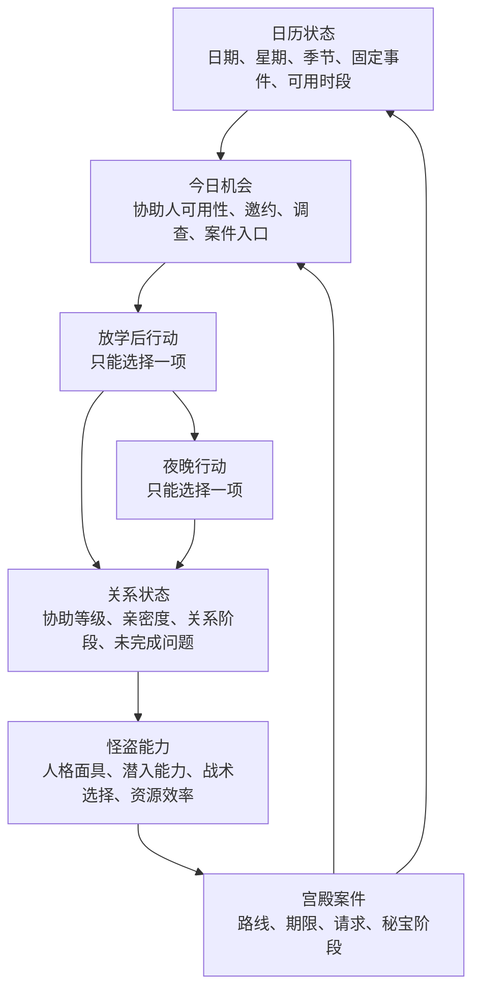

# P5R 卡牌化修订方案：由日历主导的关系—怪盗循环

> 状态：概念方案 v2，2026-07-16。
>
> 本文是基于《女神异闻录5 皇家版》（P5R）成品结构的转译方案，不是 Atlus 的开发史陈述，也不是对 P5R 内容的逐项复刻承诺。目标是保住其体验逻辑，而不是把所有名词制成卡牌。

## 1. 修订结论

上一版正确地建立了 P5R 对象与《苏丹的游戏》卡牌容器的对应关系，但把“日程”处理成了活动场域的条件，把“协助人（COOP）”处理成了人物卡上的成长字段。这样不足以承载 P5R 的核心体验。

本版的体验命题改为：

> 玩家在不断流逝的学年中，必须把有限的放学后与夜晚分配给具体的人、现实事务与怪盗行动；每段关系会改变可执行的怪盗行动，而怪盗行动的进展又会改变这些关系能否继续。

这里的主语不是“卡牌组合”，而是“今天把时间给谁”。卡牌、仪式与事件负责让这一选择可见、可结算、可记忆。

## 2. 继承与修改

| 层面 | 保留 | 修改 |
|---|---|---|
| 统一玩法语言 | 人物、人格面具、装备、情报、特殊对象都以可观察的卡牌／状态存在 | 日期、时段与地点不制成可收集卡，而是日历系统和行动场域 |
| 外部压力 | 宫殿案件具备明确期限、阶段和失败后果 | 不每周抽取随机强制命令；宫殿案件只是在日历上的持续覆盖层 |
| 人物调度 | 人物携带状态、能力、装备与叙事记忆 | 协助人默认不是“可随时投入任何仪式的角色”；其可用性由个人日程和关系状态决定 |
| 组合结算 | 行动场域读取人物、物品、状态和条件 | 对话选择保留为事件内的叙事选择；不是把每一句对话都改写成拖卡操作 |
| 战斗 | 保留人格面具配置、弱点、`1MORE／换手`、资源和团队协作 | 压缩高频杂兵战，只保留能检验关系与配置成果的高密度怪盗行动 |

## 3. 《苏丹的游戏》容器如何使用

| 《苏丹的游戏》运行时结构 | P5R 转译对象 | 使用规则 |
|---|---|---|
| `sudan` | 宫殿案件／攻略期限卡 | 记录目标、期限、阶段、失败后果和秘宝状态；是日历的覆盖层，不是每日抽取物 |
| `char` | 主角、怪盗团成员、协助人 | 所有人物都可积累状态；但以角色标签限定可进入的行动场域 |
| `item` | 人格面具、装备、消耗品、情报、请求线索 | 可装备、消耗、作为条件或作为行动输入 |
| `item` 的叙事人物特例 | 请求目标、证人、受害者、宫殿主的暗影 | 有身份与状态，但仅通过指定 ID／标签进入相应事件，不能自动占用“人物行动者”槽 |
| 动态标签／附着状态 | 五维人格指数、协助等级、亲密度、疲劳、警戒、案件进度 | 附着在主角、协助人、案件或场域上；不滥制成独立资源卡 |
| Rite / Event | 协助事件、现实调查、宫殿探索、战术行动、合体、预告信 | 是读卡、锁定输入、结算并写入后果的局部决策容器 |

### 经原作参考核对的边界

- 原作对“角色”采用类型判断；`CardExtensions__IsChar` 读取卡牌类型，`IsCardType__IsSatisfiedInternal` 也以 `Card.Type` 与条件比较。因此，P5R 转译中的“协助人是人”不应自动推出“协助人可进入所有人物槽”。
  `[SRC: decompiled/CardExtensions.c @ CardExtensions__IsChar (RVA 0x382640); decompiled/IsCardType.c @ IsCardType__IsSatisfiedInternal (RVA 0x4027e0)]`
- 原作 `RiteNode` 独立拥有开放条件、等待回合、自动开始／结算、结算组和卡槽；Rite 不是普通物品卡。
  `[SRC: il2cpp_dump/dump.cs:393154-393236, RiteNode]`

这些事实只证明容器边界可承载此方案；P5R 的日历和协助关系规则是本方案新增的设计层。

## 4. 系统总图：日历在顶层



宫殿案件必须影响次日机会，例如开放调查、生成请求、占用时段、改变某位协助人的话题或可用性；否则它只是独立副本。

## 5. 日历根系统

### 5.1 日历状态

```text
date                当前日期
weekday / season    星期与季节
fixed_events        必须发生的剧情、考试、节日、天气或案件节点
free_periods        当日剩余时段：通常为放学后、夜晚
deadline_cases      进行中的宫殿案件及其期限
availability        今日可见人物、地点、邀约与行动入口
forecast            未来 1–2 天已知的固定事件与可预告的机会
```

日期是唯一的全局推进器。没有“推进一天”就不刷新人物可用性、不更新期限、不结算延迟事件，也不出现新的日常机会。

### 5.2 每日循环

```text
日初：结算固定剧情、到期事件、天气／考试／案件提示
  → 刷新今天的协助人、邀约、调查和怪盗入口
  → 玩家选定放学后行动
  → 结算该行动，并更新相关人物与案件状态
  → 玩家选定夜晚行动（如该日仍有夜晚行动资格）
  → 日终：记录未完成承诺、更新期限、生成次日信号
  → 日期 +1
```

### 5.3 信息可见性

| 信息层 | 向玩家展示 | 目的 |
|---|---|---|
| 已知 | 今天谁可见、行动消耗哪个时段、宫殿期限、明确门槛 | 让取舍可负责 |
| 近期预告 | 未来 1–2 天的固定事件、已约邀约、可预见的截止点 | 让计划成为可能 |
| 未知 | 对话细节、隐藏亲密度的精确数值、部分后续事件 | 保留发现与人物理解 |

不能把所有隐藏条件完全公开，否则 COOP 会退化为日历优化题；也不能完全不提示，否则玩家只能查攻略。界面应明确显示“可以提升”“尚未准备好”或“此人今天无法见面”，但不展示所有内部数值。

## 6. 协助人：人物卡上的关系状态机

### 6.1 协助人卡模板

```text
身份：人物名、阿尔卡那、地点、可见时段
关系：协助等级、亲密度、当前关系阶段、已作承诺
可用性：固定日、条件日、事件锁定、暂时离场
门槛：五维人格指数、案件阶段、请求、前置事件
叙事：当前问题、已知事实、下一事件入口、不可逆后果
能力：现实收益、宫殿收益、人格面具收益、特殊行动权限
```

协助等级不是通用货币。它是该人物卡上由多次事件形成的个人历史；同为等级 3 的两名协助人，也应因已完成事件、持有标签和当前案件状态不同而可提供不同的行动。

### 6.2 协助事件模板

```text
入口：日期／时段可用，协助人未锁定，门槛满足
固定输入：主角 + 指定协助人
可选输入：与该协助人同阿尔卡那的人格面具、相关情报或请求结果
事件选择：对话或行动选择，改变亲密度、标签或问题状态
结算：提升协助等级／生成未升级的亲密度／开放或关闭后续事件／授予能力
后果：改变宫殿、请求、地点或另一人物的可用性
```

同阿尔卡那人格面具是可选的关系推进加成，不是把协助事件变成“没有正确卡就不能对话”的硬门槛。P5R 的中文资料及机制来源见资料库 `P5R-CN-005`、`P5R-CN-006`、`P5R-GUIDE-001`。

### 6.3 四类协助人链

首个切片必须同时具备下列四类，避免只验证“点一次就升级”的假 COOP：

| 类型 | 典型门槛 | 验证的体验 |
|---|---|---|
| 五维门槛型 | 勇气／体贴等达到要求 | 日常成长与关系推进互相需要 |
| 请求门槛型 | 完成指定印象空间请求或调查 | 怪盗行动会反向推进关系 |
| 固定窗口型 | 仅在少量日期／时段出现 | 今天见谁真正有机会成本 |
| 剧情推进型 | 随主线自动推进部分阶段 | 关系系统与主线节奏相互嵌入 |

## 7. 宫殿案件：持续压力，而非每日主角

### 7.1 宫殿案件卡

```text
对象：宫殿主／核心冲突
期限：明确日期与失败后果
阶段：情报不足 → 可潜入 → 已确认秘宝路线 → 可发送预告信 → 秘宝可夺取
现实入口：调查、协助事件、五维门槛、请求
异世界入口：宫殿探索、印象空间、战术行动
世界回写：新事件、人物话题、可用性、案件后果
```

它必须始终可见，但只在以下时候强制占用玩家：固定剧情日、进入宫殿、发送预告信、期限到期。其余日子应让玩家感到“案件压在日历上”，而不是“命令替我决定了今天做什么”。

### 7.2 怪盗行动场域

高频杂兵战被压缩为少量可重复但有代价的行动场域：

```text
输入：出战怪盗团成员、人格面具、装备、消耗品、情报
检查：敌方弱点、成员状态、警戒与资源
结算：1MORE／换手链、交涉或撤退、路线进度、资源和状态变化
输出：情报、人格面具、请求推进、案件阶段或长期人物状态
```

协助关系授予的能力必须在这些行动中有实际用途；否则 COOP 只是独立故事阅读器。

## 8. 防止日程坍塌成唯一最优解

不能让“第一天打通宫殿，之后永远刷 COOP”成为无条件优势。应同时使用：

1. 协助人与现实事件的有限窗口；
2. 宫殿不同阶段所需的调查、资源或队伍状态；
3. 由协助关系解锁、且只能在当前案件中使用的怪盗能力；
4. 宫殿成果对人物话题、请求与可用性的回写；
5. 不同日期的季节性与固定事件价值。

目标不是消灭优化，而是让玩家在“及时解决案件”与“及时回应具体的人”之间始终存在有意义的损失。

## 9. 首个垂直切片：21 天的第一桩案件

| 内容 | 数量／要求 | 验证目标 |
|---|---|---|
| 日历 | 21 天，放学后与夜晚两个时段，含 3 个固定日 | 时间流逝与机会竞争 |
| 宫殿案件 | 1 张，完整经历调查、路线、预告信、秘宝结算 | 期限不取代生活，但持续施压 |
| 协助人 | 4 名，覆盖四类协助人链 | 关系状态机而非奖励菜单 |
| 怪盗团 | 主角 + 2 名成员 | 人格面具配置与团队选择 |
| 人格面具 | 6 张，可完成 1 次合体 | 现实关系与怪盗配置的桥梁 |
| 请求 | 1 条，必须由现实调查发现并在印象空间完成 | 双世界的反向反馈 |
| 怪盗行动 | 2 次探索／战术行动 + 1 次关键战 | 弱点、`1MORE／换手`与资源结算 |

### 切片验收

- 三名首次玩家在相同的 21 天中，至少形成两种不同的协助关系优先级。
- 玩家至少一次因时段不足而主动放弃一个想做的行动，并能说明放弃了什么。
- 每名协助人的能力至少在现实或怪盗行动中产生一次可见差异。
- 至少一次宫殿／请求结果改变后续协助事件的可用性或内容。
- 至少一次协助关系的状态改变宫殿中的可行解，而非只提高数值。
- 不查看攻略的玩家能理解期限、今天的机会和“下一步还缺什么”；但无法预知所有对话得分与剧情。

若以上条件没有同时成立，只能称为“P5R 题材的卡牌原型”，不能称为保住了 P5R 的日程—COOP 体验。

## 10. 内容与实现优先级

1. 先定义日历状态、每日结算顺序与时段占用规则。
2. 再实现协助人卡的可用性、门槛、关系阶段和后果写入。
3. 用四条协助人链和一桩宫殿案件验证双向反馈。
4. 再接入人格面具、合体、请求和压缩后的战术行动。
5. 最后扩展角色数、宫殿数与关系内容；不要先按卡牌数量或战斗数量扩充。

## 11. 尚未被本方案解决的问题

- 关系事件的文本规模、分支密度与配音／演出成本；
- 五维、亲密度与人格面具加成的具体数值公式；
- 宫殿行动应占用多少日程，才能既有压力又不形成僵硬最优解；
- 哪些失败允许补救，哪些应永久错过；
- 如何以卡牌桌面呈现两周预告、人物可用性与大量关系状态而不造成信息过载。

这些需要纸面原型和玩家测试决定。当前版本的目标是可验证的功能等价，不声称能够“完美还原”P5R。

## 12. 资料入口

- P5R 中文术语、COOP、五维、日程与访谈来源：[`docs/research/personified-systems-game-reference-database.md`](../research/personified-systems-game-reference-database.md)
- 《苏丹的游戏》卡牌、运行时类型与 Rite/Event 边界：[`docs/research/sultan-card-model-analysis.md`](../research/sultan-card-model-analysis.md)
- 从《密教模拟器》到《苏丹的游戏》的生产性转译框架：[`docs/design/sultan-innovation-production-pipeline.md`](sultan-innovation-production-pipeline.md)
