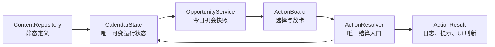

# Faust 正式模式：日历—关系卡牌系统实施交接包

> 状态：可实施方案 v3，2026-07-16。
> 目标：把日历—关系卡牌系统实现为 **Faust 的正式、可从主菜单进入的模式**。先完成 8 天、可玩且可测试的垂直切片，验证“在被日程压缩的一年中，选择与谁建立关系；关系再改变怪盗行动”的体验；验证通过后，再扩展为 14 天版本。
> 现有《苏丹的游戏》克隆是实现底座和参考基线：复用其运行时卡牌、局部行动场域、桌面表达和测试纪律；但不复制 P5R 的资产、文本或完整剧情。它不是日历关系模式必须永久携带的第二个产品。

## 0. 先锁定边界

### 要做什么

做一个作为 Faust 新正式模式、在开发阶段与苏丹参考模式并存的日历关系系统。玩家每天有“放学后／夜晚”两个时段，在日历提供的机会中选择行动；人物、面具、情报与请求以卡牌呈现，行动场域读取这些卡牌并写回关系、案件和后续机会。

首个切片只验证三种关系如何改变行动：

| 关系原型 | 体验依据 | 切片中的可见结果 |
|---|---|---|
| 导师型（川上） | 关系改变可支配时间 | 异世界行动后，可在**受限制的**夜晚继续外出；不能把全部夜间邀约也一并恢复 |
| 联络人型（三岛） | 关系带来社会请求，行动反哺关系 | 完成印象空间请求，而不是刷好感，推进该人物的关系阶段并改善队伍经验收益 |
| 战术师型（一二三） | 关系授予新的战术动词 | 在关键怪盗行动中允许替换待命成员，产生原本不存在的解法 |

跑者型（龙司）留给 14 天扩展包。它是很好的“关系改变重复劳动节奏”案例，却不是“把今天交给谁”这一核心体验成立的必要条件。

### 不做什么

- 不把 P5R 的角色、美术、台词、音乐或完整剧情搬进仓库。首个原型采用中性的角色代号和原创文本。
- 不改变既有苏丹模式的日程、苏丹池、Rite DSL、存档语义或正常开局；正式模式通过明确的模式路由和独立状态接入，而不是把日历字段塞进苏丹模式状态。
- 不扩充《苏丹的游戏》的 DSL，也不把日历伪装成 `sudan` 卡。
- 不先做完整回合制战斗、全五维成长树、合体系统或长篇关系文本。
- 不把“错过一个隐蔽关系门槛就失去大段内容”作为设计目标；案件期限必须可见、可预告、可理解。

### 为什么必须分层，而不是分项目

现有工程的 `GameState`、运行时 `CardInstance`、Rite 实例和 v5 存档已经服务于《苏丹的游戏》的真实语义。正式模式必须复用可泛化的卡牌和桌面经验，但不能把日历、协助关系和宫殿阶段混入苏丹模式状态，否则会污染正常开局、存档兼容性与 DSL 审计。

本原型应放在：

```text
core/game_mode_router.gd              # 正式模式的启动与返回边界
modes/calendar_coop/                  # 日历—关系模式的状态、内容、服务与保存
modes/calendar_coop/ui/calendar_coop_game.gd  # 该模式的正式顶层界面
```

它借鉴“卡牌是对象、Rite/Event 是读卡并结算的场域”这一结构，并作为 Faust 的正式模式拥有自己的状态、数据、UI、存档和测试。所谓“隔离”是运行时语义隔离，不是把它迁出 Faust 或藏成开发实验。

## 1. 交接时不可推翻的设计合同

### 1.1 体验合同

玩家每次选择都应能回答三个问题：

1. **我把哪个有限时段给了谁／什么事？**
2. **因此我失去了今天的哪个机会？**
3. **这段关系或这次行动，具体改变了下一次怪盗行动的什么？**

如果一个功能不能让至少一个问题的答案更清楚，就不进入 8 天切片。

### 1.2 对象与场域的边界

| 概念 | 原型中的形态 | 绝不能误做成 |
|---|---|---|
| 日期、时段、天气、固定日 | 日历状态与行动场域 | 可收集／可拖动的资源卡 |
| 协助人、怪盗团成员 | 人物卡 + 关系状态机 | 随时可投入所有行动的通用劳动力 |
| 人格面具、装备、线索、请求 | 卡牌 | 全部写进人物数值面板的隐藏字段 |
| 五维、亲密度、疲劳、案件进度 | 附着在相关对象上的状态 | 无归属的散乱货币卡 |
| 社交、调查、潜入、关键战 | 局部行动场域 | 又一类普通手牌 |
| 宫殿案件 | 可见的期限覆盖层 | 每日强制命令或一张普通任务卡 |

### 1.3 可见性合同

- 今天可做什么、会占用哪个时段、案件期限和明确门槛必须可见。
- 未来 1–2 天的固定事件和已知邀约必须可预告。
- 隐藏亲密度的精确数值、对话最优答案与远期剧情不公开。
- 不可用机会不能静默消失：卡上显示“今天不在”“需要体贴 2”或“先完成某请求”等理由。

## 2. 原型范围与完成定义

### 2.1 8 天核心切片内容预算

| 内容 | 数量 | 最低要求 |
|---|---:|---|
| 日历 | 8 天 × 放学后／夜晚 | 2 个固定事件、2 次期限预告、至少 2 次明确机会冲突 |
| 宫殿案件 | 1 条 | 情报 → 潜入 → 路线确认 → 预告 → 结算；第 1 天可见，第 8 天结算 |
| 协助人 | 3 人 | 分别实现导师、联络人、战术师三种关系回报 |
| 怪盗团 | 主角 + 2 人 | 一名待命成员，使“换人”成为真实选择 |
| 请求 | 1 条 | 现实端发现、印象空间处理、再回写联络人关系 |
| 人格面具／线索 | 4 张以内 | 只作为关系推进加成或怪盗行动输入，不做完整收集系统 |
| 怪盗行动 | 1 次印象空间 + 1 次宫殿 + 1 次关键行动 | 至少一次因关系能力而得到不同结果 |

### 2.2 Definition of Done

以下所有项成立，才宣布切片完成：

- 三名首次玩家能在同一初始局面中形成至少两种不同的关系优先级。
- 每名玩家至少一次因时段冲突主动放弃想做的事，并能复述取舍。
- 三名协助人的回报各自至少产生一次可观察差异，且不是单纯数值加成。
- 三岛型“请求 → 印象空间 → 关系／队伍”闭环真实可走通。
- 川上型能力恢复的是受限夜间行动，而非无条件多出一个万能回合。
- 案件期限、下一步缺失条件和错过结果都无需攻略即可理解。
- 开发阶段主菜单可新开／继续日历关系模式，并可返回后再进入苏丹参考模式；两种模式的存档互不覆盖。达到独立毕业条件后，日历关系模式可成为唯一玩家入口。
- 全部模型层测试、内容走查测试、UI 冒烟测试和模式接入测试通过；`tools/run_gut.ps1` 没有 Godot `ERROR`、`SCRIPT ERROR`、orphan 或泄漏诊断。

## 3. 技术架构：先做纯模型，再接 UI

### 3.1 文件与职责

```text
core/
  game_mode_router.gd       # 模式选择、启动、返回标题；不解释两种模式的规则
modes/calendar_coop/
  model/
    calendar_state.gd       # 日期、时段、固定事件、预告、行动历史
    relation_state.gd       # 每名协助人的 rank、affinity、阶段、解锁与请求计数
    case_state.gd           # 案件阶段、期限、路线、预告、结果
    prototype_card.gd       # 人物／面具／线索／请求的轻量运行时对象
    opportunity.gd          # 某日某时段可选择的一次具体机会
    action_result.gd        # 唯一的结算返回值
  services/
    content_repository.gd   # 读取、验证 prototype 数据
    calendar_engine.gd      # 唯一推进日期／时段的服务
    opportunity_service.gd  # 生成今日机会及不可用原因
    action_resolver.gd      # 验证输入、消耗时段、应用效果、写历史
    calendar_coop_save.gd   # 该正式模式自己的 save_kind 与存档根目录；不修改苏丹 v5 语义
  data/
    calendar.json
    characters.json
    cards.json
    actions.json
    cases.json
  ui/
    calendar_coop_game.gd   # 正式顶层 UI，由 GameModeRouter 启动
    demo_main.tscn          # 开发期可单独运行；正式入口仍由主菜单提供
    calendar_prototype.tscn
    calendar_prototype.gd
    opportunity_card.gd
    action_board.gd
    prototype_card_widget.gd
tests/
  test_p5r_calendar_state.gd
  test_p5r_opportunities.gd
  test_p5r_actions.gd
  test_p5r_vertical_slice.gd
  test_p5r_calendar_ui.gd
```

模型层不得 `extends Node`、不得读取 UI、不得调用全局单例。UI 只能通过 `CalendarEngine` 读取状态并提交一个明确的行动请求。

### 3.2 状态所有权



- `CalendarState` 是唯一可变真相；UI 不得自行扣除时段、加关系或改案件阶段。
- `Opportunity` 是某日某时段生成的快照，含唯一 `opportunity_id`；结算后失效，不能跨天复用。
- `ActionResult` 必须带 `ok`、失败原因、消耗时段、状态变化摘要和新增机会；UI 只显示它，不重演规则。
- 所有内容 ID 使用稳定 ASCII 标识，例如 `mentor`, `network`, `mementos_bully_request`；显示文案独立存放。

### 3.3 最小数据合同

先实现下面的固定结构；不要在切片第一轮发明通用脚本 DSL。

```gdscript
# Opportunity：由 OpportunityService 生成，UI 只读。
{
  "id": "d07_after_school_network_rank_2",
  "day": 7,
  "period": "after_school", # after_school | night
  "kind": "social",          # social | investigate | mementos | palace | fixed
  "actor_id": "network",
  "required_cards": ["hero"],
  "optional_cards": ["arcana_moon"],
  "lock_reason": "",         # 非空即不可执行且应显示
  "action_id": "network_rank_2"
}

# ActionResult：唯一结算回执。
{
  "ok": true,
  "message": "完成委托，联络人的信任加深。",
  "consumed_periods": ["after_school"],
  "state_changes": ["network.request_count +1", "request.bully = resolved"],
  "generated_opportunity_ids": ["d08_night_network_rank_3"],
  "history_id": "d07_mementos_bully"
}
```

首版**不实现通用效果 DSL**。`ActionResolver` 只处理三个有类型的行动模板：`relationship_event`、`request_run`、`heist`。每个模板只接受自己的明确字段；例如 `request_run` 只能改变请求状态、联络人请求计数、支持卡与时段，不能在 JSON 中任意调用效果。

内容仓库必须拒绝未知 `kind`、无效字段与非法阶段转移；不得静默跳过。等三个模板在试玩中证明需要复用时，才把重复的规则提炼成白名单效果动词。

### 3.4 正式模式与参考模式的生命周期

```text
开发阶段主菜单
  → “苏丹参考模式” / “日历关系模式”
  → GameModeRouter 创建相应状态和顶层 UI
  → 两种模式分别继续、保存、返回标题

日历关系模式达到独立毕业条件
  → 玩家入口默认只保留日历关系模式
  → 苏丹参考模式冻结、隐藏或移入开发构建
  → 保留源码、测试与版本历史，不再为其扩充内容
```

- 开发阶段，苏丹参考模式继续使用现有 `SaveSystem` v5 和 `user://save.json`；它是抽取共享能力时的回归基线，不是日历关系模式的长期功能承诺。
- 日历关系模式使用 `calendar_coop_save.gd`、独立 `save_kind` 与独立根目录；两者不互相读取、迁移或覆盖。
- 在 8 天切片端到端可玩之前，可用 `demo_main.tscn` 开发；达到正式模式里程碑后，主菜单入口、继续游戏、返回标题和基础帮助页缺一不可。
- 只有同时满足“日历关系模式拥有自己的内容、状态、保存、UI 与全套回归测试”“之后计划中的功能不再需要原作行为判定”“共享层已脱离苏丹配置 ID”三项，才允许把苏丹参考模式从玩家入口移除。

## 4. 玩家流程与桌面交互

```text
日初固定事件与期限提示
  → 生成“今日机会”
  → 玩家选择放学后或夜晚的一个机会
  → 打开行动板：固定显示主角／目标人物，玩家可放入可选面具、线索或请求
  → 事件内做少量对话／行动选择
  → ActionResolver 结算：消耗时段，改关系／案件／卡牌，生成后续机会
  → 若仍有时段，继续；否则日终并推进日期
```

### 4.1 行动板规则

日历不是卡牌，但它提供两个可见的**时段槽**。玩家把“今天要做的事”放进槽，而不是把日期拖进仪式。

| 行动 | 固定输入 | 可选输入 | 核心结算 |
|---|---|---|---|
| 社交 | 主角 + 指定协助人 | 对应阿尔卡那面具／关联线索 | 关系阶段、亲密度、后续问题或能力 |
| 调查 | 主角 + 地点／线索 | 协助人 | 新情报、请求或案件阶段 |
| 印象空间请求 | 主角 + 请求卡 | 2 名怪盗成员、面具、战术能力 | 请求状态、联络人计数、资源／经验 |
| 宫殿行动 | 主角 + 案件卡 | 团队、面具、线索 | 路线、警戒、秘宝或失败代价 |

对话不是拖卡小游戏。卡牌负责“谁来、带什么、为了什么”；对话选项负责“用什么态度回应”，并只在该事件已经打开后出现。

## 5. 8 天核心切片内容蓝图

内容使用中性名称，避免把 P5R 的具体人名和文本作为资产复制。括号内仅说明设计功能，不进入游戏显示文本。

| ID | 第一次出现 | 关系规则 | 授予的具体权限 |
|---|---|---|---|
| `mentor` | 第 2 天夜晚 | 一般亲密度链；第 2 阶段需先完成一次异世界行动 | 当天异世界行动后，解锁 `restricted_night_out`；它允许独处成长／采购，但不生成原本已错过的社交邀约 |
| `network` | 第 3 天夜晚 | **只读 `resolved_request_count` 升级，不读 affinity** | 生成／推进社会请求；完成请求后获得可投入下一次怪盗行动的“群众线索”支持卡 |
| `tactician` | 第 5 天夜晚，需魅力 2 | 一般亲密度链 + 固定窗口 | 在关键行动中开放 `swap_reserve_member` |

建议的最短节奏是：第 1 天案件公开；第 2 天导师事件；第 3 天第一次宫殿行动并触发受限夜晚；第 4 天联络人带来请求；第 5 天印象空间处理请求；第 6 天与战术师的窗口冲突；第 7 天关键行动；第 8 天案件结算。不是每一步都强制，必须保留足够机会让玩家形成不同优先级。

案件在第 1 天可见、在第 8 天结算；第 3、6 天各给一次明确预告。它不以“失败即删档”施压：未及时完成会写入较差的案件结果和某些关系后果，但仍保留原型其余内容。

### 必经的三条体验链

```text
导师链：宫殿行动耗尽放学后
  → 导师能力把“疲惫的夜晚”改成受限可外出
  → 玩家仍须选择独处收益，而不是白得一次完整社交回合

联络人链：现实端得到霸凌请求
  → 印象空间行动处理请求
  → 请求计数推进联络人阶段
  → “群众线索”卡改变下一次怪盗行动的投入与解法

战术链：战术师关系解锁替换待命成员
  → 关键战中让对弱点正确的待命成员上场
  → 少耗资源／获得不同案件推进
```

### 验证通过后的 14 天扩展

只有在 8 天试玩确认三条核心链有效后，才添加第 2 周：每周可用性规则、第二条请求，以及跑者型关系能力（仅在印象空间、且等级差至少 10 时跳过低威胁节点）。14 天才足以测试“每周窗口”的重复认知；21 天在这一阶段仍没有额外的系统必要性。

## 6. 分包实施顺序

一次只允许一名智能体修改某个工作包拥有的文件。先合并前置包并通过其测试，再启动依赖它的包。

| 包 | 依赖 | 文件所有权 | 交付与验收 |
|---|---|---|---|
| A. 契约与模型 | 无 | `modes/calendar_coop/model/**`、`tests/test_p5r_calendar_state.gd` | 可创建／序列化日历、关系、案件、卡牌；没有 Node/UI 依赖 |
| B. 内容仓库 | A 的数据结构 | `modes/calendar_coop/data/**`、`modes/calendar_coop/services/content_repository.gd`、内容校验测试 | 8 天所有 ID 可解析；未知行动种类、重复 ID、缺少显示文案硬失败 |
| C. 日历与机会 | A、B | `modes/calendar_coop/services/calendar_engine.gd`、`modes/calendar_coop/services/opportunity_service.gd`、`tests/test_p5r_opportunities.gd` | 时段单次消耗、固定日、预告、锁定原因和跨天失效全可测 |
| D. 结算与关系能力 | A、B、C | `modes/calendar_coop/services/action_resolver.gd`、`tests/test_p5r_actions.gd` | 三条关系链和案件阶段能由真实行动走通 |
| E. 模式 UI | C、D | `modes/calendar_coop/ui/**`、`tests/test_p5r_calendar_ui.gd` | 日历、机会卡、行动板、结果日志可完成一局 |
| F. 正式接入与保存 | E | `core/game_mode_router.gd`、`modes/calendar_coop/services/calendar_coop_save.gd`、`ui/main_menu.gd`、`ui/game.gd`、接入测试 | 开发阶段主菜单可进入／继续／返回；日历模式存档不影响苏丹 v5 存档，并保留未来隐藏参考模式的开关 |
| G. 纵向验收 | A–F | `tests/test_p5r_vertical_slice.gd`、本文件的验收记录 | 跑三条不同决策路径；执行完整 GUT 门禁 |

### 给每个智能体的统一任务前缀

```text
你正在实现 Faust 仓库中的正式“日历关系模式”。现有《苏丹的游戏》克隆是底座和参考基线，但不是必须永久保留的第二个产品；两种模式在开发阶段必须拥有不同的状态和保存语义。
除非你的工作包明确拥有该文件，否则不能修改 sim/game_state.gd、sim/save_system.gd、sim/round_loop.gd、data/ 原作配置、默认苏丹开局或现有 Rite DSL。
你只拥有下方列出的文件；仓库里有其他人的并行改动，不得回退或覆盖它们。
只写确定性的 GDScript；模型层不得依赖 Node 或 UI。
为每个行为边界写 GUT 测试，并运行 powershell -ExecutionPolicy Bypass -File tools/run_gut.ps1。
遇到未在数据合同列出的效果或语义，报告为阻塞项，不能静默猜测。
```

### A：契约与模型 — 可直接交给智能体

```text
在 modes/calendar_coop/model/** 实现 CalendarState、RelationState、CaseState、PrototypeCard、Opportunity、ActionResult；在 tests/test_p5r_calendar_state.gd 写测试。
所有类必须是纯 RefCounted 数据模型，提供 to_dict/from_dict 深拷贝往返。
CalendarState 必须拥有 day、period、已消耗时段、未来预告、历史；RelationState 必须支持 affinity 与 resolved_request_count 两种独立升级来源。
不要实现 UI、内容读取、行动效果或主游戏存档。不要触碰本包以外的文件。
```

### B：内容仓库 — 可直接交给智能体

```text
只实现 modes/calendar_coop/data/** 与 modes/calendar_coop/services/content_repository.gd，以及内容校验测试。
用中性角色代号完成 8 天、1 案件、3 协助人、1 请求、4 张以内支持卡、3 次怪盗行动的静态内容。
数据必须严格遵守实施交接包第 3.3 节；校验重复 ID、无效引用、未知行动种类、缺失 day/period、损坏阶段转移。
不要改模型、resolver、UI、主游戏或 P5R 具体文本资产。
```

### C：日历与机会 — 可直接交给智能体

```text
只实现 modes/calendar_coop/services/calendar_engine.gd、modes/calendar_coop/services/opportunity_service.gd 与 tests/test_p5r_opportunities.gd。
实现日初、放学后、夜晚、日终；同一时段只能结算一次，未结算机会跨天失效。今日可用、锁定但可见、固定事件和未来两天预告都必须从内容与状态确定性生成。
锁定机会必须带玩家可读 lock_reason。不得执行关系奖励或案件结果；那属于 resolver 包。
```

### D：结算与关系能力 — 可直接交给智能体

```text
只实现 modes/calendar_coop/services/action_resolver.gd 与 tests/test_p5r_actions.gd。
严格使用 `relationship_event`、`request_run`、`heist` 三种类型化模板和 ActionResult；失败不得部分写入状态。完成导师、联络人、战术师三条链及案件阶段。
必须覆盖：导师只恢复受限夜晚；联络人只按 resolved_request_count 升级，并生成一张可在怪盗行动投入的支持卡；战术师能改变关键行动解法；案件期限可见且不会静默删掉所有内容。
不要改机会生成、UI 或主游戏状态。
```

### E：模式 UI — 可直接交给智能体

```text
只实现 modes/calendar_coop/ui/** 与 UI 冒烟测试。提供 demo_main.tscn 作为开发期可单独运行的入口，并用 calendar_coop_game.gd 展示日历、案件覆盖层、两段时段、机会卡、人物卡、支持卡和行动板。
用户必须看得见时段成本、锁定理由、期限、下一步需要什么和每次 ActionResult 的影响；但不得显示隐藏 affinity 精确值或最优对话答案。
不得修改主菜单、模式路由或苏丹模式 UI；正式入口属于 F 包。
```

### F：正式接入与保存 — 可直接交给智能体

```text
只实现 core/game_mode_router.gd、modes/calendar_coop/services/calendar_coop_save.gd、ui/main_menu.gd、ui/game.gd 及相应接入测试。
在主菜单提供可见的“日历关系模式”新开局与继续入口；通过 GameModeRouter 启动 calendar_coop_game.gd。开发阶段返回标题后仍可选择苏丹参考模式，但路由必须支持在达到毕业条件后隐藏该入口，而不影响其测试与源码。
日历关系模式必须使用独立存档根目录与独立 save_kind，且绝不能覆盖或接受苏丹 v5 存档。不得修改 sim/save_system.gd 的苏丹语义；若确实需要共享抽象，先提出最小接口再改。
```

### G：纵向验收 — 可直接交给智能体

```text
只新增 tests/test_p5r_vertical_slice.gd 及必要的验收记录。使用真实 content repository 和正式模式入口，跑通至少三条 8 天决策路径：时间优先、请求优先、战术优先。
断言三条路径在关系阶段、案件结果、可用怪盗动作或放弃机会方面存在可解释差异；任何路径不得因未知行动种类、重复机会或跨天行动复用而崩溃。
不要为让测试通过而改写内容平衡或核心服务；发现问题应最小复现并交回对应包。
```

## 7. 关键测试清单

| 边界 | 必须断言 |
|---|---|
| 时段 | 一个行动只能消耗一个合法时段；同一时段不能重复提交；跨天机会不可复用 |
| 可用性 | 人物不在场、人格门槛不足、前置请求未完成时，机会可见但不可执行，并给出原因 |
| 导师 | 异世界行动后只有拥有能力才开放受限夜间；恢复后不伪造已经错过的社交邀约 |
| 联络人 | 增加 affinity 不会使其升级；完成指定数量请求才会 |
| 战术师 | 无能力时待命角色不能替换；有能力时关键行动结果改变 |
| 案件 | 第 3、6 天有期限预告；案件阶段只能按定义单向推进；到期结果可解释 |
| 原子性 | 一个行动任一条件失败时，不消耗时段、不半改标签、不生成半条后续机会 |
| 存读 | `to_dict/from_dict` 之后，日期、已用时段、关系、案件、已解决请求和历史一致；日历模式保存不会覆盖或加载苏丹 v5 存档 |
| UI | 固定 1280×720 下能看到今天两个时段、案件期限和至少三张机会卡；关闭行动板不改变状态；开发阶段主菜单可进入该模式 |

## 8. 已验证参照、设计推论与开放项

### 已验证的《苏丹的游戏》参照事实

- 原作对角色使用卡牌类型判断；`CardExtensions__IsChar` 读取卡牌定义的类型字段。因此“叙事上是人”不自动等于“可进入全部角色槽”。
  `[SRC: decompiled/CardExtensions.c @ CardExtensions__IsChar (RVA 0x382640); il2cpp_dump/dump.cs, Card type layout]`
- `RiteNode` 是独立的运行时场域配置，拥有开放条件、等待回合、自动开始／结算、结算组和卡槽；它不是第四种普通卡牌类型。
  `[SRC: il2cpp_dump/dump.cs:393154-393236, RiteNode]`

### 本原型的设计推论

- 日历应是顶层状态机，而不是卡牌；时段槽则是卡牌获得语义的局部场域。
- 协助人应是有可用性、个人问题、关系历史和行动权限的人物卡，不能退化为通用数值加成。
- 先使用三个类型化行动模板，而非把尚未验证的 P5R 规则塞进《苏丹的游戏》DSL。

### 当前开放项（不得由实施智能体擅自决定）

1. 玩家测试后，案件行动到底应占用一个时段还是整天。
2. 关系事件的文本分支规模与配音／演出成本。
3. 五维、亲密度和面具加成的具体数值曲线。
4. 14 天扩展后，哪些通用卡牌 UI／运行时能力值得从苏丹参考模式抽取成稳定共享层，而不破坏其来源语义；何时满足参考模式退出玩家入口的毕业条件。

## 9. 集成门禁

每个包合并前都要：

```powershell
powershell -ExecutionPolicy Bypass -File tools/run_gut.ps1
```

并人工检查：

- 未改动禁止文件与原作配置；
- 新数据没有 P5R 的复制文本／素材；
- 未知行动种类与无效引用是显式失败，不是静默跳过；
- 开发阶段主菜单可进入新模式，但没有改变苏丹参考模式的新开局、继续游戏和存档路径；
- 任务只暂存其明确拥有的文件。

当 A–G 全部完成，才进入一次 20–30 分钟的三人试玩。试玩结论只回答三件事：玩家是否真在“安排生活”、是否感到“具体的人改变了怪盗行动”、是否能看懂失败或错过的原因。若任一项为否，优先回到体验链修正，不扩充卡牌或战斗数量。
