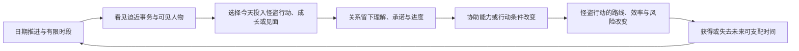

# P5R 体验生成基线：日程、关系与怪盗行动的 MDA 分析

> 用途：为 Faust 后续的玩法改造建立体验判断标准。
>
> 本文分析《女神异闻录 5 皇家版》（P5R）成品如何产生体验；不复用其角色、文本、设定、美术或剧情，也不是对 Faust 的实现方案。后续方案必须先满足本文的体验链条，再讨论采用何种桌面、仪式、事件或卡牌表达。

## 结论先行

P5R 的“理想校园生活”感并不来自日历 UI，也不来自单独的一条好感度数值。它来自同一份不可逆时间预算同时被三类事情争夺：

1. 必须面对的怪盗行动与截止日；
2. 主角自身的成长和生活琐事；
3. 会在特定时段出现、也可能被错过的具体的人。

玩家主动把今天给了谁，关系便以可观察的方式改变之后的怪盗行动；怪盗行动又反过来挤压、制造或检验这些关系。于是玩家记住的不是“完成了多少支线”，而是“我怎样度过了这一年”。

## M：Mechanics，规则怎样制造选择

| 机制 | 它限制或允许什么 | 在体验链中的职能 |
| --- | --- | --- |
| 一年制日期、昼夜时段与自动流逝 | 每个时段只能做有限的事，过去的日期不能重来 | 让“今天给谁”有真实机会成本 |
| 主线期限与怪盗行动成本 | 殿堂、请求与剧情不能无限拖延；突入行动也会占用日程 | 让日常关系不是无代价的收集 |
| 角色的时段、地点、解锁条件与截止窗口 | 不是任何人随时都能见到；有的人需要属性、前置事件或特定进度 | 把伙伴变成有自己生活节奏的具体存在 |
| 社会属性与关系推进条件 | 某些行动、见面和谈话阶段尚不可用 | 让生活培养与关系经营相互支撑，而非二者分离 |
| 对话、相应 Persona 与隐藏的亲密度积累 | 一次见面不必立即升阶；玩家的准备和选择会影响下次推进 | 让关系成为持续的互动，而非一次点击解锁 |
| 各 COOP 的特有协助能力 | 不同人物给出不同的战斗、潜入、资源、培养或调度效果 | 把“与此人变熟”翻译为明确的新行动能力 |
| 重复地点、上学、考试、节日、天气与讯息邀约 | 相同空间和时间结构反复出现，但当日机会不同 | 让时间形成生活节律和可回忆的个人经历 |

官方将 COOP 表述为：与城市中的人建立信赖关系，获得他们的能力，使怪盗生活更有利。这是 P5R 最重要的跨系统接口：关系不是战斗外的装饰，而是怪盗行动的输入。[P5R 官方：COOPERATION](https://p5r.jp/character/coop/)

中文攻略对其数值层也提供了旁证：COOP 提升会带来技能或优惠；多数关系的对话会累计内部 CP，部分等级另有事件条件和例外。[女神转生 Wiki：P5R 全社群攻略指南](https://wiki.biligame.com/persona/P5R%E5%AF%B9%E8%AF%9D%E6%94%BB%E7%95%A5)

## D：Dynamics，玩家实际上怎样游玩

### 1. 每天先做“可见性判断”，而非先选奖励

玩家面对的不是一个静态技能树，而是今天的可用窗口：谁能见、有什么期限、这一时段是否已被剧情或怪盗行动占用。日历因此不是信息面板，而是每日重新生成的取舍场。

这个取舍同时包含近期和远期：今天去处理殿堂，可能减少未来压力；今天去见某人，则可能推进其个人问题、改变今后可采取的行动。最有力的选择往往不是“哪个数值最大”，而是“此刻我认为什么关系或事务值得占用不可重来的今天”。

### 2. 关系通过重复赴约变成一段连续历史

反复回到同一地点、见同一个人、处理其不同阶段的问题，会让角色从一次性剧情节点变成持续存在。关系并非只记录 Rank：玩家还会保留自己此前如何回应、为何迟到、为谁腾出过时间的因果记忆。

隐藏 CP、对话选择与 Persona 匹配使玩家注意对方的性格与需求；但它们不是情感的全部。真正的连续性来自“第一次相遇—再次赴约—遇到阻塞—解决个人问题—关系反过来参与主线行动”的时间序列。

### 3. 怪盗行动把关系从叙事奖章变成实际协作

COOP 的能力进入战斗、潜入、资源和时间调度后，玩家会在操作层面感到某人正在帮忙。于是“我花时间与他相处”与“我现在能以不同方式解决问题”属于同一个因果链，而非剧情奖励和玩法奖励的并列发放。

反过来，殿堂期限、战斗消耗与迷宫推进又会占走本可用于赴约的时段。怪盗身份不是日常生活之外的第二个小游戏；它是需要由日常关系供给、又不断挤压日常关系的压力源。

### 4. 玩家把优化能力转化为个人生活史

熟练玩家会提前完成高压事务、选择更高效的活动、规划角色窗口，从而争取更多自由时间。这不是单纯的资源膨胀：它让玩家感到自己逐渐能够掌控这一年。

但也因此存在反作用。若玩家完全照抄逐日攻略、反复读档追求最佳对话，日程会退化为排程题，人物会退化为奖励节点。P5R 提供的是形成个人生活史的机制条件，而非自动保证每位玩家都会获得同样的情感体验。

## A：Aesthetics，为什么它会被感受为校园生活与深厚情感

| 最终感受 | 对应的动态原因 |
| --- | --- |
| “这是我度过的一年” | 时间不可逆；玩家亲手安排了大量看似平凡却可回忆的日期与傍晚 |
| “校园生活不是战斗间隙” | 学习、打工、社交、节日和怪盗行动共用时间预算，彼此造成机会成本 |
| “这个人不是任务发布者” | 对方有出现窗口、个人困境、关系阶段和持续的互动历史 |
| “我们变熟后，真的能一起做事” | 关系能改写之后的战斗、潜入、资源或调度动词，而不只是增加属性 |
| “我为自己的选择负责” | 忽略邀请、优先处理期限或投资一段关系，都会改变后续可见的机会与路线 |
| “怪盗团是共同生活后形成的伙伴” | 伙伴关系先在日常中被建立，再在高压行动中被证实和回收 |

因此，P5R 的情感强度有两个来源：

- **时间归属感**：玩家拥有的是一段被压缩但由自己安排过的生活，不是一串被动播放的校园事件。
- **能力归属感**：伙伴提供的帮助带着人物来源和共同经历；玩家把新的行动能力归因于“我们建立了关系”，而非系统无缘无故赠送了升级。

剧情、人设、配音、音乐、场景和节日演出会显著放大上述效果，但它们不能代替这条机制链。若没有有限日程、具体人物窗口和关系对行动的实质回流，再好的校园文本也更容易被体验为并列支线。

## 后续改造必须满足的三条判据

后续无论采用何种题材或界面，都必须同时回答三个问题：

1. **时间是否真的有限且可失去？** 玩家是否能清楚知道今天选择一件事，意味着另一件事会等待、变化或错过？
2. **关系是否属于具体的人和共同经历？** 它是否记录人物的可见性、承诺、缺席或事件历史，而不是一条脱离角色的通用等级？
3. **关系是否实际改写行动？** 后续压力事件中，玩家是否因为与某人建立或损害关系，而获得不同的可行方案、代价或后果？

三条中缺少任何一条，都会失去体验链的一环：只有日程会变成行动点管理；只有关系剧情会变成支线收集；只有能力奖励会变成装备或天赋树。

## 本文不主张的做法

- 不主张把 P5R 的人物、面具、案件或术语逐一转换为卡牌。
- 不主张建立一套与现有游戏完全隔离的“日历关系模式”。
- 不主张用线性好感等级和通用数值奖励替代人物关系。
- 不主张以“全部关系必须一周目满级”为唯一成功标准；那会放大排程焦虑，削弱自主生活感。

本文只定义体验目标与验证标准。Faust 的下一步应当讨论：如何让既有桌面、人物、仪式、事件、持续状态和外部压力共同承担这三条判据。
