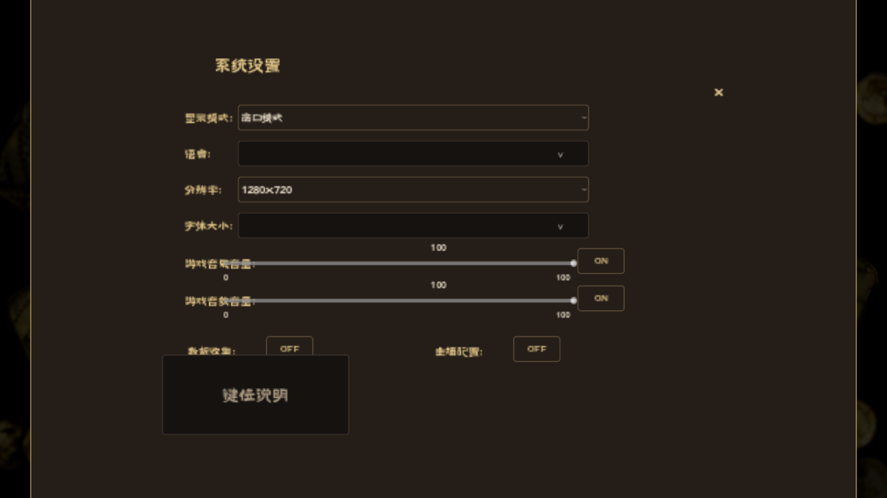

# 界面、输入、动画与声音

## 当前采用的规则

UI使用原作3840×2160设计坐标，宿主默认窗口与设计画布不同。Unity右下锚点必须结合父尺寸、pivot、scale和y翻转换算；图像本体、组件启用状态与实际输入命中必须一起检查。

界面可见不代表机制一致，静态几何一致也不代表动画时序正确。本次实际对拍仍观察到额外全屏提示、段落/字体和手牌尺度等差异，不能使用历史页面“1:1”标题签署整体完成。字体、着色器、音频、原生噪声及性能优化的详细参数和证据全部按下列模块整合。

原作矩形表统一进入[布局数据册](layout.md)，截图/反汇编/日志统一进入[证据登记](evidence.md)。历史工具、测试和路径在下面记录原批次口径，执行新工作只取METHOD_MAP当前项。


## 按表现问题阅读

阅读顺序是“原作组件与资源→坐标和显示条件→真实命中→过程与恢复”。布局原始表提供静态依据，截图提供某个运行状态，两者都不单独证明完整过程等价。

| 材料类别 | 如何使用 | 必须纠正的误读 |
|---|---|---|
| 布局与资源 | [布局册](layout.md)按页面定位；先检查贴图和组件是否启用，再换算屏幕矩形 | Unity锚点不能直接按Godot含义抄写；资源名称不代表可见内容 |
| 着色器与卡面 | 本章保留环境输入、常量和程序审计，反汇编纳入[证据册](evidence.md) | 静态源码近似不等于实际渲染逐像素相同 |
| 动画与声音 | 对照原作控制器调用、时序、音频映射，再看该批次日志 | 找到音频文件或静态截图不等于实际触发正确 |
| 输入与覆盖层 | 结合本章与[循环链](loop.md)检查模态、鼠标过滤、队列和锁 | 直接发送pressed信号不是鼠标命中验收 |
| 早期诊断图 | 隐藏目录clipboard-20260802图为1152×648旧克隆错误现场 | 不是原作目标；图中AudioManager报错也不自动代表当前仍存在 |

## 证据模块

- [档案按钮状态色纠偏（2026-09-10）](#e003)
- [A21 音频：`sfx_config.json` 就是 clip 名的来源（第三十四批）](#e004)
- [A21 续：三张音频映射表全部是配置，不是"未导出的 .cs"（第三十五批）](#e005)
- [音频提示面、向导宿主与卡面可达性（第二十八批，2026-09-10）](#e006)
- [卡牌根命中、拖起和手牌堆叠纠偏（2026-09-10）](#e009)
- [A11 场景环境输入：卡牌光照模型已由数据定案（第三十三批）](#e010)
- [事件布局与确认按钮纠偏（2026-09-10）](#e023)
- [拖入吸附、占位及抓取钳制审计（2026-09-10）](#e024)
- [夜幕黑条：粒子 pivot 符号错误（2026-09-12）](#e027)
- [首选尺寸布局纠偏（2026-09-10）](#e030)
- [结算文字播速：两个档位、来自配置、按自动播放选择（第二十五批，2026-09-10）](#e037)
- [通知抖动原生数学与点击链纠偏（2026-09-10，第十二批）](#e041)
- [Shaker源证据纠错与原生入口定位（2026-09-10）](#e042)
- [悬停提示修正与验收（2026-09-11）](#e048)
- [显示模式与分辨率接线（2026-09-06）](#e064)
- [BeginGuide 桌面布局真值表](#e073)
- [卡牌光照与闪烁轮廓：原作程序审计](#e079)
- [卡牌着色器落地与验收边界（2026-09-10）](#e080)
- [卡面与手牌区域纠偏 — 2026-09-07](#e085)
- [桌面续修：四页、金属反光、仪式标题](#e094)
- [GameScene hand-card layout](#e101)
- [MapController — source mapping and fidelity boundary](#e103)
- [全页面原作还原验收](#e108)
- [SourceTips 原作证据与修正（2026-09-11）](#e124)
- [StoryNotify 原作真值表](#e128)

<a id="e003"></a>

## 档案按钮状态色纠偏（2026-09-10）

证据范围：`docs/replica/presentation.md#e003`，基准`843f0100`。以下为原批次事实、推理和验证记录，**局部通过/未决均不自动成为当前全局状态；当前决定以本章顶部与METHOD_MAP为准**。

<details>
<summary>展开来源、方法、边界和验证细节</summary>

### 档案按钮状态色纠偏（2026-09-10）


A09 第九批。移除已核实档案按钮继承的自制 RGB1.15 悬停效果；未把同工厂所有调用统一视为同一Prefab。


### 来源与差异


直接核对 `Resources/prefab/UserArchive.prefab`、`UserArchiveItem.prefab`、`UserArchiveNameInput.prefab` 的 Selectable：


| 按钮 | Transition / Navigation | Disabled | TargetGraphic |

| --- | --- | --- | --- |

| UserArchive Close | ColorTint / None | RGB .78431374, A .5019608 | 114043919389829319（背景，非X） |

| Item ModifyName | ColorTint / None | 同上 | 114499726237547504 |

| Item Load | ColorTint / None | 同上 | 114232094423628703 |

| Item Delete | ColorTint / None | 同上 | 114887312969816373 |

| NameInput Confirm | ColorTint / Explicit | RGB .39215687, A 1 | 114611579644537198 |

| NameInput Cancel | ColorTint / None | RGB .78431374, A .5019608 | 114271925019662038 |


上述按钮Normal为白色，Highlighted/Selected为RGB .9607843，Pressed为RGB .78431374，ColorMultiplier=1，FadeDuration=.1。NameInput Confirm数据位于prefab约2851–2881，Cancel约3773–3803。


`decompiled/UserArchiveNameInputController.c @ Show 0x5cb0f0`及文本变化链写Selectable.interactable，没有克隆的整颗按钮alpha=.4操作。禁用状态应由指定图形的ColorBlock承担。


### 实现


共用 source_confirm_tint 增加可配置 disabled_color；只对上述已核实按钮启用，Close背景与X分开着色。名称Confirm保留可获得焦点，其显式导航图未完整迁移，不能宣称手柄等价。删除_name_confirm.modulate.a自制透明度。


### 验证与剩余


- archive_flow 3测试/19断言通过，含原作save_slot/user_archive样本摘要。

- 1280×720和1920×1080的完整GPU操作脚本通过：保存、覆盖取消、改名入口、删除取消/确认、读取取消/确认。

- 脚本实际Backspace清空名称，等待.15秒后检查按钮disabled、图形不透明深灰、根modulate保持白色，再实际键入恢复流程。也修正脚本遗漏的 `await type_text`。

- 日志 `approximation-archive-tint*.log` 无引擎错误/泄漏报告；diff检查通过。

- 行内删除确认仍使用待核实工厂路径，输入框/滚动条的状态着色、Explicit导航图尚未完成，A09继续开放。截图和GPU检查来自克隆，不代表原机同帧像素验收。


### 第十批：行内确认补核并修正


直接读取UserArchiveItem.prefab组件114012617856089587（Confirm）与114228214996573471（Close）：两者均为标准ColorTint、Navigation None、fade .1，目标分别为114321827775029018/114041320612064254。此前用于导航的114703247130969877/114641204913154593实为ActionBinder，其Button字段才指向Selectable；不能根据组件所在对象或相同fileID在另一个Prefab的含义推断类型。


Confirm的UnityEvent调用ButtonDelegater.OnSubmit及UserArchiveItemController.OnDelete 0x5c9760。Close隐藏DeleteConfirm、恢复hold_for_delete与holder_for_delete；后两者为未迁移的手柄提示树，不能据此误隐藏Delete图标。


现行内两按钮均启用源ColorTint，共用工厂删除RGB1.15悬停分支。archive_flow 3/19通过，1280/1920完整GUI流程通过，并实际移动指针到行内取消按钮、等待过渡完成后验证RGB .9607843；取消与确认删除行为仍通过。日志 `approximation-inline-delete-*`。输入框/滚动条及显式导航/手柄提示树仍未完成；上面的第九批“行内待核”由本段取代。


</details>


<a id="e004"></a>

## A21 音频：`sfx_config.json` 就是 clip 名的来源（第三十四批）

证据范围：`docs/replica/presentation.md#e004`，基准`843f0100`。以下为原批次事实、推理和验证记录，**局部通过/未决均不自动成为当前全局状态；当前决定以本章顶部与METHOD_MAP为准**。

<details>
<summary>展开来源、方法、边界和验证细节</summary>

### A21 音频：`sfx_config.json` 就是 clip 名的来源（第三十四批）


A21 行里有一句写错的事实判断：


> **仍未接**：`LoopArmageddonController`（clip 名来自编辑器字段、语料无该字符串、无法推导，`Start 0x403e80` 在空名时直接 LogError）


**"语料无该字符串、无法推导"是错的。** clip 名与循环点都在 `data/config/sfx_config.json` 里，而这份文件一直躺在语料里。本批把它接上。


### 原作事实


### 1. 查找链：rite 配置 id → `armageddon_music_loop` 表项


`LoopArmageddonController.GetLoopData 0x4033f0` 与 `PlayArmageddon 0x403520` 走同一条链：


```

Datapool+0x68 → +0x60 → +0xB0 → +0x38        # 音频配置表

  Animator.GetInteger(animator, <param>)      # → 写回 controller+0x48

  FUN_180fc2200(表, key = controller+0x48, ...)  # 取表项

```


`PlayArmageddon` 里还有一处直接给出语义：clip 名为空时


```c

uVar8 = System_String__Format(DAT_1825bdb98, controller+0x40 /* clip 名 */, boxed(controller+0x48) /* id */);

UnityEngine_Debug__LogError(uVar8, 0);

```


即 `+0x40` 是 **clip 名**、`+0x48` 是**表键（配置 id）**——报错文案把两者一起打出来。`Start 0x403e80` 在 `IsNullOrEmpty(clip)` 时 LogError，与审计记的一致。


`GetClip 0x403240` 再把名字解析成 `AudioClip`：先 `Datapool.LoadModAudioClip(name)`（MOD 音频），为空则退回内建 `AudioClip[]` 数组按名查找。


### 2. 表就是 `sfx_config.json`


顶层 5 张表：`main_game_loop`、`main_game_loop_difficulty`、`settle_loop`、`settle_loop_difficulty`、`armageddon_music_loop`。每项形如：


```json

"5003027": { "clip": "secret_journey", "start": 0, "loop_start": 0, "loop_end": -1 }

```


`armageddon_music_loop` 共 **22 个 rite id**（5003027 … 5010201），用到的 clip 恰好 10 个：`secret_journey` / `dragon_slayer` / `final_battle_facing_sultan` / `the_last_sultan_card` / `seeds_of_history` / `battle_1..4` / `void_flight`。可选旗标 `play_in_rite_create`（5 处）与 `play_instant`（2 处）。`loop_end: -1` 表示"放到结尾"。


`Update 0x404110` 用 `loop_start`（`+0x34`）与 `lifeCount`（`+0x38`）做循环回卷：`AudioSource.time >= +0x38` 时 `AudioSource.time = +0x34`。


### 克隆缺口


`LoopArmageddonController`（0x403e80 / 0x404110 / 0x403f70 / 0x403520 / 0x403d90）**整个未接**。但依赖面比想象的小：


- `GameState.is_armageddon` / `armageddon_rite_id` 已经存在并在 v? 存读档与导入桥里映射（`original_save_schema.gd` 还写了"当前 armageddon_music_loop 仪式配置 id"）；

- 但全仓 `is_armageddon = ` / `armageddon_rite_id = ` 只有**初始化与存档恢复**两处写点，**没有运行时赋值**——也就是说这两个字段现在只随存读档往返，还没有驱动它的规则链（`GameController` 的 armageddon 分支不在本批范围内）。

- 语料 `save_samples/auto_save.json` 里 `is_armageddon=false`、`armageddon_rite_id=0`。


所以本批**不做播放宿主**（没有写点就没有可信的触发时机，硬接一个自制触发点违反三支柱第 3 条），只把**数据与查找**做实。


### 落地


1. **`content/sfx_config.json`**：从语料逐字节拷入（SHA-256 相等，7014 字节）。parity 由 3885 → **3886 文件 / 0 违规**。

2. **`data/db.gd`**：新增 `sfx_config` 字段 + `_load_single(content_dir + "/sfx_config.json", sfx_config)`。

3. **`ui/audio_manager.gd`**：新增 `ARMAGEDDON_TABLE_KEY`、`armageddon_rite_ids(config)`、`armageddon_loop_for(config, rite_id)`、`armageddon_clip_for(config, rite_id)`（自动补 `.ogg`）、`_armageddon_table(config)`。`rite_id <= 0`、查不到、`config == null` 三种情况都返回空——对应原作的"clip 名为空 → LogError"路径。

4. **音频资产**：`armageddon_music_loop` 用到的 10 个 clip 里有 7 个从未进过克隆（只有 `main_game_level1..3` 在）。已从语料 `Assets/AudioClip/` 逐个 SHA-256 等值拷入 `assets/original/audio/`，并把 13 个名字全部登记进 `GameAudio.CUE_CLIPS`。

5. **`tests/test_audio_cues.gd`**：4 → **10 测试**。新增：`sfx_config` 被真正加载（且必须有 `armageddon_music_loop`）；表恰好 22 项且 `secret_journey` / `play_instant` 两种形态都对；未知 rite / id 0 / config null 三种查询返回空；**22 项的每个 clip 都必须能在项目里 `ResourceLoader.exists`**（这条会把"配置写了但资产没搬"钉死）；每个 clip 都必须在 `CUE_CLIPS` 里（防止"盘上有、cue 面看不见"）；`main_game_loop` 的 clip 同样存在（防止文件被半集成）。


### 验证


- 新增的 10 个 `.ogg` 与语料 SHA-256 **10/10 相等**。

- `tools/check_content_parity.ps1`：**3886 文件 / 0 违规**。

- `tests/test_audio_cues.gd` **10/10**。

- 全量 GUT 见 `ApproximationAudit.md` A21 行。


> 过程中踩到一个流程点：新拷入的 `.ogg` 在 `ResourceLoader.exists` 里看不到，因为 Godot 还没导入。跑一次 `--headless --import` 生成 `.import` 后即通过。**不能**手写 `.import`——它由导入器生成。


### 仍开放


- **`LoopArmageddonController` 的播放宿主**：需要先有 `is_armageddon` 的运行时写点（原作的 armageddon 分支不在反编译子集里，或至少未定位），否则触发时机是自制的。本批只保证"一旦有写点，clip 名与循环点立刻可查"。

- `main_game_loop_difficulty` / `settle_loop_difficulty` 两张难度表的消费方（`GetCurrentMusicLevel` / `GetSettleMusicLevel`）未接。

- `MusicFadeOutController.FadeOutMusic` 的淡出曲线仍未复核。

- 其余 ~391 个角色配音/环境 clip：本批证明了**提示名来自 `sfx_config.json` 这类配置而不是编辑器字段**（至少对音乐族如此），所以"文件名→调用点在未导出 .cs 里"这条留档需要按同一思路重查——很可能也有一张配置表，只是还没找到。


</details>


<a id="e005"></a>

## A21 续：三张音频映射表全部是配置，不是"未导出的 .cs"（第三十五批）

证据范围：`docs/replica/presentation.md#e005`，基准`843f0100`。以下为原批次事实、推理和验证记录，**局部通过/未决均不自动成为当前全局状态；当前决定以本章顶部与METHOD_MAP为准**。

<details>
<summary>展开来源、方法、边界和验证细节</summary>

### A21 续：三张音频映射表全部是配置，不是"未导出的 .cs"（第三十五批）


上一批（第三十四批）从 `sfx_config.json` 定案了音乐族的 clip 名，并在文末留了一条线索：


> 其余 ~391 个角色配音/环境 clip：本批证明了**提示名来自 `sfx_config.json` 这类配置而不是编辑器字段**（至少对音乐族如此），所以"文件名→调用点在未导出 .cs 里"这条留档需要按同一思路重查——很可能也有一张配置表，只是还没找到。


本批把这条线索查完：**有三张表，全都在语料里。**


### 1. `sfx_npc_role_dub.json` —— 角色配音表


```json

{ "2000006": ["mg001","mg002","mg003"], "2000029": ["item_coin"], "2000001": [] }

```


- 键 = **卡片 id**（`CardNode.id` 域）。判定依据：`2000029`（金币卡）→ `["item_coin"]`——唯一"台词"就是金币音效，这个条目把键域钉死在卡片 id，而不是人物 id。

- 值 = **有序 clip 名数组**。顺序有意义（同一句的多个变体按序取用）。

- 规模：**584 个卡片条目，579 个非空，670 条引用，去重 123 个 clip**。

- **123 / 123 全部存在于语料 `Assets/AudioClip/`——零缺失。**


审计原文说"~391 个角色配音/环境 clip 的文件名→调用点映射在未导出的 .cs 里，无法逐条对拍"。实际是 **123** 个（441/391 那个数还包括环境音，本表不含），而且映射**完全在配置里**，可以逐条对拍。


### 2. `sfx_settle_card_new.json` —— 结算卡音效表


```json

{ "0": "settle_card_new_nomal", "1": "settle_card_new_great",

  "2000083": "settle_card_new_bad", ... }

```


只有 9 个键，但形状是关键的：**`"0"` 是默认项**，其余 8 个（`2000083`/`2000168`/`2000326`/`2000558`/`2000672`/`2000680`/`2000698`）是"坏结果"覆盖。所以查表语义是 **具体命中优先、否则落 `"0"`**，而不是未命中即静音。三种值：`nomal` / `great` / `bad`（原作拼写就是 `nomal`，不改）。


### 3. `over_music_config.json` —— 结局音乐表


150 个条目，表项形状与 `sfx_config.json` 的循环表**完全一致**：`{clip, start, loop_start, loop_end}`。


- 149 个键是**结局 id**（1..604，稀疏）。判定依据：这 149 个键**全部**能在 `content/over.json` 的 159 个属性键里找到，**零缺失**。

- 第 150 个键是 **`-1`**，clip 与结局 1..7 相同（`over_game_dead`）——它是**兜底项**，不是结局。克隆的 `over_music_entry` 起初带 `over_id <= 0` 的门，正好把这项挡掉了，已修。

- 反向不全覆盖：`over.json` 里有 **10 个结局没有自己的音乐条目**（`0, 15, 40, 204, 273, 274, 289, 290, 291, 999`），已用测试钉住这个集合。


顺带澄清 `over.json` 的形状：它是**顶层对象**（159 个属性键 = 结局 id），不是数组，**节点里没有 `id` 字段**。`ui/game_over.gd` 也是按属性键查的。此前一度把它当数组解析，被测试当场打回。


### 落地


1. **配置**（全部逐字节拷入，SHA-256 相等）：`content/sfx_npc_role_dub.json`、`content/sfx_settle_card_new.json`、`content/over_music_config.json`。parity **3886 → 3889 文件 / 0 违规**。

2. **`data/db.gd`**：新增 `npc_role_dub` / `settle_card_new` / `over_music` 三个字段与对应的 `_load_single`。

3. **`ui/audio_manager.gd`**：新增

   - `npc_dub_files(config, card_id)` / `npc_dub_file(config, card_id, index)`（索引**钳制**而非报错，与表的有序语义一致）、

   - `settle_card_cue(config, card_id)`（具体优先 → `"0"` 兜底）、

   - `over_music_entry(config, over_id)` / `over_music_clip(config, over_id)`（允许 `-1`）、

   - `_cue_file()` 统一补 `.ogg`，`armageddon_clip_for` 也改用它。

4. **音频资产**：三张表引用的 133 个 clip 里 **132 个从未进过克隆**，已全部从语料 `Assets/AudioClip/` 逐字节拷入（42.0 MB）。克隆音频目录 **35 → 167 个 ogg**；**167/167 与语料 SHA-256 相等**；表引用的 clip **语料缺失数 = 0**。

5. **`GameAudio.CUE_CLIPS`**：由手写 35 项改为**登记全部 167 个 clip**，使"盘上有、cue 面看不见"成为可断言失败。

6. **`tests/test_audio_cues.gd`**：10 → **18 测试**。新增覆盖三张表的加载与形状、键域判定、顺序与索引钳制、空/未知/`null` 三种查询路径、**每个引用 clip 必须 `ResourceLoader.exists` 且必须在 `CUE_CLIPS` 里**、`over_music` 键与 `over.json` 的双向覆盖（含 10 个无音乐结局的确切集合与 `-1` 兜底等价性）。


### 验证


- `tools/check_content_parity.ps1`：**3889 文件 / 0 违规**。

- 克隆音频 167 个文件与语料 **SHA-256 167/167 相等**。

- `tests/test_audio_cues.gd` **18/18**。

- 全量 GUT 见 `ApproximationAudit.md` A21 行。


> 流程点（与上一批相同）：新拷入的 `.ogg` 必须先 `--headless --import` 生成 `.import` 才能在 `ResourceLoader.exists` 里可见；`--import` 后 167/167 都有 sidecar。


### 仍开放


- **播放宿主**：三张表现在都可查，但 clone 尚无"何时播"的写点——`is_armageddon` / `armageddon_rite_id` 仍只有初始化与存档恢复两处写点；角色配音的触发时机（哪张卡、第几句、重复几次）在未导出的控制器里。**表 ≠ 时机**，本批只做实前者，不编造后者。

- `main_game_loop_difficulty` / `settle_loop_difficulty` 两张难度表仍无消费方。

- 语料 `Assets/AudioClip/` 共 **207** 个 ogg，克隆现有 **167**；剩余 40 个（约 21 MB）尚未被任何已集成配置引用，属环境音/其他族，未搬。


</details>


<a id="e006"></a>

## 音频提示面、向导宿主与卡面可达性（第二十八批，2026-09-10）

证据范围：`docs/replica/presentation.md#e006`，基准`843f0100`。以下为原批次事实、推理和验证记录，**局部通过/未决均不自动成为当前全局状态；当前决定以本章顶部与METHOD_MAP为准**。

<details>
<summary>展开来源、方法、边界和验证细节</summary>

### 音频提示面、向导宿主与卡面可达性（第二十八批，2026-09-10）


本批收口 A21 / A22 / A23 三项 P2，都是"先把可达性核清楚，再决定改什么"的类型。


### A21 音频缺口


### 已确认


- 语料导出 **414 个 AudioClip**；克隆携带 **25 个**。

- 克隆能播放的提示面共 **25 个 clip 名**（23 个 SFX + 4 个 BGM，去重后 25），逐个核对：

  - **23/23 个 SFX 在语料 AudioClip 目录里都存在**；

  - **25/25 在克隆 `assets/original/audio/` 里都存在**。

- 之前的排查里出现过 `3.ogg`，那是从版本号字符串误抓的，不是 cue。

- 音频提示名**不来自内容配置**：全量扫描 `data/config` 里 `sfx/sound/audio/bgm` 字符串只有 **1 处**（一张卡的 `sfx: "cat"`）。也就是说音频路由靠 Unity 编辑器里挂的 AudioClip 引用与 `SFXManager` 的运行时查表，**不是**可从配置推出来的表。

- BGM 方面语料有 `main_game_level1/2/3.ogg`，克隆三首都在。


### 处置


- `ui/audio_manager.gd` 新增 **`CUE_CLIPS` 清单 + `all_clip_names()`**：把"能播的 clip 面"变成可断言的注册表。

- 新增 `tests/test_audio_cues.gd`（4 测试 / 43 断言）：每个 cue 资产必须存在；BGM 与四族苏丹抽卡 cue 都在注册表内；四个苏丹族映射到**互不相同**的 clip；未知 cue 静默降级（`_load_stream` 返回 null、播放池不变）。


### 仍未接（登记，不冒充）


- `LoopArmageddonController`（`PlayArmageddon 0x403520` / `GetClip 0x403240` / `GetLoopData 0x4033f0`）**未接**。它的 clip 名来自编辑器赋值的字段，`Start 0x403e80` 在该字段为空时直接 `Debug.LogError`；导出包里既没有该名字字符串也没有可搬运的编辑器引用，因此**无法从语料推导**，不猜。

- 剩余 ~391 个 clip（`alm001`/`adl001` 一类角色配音与环境层）走 `SFxManager.PlaySFx` / `PlayCharacterDub` / `SFxPlayCharacterDub`，其**文件名→调用点映射在 C# 源码里，而语料未导出 .cs**，故本批无法逐条对拍，登记为开放项。

- **视觉抖动与音频缺口分别登记**（沿用审计口径）：抖动侧属 A06 已修范围。


### A22 向导宿主 / credits / after_story


### 已确认（原登记已过期）


- **credits 与 after_story 不是空实现**：克隆有 `credits_controller.gd` + 三个子页（developer/contributor/thanks）与 `game_over.gd` 的 `SHOW_AFTER_STORY` 阶段链，`story_controller.show_after_story()` 已接。

- `credits_page.gd` 里的两个 `pass`（`previous()` / `next()`）是**基类默认**：基类 `has_previous()` / `has_next()` 恒返回 false，而两个子类都**重写**了 has/动作两对方法；控制器仅在 `has_*()` 为真时调用动作。所以它们**不可达**，不是缺口。

- **`magic_sudan` 的宿主配置一直都存在**：`data/config/wizard/wizard.json`（id `WIZARD`）与 `wizard_sudan.json`（id `WIZARD_SUDAN`），字段含 `prompt_draw_sudan_start{,_first}`、`prompt_draw_sudan_end_with{out}_times`、`name`、`text`、`options`。克隆**从未加载**过这两个文件。


### 原作事实


- `MagicSudan.ctor 0x5153f0` 调 `Datapool.AddMagicSudan` 把指令登记进 Datapool；`PreDo` 直接抛异常（不可预处理）；`Do 0x515160` 做日志与校验。

- `WizardController.LoadWizard 0x5cbdf0` 从 `Datapool+0x40`（按 id 索引的向导字典）取节点，再读 `WizardNode+0x20` 等字段配置文案。

- 配置里 **3 个事件**（`5300067` / `5300068` / `5310104`）调用 `magic_sudan`，可见该指令是可达的。


### 修复


- `ConfigDB` 新增 **`wizard_config`** 并加载 `content/wizard/`。

- 新增 **`_load_dir_by_string_id()`**：原 `_load_dir` 用 `int(id)` 建键，两个向导 id 都是字符串，会被压成同一个 0 并互相覆盖（只留最后一个）。按字符串 id 索引后两个节点都在。

- 按复刻工作法第 1 条（数据零转译）把 `wizard.json` / `wizard_sudan.json` **逐字节拷贝**进 `content/wizard/`；`tools/check_content_parity.ps1` 报 **3885 文件、0 违规**。

- 新增 `tests/test_wizard_host.gd`（3 测试 / 21 断言）：两个向导节点按字符串 id 加载；四个 prompt 键都存在（注意 `WIZARD_SUDAN.prompt_draw_sudan_end_without_times` 在原作里**就是空的**，不去"修"内容）；`magic_sudan` 至少被一个配置事件调用。

- `magic_sudan` 仍为**审计过的 no-op**（无向导渲染宿主），但注释更新为"宿主配置已加载、演示层未接"，下一步不再是"没有数据"。


### A23 卡面 fallback 可达性


### 已确认


- `cards.json` **1292 张卡全部带 `resource`**，`type` 只有三种（char 317 / item 955 / sudan 20）。

- 但**110 张卡的 resource 在 `assets/original/cards/` 下没有对应文件**（如 `2000002`、`1_item_12`），即"原作数据本身无立绘"，与既有登记一致。

- 这 110 张走 `card_type_{char,item,sudan}.png` 类型图标兜底，三个图标在克隆里都存在。

- 6 张稀有度边框（`card.png` / `card_0..card_4.png`）全部存在，且 `_style_for_card()` 的门是"**有原图或有稀有边框**就返回透明样式"——由于边框恒可解析，**纸面样式分支对任何配置卡都不可达**。


### 处置


- 该分支保留为**防御性守卫**（若将来某个边框/原图资产缺失，仍能画出可读卡面），但把上面的结论**钉进测试**，避免它悄悄变成活路径。

- 新增 `tests/test_card_face_reachability.gd`（5 测试 / 18 断言）：6 张边框与 3 张类型图标必须存在；逐张遍历 1292 张卡，确认每张"有原图或有边框"；三种 type 都被图标覆盖；有原图与无原图的卡**都**得到透明样式，并断言无原图卡的 `_rarity_frame_texture()` 非空。


### 验证


- 全量 GUT：**52 脚本 / 603 测试 / 601 通过 / 4502 断言中 4500 通过**（`r5-full2.log`），无 SCRIPT ERROR、无 orphan/泄漏报告。两条失败仍是既有的 `test_card_flash` 与 `test_event_choice_controller`。

- `tools/check_content_parity.ps1`：3885 文件、0 违规（含新增的 2 个 wizard 文件）。


</details>


<a id="e009"></a>

## 卡牌根命中、拖起和手牌堆叠纠偏（2026-09-10）

证据范围：`docs/replica/presentation.md#e009`，基准`843f0100`。以下为原批次事实、推理和验证记录，**局部通过/未决均不自动成为当前全局状态；当前决定以本章顶部与METHOD_MAP为准**。

<details>
<summary>展开来源、方法、边界和验证细节</summary>

### 卡牌根命中、拖起和手牌堆叠纠偏（2026-09-10）


对应近似审计 A05，并继续消除 A02/A03/A04 的布局遗留。该批完成下列 PC 鼠标边界，不等于完整 CardController/HandCardsController 已验收。


### 原方法与独立信号


只读源根为 `Faust-local-source/_unpack`。


- `CardController.c CardMoveUp 0x528390`：slot非空不执行；根尺寸恢复oldSize宽、高加100。`CardResetMove 0x528480`恢复oldSize，并检查当前选择对象。dump.cs:316959起确认rect@1b0、isMoveUp@216、oldSize@218；CardNew根194×422、CardShow固定中心锚。原DLL RVA1c9e4d0=`0000c842`为100。

- `HandBagController.c SetChild 0x55e360`按根尺寸、scale与pivot赋位置，底部对齐；dump.cs:320498确认签名。新增高度100不改变卡面422高，而是卡面中心升50；候选scale1.1时升55。

- `CardController.c OnPointerEnter 0x52ae70`只在CardFlashController.flash@38为false时调用MoveUp。`CardFlashController.c Update 0x52e330`在峰值清flash，下降残余currentTime不阻止新的进入；dump.cs:317258起确认两个字段不同。不能用alpha>0代替flash门。

- `CardController.c OnBeginDrag 0x5294e0`调用`UnityEntensions.SetParentNormalize 0x395630`，保留世界中心后把scale归一，再记pointer减localPosition为offset。新适配把放大/扩高根的点击坐标换成固定卡面拖动预览坐标，不再叠加一次悬停偏移。

- `HandCardsController.c Update 0x563520`与`HandBagController.c Update 0x55e510`分别提供相同的左/中/右钳制与兄弟顺序链：左段SetSiblingIndex，右段逐个SetAsFirstSibling；鼠标进入本身没有“z+20”。`dump.cs:320419`的ItemInfo为pos/width/scale；320465/320760字段提供Range、SpeedMultiple、SpeedRange等独立类型信号。

- `GameScene.unity`主Hand组件：reserveWidth0、Space10、minVisibleWidth20、Range0、SpeedMultiple200、SpeedRange100..400；根pivot(.52,0)。原DLL按PE节读取RVA1c9e558=`9a99993e`=.3，RVA1c9e764=`6f12833a`=.001，符号±1/0.5亦已核对。此处Update没有deltaTime乘数，不另造平滑速度。


### 实现改变


1. `CardWidget`以真实size/scale承载命中：悬停根194×522，固定CardVisualFace局部y50；底部不动，选中/刷新反复调用不累计位移。移除普通卡面的visual-only缩放/抬升；槽卡保留宿主scale且不扩高。

2. 候选缩放影响实际鼠标区域。上升闪光中的进入不抬升，闪光结束不伪造第二次进入。移除自制hover z+20。

3. `_get_drag_data`把局部点换算为归一化卡面坐标，普通卡及1.1候选卡拖起都保持卡面中心；失败拖动恢复源位置。

4. `source_hand_layout.gd`取代均匀压缩：中间保留完整卡间距，左右各按20单位堆叠；真实兄弟顺序和z一致。布局/插入计算按rail_order（bagpos承载）取卡，不能把画图顺序写回存放顺序。

5. 边缘滚动按原Range更新；手牌不溢出时居中并将Range恢复1。鼠标不动而卡片移动时显式刷新Godot鼠标命中，承接Unity EventSystem逐帧raycast职责。


### 验证


- UI81/1073、根几何4/44、按住提示6/26、原手牌分段布局3/18、分页6/44，共100测试/1205断言通过。最终日志无引擎错误、失败、orphan或泄漏报告。

- 原根几何重建测试首次报告32个待释放旧CardVisualFace；测试加入实际帧等待后确认queue_free全部释放，未掩盖报告或改成忽略泄漏。

- `verify_card_root_input.gd`在1280/1920验证新增上沿命中、候选横向命中、普通/候选拖动中心、失败返回。两种拖动输入的中心位移均精确等于鼠标位移。

- `verify_hand_edge_input.gd`在1280/1920通过真实窗口光标轮询验证20卡左右堆叠、双向滚动、遮挡顺序变化、静止鼠标命中刷新及存放顺序不变。截图`hand_edge_{left,right}_{1280,1920}.png`已检查1280左右图。

- 修正旧GPU工具伪造固定relative=(20,-20)的鼠标事件；边缘滚动检查还必须移动窗口实际光标，单独push_input不能替代get_local_mouse_position的每帧轮询。

- `verify_card_reference_states.gd`1280通过；`verify_card_equipment_input.gd`1920通过人物装备、详情替换、旧装备回手链。检查本批选中卡截图；未启动原作同状态重新对拍。


### 仍未完成


原BeginDrag后续`CalculateRelativeRectTransformBounds -> Bounds.ClosestPoint`对超出归一化边界的抓取点钳制尚未迁。InputManager独立选择与详情显示的完整状态区分、手柄持牌/自动Range、拖入时sticky装备/堆叠吸附区仍未完整对应。当前插入预览沿已有有效目标判定，不能把本批普通PC布局边界外推为全拖放等价。A05保留未完成状态，继续从这些方法推进。


</details>


<a id="e010"></a>

## A11 场景环境输入：卡牌光照模型已由数据定案（第三十三批）

证据范围：`docs/replica/presentation.md#e010`，基准`843f0100`。以下为原批次事实、推理和验证记录，**局部通过/未决均不自动成为当前全局状态；当前决定以本章顶部与METHOD_MAP为准**。

<details>
<summary>展开来源、方法、边界和验证细节</summary>

### A11 场景环境输入：卡牌光照模型已由数据定案（第三十三批）


`CardShaderAudit.md` 第 65 / 78 / 97 行把三件事挂在"实际现场绑定值待测"：


> 5. 存在SH环境光、反射立方体及其LOD/HDR解码、遮蔽计算。其实际贡献需拿到现场绑定值；不能因有分支就假定反射一定非零。

> 环境反射/SH | 完全未接 | 编译程序存在且绑定相关资源；**实际现场值待测**

> GameScene RenderSettings 的环境模式/颜色 …… 这些还没有完成现场绑定值对拍


本批把这三项**在导出场景数据里定案**——不需要现场抓帧，因为场景自己的序列化值就决定了它们。


### 1. 环境光不是 SH，是 Flat 单色


`GameScene.unity` 的 RenderSettings 块（整场景只有这一个，起始第 4 行）：


| 字段 | 值 | 含义 |

| --- | --- | --- |

| `m_AmbientMode` | **3** | **Flat** —— 只用 `m_AmbientSkyColor`，不烘 SH 探针 |

| `m_AmbientSkyColor` | `{0.212, 0.227, 0.259, 1}` | 唯一的平坦环境色 |

| `m_AmbientEquatorColor` | `{0.114, 0.125, 0.133, 1}` | **Flat 模式下不参与** |

| `m_AmbientGroundColor` | `{0.047, 0.043, 0.035, 1}` | **Flat 模式下不参与** |

| `m_AmbientIntensity` | `1` | 足额 |

| `m_SkyboxMaterial` | `{fileID: 0}` | **没有天空盒** |

| `m_CustomReflection` | `{fileID: 0}` | **没有自定义反射立方图** |

| `m_DefaultReflectionMode` | `0` | Skybox（但天空盒为空） |

| `m_ReflectionIntensity` | `1` | 强度 1 乘在"空的来源"上 |


`LightmapSettings` 里 `m_EnableBakedLightmaps: 0` / `m_EnableRealtimeLightmaps: 0` / `m_AO: 0` / `m_EnvironmentLightingMode: 0`——**没有任何烘焙 GI**。


**结论**：环境光 = 单一常量 `(0.212, 0.227, 0.259) × 1`；因为是 Flat 模式，`UNITY_LIGHTMODEL_AMBIENT` 就是它，不存在 SH 解码要还原。`CardShaderImplementation` 里那个 `ambient_diffuse = vec3(0.212, 0.227, 0.259)` 是**逐字正确**的，不是近似。


### 2. 环境反射 = 精确零


`UNITY_SAMPLE_TEXCUBE_LOD` 那一族分支在程序里存在，但**运行时没有可采样的立方图**：`m_SkyboxMaterial` 与 `m_CustomReflection` 都是 `{fileID: 0}`，且 Flat 模式下不生成 SH 探针。所以 `environment_specular = vec3(0.0)` 从"待测的未知量"变成**有源背书的确切值**。


> 这正是审计第 65 行警告的反面用法：不能因有分支就假定反射非零——现在可以说它**恰好为零**，依据是绑定源为空，不是"看起来黑"。


### 3. 只有一盏灯能照到卡牌


`GameScene.unity` 里恰好两个 `!u!108` Light，都是 `m_Type: 1`（Directional）、`m_Color: {1,1,1,1}`、`m_Intensity: 1`：


| 组件 | 宿主 | culling mask | 包含层 | 阴影 |

| --- | --- | --- | --- | --- |

| `&4869` | GO 157 "Directional Light" | `1073741824` = `0x40000000` | **只有 30** | `m_Type: 2`（软阴影） |

| `&4870` | GO 346 "Directional Light" | `2147483895` = `0x800000F7` | 0,1,2,4,5,6,7,31 | `m_Type: 0`（**无阴影**） |


卡牌 GameObject 在 **layer 5**（`CardNew` 根节点 `m_Layer: 5`）。逐位核对：


- `4870`：`0x800000F7` 的 bit5 = 1 → **照卡牌**；

- `4869`：`0x40000000` 只有 bit30 → **不照卡牌**。


所以克隆的"单光源 + 白色 + 强度 1 + 无阴影"四条都成立，而且 `light_color = vec3(1.0)` 是**唯一可达光源的实测值**，不是默认值。反过来也定了一条禁令：**不能拿 4869 的软阴影给 layer5 卡牌造投影**（`CardShaderAudit.md` 第 96 行已经这么写，现在有了 mask 位的逐位依据）。


`&4870` 的宿主 Transform `&4011` 根旋转四元数 `(.13040192, .043246232, -.005693473, .9905012)`、欧拉提示 `x:15, y:-5, z:0`——与审计第 95 行一致，本批核对无出入。


### 4. 颜色空间：登记为分歧，不宣称像素影响


`ProjectSettings.asset:60` `m_ActiveColorSpace: 0`（Gamma）。克隆的 `project.godot` 里**没有任何 rendering / color_space 设置**。


⚠️ **本批不把这条升级成"亮度偏差"结论。** 当初写这段时一度想直接断言"克隆渲染在 Linear、所以更亮"——但 Unity 的 Gamma 工作流与 Godot 内部线性/显示 sRGB 的对应关系**没有在本仓库验证过**，而 shader 里那些 Gamma 工作流常数（`0.220916` / `0.779084`）本来就是按 Gamma 数值写的。没有同帧对拍就说亮度方向，属于编造因果。


因此只做两件事：把设置**钉进测试**防止它悄悄变化，并在文档里登记为未验证分歧。


### 5. 仍未定案：`light_direction` 的 z 符号


shader 里 `light_direction = vec3(-0.08418598, 0.25881905, 0.96225019)`。


用源四元数算灯的 forward（Unity 旋转 `R*(0,0,1)`）：


```

R = [[1-2y²-2z²,      2xy-2wz,      2xz+2wy],

     [2xy+2wz,    1-2x²-2z²,      2yz-2wx],

     [2xz-2wy,      2yz+2wx,  1-2x²-2y²]]

R*(0,0,1) = (2xz+2wy, 2yz-2wx, 1-2x²-2y²)

          = (-0.08418598, +0.25881905, +0.96225019)

```


代入 `(x,y,z,w) = (.13040192, .043246232, -.005693473, .9905012)` 得到上面这个向量。也就是说 **shader 里存的是源的 forward 向量本身**，而 shader 的 `nl = clamp(dot(n, l), 0, 1)` 把 `l` 当"指向光源"用。两者要么差一个全局取负，要么 clone 的切线空间 z 朝向与源相反——**两种解释都能自洽，本批没有能判定的证据**，所以不动它，只把四元数与匀量的两个分量幅值钉进测试（`|x| = 0.08418598`、`|y| = sin15° = 0.25881905`，与欧拉提示 x:15/y:-5 吻合）。


> 留档给后续：要判定这一点需要一次**同帧卡面明暗对拍**（同一张金属卡、同一机位），本仓库目前没有这个能力，故不猜。


### 落地


- 新增 `tests/test_card_shader_scene_inputs.gd`（**8 测试 / 30 断言**）：直接从语料 `GameScene.unity` 与 `ProjectSettings.asset` 读 RenderSettings、两个灯的 mask/Light 块、灯的四元数，再解析 `ui/card_metal.gdshader` 的匀量做交叉断言。测的是"克隆匀量 == 场景序列化值"，不是"匀量 == 我记的数"。

- 覆盖点：Flat 模式必须无 SH 探针（并显式否定用赤道/地面色）；ambient 匀量逐字等于天空色；environment_specular 必须为零且说明来源为空；恰好两盏平行光且只有一盏含 layer5；卡牌那盏必须白/强度1/无阴影；带阴影那盏必须只含 layer30；颜色空间设置被钉住。

- 过程中修掉自己两个**测试** bug：`m_CullingMask:` 行有前导空格，`begins_with` 没 strip 导致收不到 mask；`vec3(0.0)` / `vec3(1.0)` 是合法 GLSL 短形式，解析器原本会塞进不等长的数组。两处都是测试解析器问题，不是被测事实问题。


### 与既有文档的关系


`CardShaderAudit.md` 第 65/78/97 行的"现场值待测"在本批**部分关闭**（环境光、环境反射、可达光源），第 70–77 行那些"未照原作执行"项（光照模型的 TBN/粗糙度/能量分配实现、法线打包、手工亮度倍率、纵向渐变、detail 均值补偿）**仍然开放**，本批没有碰渲染公式本身。


</details>


<a id="e023"></a>

## 事件布局与确认按钮纠偏（2026-09-10）

证据范围：`docs/replica/presentation.md#e023`，基准`843f0100`。以下为原批次事实、推理和验证记录，**局部通过/未决均不自动成为当前全局状态；当前决定以本章顶部与METHOD_MAP为准**。

<details>
<summary>展开来源、方法、边界和验证细节</summary>

### 事件布局与确认按钮纠偏（2026-09-10）


对应 A07/A09。已消除本批列出的目测布局参数；不是整页像素一致验收。


### 证据与已改边界


只读原文件位于 `Faust-local-source/_unpack`。


- `PromptController.c Show 0x58a020`、`OptionController.c Show 0x576b50`、`ConfirmController.c Show 0x53fc30` 在赋文案后调用 ForceRebuildLayoutImmediate。`PromptControllerBase.c ShowInternal 0x589890` 分配立绘；`PromptIconController.c SetIcon 0x58a210` 对 null 禁用 Pos，字符串图调用 `UIImageExtensions.LoadSprite 0x40c210` 的 native-size 分支。

- `PromptNew.prefab` / `OptionNew.prefab`：根 Top minHeight100/flexible3500、Bottom minHeight400/flexible2000。2705宽 OptionBG 横排反向、padding L200/R100、spacing100。ContentGroup preferredWidth2000。空 IconGroup 本身仍 active，不能将其间距删掉。

- IconGroup spacing=-200，Pos 宽400；0/1/2/3张立绘时内容宽依次2000/1905/1705/1505。图按原 native texture size，移除400×500挤压。

- Prompt 内容前后 active 零高 flexible spacer，各50间距；Option 使用正文+Options间距50，Options 内间距20。`OptionNewItem.prefab` 根 Image 的 `option_item_bg.asset` 是1424×112、PPU100，首选行高112；文字全幅，无自制24边距。

- `ScrollViewContentHightWatcher.c LateUpdate 0x4342c0` 给 LayoutElement 写 preferredHeight 上限1300/1100；这不是最终 viewport 高度。父布局拥挤时仍可收缩。ConfirmNew 非滚动正文路径不套这两个 cap。

- 新 `source_layout_axis.gd` 承载 min/preferred/flexible 分配、反向排列和父约束；`dump.cs:430763/430766` 提供原布局接口签名。**原引擎该方法体未独立反编译，适配器不能登记为逐行源码翻译。** Godot文字首选高度仍与TMP存在度量差异。

- 上一批共用确认框漏读 `m_ReverseArrangement:1`：正文x从452.5纠正为352.5（200+居中留白152.5；空图组排在正文之后）。已同步修正上一批文档和测试。

- ConfirmNew Confirm/Cancel 的 ColorTint：normal白，highlight/selected .9607843，pressed .78431374，disabled RGB .78431374/alpha .5019608，fade .1，导航None。新增限定确认按钮的适配器，用原颜色与非缩放时间渐变取代1.15悬停增亮。档案页借用的按钮尚未核对各自prefab，未把确认框字段强加给它们。


### 验证


- UI布局81测试/1073断言、布局分配及多图长文/无滚动确认4/38、共用首选布局3/17，全部通过，无测试失败、引擎错误或泄漏报告。

- `verify_event_prompt_layout.gd`：1280×720、1920×1080 GPU实际输入。覆盖0–3立绘、未选禁确认、选项切换、确认恰好一次、长正文滚轮、两档字体变化后正文不遮选项。两档均 PASS。

- `verify_prompt_preferred_layout.gd`：两档GPU实际改名输入/确认/取消、共用确认点击、禁用/悬停/按下颜色终值，均 PASS。截图已刷新。

- 截图：`docs/ui_layout/event_icons_{0..3}_preferred_{1280,1920}.png`、`event_long_preferred_{1280,1920}.png`。人工查看三立绘1280、长文1920及确认1920图；自动截图不替代原机同状态对拍。


### 保留缺口


OptionNewItem 默认 Hightlight 是Unity内建九宫图，不是目前使用的黑色根背景；Toggle/Button的完整状态组合尚未迁。Full贴图PPU及变换、TMP行距/SDF/自动字号、卡牌扇形立绘材质与姿态仍有缺口。根布局已改不代表这些差异消失。本批未启动原作同帧对拍，不宣称A07整项完成。


</details>


<a id="e024"></a>

## 拖入吸附、占位及抓取钳制审计（2026-09-10）

证据范围：`docs/replica/presentation.md#e024`，基准`843f0100`。以下为原批次事实、推理和验证记录，**局部通过/未决均不自动成为当前全局状态；当前决定以本章顶部与METHOD_MAP为准**。

<details>
<summary>展开来源、方法、边界和验证细节</summary>

### 拖入吸附、占位及抓取钳制审计（2026-09-10）


继续 A05。只验收下述边界，不登记整个卡牌输入链完成。


### 原作方法与本批改动


- `HandCardsController.c Update 0x563520`先读取按bagpos排序的ItemInfo.pos/width/scale，以`pos+offset+(width+Space)/2`找插入候选；相等走右侧候选。此时尚未加入拖动卡空隙。删除克隆按绘制子节点顺序、旧占位位置反推下一占位的算法。

- 相同可堆叠卡/可装备目标且鼠标不在目标原始左缘之外，进入IsSticky，lastDropPos=-1；StickyStart.x为原始左缘、y为当前鼠标高度。原`GameScene.unity`主Hand的StickyRange=(240,100)。任一轴越界才释放，等于边界仍保留；释放这一帧只清IsSticky，下一次Update才能再插入空隙。`source_hand_layout.gd`复现这些判定。目标兼容性目前复用现有装备/堆叠验证器，见剩余项。

- 装备/堆叠目标直接返回可接收前，仍须执行父手牌的吸附更新。否则先前的插入空隙会残留。CardWidget转发同一事件的局部坐标，通过真实父子变换转换，不再另取一次操作系统光标位置；HandRailDrop的落点同样采用传入事件坐标。

- 原Update增加空隙时只给后续ItemInfo.pos与总宽度增加`dragWidth+Space`，子节点数量不变。移除“虚拟占位卡”参与左右钳制的实现，避免压缩区额外多出20单位格。

- 用本机dumpbin只读原GameAssembly.dll限定地址反汇编补查反编译丢失的浮点参数：`0x180564292..0x1805642c3`重新算`xmm6=available-total`并乘Range；`0x1805643e0`附近为不溢出分支；`0x180564423..0x180564452`以`xmm2=xmm6+ItemInfo.pos`、`xmm3=ItemInfo.scale`调用SetChild。确认空隙增加后会重新居中，不用目测补位置。

- 删除已经失效的_hand_pan_ratio及鼠标比例回调，边缘滚动统一使用上一批已恢复的原Range链。


### 抓取边界


`CardController.c OnBeginDrag 0x5294e0`在SetParentNormalize后调用`CalculateRelativeRectTransformBounds -> Bounds.ClosestPoint`。新增适配器对当前已迁移的active Control子树计算矩形角点并集，按归一化scale后的抓取点进行钳制。不会把透明Flash排除：原CardNew Flash active=1，Outline初始active=0。


进一步检查原引擎机器码：`CalculateRelativeRectTransformBounds 0x1bb83c0`在`0x181bb8487`清edx，再调用`0x658980`；dump.cs:344771起确认该泛型为`Component.GetComponentsInChildren<T>(bool includeInactive)`。因此它确实取active子树；`0x181bb8606`取各RectTransform角点，再变换到root空间并求界。dump.cs:546096/546099确认两重载。


**还不能宣称整棵原作边界相同。** 原CardNew包含尚未完整迁移的GamepadPrompt/输入提示节点，active与可见并非同义。当前适配覆盖已迁移节点；缺失节点可能改变极端抓取边界，保留在A05，不能用当前子树测试替代原机完整边界。独立InputManager选择与详情显示也仍待拆分。


### 验证与验证工具纠偏


- 最终GUT：UI81/1073、预览边界及集成5/24、根/钳制5/48，合计91测试/1145断言通过。预览覆盖half-spacing临界、吸附左右边界、双轴240/100包含边界、释放下一帧、旧空隙/画图顺序无关性、压缩区不增加假子节点以及真实CardWidget到手牌父层委托。

- GPU装备工具在1280/1920覆盖实际吸附置位/清空占位、人物装备、详情替换装备和旧装备回手。测试进入原方法的吸附判定区域；不能假设被空隙移开的卡面中心总在该区域内。

- GPU抓取工具在1280/1920覆盖普通/候选拖起、失败返回、扩高区域命中。现在同时移动窗口实际光标并发送GUI输入，避免帧间轮询用旧OS光标覆盖注入事件。抓取位移按实际屏幕像素核验：误差须小于一个物理光标像素；不能拿1280窗口的整数像素去要求3840设计坐标绝对相等。

- 首轮GPU吸附检查失败揭示验证工具只注入事件而未同步OS光标；修正工具后两分辨率通过。没有把失败日志当成功，也没有改宽源吸附区域来迎合测试。

- 本批未修改content，也没有启动原作同状态录像对拍。


### 剩余与下一证据点


1. 原CardController.CardStack 0x5286b0和CardDropManager.DropCard 0x4ef4f0没有克隆`_can_stack_dropped_card`的source==hand限制；槽卡拖出后再合堆链尚需连同槽归属/锁/移除语义核验，不能只改一个UI条件。

2. 原完整active子树（尤其GamepadPrompt）、独立选择/手柄持牌、拖入时携带卡宽/回退路径还需继续补齐。抓取钳制只是当前迁移子树的实现，不关闭这些缺口。


</details>


<a id="e027"></a>

## 夜幕黑条：粒子 pivot 符号错误（2026-09-12）

证据范围：`docs/replica/presentation.md#e027`，基准`843f0100`。以下为原批次事实、推理和验证记录，**局部通过/未决均不自动成为当前全局状态；当前决定以本章顶部与METHOD_MAP为准**。

<details>
<summary>展开来源、方法、边界和验证细节</summary>

### 夜幕黑条：粒子 pivot 符号错误（2026-09-12）


### 结论


黑条来自 `ui/next_day_transition.gd` 将 ParticleSystemRenderer 的顶点偏移当成 RectTransform 原点相减。`pivot.x=-0.05` 在尺寸 60 的粒子上应为 -3，旧代码使用 +3，导致两组镜像粒子重叠 12 个局部单位。重叠区由两层变成四层，随夜幕移动形成宽大的深色斜条。已将四边形左上角 `(-27,-30)` 修正为 `(-33,-30)`。


本次没有修改透明度、纹理、动画轨迹，也没有添加模糊或替代渐变。修复范围为这条硬边黑带，不代表罗盘所有特效、声音或全过场像素差异已经验收。


### 原作证据与交叉核对


- `GameScene.unity`：GO2637/944（夜幕）、GO2565/1805（白昼）的 ParticleSystem 初始 size=60、rotation=-π/2；每组 burst=2。Renderer pivot=(-0.05,0,0)、Local alignment=2。子发射器 anchoredPosition.y=54、scale.y=-1。

- 位置独立约束：`54 = 2 × 60 × (0.5 - 0.05)`。按负偏移得到顶点 x∈[-33,27]；转 -90° 后，父片接合边在 y=-27，子片接合边同样在 -54+27=-27，两片恰好接合。旧顶点 x∈[-27,33] 使父边 y=-33、子边 y=-21，出现 12 单位重叠。

- 原作过程截图 `next_day_runtime/original-night-moving.jpg` 没有硬边深色斜带。修正后 GPU 画面与该特征一致；未以截图反推出任意新参数。

- 原作运行文件 `sharedassets3.assets` path_id 258 的 ND_text_mask04 RGBA 与本地 PNG 完全相等，线性/Clamp 采样器一致。材质 `ND_mask01.mat` 和 DXBC blob30 支持现有 alpha×alpha 与混合设置；无需改 shader 通道。


### GPU 因果隔离


工具 `tools/audit_next_day_mask.gd` 在 1920×1080 白底上渲染真实生产 overlay，固定夜幕 t=4，分别显示两组、仅父组、仅子组，暂隐藏罗盘。输出位于 `next_day_runtime/mask_isolation/`。


| GPU 量测 | 修复前 | 修复后 |

|---|---|---|

| 两组叠加，y=540 扫描线的硬边 | x=1121，红通道 0.141→0.369，单像素跳变 22.7% | 无大于 5% 的跳变 |

| 仅子组 | x=1121，0.380→1.000 | x=534，0.384→1.000 |

| 仅父组 | 该扫描线无硬边 | x=534，1.000→0.384 |


修正后两片硬裁剪边恰好在同一像素交接，合成后消失。`before-both.png` / `both.png` 和 `before-measurements.json` / `measurements.json` 保留修复前后证据。


### 回归


`tests/test_next_day_mask.gd` 使用实际 GL 渲染，夜幕与白昼各取 0—4 秒的 9 个时刻、每帧扫描 5 条横线。18/18 断言通过，最大相邻像素红通道变化为 1/255≈0.392%；阈值 5% 是用于捕捉硬边的测试容差，不是新增游戏效果参数。日志 `next_day_mask_regression.log` 无引擎错误或资源泄漏。白底是隔离诊断，不代替完整场景回放。


修正后的完整场景回放：`tests/test_next_day_resume.gd` 在 GL 渲染下重新通过 **2/2 测试、135 断言、92.29 秒**，涵盖原作 auto_save 导入后的连续两天、真实鼠标命中、仪式结果/嵌套提示、保存及整场景重建。与遮罩专项合计 3 测试/153 断言；两份最终日志无引擎错误、孤儿或资源泄漏。已查看新的 `next_day_runtime/clone-day-2-enter.png`，游戏桌面中的硬边深色带消失。修前完整场景截图保存在 `mask_isolation/before-game-day-enter.png`。不在这一参数修正后重复此前的六进程调度回归；该修正不改变状态保存字段或跨日调度。


</details>


<a id="e030"></a>

## 首选尺寸布局纠偏（2026-09-10）

证据范围：`docs/replica/presentation.md#e030`，基准`843f0100`。以下为原批次事实、推理和验证记录，**局部通过/未决均不自动成为当前全局状态；当前决定以本章顶部与METHOD_MAP为准**。

<details>
<summary>展开来源、方法、边界和验证细节</summary>

### 首选尺寸布局纠偏（2026-09-10）


对应 ApproximationAudit A08/A09，以及 A10 的样式订阅边界。**本批不是所有弹窗或 TMP 自动字号完成。** 不再用截图高度替代已能从 Prefab 读出的布局计算。


### 原作证据与计算


原文件均在只读 `Faust-local-source/_unpack`。


| 边界 | 直接证据 | 本批结果 |

| --- | --- | --- |

| 改名面板高度 | PromptChangeName.prefab:882起：PromptBG LayoutGroup padding L270/R300/T200/B400、spacing0、control width/height；ContentSizeFitter VerticalFit2。Full/Icon/Border/Confirm/Cancel均ignoreLayout | 高度=600+正文首选高度；取消220固定值，画布居中 |

| 改名内容层级 | 同Prefab Content的children包含InputField、Content Invalid Prompt；Input锚(.5,0)、pos(0,-36)、826×90、pivot(.5,1)；错误行锚(.5,.5)、pos(0,-227)、324×48 | 两个节点移回Content内部；Input顶部=正文底+36，错误行不参与根布局高度 |

| 动态文字 | TextTranslate.UpdateTextInternal 0x1566ad0 / UpdateFontSize 0x1566920；dump.cs TextStyleNode:393716起；Prefab TextTranslate key=PROMPT_CHANGE_NAME_TITLE；textstyle.json同键css_size=40/45/50/55/65/75 | 改名标题接源字体/字号类并随偏好重排，删除固定fs40。原输入Text另用@TITLE_H3 |

| 文字与取消图 | 同Prefab Content m_fontColor=(.8627451,.8117647,.6039216,1)，Input Text=(1,.9764706,.6862745,1)，Placeholder灰.8113208/alpha.5；Cancel Image启用、guid c2d4c863f62df2d40985630eed19eb33→Sprite/rite_op_cancel.asset.meta；CancelText alpha0 | 恢复正确文字颜色、漏掉的取消图；不再靠暗色自制取消文字充当按钮图 |

| 无立绘共用确认框 | ConfirmController.Show 0x53fc30（ConfirmController.c:42–53）调用ShowInternal、AssignTranslateText、ForceRebuildLayoutImmediate；dump.cs:318365起。ConfirmNew.prefab OptionBG padding L200/R100/T150/B200、spacing100；ContentGroup preferredWidth2000，正文前后各一个active零高flexible spacer，spacing50；空IconGroup自身active、三Pos inactive | 高度=正文首选高度+450；正文宽2000，位置(352.5,200)。删除max560、正文2205×160与目测x250。当前共用确认框只承载无立绘路径 |

| 字号订阅门 | TextTranslate.UpdateTextInternal:198起，仅!enableAutoSize且css_size非空才订阅；dump TextStyleNode offsets .21/.40 | 共享SourceTextStyle加入相同条件。当前配置没有auto+css同时出现的条目，因此不夸大为已改变现有自动字号行为 |


确认框横坐标推导：可用宽=2705−200−100=2405；空IconGroup宽0+spacing100+ContentGroup宽2000=2100；MiddleCenter留白(2405−2100)/2=152.5；m_ReverseArrangement=1使正文先于空IconGroup排列，正文x=200+152.5=352.5。高度来自350上下padding+两个50间距，不把零高spacer删除后再凭目测补偿。


### Godot适配与新发现


Unity TMP文字节点可以拥有超出文字矩形的输入子节点。改回真实层级后，GPU输入测试发现Godot RichTextLabel默认裁剪使输入框不可见、点不到；本批显式关闭该节点clip_contents，保持原父子坐标并恢复真实输入。不能只看节点坐标测试全绿。


正文的首选行高由Godot字体排版给出，布局计算遵循上述源字段。保留独立renderer差异：TMP行距/段距与SDF材质、自动字号搜索及压字算法、改名输入的独立placeholder字体与TextArea边距尚未完整迁移；改名背景目前仍有原贴图拉伸/Full层缺口。**未把这些实现说成像素级等价。** EventPromptView的多立绘、多选项、根Top/Bottom布局后续已在[第三批](presentation.md#e023)修正；渲染剩余差异见该文。


### 验证


- GUT：UI布局81/1075，首选布局新增3/17，源文字样式4/19，档案流3/19；合计91测试、1130断言。

- 首选布局测试：正文变长增高、变短回缩；改名字号变化重排；输入相对正文定位；错误提示不污染父布局；确认只提交一次。

- `tools/verify_prompt_preferred_layout.gd`：1280×720、1920×1080 GPU及真正输入事件，点击LineEdit→输入A→确认→取消；共用确认按钮实际可点。纯隔离页面，不写玩家存档。截图 `docs/ui_layout/{changename,confirm}_preferred_{1280,1920}.png`，已检查渲染。

- `tools/verify_archive_flow.gd` 1280×720：覆盖/载入确认的实际点击链通过；工具使用其独立测试存档目录。

- 最终相关日志无SCRIPT ERROR/ERROR、失败、orphan或泄漏报告，diff检查通过。最初输入验证失败已修正后重跑，不能引用首次菜单误截图作为改名验收。

- 本批没有新启动原作同状态对拍；证据为原方法+Prefab+配置，GPU与输入验证证明宿主实施，没有替代原机最终验收。


</details>


<a id="e037"></a>

## 结算文字播速：两个档位、来自配置、按自动播放选择（第二十五批，2026-09-10）

证据范围：`docs/replica/presentation.md#e037`，基准`843f0100`。以下为原批次事实、推理和验证记录，**局部通过/未决均不自动成为当前全局状态；当前决定以本章顶部与METHOD_MAP为准**。

<details>
<summary>展开来源、方法、边界和验证细节</summary>

### 结算文字播速：两个档位、来自配置、按自动播放选择（第二十五批，2026-09-10）


A12 原登记为"rite_view result 播速/自动播放已有按钮，OpCard 播放链尚缺 / 按钮状态不代表实际奖励演出完成"。本批先取"播速"一侧的真源，把克隆自制的 x1/x2 循环换成原作的两档选择。


### 原作事实


`RiteResultPanelController.UpdateResultTextSpeed 0x5a74a0`：


- 参数是**布尔**（`param_2`），不是档位序号。

- `param_2 == 0` → 取 `Player.result_text_play_rate@0x68`；否则取 `Player.result_text_auto_play_rate@0x6C`。

- 取值被夹在 `[DAT_181c92b4c, DAT_181c9e4d0]` 之间，写进 `ScrollViewTextController + 0x38`。

- 两个常量按 PE 节 RVA 读 `GameAssembly.dll`：`0x1c92b4c = 0f`（0.5）、`0x1c9e4d0 = 100f`（100.0）。与既有先例（第一批同样用 PE 节读常量）一致。


`RiteResultPanelController.OnAutoPlay 0x5a38d0`：先写 `autoPlay@0x184`，再

`PlayerExtensions.SetRiteAutoResult(player, rite.id, autoPlay)`，**然后**调 `UpdateResultTextSpeed(autoPlay)`；若正等待结果且 `+0x178` 上挂着一个未完成的 Promise（`RSG_Promise +0x40 == 0` 表示进行中），把它 `Resolve` 掉。


字段身份由 dump.cs 独立确认（Player，TypeDefIndex 6274）：

`result_text_play_rate@0x68`、`result_text_auto_play_rate@0x6C`。


**配置实测**：`data/config/variable.json` 里只有两行——

`result_text_play_rate = 1`、`result_text_auto_play_rate = 15`。也就是说两档是 **1× 与 15×**，不是 1×/2×。


**贴图**：语料只导出 `play_speed_x1.png` 与 `play_speed_x2.png` 两张，没有 15× 的专属图。


### 克隆偏差（已修）


1. **自造 x1/x2 循环**：`_toggle_play_rate()` 把速率在 1.0 与 2.0 之间来回翻，完全不是原作的"按自动播放二选一"。2.0 这个数在原作里不存在。

2. **两份配置拷贝**：`_build_dice_surfaces()` 自己 `FileAccess` 读 `content/variable.json` 存进 `_result_text_rates`，而 `GameState.source_result_text_rate` 另有一份读取，两处可能漂移。

3. **速率被乘两次**：`_update` 里先按 `_result_auto_play` 从 `_result_text_rates` 取一档，**再**乘 `_result_play_rate`。自动播放时等于 1×15×15。

4. **`variable.json` 没有正式加载面**：ConfigDB 只加载 tag/cards/rite/event/... 与 init，没有 `variable_config`。


### 修复


- `ConfigDB.variable_config`：`load_all` 里 `_load_single(content_dir + "/variable.json", variable_config)`。

- `GameState.source_result_text_rate(auto_play)`：从 `variable_config` 读对应键，按原作常量夹到 `[0.5, 100.0]`，缺配置退回 1.0。

- `RiteView._refresh_play_rate()` 成为唯一速率写入点：向 `GameState` 取值并按 `_result_auto_play` 选择，同时决定按钮贴图（`<= 1.0` → x1，否则 x2）。两个 toggle 都改为调它。

- 删掉 `_result_text_rates` 字段与 `_build_dice_surfaces` 里的重复读取；`_update` 里的双重相乘改为单一 `_result_play_rate`。


### 验证


- 新增 `tests/test_result_play_rate.gd`（5 测试 / 13 断言）：`variable_config` 已加载且两键为 1 / 15；手动与自动分别取对应键；越界夹到 0.5 / 100.0；缺配置退回 1.0；面板按钮 meta 随自动播放开关在 1.0 ↔ 15.0 切换。

- 全量 GUT 见收尾记录。


### 未完成与新增审计线索（A12 主体仍未完成）


- **OpCard 奖励演出链仍未接**（A12 的核心）：`CardOpContext` / `OpCardNewController` / `RiteResultPanelController.AddCardOp 0x5a0e60` / `DoCachedOp 0x5a1a60` / `MoveOpCardsToResults 0x5a36f0` / `AddCardToResults 0x5a0ff0` 这一族没有落地，`_rebuild_result_lists` 仍是空实现并保留了原注释。本批只处理了播速一侧。

- **`ScrollViewTextController + 0x38` 的消费方式未核**：原作把速率写进这个字段，具体是每个字符的间隔还是整段的时长倍率需要回到 `ScrollViewTextController.c` 确认；克隆目前用 `_delta * 20.0 * rate` 的经验式推进 `visible_characters`，属于等价近似而非复刻，已在 `_update` 内保留原注释位置但未宣称等价。

- **`OnAutoPlay` 的 Promise 分支未接**：原作在"等待结果且有一个进行中的 Promise"时会 `Resolve` 它，克隆没有这条等待链（与 OpCard 链同源）。

- **15× 没有专属贴图**：`play_speed_x1/x2` 两张图覆盖不到 15× 这一档，克隆按 `> 1.0` 显示 x2，属于表现近似，登记。


</details>


<a id="e041"></a>

## 通知抖动原生数学与点击链纠偏（2026-09-10，第十二批）

证据范围：`docs/replica/presentation.md#e041`，基准`843f0100`。以下为原批次事实、推理和验证记录，**局部通过/未决均不自动成为当前全局状态；当前决定以本章顶部与METHOD_MAP为准**。

<details>
<summary>展开来源、方法、边界和验证细节</summary>

### 通知抖动原生数学与点击链纠偏（2026-09-10，第十二批）


本批接续 ShakerSourceCorrection.md，替换 A06 的双 sin、线性衰减、归一化振幅及局部时间。只验收下列边界，不宣称原机逐帧像素一致。


### 原作证据


- `Shaker.c` OnEnable 0x435690 / Update 0x4357e0，`dump.cs:420570`：初始 currentFreq=2、velocity=0、seed=Random.value*10-5；SmoothDamp(current,0,velocity,delta,10,delta)。位置用 seed+1/+2/+3、时间先取余 float32(2π)，噪声乘强度后加捕获的世界位置。

- UnityPlayer 注册循环 0xfd7bf0/0xfd7c01：函数表 0x18d4ae0 与名称表 0x18db7a0 的共同索引 2144 对应 PerlinNoise，入口 0xf0490，内核 0x5949c0。置换表 0x199a690（512 int32，后半重复）；输入先 abs，五次插值及三层置换梯度，输出 `(noise+.69)/1.483`。不能替换成一般库的 `(noise+1)/2`。

- GameAssembly SmoothDamp 0x197a3e0；独立签名 `dump.cs:343100`。工具读取对应常量并直接调用原作纯计算函数。

- GameScene.unity MainUI GO111 / Canvas7581：ScreenSpaceCamera，Camera4416，planeDistance100；该相机正交 size5，即高度10世界单位。因此世界偏移乘逻辑视口高/10，翻转Y。用 global_position 避免父级缩放重复应用。

- GameController.c NoticeCachedEvent 0x5534d0（9445起）：枚举 cachedEvents@0x320，对每个 controller 调用 Shake。GameScene GO47 点击遮罩指向此方法；CachedEventController.Shake 0x527940 重启 Shaker。


### 修复


`source_shaker_math.gd` 按原作浮点32运算边界移植噪声和衰减。`cached_events_view.gd` 捕获世界位置、保留跨帧速度，共用父级时钟，重新触发不重置时间相位。当前 CachedEvent 的旋转强度为零。


实际鼠标测试还发现：遮罩虽有较高 z_index，Godot 输入仍先命中后添加的 AdvanceDayButton。`game_screen.gd` 将遮罩移到后续兄弟位置，并在模态暂停期间禁用其输入。缓存事件存在时点击该区域触发通知抖动，回合不推进；不清除缓存列表。


### 原生裁判与验证


`tools/probe_unity_shaker_math.py` 使用 LoadLibraryExW(DONT_RESOLVE_DLL_REFERENCES) 映射本机原作 DLL，仅调用已反汇编确认的两个纯标量函数，不初始化游戏、不联网。生成审计专用 `shaker_native_oracle.json`，不进入运行时内容。重新核对256个置换条目与原 DLL 一致。


- 1029 个噪声样本、30/60/144 Hz 共468个衰减步骤：GDScript 输出与原生返回值逐项 float32 精确相等。JSON 解码值先恢复 float32，不使用容差放宽。

- 首次差分发现 fade 的中间乘法缺少独立 float32 舍入；已修后全部相等。

- 数学及投影/重触发测试3项/9断言；完整 UI81项/1073断言，共84项/1082断言通过。日志无引擎错误、orphan或泄漏报告。

- `verify_cached_shaker_input.gd`：1280×720、1920×1080 实际鼠标点击均 PASS；两条通知均抖动，最终回到捕获原点附近，缓存数和回合不变。截图在 `docs/ui_layout/cached_shake_{1280,1920}.png`。


### 尚未验收


宿主共享时钟的起算时刻与原作 Time.time、Unity 随机数流未同步；当前运行截图是克隆输入验证，不能当作原机同帧对拍。原机整帧、暂停/时间缩放的完整生命周期仍需核实。A06保留开放状态。


</details>


<a id="e042"></a>

## Shaker源证据纠错与原生入口定位（2026-09-10）

证据范围：`docs/replica/presentation.md#e042`，基准`843f0100`。以下为原批次事实、推理和验证记录，**局部通过/未决均不自动成为当前全局状态；当前决定以本章顶部与METHOD_MAP为准**。

<details>
<summary>展开来源、方法、边界和验证细节</summary>

### Shaker源证据纠错与原生入口定位（2026-09-10）


后续状态：第十二批已完成原生数学及点击边界修复，见 [ShakerNativeCorrection.md](presentation.md#e041)。下文保留第十一批当时的调查记录。


A06 第十一批，**证据批次，运行时抖动尚未修复**。前次审计虽正确否定双sin/线性衰减，但误把两个字段名与偏移对应，不能沿用旧结论实现。


### 字段与实际调用


独立信号：`il2cpp_dump/dump.cs:420570` 的Shaker字段、`decompiled/Shaker.c @ OnEnable 0x435690 / Update 0x4357e0`及CachedEvent.prefab：


| 字段 | 偏移 | prefab值 | 原作用途 |

| --- | --- | --- | --- |

| seed | 0x54 | 编辑器残留-4.4451404 | OnEnable重置Random.value*10-5 |

| frequence | 0x58 | 40 | 乘时间取样坐标 |

| currentFreq | 0x5c | 0 | OnEnable从maxSpeed@0x64复制，初始2 |

| currentVelocity | 0x60 | 0 | OnEnable清零，SmoothDamp跨帧保留 |

| maxSpeed | 0x64 | 2 | 初始currentFreq |

| time | 0x68 | 10 | 作为SmoothDamp第五参数maxSpeed |


实际为 `SmoothDamp(currentFreq,0,ref currentVelocity,deltaTime,time,deltaTime)`，而不是“初始10，再按2限速”。字段名不能替代实参追踪。


### 时间、种子、噪声


- DLL常量RVA1c92b98=10、1c9e584=5，确认seed为[-5,5]，克隆[-1,1]错误。

- Time.time传入RVA2c9dc0，第二参数常量RVA1c9e58c=6.2831854820251465。机器码处理绝对值、除法截断及余数，证实取余路径；不是无限累加局部phase。正有限时间用fmod(Time.time, float32(2π))再乘frequence。

- PerlinNoise横坐标为seed+1/+2/+3（位置）与+4/+5/+6（旋转），纵坐标为上述时间*frequence。每轴为 `(2*noise-1)*intension*currentFreq + capturedOrigin`；不能除以初始强度。

- 即使prefab local=1，当前OnEnable/Update直接读写Transform世界position/rotation。坐标换算必须继续核对，不能凭local字段改为局部坐标。


### SmoothDamp机器码


`dump.cs:343100`签名与RVA197a3e0..197a514：smoothTime至少0.0001，omega=2/smoothTime，x=omega*deltaTime，exp=1/(1+x+.48*x²+.235*x³)，change按maxSpeed*smoothTime限制，保留velocity并处理越过目标。常量字节由工具直接读出；还未做原生float32逐指令差分，不宣称等精度移植。


### 原生Perlin定位


GameAssembly的RVA1979fa0只是icall包装：首次解析字符串，然后跳转缓存指针。字符串RVA1d3d300为`UnityEngine.Mathf::PerlinNoise(System.Single,System.Single)`，不是算法本体。


已找到只读原作目录`Faust-local-source/Sultan's Game/UnityPlayer.dll`。该目录GameAssembly与_unpack/GameAssembly SHA256一致，完整哈希见生成的JSON。UnityPlayer内注册字符串raw0x18fcdf0/RVA0x18fe3f0，指向该字符串的指针表槽RVA0x18dfaa0（image base0x180000000）。下一步追该注册表对应函数地址，再恢复噪声内核及UI世界单位。


### 可重复检查


运行 `tools/audit_shaker_source.py`，产出 `docs/audit/shaker_source_evidence.json`：核对字段偏移、prefab值、11个二进制浮点常量、icall字符串、原作DLL版本对应及原生注册字符串位置。不下载、不执行原作、不改语料。此工具为审计产物，不能作为运行时内容转换层。


本次未修改抖动行为，不运行与此无关的GUT来冒充验收。A06继续开放；旧双sin、线性减时、种子与归一化振幅均待整链替换。


</details>


<a id="e048"></a>

## 悬停提示修正与验收（2026-09-11）

证据范围：`docs/replica/presentation.md#e048`，基准`843f0100`。以下为原批次事实、推理和验证记录，**局部通过/未决均不自动成为当前全局状态；当前决定以本章顶部与METHOD_MAP为准**。

<details>
<summary>展开来源、方法、边界和验证细节</summary>

### 悬停提示修正与验收（2026-09-11）


### 已确认与已修正


本轮接手的是未完成且存在编译缺口的Tips实现。直接复查.c、dump.cs、prefab与DLL常量，

发现旧文档给出的多项“真值”有误；详见 [更新后的真值表](presentation.md#e124)。


- PE地址映射修正：3840分母、0.8阈值、50/150夹取余量与三个世界偏移均可直接读取。

- 根pivot的上下方向、Right锚点、Left运行时启用及镜像、动态高度和边框切片已纠正。

- 移除未定义CANVAS_WIDTH_REFERENCE，统一窗口、viewport、面板局部坐标。

- 翻译优先级与unknown-key echo按GetTipText→Translate直接返回链修正。

- hover绑定目标；重复绑定、退出、隐藏、销毁均处理；逐帧跟随。

- 手柄/动态委托/卡槽提示未宣称完成。

- 输入验证发现手牌全宽矩形拦截背包及俺寻思：背包按视觉顺序排列；手牌命中排除原作

  IThink目标区域，保留其原有投放处理。移除该目标残留的自制tooltip_text。

- 截图不再强行调用show_for，必须经过viewport mouse motion命中目标。


### 本批验证


- `tests/test_source_tips.gd`：8测试、134断言通过，含两分辨率真实viewport输入路径。

- 截图：`docs/ui_layout/sourcetips_screenshot.png`，1920×1080完整游戏启动，整理按钮hover。

- 本轮没有启动原作对拍，不将克隆截图视为原作像素级一致的证明。

- 全量GUT：60脚本、692测试，688通过、3失败、1 risky；6219/6222断言。

  日志无 SCRIPT ERROR / ERROR / orphan / leak。全量运行载入的是本轮较早版本，

  最后文字排版与输入位置修正由专项8测试134断言和两张截图补验。

- 三项失败与交接记录一致：test_card_flash候选位置659/764；事件mask高度489/828；

  test_integration淘书生成仪式数量0/1。本轮未重新构建旧基线，故不额外声称独立归因。

  risky为test_rebuild_clears_previous_rows无断言。

- content parity：3889文件、零违规。临时探针与裁图移到仓库外tips-handoff目录。

  未推送。


### 保留的限制


字体仍由Godot而非TMP排版；正交平面投影之外的相机情况未验收；动态委托、仪式静态

holder、手柄延时、手机版及第二种卡槽提示按METHOD_MAP保留未完成状态。


</details>


<a id="e064"></a>

## 显示模式与分辨率接线（2026-09-06）

证据范围：`docs/replica/presentation.md#e064`，基准`843f0100`。以下为原批次事实、推理和验证记录，**局部通过/未决均不自动成为当前全局状态；当前决定以本章顶部与METHOD_MAP为准**。

<details>
<summary>展开来源、方法、边界和验证细节</summary>

### 显示模式与分辨率接线（2026-09-06）


2026-09-07 纠偏：无偏好时默认 **1920×1080 窗口**，不调用物理模式切换；显式 `--windowed` / `-w` / `--embedded` 优先于已存全屏偏好。设置页仍可主动选择全屏，并保存模式与分辨率。3840×2160仅为UI设计画布。


用户指出原作窗口化不改变桌面。上一版从原常量 ExclusiveFullScreen 推导并强制启动独占全屏，混淆了默认值与用户明确请求的窗口模式。此处按用户要求修正宿主启动政策，不再称强制独占启动是已经过原作实测的结论。


实机检查 `tools/verify_display_settings.gd -- --windowed-start`：正式 main 初始化前后 Windows 模式均2560×1440，Godot Window=1920×1080、mode=0。普通启动与带 `--windowed` 启动均验。专项测试还覆盖旧全屏偏好被显式窗口启动覆盖，均不调用原生 apply。


### 原作依据


| 原作 | 已实现 |

| --- | --- |

| `GameApplication.<DoInit>d__43.MoveNext`0x4520e0，L883–984；`dump.cs:542497-542500` 默认ExclusiveFullScreen/1920x1080，PlayerPrefs键GameFullScreen/GameResolution | `GameApplicationSettings.initialize_display` 从应用偏好恢复，正式main场景启动调用；测试内嵌Game节点不改桌面 |

| `SetFullScreen`0x43eea0 / `SetResolution`0x43f700：保持另一字段、调用Screen.SetResolution、写PlayerPrefs | 两个setter组合应用模式/尺寸后写已有application_settings.json；失败不保存、不把下拉框停在未成功的值上；玩家存档无新增字段 |

| `SettingDropDownController.InitResolutionDropDown`0x5aa0b0，闭包0x5b2af0/0x5b2b60：系统模式按宽高降序，转WxH并去重 | Windows系统枚举真实支持模式；刷新率重复项合并，没有手写分辨率表 |

| `content/variable.json.support_fullScreen`、`content/ui.json.SCREEN_MODE_0/1`；OnChangeScreenModeClicked0x5aab30/OnChangeResolutionClicked0x5aaab0 | 设置页两个真实OptionButton，模式值与文案直接读取原配置 |

| `SettingsPanel.prefab:24843-24867`：KeyMap底锚、pos(487,284)、size(405,174)、pivot(.5,.5)，父高1200 | KeyMap从错误y229改为829，解除对显示模式下拉框的遮挡 |


### Windows平台承载


`platform/windows/DisplayHost.cs` 承载Godot缺失的Unity Screen接口：根据游戏窗口所在显示器调用EnumDisplaySettingsEx、ChangeDisplaySettingsEx，先CDS_TEST验证，再CDS_FULLSCREEN临时切换。不写系统注册表显示偏好。


首次使用由已安装的Windows .NET Framework编译器在Godot用户缓存中生成小型exe，不下载依赖、不向仓库加入二进制。`display_adapter.gd` 单独创建隐藏的恢复服务，再通过短命请求进程与命名管道通信，防止继承捕获管道导致启动等待。服务保存原桌面模式，切回窗口时恢复；正常退出或游戏进程被终止时恢复并结束。返回值和实际尺寸均检查，不把Godot窗口大小当成物理显示模式的唯一证据。


当前验收平台为Windows、本机单显示器。其他平台适配和原作语言/字体选项不在本批范围；设置页整体美术也不据此宣称1:1。


### 验收结果


- 图形后端实际启动：Windows报告1920×1080，Godot窗口1920×1080，mode4，画布3840×2160。

- 2026-09-07补验全屏内分辨率切换：1920×1080→2560×1440→1920×1080，两个方向的Windows实际模式与Godot窗口尺寸均一致，mode始终4；日志 `faust-display-fullscreen-switch.log`，退出码0。

- 设置页选择Windowed与1280×720：窗口1280×720、mode0；物理桌面回到原来的2560×1440。

- 独立新进程加载测试偏好：仍为Windowed/1280×720，窗口实际尺寸一致。测试使用隔离偏好文件，没有覆盖用户的application_settings.json。

- 在1920×1080全屏状态强制结束验证进程：恢复服务将桌面恢复2560×1440，并退出；未终止用户的其他进程。

- 专项GUT：5/5、36断言；既有UI组75/75、877断言。日志无SCRIPT ERROR、引擎ERROR、孤儿节点或资源泄漏。git diff --check通过。

- 日志：系统临时目录 `faust-display-ui-write.log`、`faust-display-restart.log`、`faust-display-crash.log`、`faust-display-tests.log`、`faust-display-ui-tests.log`。早期接线测试曾暴露继承stdout造成等待，已改为独立创建服务；最终跨进程测试退出码均0。





图形复验（会临时切换显示模式；Windows，需在仓库根执行）：


```powershell

& 'C:\Tools\Godot\4.7-stable\Godot_v4.7-stable_win64_console.exe' --path . --rendering-method gl_compatibility --script tools/verify_display_settings.gd -- --write

& 'C:\Tools\Godot\4.7-stable\Godot_v4.7-stable_win64_console.exe' --path . --rendering-method gl_compatibility --script tools/verify_display_settings.gd -- --read

```


`--hold`用于异常退出恢复探测，输出本次验证PID，在60秒后自动结束。只应终止日志中标识的验证进程。该工具以隔离文件验证应用偏好，普通游戏启动继续使用原有应用设置路径。


</details>


<a id="e073"></a>

## BeginGuide 桌面布局真值表

证据范围：`docs/replica/presentation.md#e073`，基准`843f0100`。以下为原批次事实、推理和验证记录，**局部通过/未决均不自动成为当前全局状态；当前决定以本章顶部与METHOD_MAP为准**。

<details>
<summary>展开来源、方法、边界和验证细节</summary>

### BeginGuide 桌面布局真值表


原作来源：


- `unity_export/ExportedProject/Assets/Scenes/GameScene.unity`

  `MainUI/Prompt/BeginGuide/Default`

- `engine_spec/decompiled/BeginGuideController.c`

  `ShowBeginGuide` (RVA `0x526220`) / `GetBeginGuideItem` (`0x525630`)

- `engine_spec/decompiled/BeginGuideItemController.c`

  `Show` (`0x527450`) / `SetPos` (`0x526dd0`) / `CloseInternal` (`0x526710`)

- `il2cpp_dump/dump.cs` `BeginGuideController` / `BeginGuideItemController`

  （约 316733 行）


### `Default`（3840×2160 画布）


| 节点 | 原作 RectTransform | 克隆落点 |

| --- | --- | --- |

| `BeginGuide` | 全屏 stretch | `BeginGuideBar` 保留 3840×2160 父画布，再随 `GameScreen` 等比缩放 |

| `Default` | center，anchored `(747.3,-785)`，`1200×460` | 解析后左上 `(2067.3,65)`，直接写入 |

| `Default/Close` | right-bottom，`(-10.9,-10)`，`80×80` | `(1149.1,410)` / `80×80`，`close_1.png` |

| `Default/Image` | center，`(-756,0)`，`400×400` | `(-356,30)`；故意从左边溢出，不裁剪 |

| `Default/Text` | stretch，`sizeDelta=(-70,-70)` | `(35,35)` / `1130×390`，font size 75 |

| `Default/Ring` | center，`(-706,-337)`，`314×225` | `(-263,-219.5)` / `314×225`，`single_ring.png` |


### 已对齐与保留项


`ShowBeginGuide` 先取得 `BeginGuideItem`，再调用 `Show`；关闭路径为

`OnCloseBtnClick → CloseInternal → BeginGuideController.OnClose`，后者触发

`OnCloseBeginGuide`。克隆的 `begin_guide` 指令与关闭写点继续复用该状态边界。


本批只对拍桌面 `Default` 几何与关闭入口。`GetBeginGuideItem` 的目标卡/槽/按钮路由、

`SetPos` 的运行时 anchor 数组改写和点击目标转发仍未完整承载；它们不因默认面板已对齐而

视作完成。


</details>


<a id="e079"></a>

## 卡牌光照与闪烁轮廓：原作程序审计

证据范围：`docs/replica/presentation.md#e079`，基准`843f0100`。以下为原批次事实、推理和验证记录，**局部通过/未决均不自动成为当前全局状态；当前决定以本章顶部与METHOD_MAP为准**。

<details>
<summary>展开来源、方法、边界和验证细节</summary>

### 卡牌光照与闪烁轮廓：原作程序审计


本页记录审计时状态。后续已落地算法与当前缺口见 [CardShaderImplementation.md](presentation.md#e080)，不能将本页“尚未替换运行时”作为最新进度。


日期：2026-09-10。范围：解释当前像素差异，核实原作做法；本批不修改运行时效果、不以截图拟合代替算法。


### 结论


当前 `card_metal.gdshader` 的光照主体、`card_flash.gdshader` 的轮廓计算都是近似实现，不是原作算法移植。此前恢复贴图、颜色采样、闪烁时序，并不能使这些部分成为像素级一致。


重要纠正：AssetRipper 的 `DummyShaderTextExporter` 只表示该次导出没有正文，**不表示原作着色器已不可获取**。本次使用本机已有 UnityPy 读取安装包 `sharedassets0.assets`，解压编译程序，再用 Windows `d3dcompiler_47.dll!D3DDisassemble` 得到实际 DXBC 汇编。未联网、未修改语料或原作。


### 可复查证据


- 工具：[audit_card_shaders.py](../../tools/audit_card_shaders.py)。依赖本机已有 UnityPy；输出指定目录，不下载依赖。

- [index.json](../ui_layout/shader_evidence/index.json)：安装包 SHA256、Unity 版本、shader path ID、pass/关键词、参数绑定及原始参数字节。

- shader 184：`Sprite Shaders Ultimate/GUI SSU`；118 是 CardFlash 的无裁剪片元变体，135/152/169 为 alpha clip、rect clip、两者同时开启。

- shader 187：`CardShow/Default`；60 是金色材质的 Directional + LIGHTPROBE_SH + NORMALMAP + ALPHABLEND + METALLICGLOSSMAP + EMISSION + DETAIL_MULX2 片元变体；65/70/75保留其他光照/阴影关键词组合，14为对应一组顶点程序。

- 原语料路径前缀：`../Faust-local-source/_unpack/`。材质在 `unity_export/ExportedProject/Assets/Resources/materials/`；行为在 `engine_spec/decompiled/`。


这里的变体是安装包中存在、与材质关键词相符的程序；尚未做 GPU 帧捕获确认具体桌面 draw call 最终选用哪一个光照/裁剪变体。不能把存在的反射/阴影分支全部宣称为现场生效。


### 一、闪烁轮廓：已拿到确切公式


独立证据：`CardFlash.mat` 的 shader GUID 指向 `Sprite Shaders Ultimate_GUI SSU.shader.meta`；关键词恰好对应程序118的 `[17,46,61,89]`，即 UV空间、仅内轮廓、无全局shader淡化、启用内轮廓。


材质：`_InnerOutlineWidth=0.08`，`_InnerOutlineColor=(0.88235295,0.72840685,0.33725485,1)`，`_InnerOutlineFade=0`。


[184_118.asm](../ui_layout/shader_evidence/184_118.asm) + 参数blob86可还原为（省略UI裁剪分支）：


```text

T = sample(MainTex, uv)

d = width * 100 / texture_dimensions

directions = {(-1,0),(1,0),(0,-1),(0,1),

              (.705,.705),(-.705,.705),(.705,-.705),(-.705,-.705)}

a_min = min(sample(MainTex, uv + direction*d).a for all 8 directions)

f = (1 - a_min) * InnerOutlineFade

output.rgb = lerp(T.rgb, InnerOutlineColor.rgb, f) * vertexColor.rgb

output.a = f * T.a * vertexColor.a

```


参数绑定：`cb0[5].zw` 为 `_MainTex_TexelSize.zw`；`cb0[11].z` 为 width（字节184）；`cb0[9].z` 为 fade（字节152）；`cb0[8]` 为 outline color（字节128）。原作默认width意味着纹理空间8 texels的轴向偏移，**不是屏幕上固定8像素**；显示缩放、sprite UV/图集范围和源纹理大小共同决定屏幕厚度。


| 环节 | 当前克隆 | 原作 / 差异后果 |

|---|---|---|

| 轮廓采样半径 | `outline_pixels=2.5` | `0.08*100=8`源纹素；当前明显偏薄，具体屏幕倍率还需核对绑定纹理 |

| 对角采样 | `sin/cos(pi/4)`约0.707107 | 常量0.705；即使很小也不应继续自制 |

| alpha | 对中心和邻居均 `step(0.5)` | 连续alpha取min，乘中心alpha；当前软边被硬切，会出现不同锯齿与断口 |

| RGB | 始终纯outline金色 | 按f在原纹理RGB与金色之间混合；淡入/淡出不仅改变透明度，还改变颜色 |

| 顶点颜色 | 仅传入顶点alpha | 原作RGBA都参与；有色tint场景可能不同 |

| 裁剪 | 未移植对应Unity UI分支 | 原作另有135/152/169；需按实际父Mask启用 |


原作pass混合已核实：RGB=`SrcAlpha, OneMinusSrcAlpha`，alpha=`One, OneMinusSrcAlpha`。不能拿CardFlash材质中残留的`_DstBlend`字段当pass实际配置。


动画控制与像素算法是两个问题：`CardFlashController.Update`（RVA `0x52e330`, `dump.cs:317254`类）按 `deltaTime*speed` 推进/回退time，Clamp01后Evaluate曲线，写材质fade，到峰后回落；`Reset`（`0x52e2d0`）清time/方向/fade。CardNew prefab的speed3及曲线是独立参数证据。上一批已接此时序；但当前shader把fade只用于纯金色alpha，所以即使曲线正确，逐帧像素仍不正确。


### 二、光照：当前实现遗漏了完整的材质计算链


直接证据：[187_60.asm](../ui_layout/shader_evidence/187_60.asm)，参数blob40及common parameters。不是根据属性名猜测“应该是Standard”。实际程序有以下计算：


1. 主纹理乘材质颜色；detail通过mask参与双倍乘色。

2. 金属度R决定漫反射与镜面反射分配，金属图alpha乘GlossMapScale决定平滑度。

3. 法线贴图使用打包法线解码：`x = sample.r * sample.a`，xy映射到[-1,1]，乘BumpScale，`z=sqrt(1-min(dot(xy,xy),1))`；再与detail normal混合，经顶点传入的切线/副切线/法线转换到世界空间并归一化。

4. 使用实际观察方向、世界光方向计算半角向量；有roughness平方、GGX形状分母、可见性项及五次方Fresnel相关计算。不是当前固定half-vector+经验指数的公式。

5. 存在SH环境光、反射立方体及其LOD/HDR解码、遮蔽计算。其实际贡献需拿到现场绑定值；不能因有分支就假定反射一定非零。

6. 尾部明确采样EmissionMap并乘EmissionColor加到RGB。


| 未照原作执行的位置 | 当前实现 | 已验证的原作区别 |

|---|---|---|

| 光照模型 | unshaded canvas，自制pow指数16–160 | 实际世界空间法线/视线/光源、粗糙度与Fresnel计算 |

| 金属能量分配 | `1-0.3*metal`，F0固定0.04 | 本包变体出现0.220916/0.779084的Gamma工作流常数；不是这套系数 |

| 颜色空间 | 把“与Godot普通TextureRect一致”当基础验证 | 原ProjectSettings.asset:60 `m_ActiveColorSpace=0`（Gamma），汇编还有SH光照转换；普通TextureRect相等不证明与Unity相等 |

| 法线 | RGB解码后把z硬保底0.2 | 原作重建z并转换TBN；导出的PNG是否已解包必须单独核对，不能盲目把DXT通道公式再套一次 |

| 全局亮度 | 稀有度对应四组手工RGB倍率 | 当前没有原作背书；原作使用材质和现场光照输入 |

| 纵向渐变 | `vertical_light_falloff=0.2065` | 当前没有原作背书，不能代替世界空间照明 |

| detail补偿 | 除以`CARD_DETAIL_MEANS*2` | 原作程序按纹素乘detail，不做此均值补偿 |

| 自发光 | 完全未接 | 金色材质启用`_EMISSION`且非零颜色；已证实程序实际相加 |

| 环境反射/SH | 完全未接 | 编译程序存在且绑定相关资源；实际现场值待测 |


金色 `card/item/gold.mat`：BumpScale .3680556，GlossMapScale .75，Color=(1,.8333333,.63888,1)，EmissionColor=(.04513899,.04513899,.02083,1)；EmissionMap非空。不能把同时序列化的 `_Metallic=.393`、`_Glossiness=.71`、`_Parallax=.0393` 全部当成当前变体有效输入：金属贴图变体使用贴图，未启用parallax关键词。


### 三、之前“屏幕位置改变法线”的说法需要纠正


`CardRender.Update`（RVA `0x53a8e0`, `dump.cs:317785`）确实在enableOffset时取得世界位置、WorldToScreenPoint、GetScreenOffset，再对needUpdateOffsetMaterials调用SetFloat。`GameController.GetScreenOffset`（`0x5508a0`, `dump.cs:320205`）确实将屏幕坐标线性映射到配置范围。


**但是写入参数不等于GPU使用参数。** 本次解压的CardShow/Default整个程序blob中 `_NormalOffsetX/Y`绑定名计数都是0；所选顶点14和片元60中也没有相应常量读取。两属性仍出现在shader Properties中。本次证据不支持克隆把normal_offset直接加到normal.xy的做法。这很可能给当前卡牌额外制造了原作该变体并不存在的位置色变。


结论限于本机安装包的这个shader及核对的变体；应继续核查其他材质shader、游戏版本与实际draw call。不能因此推断所有原作材质的offset写入都无效。


### 四、材质层、灯光和最终合成也要一并对齐


- `CardRender.InitImage`（`0x5390f0`, `dump.cs:317803`附近）为image选择并实例化材质，另取卡图纹理写入材质，再加入dynamicMaterials。

- `CardRenderItem.Init`（`0x538670`, `dump.cs:317856`附近）另为bg选材质并加入needUpdateOffsetMaterials。两集合不能混为一谈。

- `CardRenderChar`还有单独的forground（`dump.cs:317834`附近）。当前按kind/rare复用一套shader的实现，仍需逐层核对对应材质、法线、金属/自发光图；不能因外框颜色相似就认为所有层都对应。

- GameScene Light4870（GO346、Transform4011）：白色、intensity1、无阴影；culling mask2147483895包含卡牌layer5；根旋转四元数(.13040192,.043246232,-.005693473,.9905012)。当前固定half-vector没有使用它。

- Light4869只照layer30，启用soft shadows；不能据这盏灯给layer5卡牌制造投影。

- GameScene RenderSettings的环境模式/颜色，与camera、Canvas空间、质量设置、texture sampler、压缩、mip、sprite图集UV以及多层alpha共同影响结果。这些还没有完成现场绑定值对拍，不宣称像素完成。


### 执行顺序与验收边界


1. 先用上述精确公式替换Flash算法；保持源纹理UV与采样半径语义，核查遮罩变体和顶点tint。逐帧比较起始/上升/峰值/下降/结束，不能只看静止金边。

2. 建立每个卡层的原材质绑定表，复原已证实的Gamma、法线、金属、detail、自发光与世界空间输入；清除手工light/均值补偿/垂直渐变。offset必须按实际GPU消费证据处理。

3. 获取原作实际帧中的光源、相机、SH/反射和纹理采样输入，再做同卡同位置同状态比较。优先石/铜/银/金与人物/物品/苏丹卡，覆盖选中、候选、拖动、详情。

4. 验收包括透明软边和逐帧局部差分。现有GUT只证明功能/时序，GPU普通贴图等值测试只证明颜色采样链；两者均不作为原作像素验收。


本批结果是**已查明算法层面的差异、获得可移植的真实程序证据**；尚未把新算法接入产品，也未完成原作GPU现场捕获。


</details>


<a id="e080"></a>

## 卡牌着色器落地与验收边界（2026-09-10）

证据范围：`docs/replica/presentation.md#e080`，基准`843f0100`。以下为原批次事实、推理和验证记录，**局部通过/未决均不自动成为当前全局状态；当前决定以本章顶部与METHOD_MAP为准**。

<details>
<summary>展开来源、方法、边界和验证细节</summary>

### 卡牌着色器落地与验收边界（2026-09-10）


### 已落地


本批承接 [CardShaderAudit.md](presentation.md#e079)，将已核实算法接入共享CardWidget；不是宣称整个卡牌表现已经像素完成。


- `ui/card_flash.gdshader`：移植原作GUI SSU fragment118。使用width .08×100×实际纹理texel size、四轴/四对角（.705）采样、连续alpha最小值、原纹理与金色随fade混合、RGBA顶点tint。删除2.5px、step(.5)、纯金色填充算法；沿用已核实的单次往返曲线。

- `assets/original/ui/card_outline.png.import`：关闭Godot自动修补透明像素RGB，保留原纹理颜色用于原作的混色算法。源贴图256×512、bilinear、clamp；原作resources.assets Texture2D270与语料PNG的RGBA逐像素一致。

- `ui/card_metal.gdshader`：移植fragment60/75的Gamma金属计算主干：F0 .220916、漫反射权重 .779084、粗糙度、GGX分布/可见性、Fresnel、Gamma spec sqrt、法线z重建、真实视线/半角、自发光。删除经验指数16–160、固定half-vector、稀有度亮度倍率、纵向渐变及detail均值补偿。

- `ui/card_widget.gd`：删除无编译消费证据的每帧normal_offset；绑定各类型/稀有度自发光贴图和颜色，人物stone_f保留独立颜色。共享底框和人物前景均使用此链。

- 旧测试中“必须改变normal_offset”“必须使用 .2065/.3 等拟合值”的断言已淘汰，改验原材质输入及实际光源变化不改变alpha。


### 贴图与原材质输入


本批只补入6张原PNG：`card_e_6 / card_d_0 / card_e_3 / card_e_1 / card_e_5 / card_e_2`。源头是 `unity_export/ExportedProject/Assets/Texture2D`；未编辑content配置。原材质在 `Assets/Resources/materials/card/{kind}/{tier}.mat`。


| 层类型 | 石/铜/金 EmissionMap | 银 EmissionMap |

|---|---|---|

| char底框/前景 | card_e_6 | card_d_0 |

| item底框 | card_e_3 | card_e_1 |

| sudan底框 | card_e_5 | card_e_2 |


颜色直接来自材质：石(.14150941,.14150941,.14150941)、铜(0,.04861112,.11458)、银(0,0,0)、金(.04513899,.04513899,.02083)；石人物前景独立为(0,.02430556,.08333)。银虽然有贴图，但颜色为0，不虚构发光贡献。


法线解包独立验证：本机sharedassets0.assets的Texture2D100/114/116，对应导出 `card_n_0/1/2.png`。原图A通道与导出R通道、原图G与导出G的逐像素差均为0。因此Godot采样已解包RG，按原程序BumpScale重建z；不能再做一次原压缩格式的R×A解码。


行为背书：`CardRenderChar.Init 0x538030`分别绑定bg/foreground/image；`CardRenderItem.Init 0x538670`绑定bg/image；`CardRender.InitImage 0x5390f0`选择材质及卡图；字段对应 `dump.cs:317717` CardRender、`:317831` CardRenderChar。材质不同层未合成一张自制贴图。


### 场景适配：有依据，但尚非现场GPU捕获


使用的静态输入来自GameScene：


- Light4870 / Transform4011：白色intensity1，旋转(.13040192,.043246232,-.005693473,.9905012)，换算到卡平面TBN的光向量(-.08418598,.25881905,.96225019)。本灯无阴影，包含卡牌layer5。

- MainUI Canvas7581：Screen Space Camera、plane distance100；Camera4416：orthographic size5，Transform3882位置(0,0,-10)、单位旋转。当前每片元从屏幕坐标反算平面视线，并考虑Godot画布2D旋转。

- RenderSettings：Flat环境模式3，颜色(.212,.227,.259)。当前作为静态ambient_diffuse；不是已捕获的运行时SH。

- 环境镜面反射输入暂为0；**没有复刻探针立方体采样、LOD/HDR解码、box projection或probe blending**。原作是否在此场景产生非零贡献仍需捕获。


手牌/拖动/仪式中的变换深度、实际SH、探针、纹理采样及选中层的完整draw-call输入仍未对齐。这些缺口没有通过调参掩盖。


### 独立像素验证


新增工具直接执行原作汇编指令，**不读取Godot shader算法生成答案**：


1. `tools/card_flash_asm_reference.py`执行blob118的29条数值/纹理指令，生成有软边、孔洞、RGB变化的纹理测试。`tools/verify_card_flash_pixels.gd`实际GPU渲染比较：32/64/128三种尺寸×fade0/.25/.75/1，共12例，顶点tint(.8,.9,.7,.6)，黑底alpha合成。

2. `tools/card_metal_asm_reference.py`执行fragment60；纹理覆盖不同法线、金属度、平滑度、detail及自发光。`tools/verify_card_metal_pixels.gd`比较直接光/环境漫反射/自发光/组合4例。受控探针为黑，SH输入固定；使用不透明材质隔离shader算术与HDR混合问题。


两组最终最大RGB通道差均为1/255（浮点输出约 .0039216），阈值2/255；参考数据在 `.godot/` 可重建。结果在 [flash_gpu_results.json](../ui_layout/shader_evidence/flash_gpu_results.json) 与 [metal_gpu_results.json](../ui_layout/shader_evidence/metal_gpu_results.json)。这证明**受控输入下已移植算术的吻合程度**，不是原作整帧误差。


还观察到需要单独处理的边界：HDR高光RGB>1且alpha=.6时，Godot当前非HDR 2D目标的合成会先钳制源RGB，不能用“浮点RGB先乘alpha再钳制”的参考作为同一个合成管线。原作Camera4416允许HDR，但本批没有捕获最终目标格式；此问题保留为阻止透明拖动像素验收的明确缺口，未通过修改亮度绕过。金属算术测试因此明确隔离在alpha=1，原有透明颜色/轮廓测试仍覆盖alpha<1。


### 功能与运行验证


- GUT：UI81测试/1072断言；候选闪烁3/55；手牌分页6/44；合计90测试/1171断言全过。

- 1280×720、1920×1080 GPU：候选动态、选中金币、装备拖放遮挡、装备后详情全部通过。截图为 `card_reference_*_{1280,1920}.png`；2560旧图不代表本批。

- 材质中性采样4色块误差0；改变真实光方向使52821像素变色，alpha变化0。

- 使用computer-use观察原作2560×1440桌面，并打开治理家业、点击人物槽核对候选放大/首项选中。工具截图未构成同步逐帧差分，不拿它声称闪烁峰值已逐像素验收。

- `git diff --check`通过；最终测试/运行日志无ERROR、SCRIPT ERROR、orphan或泄漏。没有提交、推送或修改content。


### 下一项硬门槛


需要原作GPU帧捕获，读取具体draw call的常量缓冲、反射纹理与目标格式，再替换上面的静态环境适配并完成透明拖动对拍。本机已检查C:\Tools、Program Files、Program Files (x86)、Downloads及Local Programs，未找到RenderDoc或dxcap；现有Nsight Systems/Compute不是此处需要的D3D11资源帧检查器。下载新的帧捕获工具受仓库AGENTS.md联网报备规则约束，当前未下载。


</details>


<a id="e085"></a>

## 卡面与手牌区域纠偏 — 2026-09-07

证据范围：`docs/replica/presentation.md#e085`，基准`843f0100`。以下为原批次事实、推理和验证记录，**局部通过/未决均不自动成为当前全局状态；当前决定以本章顶部与METHOD_MAP为准**。

<details>
<summary>展开来源、方法、边界和验证细节</summary>

### 卡面与手牌区域纠偏 — 2026-09-07


用户图一复现于1920×1080 Forward+；Compatibility得到同样结果。不是通过改渲染器修复。


### 2026-09-09 续批：卡面壳层与材质亮度


| 旧偏差 | 原作依据 | 修正 |

| --- | --- | --- |

| 卡面没有任何外圈描边 | CardNew.prefab：Outline `m_IsActive: 0`（原作不画），Flash `m_IsActive: 1` 256×512 + CardFlash.mat（`_INNEROUTLINEOUTLINEONLYTOGGLE_ON`、`_InnerOutlineColor` 0.882/0.728/0.337） | 新增 `ui/card_flash.gdshader`：用 card_outline.png 自身 alpha 轮廓做 2.5px 金色内描边，挂在 CardArt 之上的 `Flash` 节点 |

| 数量底章用 checkbox_bg 75×78 | CardShow*/Stackable = 80×80 `Sprite/number_bg.asset`，底部锚 +50 → 左上 (57,332) | 复制 `Texture2D/number_bg.png`（SHA256 一致）并改位置/尺寸/底图 |

| 只有 rare≥2 挂材质 | 12 个 `materials/card/{char,item,sudan}/{tier}.mat` 每档都有 _MainTex/_BumpMap/_MetallicGlossMap | `_apply_metal_surface` 对全部稀有度生效，并按档写入真值 `_BumpScale`/`_GlossMapScale` |

| 卡面比原作暗约 2 倍 | canvas_item 自定义 shader 采样在线性空间、默认管线在 sRGB；Unity Standard 光照无导出函数体 | 采样统一 `to_display()` 还原；灯光按原作截图逐档校准 `material_light` |


验收与保留差异见 METHOD_MAP 顶部「手牌卡面 1:1 第一批」；截图 `card_surface_1920.png`，对拍脚本 `tools/verify_card_surface.gd`。


### 2026-09-09 第二批：手牌基线、细节贴图、数字精灵


| 旧偏差 | 原作依据 | 修正 |

| --- | --- | --- |

| 手牌卡比原作高 2px | GameScene MainUI/Hand 内容矩形底边距画布底 4 单位，卡牌贴底边 | `_layout_hand_cards` 的 Y 由居中改为 `size.y - card_size.y` |

| 缺 `_DETAIL_MULX2` 细节层 | 12 个卡材质逐档的 `_DetailAlbedoMap`（stone 档没有） | 复制 6 张 detail 纹理，shader 里同 UV 做 `albedo × detail × 2`，灯光按 detail 均值除回 |

| 数量底章统一用 number_bg | CardShowItem/Stackable 是 checkbox_bg 75×78@(59.5,332) | 按卡类分派：char/sudan 用 number_bg 80×80@(57,332)，item 用 checkbox_bg |

| 数量/寿命数字是普通字体 | 两个 TMP 组件都用 spriteAsset number_6（fs48/fs52） | 改用 `ui/source_number.gd` 数字精灵，glyph_height 58/63 |


六张卡整卡均值与原作差 ≤6%（见 METHOD_MAP）；对比图 `card_surface_compare.png`。


### 2026-09-09 第三批：寿命牌 DotText


`LifeBg/Image/DotText` 的 `'<sprite=21>'` 用的是 `rite_settlement_icon` sprite asset（索引 21 = `dot_0.png`，图集帧 50×30），不是 number_6。已复制该图集并在 LifeBg 内按 Unity 锚点折算加上 `DotText`（(-7.2,23.1)、50×30）。对拍脚本临时给小圆加 7 天寿命来覆盖这条链。


### 2026-09-09 第四批：底板光照分布与详情面板


- 光照：按"立绘透明像素"逐带对比克隆与原作，得到自上而下 1.21×→0.79× 的衰减、金属件 30% 漫反射损失、0.3 高光强度，写入 `ui/card_metal.gdshader` 三个 uniform；逐带误差 21%→15%，整卡均值仍 ≤6%。

- 详情面板：`CardInfoNew/Equips` 缩略图复用 CardWidget 链，新增 `tools/verify_card_detail.gd` 校验装备缩略图的 RarityFrame/材质/CardArt/Flash/194×422 并输出 `card_detail_2560.png`；原作参考帧无装备，故只做结构与源几何验证。


### 原因与对应实现


| 旧偏差 | 原作依据 | 修正 |

| --- | --- | --- |

| 只读CardNew外壳，VBox自制标题、缩略图、属性行 | CardController.Init 0x528f40实例化GetCardShowPrefab，再CardRender.Init；dump.cs:317717 的bg/image/text/stackable/life | 按新导出的CardShowChar/Item/Sudan真值表分层，Icon全幅194×422，Title矩形(9.5,15,175,40)、字号30 |

| card_bg_*当成前景边框盖住立绘，纹理本身形状也不对 | CardRenderChar.Init 0x538030 / UpdateRareMaterial 0x538480；Resources/materials/card/{char,item,sudan}各品级_MainTex与_Color | 使用card、card_0..4原底板，人物叠加stone_f/copper_f/silver_f/gold_f前景。移除card_bg_*这条错误渲染路径 |

| 用配置id猜立绘文件，忽略resource | CardRender.InitImage 0x5390f0→CardExtensions.GetPic 0x3803b0；cards.json resource为单值或列表 | 读取resource及pic索引，选择对应原图；保留有效运行时名字、稀有度 |

| 手里苏丹卡用了池中的小图标尺寸、名字拼上稀有度 | GameController.AddCard 0x54ad40统一cardPrefab@0x268→CardController.Init；GenSudanCard 0x54f6f0添加普通Card；dump.cs:327241 SudanCardPrefab属于SudanPoolController | 手牌统一194×422，名称来自配置/运行时名字，稀有度由底板表达 |

| ×N标签另贴在卡外，倒计时只有18px | CardRender.UpdateShowInternal 0x53a4a0，count>1且stackable；life=config.card_vanishing−Card.life；CardShow*/Stackable、LifeBg | 合并显示数量传给卡面，数量底章及寿命绿签在原位置；实例life只投影到card_data_for，不改变状态推进 |

| HandBG只有字段和布局代码，没有实例 | GameScene MainUI/Hand BG，底部拉伸、高356 | 创建原hand_bg底板并置于手牌后 |

| 左下是146×58的IThink_01缩略条 | GameScene MainUI/IThink BG=388×704、Folder=400×700，左下锚 | 使用bg_0/open_03原图；保留现有拖卡到仪式的入口，无新增假按钮 |

| 怀表旁黑色长条撑破按钮 | 回退原图158×137；旧按钮套516px文字底板且内容左右margin各158 | 两个图标按钮使用空样式和全幅图像，不让文字按钮最小尺寸撑大 |


### 验证与边界


- 实际GPU截图：[card_hand_corrected.png](../ui_layout/card_hand_corrected.png)，是克隆运行输出，并非原作截图。

- source prefab真值表：CardShowChar.md / CardShowItem.md / CardShowSudan.md，由原YAML直接导出。

- 导入14张原纹理：card/card_0..4、四张人物前景、bg_0、open_03、bg_green、rite_round；不改content。文件直接来自原素材，未绘制替代卡面。

- UI专项76测试通过，包括立绘不被底板遮挡、资源变体、数量和寿命显示、既有拖动交互。原作存档同刻导入对拍49/49；这不表示连续游玩全一致。

- 显示专项6/6。全量464项首次462通过，另2项指出IThink高于模态层：已将HandBG/IThink放回7/8层，随后完整UI76项复验通过。卡面替换测试增加帧等待以完成queue_free；最终专项无SCRIPT ERROR/ERROR/Orphan。未把局部复验说成另一次全量运行。


**仍未还原**：原材质的动态金属光照/法线/反射（导出的.shader是DummyShaderTextExporter，不能当作原片元算法）；数字仍是文字而非原TMP数字精灵；IThink开合动画与闭合姿态；四个手牌分页入口；桌面仪式标牌仍明显偏小。人物卡前景与底板使用原材质颜色，但与Unity世界空间光照尚无同帧对拍，不宣称像素相同。


这些是本条核心桌面链的后续缺口，不以外围面板数量代替修复。


</details>


<a id="e094"></a>

## 桌面续修：四页、金属反光、仪式标题

证据范围：`docs/replica/presentation.md#e094`，基准`843f0100`。以下为原批次事实、推理和验证记录，**局部通过/未决均不自动成为当前全局状态；当前决定以本章顶部与METHOD_MAP为准**。

<details>
<summary>展开来源、方法、边界和验证细节</summary>

### 桌面续修：四页、金属反光、仪式标题


2026-09-08。本轮沿已有修改继续，不改 content，不联网，不提交。


### 已实现


- 四个手牌页按钮恢复原 bag_icon/1..4_on/off 图片及 80×80、间隔 6 的布局。点击只改变当前可见页，其他页的卡仍归玩家所有。Player.BagIndex 进入存档和原作导入桥；非法页号保持原页。堆叠显示只统计当前页。

- 手牌拖放把当前页序号换算回全局 rail_order，避免其他页的卡干扰排序。槽中返回的卡进入当前页。新抽苏丹卡读取当前页。

- 金属卡底板和人物前景使用各类型原法线与金属贴图；拖动、升起引起的屏幕位置改变会更新材质偏移。石卡不附加金属反光，弹窗暂停时材质保持静止。未添加自动往返扫光。

- 仪式标题从图标内部移到独立 TitleBG 条，使用 42 字号、77 高背景、56 左空位和 57 右端。宽度按当前名字度量，标题也能点击打开对应 UID 仪式，模态时同步禁用；地图缩放同时作用于标题字号和背景。


### 原作证据


- GameController.c ChangeCurrentBag 0x54cb60；PlayerExtensions.c SetCurrentBagIndex 0x38f500；CardExtensions.c IsCurrentHandCard 0x3826a0；dump.cs Player.BagIndex 391594；GameScene BagBtnGroup。

- HandBagController.c DropCard 0x55d1f0：bagpos=插入序号+1、bag=目标页；GameController.c GenSudanCard 0x54f6f0：bag=Player.BagIndex。

- CardRender.c Update 0x53a8e0；CardRenderChar.c Init 0x538030；GameController.c GetScreenOffset 0x5508a0；dump.cs 317732、319746；GameScene ScreenXOffsetRange=(0,.05)、ScreenYOffsetRange=(.2,.4)。

- 原材料 materials/card/{char,item,sudan}/*.mat 的 BumpMap/MetallicGlossMap；char copper/silver/gold BumpScale=.3819444/.2847222/.3680556、GlossMapScale=.7847222/.8090278/.75。

- RiteRender.c Init 0x59a9e0 / OnLanguageChanged 0x59bab0；dump.cs RiteRender 324578；RiteShows.asset；[RiteNew 真值表](layout.md#e113)。TitleBG 使用 Resources/image/main_new/event-tag 下对应纹理，不能用 Texture2D 中的同名金底图代替。


### 验证与边界


- [最终 GPU 桌面截图](../ui_layout/desktop_pages_metal_rites.png)，1920×1080 Forward+。

- 新增 5 项回归：四页边界与存档、按钮切页与模态禁用、跨页隔离下排序、金属偏移与暂停、仪式条几何及点击。

- GPU 反光检查：80,209 个可见像素，改变偏移后 33,137 个像素变色，透明度变化 0。工具：`tools/verify_card_metal.gd`。

- 事件睡眠回归由固定等待 0.1 秒改为等待结局信号（2 秒超时），避免首次桌面资源初始化导致提前断言。保留原来的信号次数、结局原因和队列清空断言。

- 全量 GUT 最终复验 469/469、3443 断言通过，186.317 秒；输出无 SCRIPT ERROR/ERROR、orphan 或资源泄漏诊断。日志 `desktop-full-final.log` / `desktop-full-final.stdout.log`。

- 原作同刻存档桥 50/50，通过新增 current_bag_index 对拍；21 张本轮纹理 SHA256 与对应原素材相同。content 未改动。

- [1280×720 截图](../ui_layout/desktop_pages_metal_rites_720.png)也已走查，数字和标题条无尺寸撑破。


未宣称完整背包系统：HandBagPanel 总览、手动跨页搬运、自动分类、页计数和提示仍未接；新普通卡的分配仍沿已有行为。bagpos=0 的存储分区未从手牌页分离。


反射为明确的 Godot 渲染近似：导出的 cardshow.shader 是 DummyShaderTextExporter，没有原 fragment；当前保留可验证的输入和位置驱动，未恢复 Unity 的环境反射、DetailAlbedo、完整光照模型。仪式标题 PreferredSize 使用 Godot 字体度量，特殊类型 native size、位移及额外状态装饰仍待后续；尚无原作同帧像素对拍。


</details>


<a id="e101"></a>

## GameScene hand-card layout

证据范围：`docs/replica/presentation.md#e101`，基准`843f0100`。以下为原批次事实、推理和验证记录，**局部通过/未决均不自动成为当前全局状态；当前决定以本章顶部与METHOD_MAP为准**。

<details>
<summary>展开来源、方法、边界和验证细节</summary>

### GameScene hand-card layout


This is the source geometry contract for the persistent hand. It is not a

clone-side 1280×720 measurement.


### Authored evidence


| source object | authored data | clone mapping |

| --- | --- | --- |

| `GameScene/MainUI/Hand Mask` | stretch-x, `sizeDelta.y=470` | `CardRail`: full-width bottom band, height 470 |

| `GameScene/MainUI/Hand` | anchors `(0,0)-(1,0)`, anchored `(-63.967773,4)`, `sizeDelta=(-1116.736,430)`, pivot `(0.52,0)` | resolved at 3840×2160 to `(516.7349,1726)` / `2723.264×430` |

| `HandCardsController` | `minFullCount=10`, `minVisibleWidth=20`, `reserveWidth=0`, `Space=10`, `Range=0` | source-width row; when it overflows, preserve 20 pixels of each card |

| `CardNew.prefab` | root `194×422`; Outline `256×525` at `(0,22)` | normal card root size |

| `SudanCard.prefab` | root `185×330` | Sudan-card root size |


The resolved Hand rectangle uses Unity's stretch-axis equations:


`left = anchoredX - pivotX × sizeDeltaX = 516.7349`


`right inset = -(anchoredX + (1 - pivotX) × sizeDeltaX) = 600.0013`


In Godot's top-left coordinates its top is `2160 - (4 + 430) = 1726`.


### Behaviour evidence


`CardController.Init` / `InitInBag` instantiate the presentation returned by

`GameApplication.GetCardShowPrefab`, then `HandCardsController.Update` reads

each child `RectTransform.sizeDelta × localScale` before placing it. The hand

therefore cannot be represented faithfully by one clone-wide card size or a

global 3× mockup scale.


Sources: `engine_spec/decompiled/CardController.c` (`Init`, `InitInBag`),

`engine_spec/decompiled/HandCardsController.c` (`Update`), `dump.cs`

`CardController` / `HandCardsController`, and the original scene/prefabs

listed above.


</details>


<a id="e103"></a>

## MapController — source mapping and fidelity boundary

证据范围：`docs/replica/presentation.md#e103`，基准`843f0100`。以下为原批次事实、推理和验证记录，**局部通过/未决均不自动成为当前全局状态；当前决定以本章顶部与METHOD_MAP为准**。

<details>
<summary>展开来源、方法、边界和验证细节</summary>

### MapController — source mapping and fidelity boundary


This is the source map presentation contract for `ui/map_controller.gd`.

It is not gameplay configuration and must not be turned into a new content

table.


### Original structure


- `MapController` owns `LocationPrefab`, `DesktopImage`, `MapImage`,

  `locations`, `maps`, `pins`, `lastRite`, `ViewRange`, and `DeskBGSpecial`.

  (`dump.cs` MapController, GameScene `MonoBehaviour &11384`.)

- `Awake` indexes the authored `LocationController[]` into `maps`; a mod can

  add/update locations through `ModGameNode.Map.locations`.

- `GameController.GetLocation` parses an original rite `location` string,

  resolves the named `LocationController`, then calls

  `LocationController.GetPosition(min,max)`.  That method selects the least

  occupied `RitePosition` inside the inclusive 1-based range; equal occupancy

  keeps the lower-numbered child.

- `RitePosition.AddRite` first normalises existing children, then parents the

  new rite at local `(riteCountAfterAdd * 100 - 100, 0, 0)`.  A location string

  is therefore a selector (`area:N` or `area:[N,M]`), never an x/y coordinate.

- `MapController.AddPin` is a **rite-definition-ID** keyed dictionary

  insertion. `Player.pins` is an ordered, de-duplicated `List<int>` of those

  IDs. `GameController.AddRite` instead makes a runtime-UID `RiteController`.

  `OnDrop` forwards the card to `lastRite`; it does not open a location action

  menu.

- `RefreshRitePinLines` first visits completed `Player.pins` as targets, then

  live Player rites as targets.  For either target it creates a line only when

  a `from_pins[].rite_id` is itself in `Player.pins`; `CreateLine` looks that

  source up in the map pin dictionary.  The line dictionary key is

  `(target rite definition ID, source pin definition ID)`, so it suppresses

  duplicate live instances of the same target definition.


Sources: `engine_spec/decompiled/MapController.c` (`Awake`, `AddPin`, `OnDrop`,

`SetPos`, `SetRitesPosition`), `GameController.c` (`GetLocation`,

`GetLocationRange`), `LocationController.c` (`Init`, `GetPosition`), and

`RitePosition.c` (`AddRite`, `RemoveRite`, `UpdateExistsChild`), and

`il2cpp_dump/dump.cs` (`MapController`, `LocationController`, `RitePosition`).


### Authored static locations


`GameScene.unity` `Map` (`RectTransform &7621`) is `4200 x 2600`, scale `1.25`,

with local position `(0,-178)`.  The clone maps the following original child

RectTransforms directly; all positions are in source pixels, centred in the

Map coordinate space.


| GameObject | in-game name | position | size | active |

| --- | --- | --- | --- | --- |

| Palace | 宫廷 | (-477, 508) | 690×446 | yes |

| Treasure | 奇珍 | (-1238, 263) | 800×500 | yes |

| Enemy | 大敌 | (-1238, 263) | 800×500 | yes |

| Parish | 神殿区 | (-1414, 521) | 800×500 | yes |

| Outside | 野外 | (1380, 197) | 800×500 | yes |

| Blackstreet | 黑街 | (439, -70) | 800×500 | yes |

| Skill | 技能树 | (-1238, 263) | 800×500 | yes |

| SelfHome | 自宅 | (-1506, -141) | 321×211 | yes |

| Harem | 后宫 | (-1238, 263) | 800×500 | no |

| End | 结局 | (-1238, 263) | 800×500 | yes |

| Uptown | 上城区 | (-65, 768) | 723×383 | yes |

| Downtown | 商业区 | (-121, -133) | 800×500 | yes |


### Authored RitePosition children


The static child nodes are ordinary Unity `Transform`s, not `RectTransform`s;

the prior export only read the latter and therefore missed them.  Each child is

named `1` through `N` and carries the `RitePosition` MonoBehaviour.  The clone

now embeds these source coordinates directly in `LOCATION_SCENE_SPECS` as

presentation scene data, not as a gameplay content conversion.


| location | child count | source local positions, in child-number order |

| --- | ---: | --- |

| 宫廷 | 11 | (-87,-108), (104,58), (-264,7), (159,-220), (229,-55), (484,-174), (-164,-220), (-405,-108), (-213,122), (438,62), (11,257) |

| 奇珍 | 15 | (1117,714), (-152,33), (604,-1079), (2174,-237), (449,689), (2774,536), (2736,-941), (-583,570), (1287,-910), (1767,-1046), (3129,-777), (-167,-1122), (-922,569), (3140,566), (-802,-1171) |

| 大敌 | 6 | (1328,188), (1843,-713), (1928,-66), (2737,-791), (-79,163), (-531,-940) |

| 神殿区 | 11 | (-281,-2), (-467,-285), (310,32), (-419,-141), (120,166), (17,25), (-200,137), (146,313), (-737,-120), (-681,61), (-68,454) |

| 野外 | 15 | (32,403), (-353,99), (57,33), (-217,565), (-52,228), (-59,-98), (-460,-353), (-479,-484), (-129,-384), (-399,-634), (-276,-792), (-17,-572), (145,-258), (251,-418), (-501,310) |

| 黑街 | 20 | (147,287), (-139,-179), (-797,-251), (-887,-364), (-567,-420), (-478,-302), (-243,-412), (-141,-298), (-283,-71), (-211,206), (92,-52), (201,-175), (237,156), (-945,-137), (-603,-79), (-479,-188), (-72,92), (460,322), (501,447), (-129,-626) |

| 技能树 | 1 | (3465,-1461) |

| 自宅 | 14 | (24,3), (-295,11), (44,120), (338,-3), (106,-113), (82,234), (-211,-114), (-155,-242), (164,-248), (-280,173), (145,-389), (440,-532), (-637,-482), (-680,92) |

| 后宫 | 2 | (158,17), (41,59) |

| 结局 | 20 | (-904,-731), (1976,478), (0,-500), (830,-429), (1185,-32), (533,292), (673,138), (3038,148), (1102,-170), (726,-870), (554,-194), (900,539), (1488,1447), (1096,-489), (282,464), (2774,705), (2532,748), (1523,-859), (997,1782), (1546,1627) |

| 上城区 | 12 | (-675,-754), (-995,-706), (-764,-863), (-445,-864), (-580,-635), (-907,-588), (19,56), (409,-136), (398,-2), (-36,-78), (386,143), (482,-267) |

| 商业区 | 10 | (-232,-383), (95,-238), (4,8), (74,131), (-92,-108), (194,-113), (-269,-11), (284,1), (261,397), (337,-503) |


### RitePin geometry


`RitePin.prefab` is a separate object from `RiteNew.prefab`.  Its root remains

at the selected `RitePosition`; its `Icon` child is not root-centred: anchored

at `(0,-17.6)`, size `123×133`, pivot `(0.5,0)`.  The clone maps that exact

rectangle (including its visual centre offset) before applying the scene's map

coordinate conversion.  This is why a rite icon's centre is not identical to

the selected child Transform coordinate.


Sources: `Resources/prefab/RitePin.prefab` root/Icon RectTransforms

`&224256069497284392` / `&224632457200066912`, plus `dump.cs` `RitePinRender`.


### Current boundary


Implemented: original table/map textures, source location nodes and coordinates,

all static `RitePosition` children, range selection, same-child 100-pixel stack

offsets, and the two independent map object carriers:


- a runtime-UID, clickable `RiteNew` card for every live `Rite`, using its

  independently authored `bound` rectangle `(0,-18)`, `123×133`, pivot `(0.5,0)`;

- a non-interactive `RitePin` endpoint for each ordered, de-duplicated

  `Player.pins` definition ID, using its `(0,-17.6)`, `123×133`, pivot `(0.5,0)`

  Icon rectangle.


On settlement, the clone now removes the live runtime rite first and only then

adds its definition ID when `RiteNode.final_pin=true`, matching the result-panel

chain. `tests/test_situation_desk_tabletop.gd` checks the fixed/ranged card

selection, stack offset, card/pin split, and final-pin transition.


The currently exported `rites.png` atlas has some `rite_ex_*` metadata frames

outside its available bitmap bounds.  The clone still creates the source-backed

card/pin carrier and geometry, but intentionally leaves that unavailable source

texture blank; it does not substitute a hand-made image.  Direct Unity-GUID

asset extraction is the remaining asset-provenance task for those frames.


`SetRitesPosition` / `SetPos` is now mapped for `RiteNew` only: NORMAL or

range-location (`[`) cards sort by their bound centre's distance to the current

screen centre; the later card moves along its smaller overlap axis.  Fixed

special cards move only away from that primary group.  A candidate whose **bound

centre** leaves `bg` reverts to its whole previous position—there is no edge

clamp.  This is separate from `RitePosition`'s same-child 100-pixel stacking.

`RiteController.Init` selects that `RitePosition` once; redraw does not select

again. On removal, `RiteController.OnDestroy` invokes `RemoveRite`, whose

`UpdateExistsChild` compacts surviving siblings back to local `index×100`.


### From-pin lines


All eight original rite files with `from_pins` are now rendered as a separate

`RitePinLineView` layer.  They do not affect location selection, pin placement,

or RiteNew collision placement.


- The source must be a completed `Player.pins` endpoint.  A live RiteNew can

  receive a line but can never originate one.

- `CreateLine` converts source/target transforms to root-canvas coordinates,

  then adds each configured control point to the **source** point.  The clone

  applies the same original 3840×2160 canvas scaling (and converts Unity-up Y

  to Godot-down Y).

- `LineController.GenerateLine` samples the original linear/quadratic/cubic

  Bézier form from `start_reserve` through `1-end_reserve`, inclusive.  The

  present eight entries each have one control, resolution 50, width 20,

  `start_reserve=.08`, arrow 100/40, RGBA `(207,187,161,255)`, and `dashed`.

  Dashed maps to the source `UILineRenderer.LineList` pairwise segments; the

  arrow is generated from the last two samples.


Sources: `MapController.c` `RefreshRitePinLines` (RVA `0x5690d0`),

`CleanUnexistsPinLines` (`0x568080`), `CreateLine` (`0x568360`);

`LineController.c` `GenerateLine` (`0x42edd0`);

`BezierCurveGenerator.c` `CalculateBezierPoint` / `GenerateArrow`; and

`dump.cs` `MapController` / `RiteNode.FromPin` / `LineCreator.LineData`.


</details>


<a id="e108"></a>

## 全页面原作还原验收

证据范围：`docs/replica/presentation.md#e108`，基准`843f0100`。以下为原批次事实、推理和验证记录，**局部通过/未决均不自动成为当前全局状态；当前决定以本章顶部与METHOD_MAP为准**。

<details>
<summary>展开来源、方法、边界和验证细节</summary>

### 全页面原作还原验收


2026-09-08 用户要求：将原作证据、字体、布局和交互的严格还原标准推广到每个游戏页面。本文是 METHOD_MAP 的表现层验收索引，不取代方法背书。


### 统一验收门


- 来源：每页登记原控制器 .c 方法、dump.cs 类字段和 prefab/场景/config；文档只作导航。

- 字体：逐文本节点核对字体资产、textstyle 键、字号档位、颜色、行距、自动缩放和富文本。不得统一替换成一种字体后声称完成。

- 布局：核对 anchors/pivot/size/scale、原图与网格、布局组、滚动和动态高度；静态 prefab 不代替运行时布局。

- 输入：从可见入口实际点击、拖放、选择、确认、取消、返回；验证禁用态、空态、进行中态、遮罩和焦点。直接发信号只能作为单元测试。

- 状态：验证操作前后状态与持久化，拒绝以界面看起来正确代替结算正确；涉及状态须原作产物对拍。

- 验证：1920x1080 与 1280x720 GPU 截图；与原作同语言、同字号档、同状态比较。记录引擎日志、测试及差异。不同状态截图只能辅助观察。

- 完成：证据、可见输入、视觉和状态四项均过才验收该页；缺证据、近似或未迁移明确保留，不用测试数折算完成率。


### 页面清单


以下是当前宿主表面清单，均为待按新标准复验，不代表原作页面已穷尽。下一次普查须从 dump.cs 控制器及 StartScene/GameScene/Resources prefab 增补缺失页面。


| 页面族 | 当前宿主入口 | 复验重点 |

| --- | --- | --- |

| 仪式准备、运行、结果、帮助 | rite_view.gd | 正文字体/字号档、空槽选卡、运行中锁槽、取消/返卡、结果等待 |

| 桌面、地图、手牌、分页 | game_screen.gd / map_controller.gd / hand_bag_tabs.gd | 拖放、页归属、标牌、层级、整理背包缺口 |

| 卡牌详情、改名 | card_info_view.gd / change_name_view.gd | 属性/标签字体、装备、输入与校验、返回 |

| 事件、选项、确认 | event_prompt_view.gd | 选择后确认、取消、队列等待、动态高度和人物图 |

| 主菜单、游戏菜单 | main_menu.gd / esc_game_panel.gd | 每个可见入口、禁用与返回、遮挡 |

| 设置、存读档 | settings_panel.gd / user_archive_panel.gd | 字号档与分辨率、持久化、覆盖与取消 |

| 任务、通知、缓存事件 | story_controller.gd / story_notify_controller.gd / cached_events_view.gd | 长文、目标、领取、排序、队列与点击 |

| 命运商店 | point_shop_controller.gd | 购买/激活/停用、预览、滚动与返回 |

| 图鉴、卡牌图鉴详情 | gallery_panel.gd / gallery_card_info.gd | 筛选、解锁、翻页、长内容、返回 |

| 结局、故事、后日谈 | game_over.gd / over_new_step2.gd / over_new_step2_story.gd / over_new_after_story_item.gd | 分支、动态内容、翻页与放大 |

| 回忆列表与详情 | over_record_view.gd / over_node_view.gd | 真实记录、加载、删除与取消 |

| 制作人员 | credits_controller.gd 及 credits_page_* | 分组、字体、长名单、滚动 |

| 教学与帮助 | begin_guide_bar.gd / main_help.gd | 高亮、阻断、关闭与后继事件 |


### 当前已确认的共性缺口


卡牌详情续批：原作实机 card_info_artu.jpg 证实数值属性使用 CardTag 图文预制体，“CardAttribute无徽记”只适用于纯名称标签。现有400x120四列网格保留；2026-09-09已补普通标签的显示旗标、tag_rank排序、相对初始配置的diff颜色/静态箭头、状态图数量、装备卡扇形排列及装备槽图。完整GetTags复合项、装备拖放/取回、提示、动态属性监听和TMP材质仍缺。克隆与原作存档不同时刻，只验布局结构，不验数值一致。


### 2026-09-09 连续验收批次


- 按住提示（2026-09-09 接手复核）：纠正原方法地址与严格 >0.2s 阈值；找到完整 card_satisfied.anim，删除整块标牌循环变色，改为原图轮廓0/.25/.75/1秒的0/1/1/0透明度曲线，自动结束、重复触发重播；松开不取消已播放效果。暂停/拖拽清待触发计时，阻断期间不提示。6项专项与真实GPU鼠标路径验证；标题动画路径冲突、特殊类型轮廓偏移及CanPutCard部分条件仍缺，详见METHOD_MAP。

- 卡牌堆叠/拆分（2026-09-09）：按 CardController.CardSplit 0x528390 / CardStack 0x5286b0 落地 `split_card_stack`（count>n，副本继承 bag/bagpos 回手牌）与 `stack_cards`（同 id + 双可堆叠，目标累加、源卡移除）；CardWidget 支持拖到同 id 可堆叠手牌合并，仪式槽已占用且同 id 可堆叠时也合并（CardSlotController.CardStack）。新增 tests/test_card_stacking.gd（7/33）与 verify_card_surface.gd 端到端 8→4+4→8。🟡 拆分手势暂绑 Shift+左键（原作是 SplitCard 提示 A+B）；⬜ 0.2s 按住 ShowSatisfiedRite 提示未接。

- 手牌卡面第四批（2026-09-09）：按"立绘透明像素"逐带拟合出底板光照分布（自上而下 1.21×→0.79×、金属件 30% 漫反射损失、高光 0.3），逐带误差 21%→15%，六张卡整卡均值仍 ≤6%；详情面板 `CardInfoNew/Equips` 装备缩略图复用同一 CardWidget 链，新增 verify_card_detail.gd 校验壳层并输出 card_detail_2560.png（原作参考帧无装备，只做结构验证）。

- 手牌卡面第三批（2026-09-09）：补上寿命牌 `LifeBg/Image/DotText`——`<sprite=21>` 的真身是 `rite_settlement_icon` 图集索引 21 的 `dot_0.png`（50×30，不是 number_6），已复制图集并按锚点折算落位；对拍脚本临时给小圆 7 天寿命覆盖这条链。仍缺：材质高光/法线空间分布、详情面板装备缩略图未按 card_info_artu.jpg 单独对拍。

- 手牌卡面第二批（2026-09-09）：手牌基线改贴内容矩形底边（原作 1920 下卡顶 867px）、接入 `_DETAIL_MULX2` 细节贴图（6 张纹理，逐档真值）、数量底章按卡类分派（item 用 checkbox_bg 75×78@(59.5,332)）、数量/寿命数字改用 number_6 数字精灵（glyph_height 58/63）。六张卡整卡均值与原作差 ≤6%。仍缺：高光/法线空间分布近似、LifeBg/Image/DotText 未接。

- 手牌卡面壳层（2026-09-09 续批）：补上 CardNew/Flash（card_outline.png + CardFlash 金色内描边；Outline 在预制体里 m_IsActive=0，原作不画）、数量底章改 number_bg 80×80@(57,332)、卡牌材质对全部稀有度生效并逐档写入真值 _BumpScale/_GlossMapScale；修掉自定义 canvas_item shader 线性/sRGB 采样不一致导致卡面暗约 2 倍的问题，并按原作截图逐档校准灯光项。对拍脚本 tools/verify_card_surface.gd + 截图 card_surface_1920.png：同坐标卡面顶部条带与原作差 ≤10%，卡牌 UI 专项 80/80、1006 断言。保留：手牌整体高 2–3px、_DetailAlbedoMap 未接、TMP 数字精灵仍为文字。

- 桌面地图与事件标牌（2026-09-09 续批）：地图改按 GameScene 相机(97,-106)/正交半高1732 与 Map 缩放1.25 做等比投影，建筑改用 Image 子节点自身尺寸与偏移（不再用 Location 容器矩形），rites 图集按实际 PNG 尺寸同比换算裁切；事件标题宽度参与 bound，避免多个事件挤在一起。1920x1080、1280x720、1600x1000（16:10）三窗口 GPU 真实点击：图标面与标题条分别打开正确实例、自宅同点4个仪式展开后不重叠、画布始终 3840x2160；截图 desktop_map_{1920,1280,1600}.png 与原作 desktop.jpg 同比例裁切，建筑吻合、标牌高度差<5%。图标留白、TMP基线、发光与像素级重叠对位仍缺，详见METHOD_MAP顶部条目。

- 桌面顶部续批：菜单与帮助在桌面之后接收鼠标，菜单恢复圆形底图；声望恢复数字底托、number_6与7100006金骰；处刑日改为剩余寿命/玩家初始寿命，补路径图、红数字及RedText缩放曲线。两尺寸GPU真实菜单打开/返回/帮助、最后一天动画、仪式槽内较老苏丹卡、不同分母及隐藏状态通过；完整490/490、3605断言，parity3882/0。精确TMP基线、发光、进度过渡和同状态逐帧对拍仍缺，详见METHOD_MAP顶部条目。

- 卡牌帮助：按原作card_info_help.jpg重放四段说明、遮罩和圈线，修复文字绘制范围；生产入口实际打开帮助、点遮罩关闭、关闭详情在1280x720与1920x1080通过。卡牌UI专项78/78、912断言；全量基线486/486、3565断言，无引擎错误或泄漏。

- 仪式正文：统一滚动树内使用原说明、分隔图、提示图、120缩进及提示颜色；滚动条预留17。Godot段末已含80间距，取消外层重复80，分隔线后保留80；最终间距版两尺寸截图及滚轮验证通过。与rite_household_font_reference.jpg对比仍有字形行高、分隔图绘制厚度及TMP sprite基线差异。

- 事件正文：按源预制体区分PromptNew的1300与OptionNew的1100上限，选项间距20；长文滚动、选项避让与底部装饰跟随，正文/选项使用对应textstyle和共享富文本。完整回归487/487、3574断言（prompt-content-final.log）；最后拆分上限后UI79/79、923断言（prompt-caps-ui.log），无引擎错误或泄漏。两分辨率长文滚轮通过，并以原配置5300102实际完成选择、改选、确认、分支提示、关闭后event_on；日志prompt-gpu-{1280,1920}.log，stderr空。

- 内容一致性：3882文件，0违规；17份源配置仍未接入。所有图像均为宿主输入/渲染证据，不能代替原作同状态动态布局对拍。


事件外围水平位置、960最小高度、选项行高、人物图组仍为近似；本批仅映射正文高度观察器，不把它升级为完整源LayoutGroup。仪式预览/实际执行分离、串行结算及存档恢复仍是状态缺口。13页族没有新增整页验收完成标记。


本批增量类普查复核dump.cs中的PromptControllerBase:323540、PromptIconController:323572、OptionController:321643、OptionItemController:321676及OptionNewItemController:321709。由此保留ConfirmNew（无高度观察器）的独立布局缺口；人物图数组、选项鼠标高亮对象、手柄提示未因此视为完成。


### 2026-09-08 实机设置页续批


原作实机为 1.0.2feaceb3，截图物理尺寸2560x1440；菜单显示的1920x1080不等于捕获尺寸。设置页实际使用 SettingsPanelNew，已替换旧版单面板：画面声音、键位说明、其他设置三分页，源背景九宫格、控件纹理、字号、可滚动16行键位表及关闭按钮。桌面显示参数仍使用现有系统适配器，音量和三个布尔偏好仍写应用设置。键位行来自源控制器顺序与 InputActions 绑定，显示键位不代表所有对应游戏动作已实现。


验证：UI专项76/76、888断言，显示设置专项6/6、41断言；tools/verify_settings_pages.gd 在1280x720及1920x1080实际点击三分页、滚轮滚动和关闭均通过，stderr空。纹理错误与测试滚轮未释放问题已修正。截图 settings_{display,keys,other}_{1280,1920}.png；原作证据 original_runtime/settings_*.jpg（原始捕获编码为JPEG，已纠正扩展名）。源布局表 SettingsPanelNew.md / KeyItem.md。


字号续批已接：五档选项直接读取 support_font_size，默认 md=小、lg=普通（默认值来源 GameApplicationConfig..cctor 0x300380 + stringliteral 0x25C2418）；应用级 GameFontSize 偏好持久化，已打开仪式/设置文本实时更新，固定标题不变。新建页面读取当前偏好，释放页面自动解除订阅。专项2/2、15断言，全量482/482、3537断言。GPU脚本使用隔离偏好文件，实际打开菜单并经输入分发器选择 lg；截图 settings_font_popup_*.png 展示展开状态。


仍未验收整页：语言选择、手柄焦点、下拉菜单选项居中/勾选位置/限高滚动未完成；主播辅助与掌机模式仅偏好字段，尚无对应渲染分支；数据收集偏好不启动遥测。下拉展开背景已使用原图 dropdown_bg；文本SDF为Godot局部适配，原TMP材质、选中高亮和字重仍有差异。不得把三分页输入通过称为全设置功能完成。


仪式实机证据：original_runtime/rite_household.jpg，源 Main Content/Scroll View/Viewport/Text 实为 @MAIN_BODY；旧 @RITE_TEXT 属于 OpenTips，已修正文与提示段字体选择。停止按钮由 Show 0x5992a0 按 start && start_round == Player.round 显示，开始后隐藏LastState；处理函数也防止跨回合绕过。正文、提示与结果已接全局字号偏好，提示尚未完整回放 variable.json 的行高/缩进模板，故换行和段间距仍待修正。截图 rite_compare_1280.png 与原作不同回合，仅用于同模板几何比较。


原作 data/config/textstyle.json 中 @MAIN_BODY 和 @RITE_SETTLEMENT_TEXT 指定 xiquemuye SDF，@RITE_PANEL_TITLE 指定 CardTitle SDF。已原样导入 content/textstyle.json 和两种源字体，由 ui/source_text_style.gd 读取仪式正文、结果与标题样式。设置字号联动与Tips字体已接；自动字号、行距与 SDF 材质未完成，不能据此验收整页字体。


仪式空槽合格背包轮换、当前页排序与运行中锁槽已接，详见 METHOD_MAP。当前继续收敛仪式结算生命周期，再按上表推进。


### 结算等待与叠层（2026-09-08）


已接手动结果等待门：pending_operations 未完成时阻止确认收尾、取消、金骰与重掷；零日 auto_result 等提示完成再关闭。结算后主动刷新 GameScreen，提示覆盖仪式与桌面控件并吸收面板外点击，仍低于全局菜单。源收尾依据为 RiteResultPanelController.Settlement 0x5a4800 及闭包 b__8 0x5b4850 的 RemoveRite 调用。


tools/verify_rite_wait.gd 使用合成提示和实际鼠标事件验证等待、继续、最终确认；1920x1080 与 1280x720 图形路径通过，截图 rite_wait_1920.png / rite_wait_1280.png 已人工检查提示无遮挡。该截图不属于原作同状态对拍，不能证明 PromptNew 动态布局还原。


仍未完成：RiteResolver 内部串行操作、post_rite 提示后的清理时机、NextDay 等待、结算预览跨进程恢复。重新打开时的成熟门已由下方续批修复。不得将 UI 等待门称为完整 Promise 链。


### 基线验证


### 2026-09-09 标题页与同类菜单续修


本批修正入口标题页（用户所称登录界面）、共享菜单按钮和加载存档路径；不把整张全页面清单标为完成。


- `ImageTranslate.Start/UpdateImg` 0x1565d30/0x1565f70 会覆盖 Prefab 的 logo 尺寸。原样引入 `content/imagestyle.json`，使用 START_UI_LOGO 的 933.76×586.24，再按源布局计入 1.1 子缩放。

- `StartPanel` 与 `ESCPanelNew` 共用 `source_menu_button.gd`：背景相对实际按钮宽度居中，装饰在底部，仅悬停/焦点时显示。StartPanel 横排按 childForceExpand 分配剩余空间，Contacts 保持源 60 行高；继续游戏在无有效存档时禁用而非消失。标题文案回读原作 ui.json，默认隐藏开发测试入口；Collect 删除无源背书红点，Story 跟随 Global.HasQuestReward。

- 加载游戏接已有 UserArchive 50 槽页面。`UserArchiveController.OnItemClicked` 0x5c8630 + dump.cs IsSaveMode 0xA0：空槽无动作，有档槽先确认，确认才恢复。移除标题页旧内嵌档案列表。档案页接回已有 bg_1、源关闭图标、标题正文样式及原作说明，修复滚动范围。

- 验证工具 `tools/verify_title_menu.gd`：1920×1080、1280×720 均 PASS，覆盖空继续状态、加载入口/空槽/滚动末尾/关闭、设置/剧情/商店/画廊/制作人员入口。共享按钮后的 `verify_esc_menu.gd` 1920 路径 PASS。截图 `title_checked_1920.png`、`title_checked_1280.png`、`title_archives_1920.png`。

- 原作配置校验 3883 文件、0 违规。本批截图是克隆 GPU 走查，不是新一轮原作同状态像素差分。仍待：背景粒子/TMP 材质、手柄提示、版本行底边、公告/Mod 外部入口、档案条目与确认框的完整源视觉；不得宣称这些已验收。


最新续批：483/483测试、3543断言，34脚本，2条既有警告，无引擎错误或泄漏。该全量覆盖字号联动、CardTag网格和自动字号范围修正；整面板ui_size最后补入后另跑UI专项，见card-info-final-ui.log。tools/verify_card_info_grid.gd在1280/1920用lg档验证1.1倍整面板和全部六枚徽记，截图card_info_normal_{1280,1920}.png。整页标题/正文样式、状态/装备差分与交互仍缺，不作全页验收。content parity仍3882文件、0违规。


续批：仪式重新打开时的成熟门已接（life < round_number 不允许提前结算）；前置结算命中后跳过普通与仪式额外结算，来源见 METHOD_MAP。完整回归479/479、3516断言，无引擎错误或泄漏。


事件背景续修：PromptNew/Full 的 m_ShowMaskGraphic=0，原遮罩纹理不应画成黑色实体；PromptControllerBase.Awake 0x589430 加载 full/item_bg 并放在裁切容器首位。已原样导入 prompt_full_item_bg.png，以 NinePatchRect 的仅裁切子项模式回放，并修正 Full 拉伸锚点换算为 (38,52)/2629x828。当前提示自己的标量 icon 已传到画面，避免从其他分支借图。事件专项10/10；tools/verify_source_option.gd 使用原事件5300102，验证选择→确认→后续剧情→完成才启用5300104，1280与1920窗口均通过。截图 source_option_1280.png / source_option_1920.png。


事件页仍未通过完整验收：多列/嵌套人物数组与 full CG、动态布局、原作同状态截图对拍、输入设备焦点链仍待完成；目前单人物的矩形还是旧截图近似，不把素材传递修复说成布局完成。


本批完整回归：34 脚本、477/477 测试、3501 断言，无引擎错误、orphan 或泄漏诊断（保留2条既有测试警告）。最终提示层级修正后另跑事件专项9/9、64断言及上述两种 GPU 路径，stderr 均空。content parity：3882文件、0违规。原作尚未集成的17个配置域仍由 METHOD_MAP 跟踪，0违规不表示配置已全部接入。


2026-09-08 本地 gut-test.log 的最终汇总为 33 脚本、471/471 测试、3454 断言。该回归不能证明字体正确、可见输入通过或全页面原作一致；此前仅有 headless 测试结果，不登记为本标准的视觉验收。


2026-09-09 ESC 菜单与仪式投放续批：`ESCPanelNew` 改为挂在 `GameScene` 的 3840x2160 设计画布，按 `ButtonGroup` 1665x1036 与底部锚点位置重建；按钮使用 `button_bg_new`、`prompt_bg` 和 `checkbox_bg/close_2`，保存、设置、结算、返回主菜单、返回均接入现有宿主信号链。仪式槽内保留 `CardNew` 194x422，置于 `CardSlot` 272x496 的 Container 偏移，避免把手牌卡面拉伸到槽根。专项 `test_ui_layout.gd` 80/80、`test_rite_view.gd` 30/30，`tools/verify_rite_hand_input.gd` 实际拖放路径通过。仍待迁移：原作 `CardController.Update 0x52c890` 的 0.2 秒按住后 `ShowSatisfiedRite` 快捷投放提示与手柄 A+B 分支；手牌卡面材质的 Unity Standard 光照与 TMP 数字精灵仍有记录中的渲染差异。


### 2026-09-10 仪式实机复核纠偏（尚未整页验收）


本节替代早先的结算壳层完成声明。原作新证据：`original_runtime/rite_result_power_20260910.jpg`、`rite_household_result_20260910.jpg`、`rite_help_20260910.jpg`。本轮直接控制原作完成结果继续、打开治理家业、打开帮助；没有将不同世界状态的克隆截图称为完整存档回放。


已修正：Result/Op BG/Next/PlayRate/AutoPlay 的父级锚点折算；结果出现时隐藏准备板与槽层；DicesBG 独立按源相机投影；AutoPlay 使用 auto_play 纹理；后台禁用的下一天按钮不再吸收结果点击。PlayRate=(3067,1441)，AutoPlay=(2668,1445)，之前记录的 y=275 等坐标无效。


结果内容只展示原作仪式开场正文与命中的 prior/normal/extre 文本。删除 DSL 键名、金币余额、自制执行统计和投入卡伪结果；CardOpContext/OpCardShow 完整播放链仍未接。直接读 RiteResultPanel.prefab 确认结果正文 TextTranslate 实为 **@MAIN_BODY**、TMP paragraphSpacing=80，替换此前错误的 @RITE_SETTLEMENT_TEXT。结果标题的 TMP sprite/Title SDF/+10/10%缩进模板仍待移植。


金骰与重投改为 DiceCountPromptNew 的源左右控件；暂选资源只影响面板计数，取消不扣资源，多枚金骰确认一次扣款、重复确认无效。修复玩家上下文深拷贝骰子缓存导致确认金骰时重新掷骰的问题。准备隐藏后两侧入口仍可点击。数量提示使用原配置 random_text_up.low_target_tips。此处仍是 eager resolver 的结果决策界面，不等于已移植原作逐项检定/串行Promise/掷骰动画。


帮助跟随 CommonContent，遮罩 alpha=128/255，TimePrompt 使用源 Bottom 对齐。真实点击帮助打开/关闭、滚轮滚动通过。精确 SDF、段落排版、不同模板/长文案覆盖仍未全部验收。


本轮验证：仪式 36/36、172断言；UI 81/81、1096断言。全量516项初跑515通过，唯一失败为两层半像素位置被旧函数取整；修复后重跑上述相关组通过。最终日志无 SCRIPT ERROR/ERROR/退出泄漏。1280/1920 GPU结果入口、金骰确认/取消、重投取消、播放开关、继续提交通过；准备真实拖放→开始→重新打开运行态→锁槽→停止通过。帮助/滚动两尺寸通过；事件等待1280通过。原配置无人治理分支截图 `rite_source_household_result_1280.png` 验证文案来源，仍能看出未完成的标题模板和渲染差异。content parity 3883/0。


下一验收门：结果标题模板与精确正文行距；CardOpContext→OpCardShow卡片和属性增减播放；逐检定的骰子动画与金骰/重投阶段；AutoPlay自动推进与等待门；同存档、同字号、同状态的整页对拍。以上未完成前不将仪式四页标绿，也不提前升级后六组页面状态。


</details>


<a id="e124"></a>

## SourceTips 原作证据与修正（2026-09-11）

证据范围：`docs/replica/presentation.md#e124`，基准`843f0100`。以下为原批次事实、推理和验证记录，**局部通过/未决均不自动成为当前全局状态；当前决定以本章顶部与METHOD_MAP为准**。

<details>
<summary>展开来源、方法、边界和验证细节</summary>

### SourceTips 原作证据与修正（2026-09-11）


本页替代此前失真的真值表；旧版关于 1920 分母、偏移、永不启用 Left、未知 key

不显示的结论均已撤销。普通鼠标提示已接通，尚不宣称原作实机像素级对拍完成。


### 常量必须按 PE 节表取值


原作 `GameAssembly.dll` 只读。反编译的 `DAT_181…` 是 VA；先减 ImageBase

`0x180000000` 得 RVA，再通过节表换成文件偏移。旧探针直接把 RVA 当文件偏移，

读错位置，继而把可解析的常量误记为未知。


可复验工具：`tools/read_pe_floats.py <GameAssembly.dll> <RVA...>`。


| RVA | raw offset | float32 值 | 用途 |

| --- | --- | --- | --- |

| 0x1c9e564 | 0x1c9cd64 | 0.800000011920929 | 水平与上部判断阈值 |

| 0x1c9e7d0 | 0x1c9cfd0 | 3840 | 宽度基准 |

| 0x1c9e7cc | 0x1c9cfcc | 2160 | 高度基准 |

| 0x1c92b48 | 0x1c91348 | 0.20000000298023224 | 右下分带 |

| 0x1c92b4c | 0x1c9134c | 0.5 | 半高 |

| 0x1c9e5f8 | 0x1c9cdf8 | 50 | 水平夹取边距 |

| 0x1c9e5fc | 0x1c9cdfc | 150 | 纵向夹取余量 |

| 0x1c9e7b4 / 0x1c9e7d8 | 0x1c9cfb4 / 0x1c9cfd8 | +0.185185179 / -0.185185179 | OFFSET 世界单位 |

| 0x1c9e7dc / 0x1c9e7b8 | 0x1c9cfdc / 0x1c9cfb8 | -0.277777791 / +0.462962955 | RIGHT_BOTTOM |

| 0x1c9e7d4 / 0x1c9e7d8 | 0x1c9cfd4 / 0x1c9cfd8 | -0.092592590 / -0.185185179 | RIGHT_TOP |


背书：`SlotTipsController.c` set_Width **0x5aca50**、SetPositionInternal

**0x5ac340**、.cctor **0x5ac920**；`dump.cs:326121` 字段及签名。


### 布局与变换


`Tips.prefab` 根 900×164，Unity pivot(0.5,1) 是**上边中心**。Right 锚在根中心，

pivot(0,.5)，因此它的左边位于根 x=450，不是旧实现的 x=50。

Right 的 sizeDelta.y=0，ContentSizeFitter VerticalFit=2 决定实际高度；Left 的

序列化 164 不是固定高度。两边 padding 四向 60。文字 @TIPS_FORMAT，md=30，

xiquemuye，颜色 #DDD5C4。克隆使用 Godot 字体排版，TMP 行高差异仍待实机测量。


Border 的 **sprite** 是13×75，但 RectTransform sizeDelta=(13,0)，上下 stretch；

因此边框高度随面板变化。右边面的边框左上 x=-17（-4减13），不是旧值+9。

使用 NinePatchRect 保留 top23/bottom26 切片。


Left 初始隐藏，但 SetPositionInternal 会主动启用它。Left Y轴旋转180度，背景与

边框镜像；LeftText 再旋转180度，文字不倒置。克隆复用面板、镜像背景并换边框位置。


### 位置与宽度


`set_Width`: `sizeDelta.x = Screen.width * NeedWidth / 3840`。1920窗口、NeedWidth1000

得到500个面板局部单位；没有把它擅自改成“半屏”。NeedWidth=0保留800。


`SetPositionInternal` 先取指针屏幕比例，再夹取指针坐标，最后投影和加世界偏移。

水平右侧严格为 x/width>0.8；纵向使用 **Unity Y向上**。上部>0.8和下部<0.2仅在

右侧切换偏移。禁止把最终面板矩形再钳回窗口，那会改变原作顺序。


GameApplication.ScreenToDesktopPoint **0x43e7f0** 读取桌面相机作射线/平面求交。

当前平面UI投影按 GameScene 正交相机 size=5（屏高10世界单位）折叠；2160设计空间

对应偏移(40,40)、(-60,-100)、(-20,40)，Godot Y向下。克隆不另建可动3D桌面相机；

跨相机变换的等价性仍是限制，不能写成“所有场景无差异”。


Godot鼠标事件按canvas逆变换转换为本控件坐标；面板只缩放一次，不再把指针

除以窗口比例后又放到屏幕坐标。`_process` 跟随最近输入，避免注入事件后读取旧OS指针。

窗口大小与逻辑viewport大小分开传入。


### 文字与生命周期


`TipsHolder.GetTipText 0x5c4400`：委托优先，其次非空TipsId翻译，否则字面量。

`Datapool.Translate 0x422740` 两表都未命中时直接返回key，GetTipText直接返回该结果，

不存在“同一个key在GetTipText变成null”的隐藏规则。只有最终空文字才早退。

默认简体来自 `content/ui.json`，不混用 zhTW 译文。


attach绑定具体目标；重复attach不重复连接；离开/隐藏/移除目标都会关闭提示。

真实viewport输入回归覆盖整理、回退、处决日、背包、俺寻思，1280×720和1920×1080。

已修复Godot手牌大矩形挡住背包/俺寻思命中的问题。处决日浮层按可见绘制顺序参与命中。

截图工具通过 `push_input(event, true)` 触发hover，不再调用show_for伪装鼠标成功。


### 6. `GameScene.unity` 里的 TipsHolder 清单（30 处 / 16 个 id）


| TipsId | GameObject 路径 | NeedWidth | 克隆状态 |

| --- | --- | --- | --- |

| `BACK_TO_LAST_ROUND_BEGIN_TIPS` | `MainUI/Next Round/PrevRound` | 1000 | ✅ 已接 |

| `BACK_TO_ROUND_BEGIN_TIPS` | `MainUI/Next Round/BeginRound` | 1000 | ⬜ `BeginRound` 按钮本身未建 |

| `SORT_HAND_CARD_TIPS` | `MainUI/Next Round/Sort` | 1000 | ✅ 已接（按钮同批补建） |

| `EXECUTION_DAY_TIPS` | `MainUI/RoundNumber BG` | 0 | ✅ 已接 |

| `ITHINK_TIPS` | `MainUI/IThink` | 0 | ✅ 已接（`ThinkDropZone`） |

| `BAG_POS_1..4_TIPS` | `MainUI/BagBtnGroup/BagGroup/{0..3}` | 0 | ✅ 已接 |

| `BAG_EXPANSION_TIPS` | `MainUI/BagBtnGroup/BagShow` | 0 | ⬜ 背包展开按钮未建 |

| `BAG_AUTO_CLASSIFY_TIPS` | `MainUI/HandBagPanel/AutoClassify` | 0 | ⬜ 自动分类控件未建 |

| `RITE_STOP_TIPS` | `MainUI/UI/RitePanel{,Show}/…/Stop` | 0 | ⬜ 仪式停止按钮的 holder 未接 |

| `RITE_AUTO_FILL_TIPS` | `…/Last State` | 0 | ⬜ |

| `RITE_AUTO_SETTLEMENT_TIPS` | `…/Toggle` | 0 | ⬜ |

| `RITE_FIGHT_EVENT_TIPS` | `…/Header/FightEvent` | 0 | ⬜ |

| `RITE_AUTO_RESULT_TIPS` | `MainUI/UI/RiteResultPanel/Op BG/AutoPlay` | 0 | ⬜ |

| （动态，`UpdateTips` 委托） | `MainUI/Prestige/7100001..6` | 0 | ⬜ 文本由运行期委托产生，需先定位委托绑定 |

| （动态） | `MainUI/SudanBox` | **1800** | ⬜ 同上 |

| （动态） | `MainUI/UI/RiteResultPanel/Dice Prompt/Type` 等 4 处 | 0 | ⬜ 同上 |


`SelectionTipsOffset` 与 `SelectionTipsElapseTime`（手柄选中 3 秒后弹提示）是**手柄**路径，

本批次只做鼠标悬停；`OnSelect`/`OnDeselect` 分支未接，一并留档。


### 验收边界


普通提示本批修正；静态仪式holder、动态文本委托、手柄延时和手机版仍按上表留档。

后续复核纠正：CardSlotController.Init/ShowTips 使用同一个 TipsHolder，传入 Slot.text；

并非另一种提示表面。本次已接入鼠标槽位提示。实机原作截图对拍、TMP逐字像素

一致性没有在本轮完成；自动截图只证明克隆真实渲染与输入链可用。


</details>


<a id="e128"></a>

## StoryNotify 原作真值表

证据范围：`docs/replica/presentation.md#e128`，基准`843f0100`。以下为原批次事实、推理和验证记录，**局部通过/未决均不自动成为当前全局状态；当前决定以本章顶部与METHOD_MAP为准**。

<details>
<summary>展开来源、方法、边界和验证细节</summary>

### StoryNotify 原作真值表


### 结论


任务完成通知是 `StoryNotifyController`，与右侧 `CachedEvents` 托盘不是同一表面。当前实现按原作 Global 任务链产生通知，不接受克隆侧手写提示内容。


### 调用链


`ModifyGlobalCounter.Do 0x5176a0`

→ `GlobalExtensions.RefreshQuest(send_notify=true, init=false) 0x4fcee0`

→ `Global.OnQuestCompleted`

→ `StoryNotifyController.Show 0x5b9c00`


启动时 `StartController` 调 `RefreshQuest(false, true)`，只恢复任务状态，不重播历史通知。已有动画播放时，`Show` 把 `QuestNode` 放进 FIFO；`OnAnimationDone 0x5b99c0` 取下一项。


### RectTransform（3840×2160 设计空间）


| 节点 | Godot 左上角坐标 | 尺寸 | 内容 |

| --- | ---: | ---: | --- |

| StoryNotify | 顶部水平居中 | 630×444 | 根点击面 |

| Title | (15, 73) | 600×50 | `QuestNode.name`，字号 60 |

| Icon | (193.5, 207) | 103×110 | 原作 `point_0` |

| PointCount | (316.5, 237) | 100×50 | `+{upgrade_point}`，字号 50 |


背景直接使用语料 `prompt.png`；图标直接使用语料 `point_0.png`。


### 动画


`StoryNotify.anim` 的 Unity anchored Y 为 `0 → -444 → -444 → 0`，关键时间为 `0 / 0.33333334 / 5.3333335 / 5.6666665`，切线为零。换算到 Godot y 向下坐标即根节点顶部 `-444 → 0 → 0 → -444`。


### 证据边界


- `.c`：`StoryNotifyController.c`、`GlobalExtensions.c`、`ModifyGlobalCounter.c`、`StartController.c`。

- `dump.cs`：`Global`、`QuestNode`、`StoryNotifyController` 字段与 RVA。

- 产物：`quest.json`、`StoryNotify.prefab`、`StoryNotify.anim`、`prompt.png`、`point_0.png`。

- `save_samples/global.json` 是默认态稀疏样本，没有非默认 `quest/counter` 字段，因此不能声称任务持久态已由真实非默认存档逐字段对拍。

- 🟡 点击后的 `StoryController.Target → GameController.ShowStory` 完整任务面板与领取奖励链仍待下一批迁移；当前只发出结构对应的任务 id 请求，不虚构面板。


视觉走查：[`storynotify_screenshot.png`](../ui_layout/storynotify_screenshot.png)。


</details>
