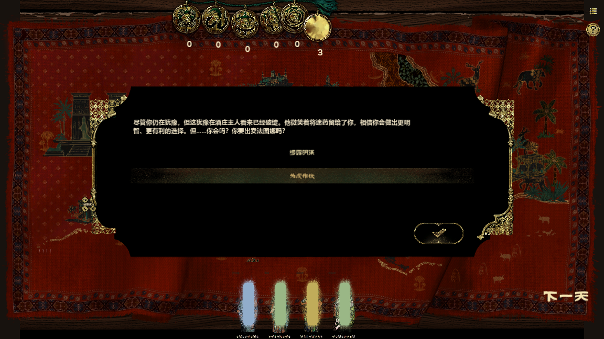

# 验收、证据与当前交付状态

## 当前判定

**最新增量：普通装备销毁卸装已接原始unequip曲线、BROKER整卡采样与半秒Done。** GPU仪式49/49、494断言及像素探针通过，两尺寸真实输入、中途存读档和移除状态通过；共享atlas邻格、独立RiftGenerator裂口层、原作同帧捕获未闭合，仍🟡。详见[presentation正文](presentation.md)。

**最新增量：卸装回收已接原始动画与半秒Done等待。** 原编译Shader证明NORMAL材质不读取distance，已纠正“回收也应消散”的旧推断。GPU仪式47/47、431断言通过，含两尺寸、真实输入和装备回手后的中途存档重建。该回收批次未覆盖不回收BROKER；后续已接单格采样，Special仍未完成。

**最新增量：装备操作主卡已改为宿主，正equipment标签的普通装备已接原始位移/四元数曲线与Done等待。** GPU仪式46/46、380断言，真实输入和中途存档恢复通过；该装备批次当时卸装仅纠正主卡身份；后续回收分支已接，未回收BROKER、特殊效果分支和原RenderTexture投影仍开放。详见[presentation正文](presentation.md)。

**最新增量：标签增减操作6/7已补原始图标、变化量颜色、动画与串行Done等待。** GPU仪式44/44、310断言通过，包含两种尺寸、真实按键/确认按钮和中途存档恢复；见[presentation正文](presentation.md)。仍不是全套操作卡表现等价。

**2026-09-15 自审修复继续推进，尚未完成用户要求的全部还原。** 浅色操作文字行已移除，改为原作卡面、气泡和新卡条幅；新卡直接读取原始 `new.anim`，按 Hermite 曲线、1/3 秒 Done 与 1/2 秒视觉终点分别处理。气泡串行等待，真实松键只推进一次；播放中完整保存/重建/读档可继续，已播放音效不重播。新卡角色默认音效按原作使用正面音效，物品使用普通音效。

手牌/仪式发言、镜头 focus 和 slide 已有执行宿主及持久化等待，不能再描述为全部未消费。仍开放：装备/删卡/升稀有度等动画及标签悬停详情、结果堆叠与完整批次时序、旧 guide_cues 迁移、禁词原作实机边界、完整骰子演出、非16:9及其他原作运行边界。**54/54仍仅验收已采集的一条原作状态轨迹。**

当前专项：仪式GPU42/42、257断言，覆盖1920与1280、新卡曲线/Done分离、原始NEW_CARD文案、发言真实按键、完整SaveSystem恢复及关闭等待；`op-sequence-save-gpu-2.log`为通过日志。前一版失败日志保留：旧测试错误要求新卡动画完成前自动关闭；初始截图因测试画布零尺寸为全灰，已作废，修复测试布局并重拍。全量结果见下表；全量启动后新增的禁词实现与气泡时限修正使用受影响整组复测，不冒充已纳入该次全量。

| 当前回归范围 | 结果与边界 |
|---|---|
| 销毁卸装后原作带复跑 `broker-original-replay.log` | 2/2、196断言；结算和读档54/54、规则随机13/13。复用既存原作带，不是新原作销毁过程捕获 |
| 销毁卸装GPU `broker-animation-gpu-final.log` | 49/49、494断言；含GPU采样检查、两尺寸、真实输入、中途存读档与移除状态；非原作销毁过程新采集 |
| 回收动画后原作带GPU复跑 `recovery-animation-original-replay.log` | 2/2、196断言；结算/读档54/54，规则随机13/13；复用既存原作带，非原作回收过程新采集 |
| 回收卸装GPU `recovery-animation-gpu.log` | 47/47、431断言；独立源材质消费链、两尺寸、真实输入、中途存档与装备回手状态 |
| 装备动画后原作带GPU复跑 `equip-animation-original-replay.log` | 2/2、196断言；结算/读档54/54，规则随机13/13；复用已捕获原作带，不是新原作装备演出实测 |
| 普通装备动画GPU `equip-animation-final-gpu.log` | 46/46、380断言；两尺寸、真实输入、中途存档与主从身份；特殊效果/卸装动画未纳入通过范围 |
| 标签增减动画GPU `tag-animation-final-gpu.log` | 44/44、310断言；两尺寸、真实鼠标/按键、中途存档恢复 |
| 标签动画后原作带复跑 `tag-animation-original-replay.log` | 2/2、196断言；结算/读档54/54，随机13/13；复用既存原作带，本次捕获复刻四阶段截图 |
| 全量 `provenance-full-regression-4.log` | 75脚本、791测试，790通过、1 GPU pending；7868断言，退出0，无脚本错误/孤儿/泄漏。包含原作调用带，未包含启动后新加禁词测试及气泡时限修正 |
| 最终原作带GPU复跑 `provenance-final-original-replay.log` | 2/2、192断言；结算54/54、读档54/54、规则随机13/13。复用原作已采集带，本次未重新启动原作；本次未配置截图导出 |
| UI布局 `provenance-ui-layout-final.log` | 81/81、1070断言；在禁词实现后整组复测 |
| 气泡时限及仪式GPU `pop-strict-timeout-gpu.log` | 43/43、260断言；严格超时、重复结束、真实松键顺序、两尺寸及存档恢复 |
| GPU遮罩 `provenance-mask-final-gpu.log` | 1/1、18断言通过，补全上项跳过的渲染专项 |
| 改名 `ban-word-save-regression-2.log` | 3/3、646断言；原资源303组.NET对照，两尺寸真实禁词输入，GameScreen拒绝空名、合法提交、待处理和完成后的JSON存档/场景重建 |

**2026-09-15 全工作区自制行为审计：仍有同类问题，不能签署“复刻端无自制内容”。** 首次筛查102个运行文件；最新机器清单覆盖110个运行时代码/工程文件、32,321行，并登记6,096个配置/资产文件；这表示扫描范围完整，不表示每个方法和资产已与原作逐一等价。详细问题、经验及外部目录范围见[本次审计](#provenance-audit-20260915)。54/54仅代表已采集轨迹；复核实际RecordedRNG后，排除了骰子绕过记录入口的候选误报。

**2026-09-15 随机调用带对拍：本次原作第4→5天轨迹，结算后54/54、磁盘重载后54/54，13/13规则随机调用参数和顺序匹配。** 这是该独立原作输入下的状态等价；不代表全游戏、所有随机分支或完整表现均已等价。

用户批准后已从PyPI安装Frida 17.18.0。只读观察原作1.0.2feaceb3的GameAssembly.dll中UnityEngine.Random.Range(int,int)参数、返回值、调用栈，未修改参数、返回值、随机种子或游戏状态。完整记录和脚本纳入[外部证据索引](external-evidence.json)，本批根目录为`C:/Users/User/Documents/GitHub/Faust-artifacts/Faust-rng-capture-20260915`。

原作鼠标轨迹：继续第4天存档→下一天→等待宫廷自动结算后关闭→等待空派遣家业结算后关闭→关闭TIME_OUT→关闭BACK_ROUND→保存并退出→继续游戏→再次保存并退出→退出游戏。返回地图与重载后的引导关闭状态已在原作窗口截图中观察；本次未量测原作动画持续时间。两份原作结果存档仅saveTime不同。原15个存档文件已逐一SHA256恢复，新生成round_5.json移出玩家目录归入采集证据。

本次原作宫廷抽中了另一条自然分支，不沿用旧分支的after期望。规则抽取从原作调用返回值独立生成，不读取after存档；按源码调用点分离RiftGenerator裂隙、ThinkController动画触发和结果卡片位置/旋转的表现抽取。浮点调用仅记录出现和调用点，未采集数值，因此不宣称表现随机等价。所有观测调用点必须有归属，未知点会让提取失败。

修复两类共同机制：ListExtensions.Shuffle原作为前向抽取，两元素时仅Range(0,2)==1交换；次日事件之前漏传主RNG，周期重设和事件掉落走了独立随机流。现在在事件fire之前绑定本轮流，weighted_pick_int也经统一半开区间入口，供真实调用带检查。背书：ListExtensions0x6feb50/0x6fe7b0、ChooseOperations0x4f3830、TimingRoundBase0x465d30/0x465f20、GenLoot0x512b90及dump.cs和实机调用记录。

测试适配器只存在于专项测试内；逐项检查区间、顺序、越界、耗尽和剩余调用，任何不匹配均拒绝等价验收。该次轨迹不插入原作未做的家业中途重建；原有未同步随机的中途重建回归保留为独立边界。最终保存→重建→读档仍进行54项对照。

**2026-09-15 表现修正：** 依据 `GenLoot.RealGenCard 0x512260`（dump.cs:314584）和 `RiteRender.OnRiteShow 0x59bdb0/OpenRitePanel 0x59c2f0`，移除克隆自制的 GenLoot 卡牌/仪式确认框；生成物直接进入原作对应的卡牌操作或地图实例链。RiteNew 未知仪式现在按 `RiteNew.prefab` 的 Mask（123×133，anchoredPosition (0,-17.6)）与 `Resources/anims/rite/rite_show.anim`（Mask 0→1/6s、标题揭示、Icon 10→25/60s、事件 55/60s）先显示问号，真实悬停/焦点触发揭示，完成后写 `is_show` 与 `once_new_rites_is_show`；真实鼠标、阻断态、两种窗口尺寸、读档重复揭示专项 7 测试/52 断言通过。结果正文段落改为原作 `StringBuilder.AppendLine`（`RiteResultPanelController.AppendResultText 0x5a13e0`）的单换行，保留原始 paragraphSpacing=80 配置并按 TMP 基准字号×0.01换算；恢复原始标题模板的 Title SDF、+10字号、菱形与10%缩进。手牌改为源坐标布局并在父级统一缩放，1280/1920真实拖动和读档恢复通过。详细来源与未完成边界见 [表现修正](presentation.md#presentation-20260915)。本次自审修复前，OpCard 气泡曾为文字行近似，`OpCardNewController.Init 0x572f40/ShowPop 0x574960` 的逐卡资源与动画未完全迁移；因此表现整体仍 🟡，但此前三次额外确认差异已消除。

早先随机对拍批次详情见[历史机器报告](followup-results.json)；当前自审修复结果以本页顶部和追加专项为准；以下45/54、50/54均为随机未同步的历史批次。

| 历史表现批次检查（不是当前最终回归） | 当时结果 |
|---|---|
| 最终无渲染原作调用带对拍 | 2/2，192断言；结算54/54、读档54/54、随机13/13 |
| 最终GPU真实鼠标对拍 | 2/2，196断言；结算/读档54/54；多余确认0次，阶段截图归档 |
| 本次表现全量初跑 | 784测试：778通过、5失败、1 GPU pending；7708/7717断言，退出1 |
| 失败组修正后整组复测 | 手牌7/7、65断言；sim59/59、183；桌面14/14、149；UI布局81/81、1068 |
| 最新结果排版与揭示专项 | 结果40/40、205断言；揭示GPU7/7、52断言；字号7/7、39断言 |
| 手牌真实输入与重建 | 1280/1920尺寸、鼠标命中、真实拖动/失败回手、序列化重建均通过，包含在手牌组 |

全量初跑的5项失败来自旧测试依赖生成物确认框、未知仪式立即打开；各失败组已按原作入口修订并整组复测。该历史批次当时未复跑整套；后续自审全量已另行运行，见顶部最新表，不能改写此失败日志。之前随机批次的781项全量结果保留在机器报告历史中。揭示专项曾在断言通过后卡于GUT对已释放地图对象的信号监听清理；测试现先断开监听再释放，最终整组正常退出。

此前截图发现的未知仪式直接显示名字、标题模板缺失、段距与手牌尺寸差异已修正。**仍未完整表现等价**：CardPop文字行已替换为卡片/气泡，但原作发牌/逐卡操作串行演出、揭示四元数逐帧投影及尾事件、动画中途重建和声音验收尚未闭合。54/54只验收当前原作轨迹的状态投影，不能遮盖这些未迁项。

<a id="provenance-audit-20260915"></a>

## 2026-09-15 自制行为全范围筛查与复盘

本节表格保留首次审计事实；用户随后已授权实施修复与目录迁移。各项当前状态见下面的修复增量，不能把初次发现继续当当前未改代码。运行代码基于本轮已有未提交工作区；[机器清单](clone-provenance-audit.json)记录每个文件的SHA256、源注释和候选行。可运行 `py -3 tools/audit_clone_provenance.py` 重建。候选行不是问题数量，缺少SRC注释也不是自制的充分证据。

### 这次错误为什么会发生

| 成因 | 如何暴露 | 修复及今后门禁 |
|---|---|---|
| 为了让输出“看得见”，用自制确认框或文字行替代缺失的原作控制器 | 双端鼠标轨迹多出确认；用户截图显示浅色“新增/发言”叠在托盘上 | GenLoot确认与操作记录文字行现已删除。仍须完整迁移CardOpContext→OpCardNew→OpCardShow→气泡/动画/结果去向；不能再次用临时可见文本签署完成 |
| 只抄子节点尺寸，漏了父级CanvasScaler | 原作与克隆截图手牌明显不等大；1920下194×422仍画成194×422 | Hand源坐标与父级统一缩放已修。检查父尺寸/锚点/pivot/scale/y翻转和最终屏幕矩形，不能只断言card_size常量 |
| 将序列化初值当运行时最终值 | 本轮追查画廊同一GameObject的启用TextTranslate，发现原作会覆盖TMP.m_text | 原始配置→翻译组件→运行文本必须连查。此前引用原作Prefab字符串并不自动有效 |
| 数字看起来来自原作，但单位和曲线丢失 | paragraphSpacing=80被当成80像素；标题旋转被近似成平滑横向伸缩 | 段距已按TMP的字号×0.01因子修正；四元数曲线仍开放。记录单位、空间、采样、切线和事件，而不仅是数值 |
| 测试把当前实现写成期望，反过来保护错误 | 旧测试要求额外奖励框、未知仪式立即打开；本轮又发现copy值=2的测试要求复制两次 | 原作证据先于测试期望；保留失败运行与修订依据，不能靠测试全绿宣称原作等价 |
| 局部通过被扩张为全局通过 | 13次规则调用带通过不能覆盖所有分支；审计初读接口名又误报Dice绕过记录，实际适配器已桥接 | 先查实际覆盖方法和调用链，撤回误报；增加含检定的原作轨迹，按“本轨迹/全机制/表现/持久化”分开验收 |
| 为保留材料而不断新建外部目录，目录范围又没被校验器覆盖 | Documents出现8个Faust目录，仓库门禁却仍通过 | 证据、临时缓存、备份需统一根与保留期；外部清单必须核对缺失/散落材料，不能只查仓库内链接 |

### 已确认的问题或非等价替代

这里的“已确认”表示已经核对克隆落点和列出的原作证据；不是所有项都已完成原作实机重放。状态型风险优先于表面修饰；同一链条按METHOD_MAP统一修复。

| ID / 优先级 | 克隆行为与原作证据 | 影响和下一步 |
|---|---|---|
| PA01 / P1 | `ui/rite_view.gd:_rebuild_result_lists` 手写“新增/复制/移除/发言”，用Label、32字号、34行距画卡牌操作。原作 `OpCardNewController.Init 0x572f40/ShowPop 0x574960/Update 0x574af0` + OpCard.prefab、CardOpContext enum 使用操作卡片及气泡 | 用户截图的浅色小字来源已确认。发言数据是原作的，文字行呈现不是。不可仅隐藏文字后宣布修复，须迁移整个逐卡表现及承诺链 |
| PA02 / P1 | `ui/rite_view.gd:_build_dice_surfaces/_show_dice_surfaces` 自建Count/CurrentDices/Success标签，写“骰子 × N / 结果: / 成功数:”。`RiteResultDicePromptController.Show 0x59e9e0` 使用NumberToSprites及动画节点，dump.cs:324773、RiteResultPanel.prefab为第二信号 | 复核纠错：这些摘要所在DicePromptNew始终隐藏，不能声称玩家曾看见；现已删除。原作逐骰/成功环/数字精灵仍未完整迁移 |
| PA03 / P1 | `sim/result.gd:511` 把hand_pop/rite_pop/focus/slide/change_desk_bg等塞入guide_cues，超过32条删最早项；全运行代码无相应消费器，仅保存/载入/清空。原作 `Slide.Do 0x51bb70→GameController.ShowSlide`；`ChangeDeskBG.Do→MapController.ChangeDeskBG`并写Player.desk_bg和RequestSavePlayer；dump Slide/ChangeDeskBG与配置事件5300300～5300303为独立信号 | 这是用队列承载替代真实功能，不是完成。close_*五个显示字段已接，不应误报为全部无效；其余操作需分别迁移，并避免用“supported”掩盖未执行 |
| PA05 / P2 | `ui/gallery_panel.gd:155/162`硬写“历史画廊”“在这里可以看到已经触发过的游戏内容。”。StartScene GameObject258的TMP4274确实有旧文字，但启用的TextTranslate6001绑定GALLERY_TITLE；`TextTranslate.UpdateTextInternal 0x1566ad0`调用Datapool.Translate，content/ui.json最终值为“游戏画廊”和“在这里，你可以看到一些汇总的游戏内容。” | 已确认漏掉运行时覆盖，不能拿Prefab旧值自证正确。图鉴标题/正文应直接绑定原始文本及样式 |
| PA06 / P2 | `ui/main_help.gd:_help_text`手抄整份帮助文本且注释称zhTW转简体；当前content/ui.json已有zhCN。BAG手写“切换和使用卡牌栏位。”比原配置多句号。`TextTranslate.UpdateTextInternal`和GameScene帮助TextTranslate是对应链 | 有损手抄和重复真源；主体多数文字相同，不夸大为新增剧情。逐项改读content，检查卡片帮助/改名/任务按钮等同类字面量 |
| PA07 / P2 | `sim/result.gd:_apply_copy_slot`把value当次数且至少1次；`CopyCard.Do 0x4f51b0`只过滤目标，每目标回调4_0 0x507430追加一次，4_1 0x508090只Copy一次，不读SingleValue.Value。dump.cs:313552 + 原始copy.s3重复键为第二信号 | 克隆自行扩展了“copy.s1:2”的次数语义；tests/test_copy_card.gd:94、test_dsl_batch1.gd也保护该扩展。本轮对原始StreamingAssets全部JSONC去注释、保留重复键解析：53处copy操作值全部为1，解析错误0；因此是合成输入暴露的语义扩展，未证明现有原作内容会触发差异 |
| PA08 / P2 | `ui/source_text_style.gd:_fits_at`以“汉”字宽度估算每行字数再按总字符数估算高度。`TextTranslate.UpdateFontSize 0x1566920`实际委托TMP auto-sizing，dump TextTranslate与textstyle配置承载auto/min/max | 混合宽窄字符、显式换行、富文本字号会得出不同拟合。是宿主自制近似，需实际排版测量并对齐TMP；不能把“字体文件相同”当排版相同 |
| PA09 / P2 | `ui/change_name_view.gd:_validate_name`只验UTF16长度；`PromptChangeNameController.IsValidName 0x584de0`在长度通过后还调用Datapool.HasBanWords0x4131c0，dump.cs:323419和ILLEGAL_NAME配置为独立信号 | 已核对HasBanWords：仅在Datapool+0x2a8过滤器非空时调用HasMaskWord，否则记录错误并返回false。初审时缺少该分支；现已恢复加密资源、匹配规则和真实输入拒绝路径，详下方增量与presentation正文；原作进程同场景验收仍开放 |

### 待核验、旧残留与不能误报的事项

- **PA04，已排除的误报**：`tests/test_household_dual_replay.gd:30`的实际RecordedRNG覆盖range_int，并转入range_int_half_open(lo,hi+1)。因此不能以core/dice调用range_int推断它绕过记录或走另一个随机流；此前交流中的该判断撤回。扩大原作检定轨迹覆盖仍是验收需求，与此误报分开。

- **PA10，宽高独立缩放**：多个界面使用Vector2(width/3840,height/2160)，与GameScene CanvasScaler11488的统一ScaleWithScreenSize/Expand结构不同；1280×720和1920×1080均为16:9，无法暴露。非16:9最终画布、相机与锚点需要实际宽屏/窗口输入对拍，暂记结构风险，不冒称所有界面都已实测变形。
- **PA11，测试工具混入生产脚本**：`ui/game.gd:_mcp_capture_compact_prompt`含自制“capture.compact_prompt”及直接pressed.emit；全项目引用扫描未找到普通玩家入口。应迁至tools，不能将其等同正常游玩会弹框。`--dev-menu`测试开局已有debug+显式参数门，属于开发工具，不应当作未授权正式玩法。
- **PA12，死代码也是误导源**：`RiteOpen.is_interactive`按“有槽+有结算”筛仪式；ScopeFilter.is_match把tag统一当>=。当前生产调用未发现（RiteOpen仅旧测试；生产筛选走RuntimeOperationFilter/ConditionEval），不能报为当前可达机制错误，但应在复刻主表清理/隔离，禁止后续智能体复用。
- **PA13，已有近似仍需闭合**：rite_show四元数、尾事件、未知仪式闲置摆动、OpCard串行生命周期、TMP sprite尺寸与长标题缩进；沿用本章当前表现缺口，不能因这轮静态筛查升级状态。
- **未直接判错**：结果打字的20字/秒在RiteResultPanel.prefab的characterPerSecond=20可核对，并非凭空数字；AudioManager的0/-1音效键来自原始表，但新卡仍须区分角色默认1与物品默认0，不能用“键来自原作”替代分支验证；Godot平台适配、缓存、存档迁移不因原作没有同名类就成为违规玩法。FaustTheme自选色板、贴图缺失时FlatStyle、头像/字体兜底是候选，具体可见调用和原作资源失败分支尚未逐项闭合。

### 范围与完整性

102个运行时代码/工程文件全部进入静态筛查（core7、data3、platform2、scenes1、sim23、ui65、project.godot1），共31,472行、349个候选行；6,078个content/asset文件全部登记字节指纹。候选包括正常代码和历史注释，不作缺陷计数。新增JSON留在既有replica证据区，正式结论只在本节，METHOD_MAP只保留TODO入口。

本轮没有逐行反编译重证全部31,472行，也没有重新跑每个游戏页面、所有动画、宽屏和所有原作存档。因此准确结论是“全范围筛查发现上述问题”，不是“全文件深度等价审计已通过”。本轮未改玩法；原有GUT、54/54和配置门禁仍按原批日期解释。本轮新增工具两次输出逐字节一致，6,180个文件指纹复核通过；文档门禁通过（137条来源、567件既有证据），git diff --check通过。该文档门禁不等于外部目录登记完整，也不统计新增静态清单为运行时通过证据。

### 用户Documents目录的材料债务

2026-09-15实查8个目录约2.53GiB。它们是此前工具/备份操作留下的外部产物，游戏本体不依赖这些对拍目录；其中capstone-local是研究工具依赖，不是运行游戏依赖。

| 目录 | 文件数 / MiB | 内容和处理边界 |
|---|---|---|
| Faust-backups | 21 / 0.51 | 两批UI更正备份；当前external-evidence未逐文件登记，先判定是否已被Git/正式证据覆盖 |
| Faust-cleanup-20260911 | 11,419 / 2,452.72 | .godot约1,163.62MiB，commit-cleanup-102511约1,162.78MiB；另有capstone-local、原始token oracle及旧文档/日志。不能把整个目录都当缓存删掉 |
| Faust-dual-replay-20260914 | 151 / 50.49 | 原作截图、存档前后态、存档备份及会话提取 |
| Faust-dual-replay-20260915 | 12 / 0.60 | 后续对拍与日志；外部索引仅10项，另2项需补登记或归入可再生产物 |
| Faust-dual-replay-followup-20260914 | 29 / 8.59 | 失败与后续重放、清单和日志 |
| Faust-dual-replay-pop-20260915 | 20 / 1.12 | CardPop专项和旧结果 |
| Faust-phase-close-20260914 | 17 / 19.19 | 阶段收尾检查与DSL审计 |
| Faust-rng-capture-20260915 | 102 / 59.91 | 独立随机带、原作备份、脚本、截图及表现复测 |

初次外部索引只覆盖329文件，不能支持“8目录全部审过”。现在迁移收据覆盖11,771文件，校验器逐文件检查迁移哈希、旧路径消失及目录章节归属；这证明材料完整性，不代表缓存、旧脚本和所有原作证据都已获得语义等价验收。新增运行产物另入外部索引。

**迁移已执行**：8个目录现统一位于 `C:/Users/User/Documents/GitHub/Faust-artifacts/`，11,771个文件迁移前后逐一SHA256相等，Documents顶层旧目录已不存在。迁移收据 `migration-20260915.json` 保留全部旧→新路径、字节数与哈希；没有删除原作证据。项目文档/索引已改新路径，历史外部脚本中的旧字符串不重写为新历史，执行时显式指定新根。AGENTS已加入输出目录约束。

### 自审修复增量（尚未整体验收）

- PA01：删除操作摘要Label，按OpCard.prefab创建原始CardWidget、稀有度背景和Pop贴图；UID复用，使用TextTranslate的`@RITE_SETTLEMENT_POP_TEXT`。DoCachedOp发言串行；PopJumpActionBlocker.OnActive0x5829d0注册canceled回调，InputActions/UI_PopJump独立确认Space/Enter/leftButton的松开跳过。剩余时间写入操作载荷，零剩余重建立即完成。新卡0/1已接原始new.anim、NEW_CARD条幅和PlaySFx；Done与曲线尾部分离，顺序/音效已接入完整存读档。另已补标签增减6/7原始动画、符号/颜色和中途恢复；尚缺装备/删除/升稀有度等操作动画、全部音效与最终结果堆移动，不能标为完整等价。
- PA02纠错：旧DicePromptNew始终隐藏，自制摘要从未被证实可见；已移除未使用Count/CurrentDices/Success文字占位。原作骰子准备、NumberToSprites和实际骰子演出仍需补齐；删除死代码不是完成骰子还原。
- PA03：HandPop/RitePop已进入可保存的pending_operations并消费，按实际卡牌/仪式UID显示，后继操作等待最后一句；change_desk_bg/location_icon写入Player对应持久化字段并由地图消费，close_*不再积压无消费者提示。focus已接MoveTo线性移动、地图边界和中途进度；slide已接原始素材/nativeSize/页界、SmoothDamp和关闭Promise；删除向guide_cues继续追加的兜底分支；旧存档残留因缺发生上下文仅无损保留，不擅自回放。不同输入设备和完整原作运行边界未验收。
- PA03新增实证纠错：`close_begin_guide`在dump.cs:426398声明为`[Timing]`，`CloseBeginGuide.IsValid 0x45eb80`比较guide_type，没有Do；原始事件5310128/5310132/5310137把它放在on。已删除复刻虚构的同名结果指令及“清空全部旧cue”行为，收紧close_*为原作五项白名单。真实引导关闭仍由begin_guide_bar→trigger_events触发。43/43 DSL、184断言通过，未知指令不改变活动引导或等待队列。
- PA03新手选择链：原始5300000重复event_on先触发5300300的slide，等关闭才启用5300066。过去测试跳过此等待，因滑页曾是空实现而通过；现在按原始JSONC调整，OperationsSequence7/7、42断言通过。
- PA05/06：图鉴使用原ui.json的GALLERY_TITLE/GALLERY_TEXT，帮助使用MAIN_HELP_*_PROMPT，删除复刻自写正文，不再沿用Prefab序列化旧译文。
- PA07：CopyCard每个筛选目标只Copy一次，不以操作value制造复制次数；已改合成value=2回归。原始JSONC53处copy值均1，不虚报其为已观察原作轨迹差异。
- PA08：删除“汉字宽×字符数”估算，改用真实Font和RichTextLabel排版测量，并随文字变化重算；仍是Godot适配，尚未证明TMP逐像素等价。
- PA11：删除ui/game.gd中无外部调用的5个_mcp_capture_*入口，包括自制测试弹框与pressed.emit模拟操作；现有真实输入测试继续保留。
- PA12：删除无生产调用的RiteOpen.is_interactive与core/scope_filter.gd；原死代码测试迁为RuntimeOperationFilter身份、丢失排除、六种比较运算边界，避免后续误用统一>=规则。
- PA09：原加密禁词库已导入并由运行时解密，303组独立.NET对照、两尺寸真实输入及GameScreen待处理/完成后存档重建共3/3、646断言通过；原作进程实机边界仍未验收。PA10/13仍待实现/验收：非16:9统一缩放、源动画/Shader/音效完整链条。未以静态筛查或54项状态投影掩盖缺口。

新增经验：修改执行器时必须区分“支持性检查”和“实际执行”两个同名条件段；本次一次错插曾导致未定义state/val的编译失败，现已修复并通过引擎导入。GUT遇脚本错误可能仍显示通过计数，因此必须连同SCRIPT ERROR、孤儿/泄漏检查，不仅看Passing Tests。

本次原作随机带GPU复跑：`op-sequence-original-replay.log`2/2、196断言；独立报告`op-sequence-oracle-report.json`结算54/54、读档54/54，13次规则随机顺序/参数通过。原作没有重新启动采集，本次重用之前捕获的输入带与独立终态。新增slide首尾限界、单页、真实鼠标命中层级/底层阻挡、重入关闭测试2/2、34断言通过；初版断言误把合法子节点命中当失败，保留失败日志并改为验证真实命中属于该面板层级。

## 2026-09-15 CardPop后续批次（历史）

**2026-09-15 CardPop后续：最新真实输入重放45/54，尚未等价。** 前一次50/54保留为历史单次结果，不代表稳定进度；没有筛选种子或只保留高分运行。

已按原作CardPop.PreDo回调0x5083a0→OperationContext.AddCardOp_Pop0x39e640（dump.cs:394346，type9/card/pop）修正仪式results阶段的发言：绑定目标UID、按原顺序记录文本，不再排入全屏确认。空目标不产生匿名发言。原作Do阶段CardController.ShowPop0x508690是另一条路径，本批未替代它。

同时发现并修正结果面板读取错误：实际输入为RiteResolver.RiteResult.deferred，旧实现只接受顶层Dictionary.card_ops，已记录的结果无法显示。现在支持真实对象和字典，并在提交结算后刷新。前一份纯字典单测不足以验证实机宿主，已补真实RiteResult回归。

最新原作对拍显示：uid41/卡2000024的发言“就没有点新鲜事吗？”进入可见结果行；真实鼠标完成结算，CardPop全屏确认数为0。当前行式呈现仍不是原作气泡动画，完整占位符、动画时序及结果外发言仍待完成。GenLoot生成仪式/卡牌仍有额外全屏提示，不作表现全通过结论。

验证：边界13/13、55断言（含发言顺序、空槽、保存恢复）；仪式UI40/40、201断言；原作专项173/191断言，转换后与重载后均45/54，退出码1。专项剩余失败均为9个状态投影项，发言可见与无额外CardPop确认断言通过。日志没有SCRIPT ERROR/ERROR/泄漏报告；本批未重跑全量和GPU。详细运行证据见[机器报告](followup-results.json)和[外部索引](external-evidence.json)。

当时随机调用采集尚未建立，本机缺少Frida且等待联网授权；此阻塞已由上方本批采集解除。相同存档不含完整Unity随机状态、中途重建克隆会重置main RNG的边界仍需区别处理，不得根据目标终态反填返回值。

## 2026-09-15早先周期事件批次（历史）

**2026-09-15：实际重放50/54，仍未等价。** 本次只执行一次新重放，未更换种子挑选结果。修正周期事件把GameRNG误当作Godot原生RNG、从而退回全局randi的接口接线。该修正由原作TimingRoundBase.NextRound 0x465f20、dump.cs:427066和原始event/5310809.json共同背书。

| 剩余差异 | 原作 | 本次克隆 | 判断 |
|---|---|---|---|
| 周期531080900下次触发日 | 8 | 9 | 当前第5日加Range(3,7)；原作与克隆随机输入未同步 |
| 上朝uid24槽s3 | uid33 | uid34 | 普通多候选随机吸附，需原作调用轨迹确认选择序号 |
| 上朝uid24槽s4 | uid100 | uid35 | 同上；候选集和消耗顺序还需轨迹对齐 |
| 淘书uid27槽s2 | uid35 | uid58 | 同上；同时引起hand/table成员差异 |

四个不一致投影项为timing_rounds、hand_membership、table_operation_root_membership、rites。后三项共享上述槽位归属差异，不是三套互不相关的数值错误。其余50项在本次运行一致，不推广为所有随机输入均等价。

验证：边界组12/12、46断言；事件集成14/14、76断言；原作专项177/185断言，转换后与磁盘重载后均50/54，退出码1。未重跑全量；下方777测试是9月14日历史结果。日志及紧凑差异见[本轮机器报告](followup-results.json)和[外部证据索引](external-evidence.json)。

下一项需要独立采集原作Random调用的顺序、参数、返回值及对应游戏操作，再与克隆逐调用对齐；不得从终态反推选择并伪装成输入证据。当前没有可用的原作随机调用采集器，本机Python也未安装frida/pymem，本轮未联网安装。已有测试在家业关闭前额外重建克隆场景，而main RNG未持久化；后续应分别验收同操作轨迹和中途重建边界，不能混称同一随机输入。CardPop/GenLoot额外全屏提示仍待修正，50/54不包括完整表现通过。

## 本轮实际结果（2026-09-14）

| 检查 | 结果 | 含义 |
|---|---|---|
| 原作第4→5天实机采集与保存重载 | 已取得；原15个存档文件已按哈希恢复 | 有独立原作裁判，不是克隆自造预期 |
| 修正后实际双端重放 | 167/185断言，失败；转换后、重载后各45/54投影项一致 | 仍不能签署结算等价 |
| 定向机制边界 | 11/11测试、40断言通过 | 覆盖have、标签历史、墓碑及普通随机吸附等局部边界 |
| 完整GUT首次运行 | 777测试：774通过、1失败、2 pending，7461/7462断言 | 失败是旧测试错误要求“吸附首张”；已按原作纠正 |
| 纠正后仪式UI整组 | 39/39测试、197断言通过 | 不将定向复测伪称全量通过；最终全量结果见下一行 |

最新实测差异为 per_id_counts、timing_rounds、hand_membership、table_operation_root_membership、rites、only_rites、once_new_rites_is_show、gen_cards、gen_tags。不同随机选择会改变后续奖励与历史计数，不能仅凭字段不等就认定每个字段各有一个独立缺陷。随机轨迹未同步是未决项，不能反填原作选择来消除差分。

克隆还出现原作本次流程没有的 pop/rite/card 全屏确认；CardPop 应追到卡牌表现，GenLoot 应追到附加结果流，不能只删提示掩盖缺失的表现。下一批按 METHOD_MAP 处理随机流及结果呈现，并用同一裁判复验。完整源样本、两次失败重放和日志统一登记在 external-evidence.json。

## 最终本地回归与整理校验

全量复测：777测试，775通过、2 pending、7462断言，650.807秒，退出码0；日志无SCRIPT ERROR、ERROR或对象泄漏报告。两个pending分别需要外部原作裁判和GPU：原作专项已另外执行，结果为失败，不能被这次全量退出码0覆盖；本轮未重复GPU专项。

整理校验：137来源记录、681个复刻旧标题、35份原创原件及483个原创旧标题、567项工作区资料；旧正文撤除、当前入口与本地文件链接有效。原件Git哈希与Windows工作区文本哈希分开记录；一份2026-06-29历史规格原本含损坏UTF-8，原始字节仍可由Git哈希验证。

布局导出实际运行AfterStoryItem：49条统一记录数量不变，原始text保留，新增generated_text承载最新导出，没有重建退役Markdown。离线阅读器脚本语法检查通过；浏览器对file URL的安全策略阻止了渲染检查，故不宣称浏览器视觉验收通过。Markdown入口与JSON资料可直接使用。

## 验收准则

唯一主TODO为../METHOD_MAP.md；原作行为裁判是.c、dump.cs、原始配置和实际运行产物。完整链条须覆盖来源→状态→控件→真实输入→变化→过场/音效→磁盘恢复。通过GUT、没有未知DSL键、配置数或静态截图，均不能单独签署整体验收。

本次原作15文件已恢复，哈希一致。既有原第4/5天裁判、过程截图和克隆失败差分保存在外部证据目录，并由仓库机器报告记录哈希；不是未处理材料。可复用历史审计、旧计划、平台设置及方法映射修订均按下列证据项纳入，不再保留平行旧文档。

## 必须覆盖旧记录的纠错

- 完全复刻已解冻；旧冻结/横版正式架构/固定玩家视角不是原创契约。
- “全部DSL识别”不等于全部原作语义正确，“已修局部”不等于功能闭环。
- 普通吸附不是固定首张；槽位定义来自RiteNode+0xB0，不是Player苏丹池。
- data/config是有损旧导出；现在以content原始JSONC为准，旧统计只保留历史口径。
- 原作同刻存档54项一致不是次日54项一致；随机结果不允许反填或换种子挑中。
- 旧计划中的REQUIRED技能、代理分工、冻结/提交策略均无当前指令效力；只遵循当前AGENTS及用户指令。


## 证据模块

- [A19 第42批：吸附指定的投槽门](#e001)
- [当前实现近似审计（2026-09-10）](#e002)
- [自动字号：按 sizeRange 收缩（第二十四批，2026-09-10）](#e007)
- [CardOpContext 操作流：从结算到结果面板（第二十九批，2026-09-10）](#e008)
- [DeepSeek 工作接手核验（2026-09-11）](#e018)
- [桌面与仪式性能排查（2026-09-12）](#e019)
- [结局地图特效槽位与地点位置规则（第二十七批，2026-09-10）](#e020)
- [2026-09-12 下一天后续提交复审](#e026)
- [基础循环双端对拍与原创阶段收尾](#e029)
- [2026-09-13 提示框复审（保持 🟡）](#e031)
- [残留清单收敛（2026-09-11）](#e033)
- [苏丹骰子子场景与仪式类型分支（第二十六批，2026-09-10）](#e051)
- [Faust Clone Independent Double Audit - 2026-06-30](#e056)
- [报告五：卡牌实例/区域流转/标签/计数器系统（2026-08-15 第二批完成）](#e057)
- [报告六：事件系统（2026-08-15 第二批完成）](#e058)
- [报告四：Result/Action DSL 执行器语义（2026-08-15 第二批完成）](#e059)
- [审计报告七：苏丹卡循环 / 难度 / 回退系统余项（2026-08-15）](#e061)
- [Faust 独立全面审计 · 第一轮（2026-08-15）](#e062)
- [核心复刻验收与当前证据](#e063)
- [完全复刻差距清单（2026-08-15，审计修复收口后）](#e065)
- [Faust Audit Repair Implementation Plan](#e069)
- [Faust — 苏丹的游戏 Godot 克隆 设计规格](#e070)
- [UI 架构验收矩阵](#e071)
- [开发阶段、旧架构与规则记录](#agent-history)
- [方法映射的逐批依据与冲突修订](#method-history)

<a id="e001"></a>

## A19 第42批：吸附指定的投槽门

证据范围：`docs/replica/verification.md#e001`，基准`843f0100`。以下为原批次事实、推理和验证记录，**局部通过/未决均不自动成为当前全局状态；当前决定以本章顶部与METHOD_MAP为准**。

<details>
<summary>展开来源、方法、边界和验证细节</summary>

### A19 第42批：吸附指定的投槽门


### 原作证据


- `RiteExtensions.CanPutCard 0x3918b0` 先执行槽配置条件；条件失败立即返回。成功后，若main存在且 `GetTag(main, adsorb_spec, false)>0`，只有上下文 `is_adsorb_spec` 为true才允许。

- `HasTag.IsSatisfied 0x3fe5a0` 在单main分支读取 `TagNode.attributes@0x58`，若包含adsorb_spec，调用 `ConditionContext.SetAdsorbSpec 0x385520`；随后才读取被检查标签并Compare。标志不取决于本次比较成功与否。

- `SetAdsorbSpec` 直接将 `context+0x21` 置1；`dump.cs:383851`确认该字段，`TagNode`字段声明确认attributes字典；`stringliteral.json:10791` 将 `0x258AE08` 映射为adsorb_spec。

- 原 `content/tag.json` 囚徒（prisoner）attributes为 `{"吸附指定":1}`，原加载链翻译为code。宿主保留原配置字节，所以读取原名和已翻译code两种表示。

- 原存档 `save_samples/auto_save.json` uid120/id2000346哲瓦德的运行态tag为 `{"adsorb_spec":1}`，配置tag为 `囚徒1、哲瓦德1`。这是实际保存状态，不是本批手写状态。

- 原 `CardStack 0x53b0a0` 仍以is_cost而非CanPutCard布尔值作为后续付款门；不能顺手把特殊标签拒绝改成所有付款的前置拒绝。


### 改动


新增共享 `ConditionEval.can_put_card`，按原条件→特殊门顺序计算；RiteView的手动预检、替换、成本探测及GameState的候选仪式/吸附路径接入。空配置条件仍会经过特殊门。


`eval_acting_tag` 在实际执行该标签条件时、比较之前设置is_adsorb_spec；沿用同一上下文的any/all短路语义。不预扫描整棵条件树，也不把标志存入卡牌或跨探测缓存。


### 验证边界


直接导入原auto_save的哲瓦德验证：空槽条件拒绝、囚徒条件通过、阈值不满足仍拒绝、失败的标签条件可为随后成功的any分支设置标志、被短路跳过的标签条件不能授权。生产View验证拒绝保持手牌、许可后实际入槽；候选/吸附入口使用同一规则。


另有明确合成的金币标记夹具，仅用于验证CardStack忽略CanPutCard布尔而尊重is_cost的边界，不宣称这种金币来自原作存档。


最终回归：特殊投槽4/16、生产投槽13/69、生命周期16/57、卡牌实例11/51、仪式界面36/175、原存档导入桥7/91，合计 **87测试、459断言通过**。六组日志无SCRIPT ERROR、ERROR、Orphans、泄漏或失败；`git diff --check`通过。日志位于仓库外 `C:/Users/User/Documents/GitHub/Faust-artifacts/Faust-cleanup-20260911/adsorb-test_*.log`。


### 未完成与下一步


投槽门对**已有**原作标记有效，不代表标签属性维护已完整：`CardExtensions.ValidateTagAttributes 0x3831c0` 在源tag有效值>0时对attributes逐项AddTag，否则RemoveTag；AddTag 0x37e6a0、RemoveTag 0x382e40及Copy0x37f4e0有调用。当前宿主的增删标签与新建/Copy仍需系统接入这条链，不能简单从每次读取临时推导，也不能把多个源tag的attributes自行求和替代原作写入顺序。


全量测试、完整自动吸附成本附加条件、self/parent索引、演出与音频仍未完成。本批未修改content、未联网、未提交或推送。


</details>


<a id="e002"></a>

## 当前实现近似审计（2026-09-10）

证据范围：`docs/replica/verification.md#e002`，基准`843f0100`。以下为原批次事实、推理和验证记录，**局部通过/未决均不自动成为当前全局状态；当前决定以本章顶部与METHOD_MAP为准**。

<details>
<summary>展开来源、方法、边界和验证细节</summary>

### 当前实现近似审计（2026-09-10）


本表是 METHOD_MAP B/C/D 的展开，不替代主 TODO。目标是消除未经证实的算法、参数和执行顺序，而非用另一套目测参数替换旧参数。此次按用户要求暂不做 RenderDoc 逐帧捕获。


### 状态及范围


- **已证实偏差**：当前代码与本次打开的原作方法/产物冲突。

- **已修本边界**：只表示表中明确列出的边界改正，不能外推整个系统。

- **待核候选**：实现中发现参数、替代结构或缺口；来源栏只作下一步导航，尚非新验收结论。

- **平台承载**：可保留等价接口实现，不因为用了 Godot 或自写解析器就认定错误。


自动候选明细在 `approximation_candidates.csv`，逐文件覆盖在 `approximation_scan_coverage.csv`。工具直接遍历 ui/sim/core/scenes 的 gd/gdshader/tscn，绕过 Git ignore；扫描常量、运动表达式、视觉字面量、缺口注释和空方法。本批扫描 **85 文件、1403 条候选行**。**这是可重复的发现清单，不是每行均有问题，也不保证找到所有无注释的语义错误。** CSV 的 UNREVIEWED 由此表的人工条目逐组解释，不自动改成已验收。


`source_pointer_candidates.csv` 另列389处C文件名引用，其中10处按字面文件名未匹配：包含省略类名前缀的闭包/协程简写，必须展开后再判断，不能直接宣称10个错误背书。即使文件存在，也只标FILE_EXISTS_BODY_UNVERIFIED，不视为行为已验证。


### 当前逐项处置


| ID / 优先级 | 当前位置与问题 | 原作来源 / 下一步核验入口 | 状态与处置 |

| --- | --- | --- | --- |

| A01 / P0 | card_widget 文件头伪背书 `CardArea.c`、DOTween | 本次直读 CardController、HandCardsController、HandBagController；dump 无 CardArea 类 | **已修**：删除错误引用，改为真实方法指针。注释有 SRC 不等于已验证 |

| A02 / P1 | card_widget 悬停高度 `422*.2=84.4`，错误地随卡高变化 | CardMoveUp 0x528390；CardResetMove 0x528480；SetChild 0x55e360；CardShow 居中锚 | **已修视觉边界**：固定 100 根高度增量的一半=50，随候选缩放；槽卡无上移。根命中矩形增长后续已迁，详A05 |

| A03 / P1 | card_widget 发牌 `.30`、错峰 `.055`、淡入 `.16`；game_screen 右侧偏移42、上下28/4 | GameController.AddCard 0x54ad40 / CardController.Init 0x528f40 -> HandCardsController.Update 0x563520 -> SetChild | **已修普通入手布局边界**：删除额外飞入、错峰、透明度与临时输入锁。独立 OpCard 奖励演出不在本结论内 |

| A04 / P1 | card_widget 重排/失败拖回 `.22` 秒 SINE_OUT，视觉与命中位置分离 | SetChild 0x55e360 直接 set_anchoredPosition；dump.cs:320498 | **已修**：恢复布局直接赋位置，不再对重排附加自制缓动 |

| A05 / P1 | card_widget 根命中、拖起坐标、手牌左右堆叠与Range滚动 | CardMoveUp 增高100；CardResetMove 恢复oldSize；CardNew根pivot；Hand输入排序 | **已修PC边界**：真实根扩高100/卡面中心升50、候选实际缩放、flash进入门、拖起中心转换、左右堆叠/兄弟顺序/边缘滚动。100测试及双分辨率实际输入通过。后续已补sticky插入判定、空隙不增加子节点及已迁子树的Bounds钳制；槽出合堆/装备已补实际来源锁定和离槽后面板同步，装备首次自动打开人物详情，双分辨率实际拖动通过；完整active树/独立选择/手柄持牌/拖起离槽时序仍未完成。详CardRootAndHandLayoutCorrection.md、HandDragPreviewCorrection.md、SlotHandStackCorrection.md、SlotEquipmentCorrection.md |

| A06 / P1 | cached_events_view 双sin、线性衰减、局部时间与坐标换算 | Shaker.c 0x435690/0x4357e0；dump Shaker；UnityPlayer原生内核；GameScene Canvas7581/Camera4416 | **已修数学与点击边界**：1029噪声+468衰减步骤与原生float32结果一致；恢复世界投影并修NextDay遮罩点击顺序。84测试/1082断言及双分辨率实际点击通过。原机时钟/RNG同步与逐帧仍开放，详ShakerNativeCorrection.md |

| A07 / P1 | event_prompt_view 2705×960根、1300/1100限高、行起点/步长、立绘400×500 | PromptController.Show 0x58a020、PromptControllerBase.ShowInternal、OptionController；PromptNew/OptionNewItem布局组 | **已修布局边界**：按源反向排列/父子弹性布局分配，移除960固定高、行步长和立绘400×500挤压；0–3立绘/长正文实际输入已验。默认高亮图、TMP及Full变换仍未完成。详EventLayoutCorrection.md |

| A08 / P1 | change_name_view BAR_SIZE高度220 | PromptChangeNameController；PromptChangeName ContentSizeFitter/布局组 | **已修根布局和父子层级**：高度改为正文+600，错误行不计入根首选高度；详PreferredLayoutCorrection.md。后续已修输入Simple背景、10/7/10/6内距及独立placeholder字体/字号，详RenameInputSurfaceCorrection.md。TMP度量/主背景Full仍待迁；第十四批已修表面层硬截断/Trim/UTF-16长度/Enter与编辑门，86测试及双分辨率输入通过。第十五批已将实例误写修为Player.name/配置id名并补存读档及真实原存档对拍，102测试和双分辨率输入通过；第十六批已修剧情改名存原键及默认中文译文回退（CustomNameTranslationCorrection.md）；禁词、第十七批已补custom_text默认翻译链（CustomDescriptionTranslationCorrection.md）；第十八批已修table/total数字ID的多目标与根对象域（CustomTextScopeCorrection.md）；其他翻译域/筛选器、调用顺序及通知消费者仍开放 |

| A09 / P1 | source_confirm_dialog 短面板高度与按钮悬停 RGB1.15 | 本次直读ConfirmNew.prefab:2208起：ColorTint、highlight .9607843、pressed .78431374、fade .1、目标为Confirm/Cancel图 | **无立绘共用确认框动态布局已修**，高度=正文+450；确认按钮ColorTint原色/.1秒过渡已接并验实际输入；档案Close/ModifyName/Load/Delete/名称Confirm/Cancel已按各自状态色修正，含名称禁用不透明深灰；行内删除Confirm/Close也已修且共用RGB1.15分支已删除；输入框/滚动条及导航仍未完成，多立绘见A07。详PreferredLayoutCorrection.md及ArchiveButtonTintCorrection.md |

| A10 / P1 | source_text_style 自动字号只取sizeRange上限 | TextTranslate/TMPTextExtensions、textstyle.json、TMP自动字号 | **已修**（第二十四批）：`TextTranslate.UpdateFontSize` 0x1566920 与 TextStyleNode 布局（dump.cs:393716）确认"上限=sizeRange.y、收缩=TMP enableAutoSizing"，13/80 个样式为自动字号且只有 sizeRange。克隆原只取上限不收缩、显式档位时根本不建绑定、css_size 缺档位时返回 0、尺寸恒定不更新，均已修：新增二分拟合 + resized 重拟合 + 绑定总是建立 + 查表失败退 size。详AutoSizeTextCorrection.md。spacing 字段与 TMPTextMaxPreferredSize 首选尺寸截断仍未接 |

| A11 / P1 | card_metal 固定ambient/probe黑/相机平面；透明高光HDR边界 | 原Shader187字节码、GameScene RenderSettings/Camera，详CardShaderImplementation | **环境输入已由数据定案**（第三十三批）：①`GameScene.unity` RenderSettings 是 **m_AmbientMode:3（Flat）**——只用 `m_AmbientSkyColor (0.212,0.227,0.259)` @ 强度1，**不烘 SH 探针**（`m_EnableBakedLightmaps:0` / Realtime:0 / AO:0），赤道色与地面色在 Flat 下不参与 → shader 里那个 `ambient_diffuse` 是**逐字正确**的。②`m_SkyboxMaterial` 与 `m_CustomReflection` 都是 `{fileID:0}` → **没有可绑定的立方图**，故 `environment_specular = 0` 从"待测未知量"变成**有源背书的确切零**（正是审计"不能因有分支就假定反射非零"的反面用法）。③场景恰好两盏平行光：`&4869` mask `1<<30` 只照苏丹骰子层、`&4870` mask `0x800000F7` 含 **layer5（卡牌层）** → 克隆的"单光源/白/强度1/无阴影"四条全部成立，且**禁止**拿 4869 的软阴影给卡牌造投影（第96行原话现在有逐位依据）。④`m_ActiveColorSpace:0`（Gamma）vs 克隆无任何 color_space 设置 → **登记为未验证分歧**（不做"更亮/更暗"的因果断言，Unity Gamma 与 Godot 线性/显示 sRGB 的对应未在本仓库验证）。⑤仍未定案：`light_direction` 的 **z 符号**——匀量等于源四元数 `(.13040192,.043246232,-.005693473,.9905012)` 的 forward `(-0.08418598,0.25881905,+0.96225019)`，但 clone 切线空间与源不同，两种解释都自洽，需同帧卡面对拍才能判定，故不动。新增 `tests/test_card_shader_scene_inputs.gd`（8测试/30断言）直读语料 `.unity`/`ProjectSettings.asset` 交叉断言匀量。**渲染公式本身（TBN/粗糙度/能量分配、法线打包、手工亮度倍率、纵向渐变、detail 均值补偿）仍未碰**。详CardShaderEnvironmentCorrection.md、CardShaderAudit.md |

| A12 / P1 | rite_view result 播速/自动播放已有按钮，OpCard播放链尚缺 | RiteResultPanelController、CardOpContext、OpCardNewController | **操作流已落地、播放未接**（第二十五/二十九/三十批）：①播速确认为**两档**且来自 variable.json、按自动播放布尔选择、夹在 [0.5,100]，克隆自造的 x1/x2 循环与"速率乘两次"已修。②`CardOpType`（dump.cs 6304，13 值）与 `CardOpContext`（6305）已对齐；`GameState` 新增结果操作日志隔舱（NEW/COPY/DELETE/EQUIP/UNEQUIP/UNEQUIP_RECOVERY/UPRARE 在卡牌变更点被动记录），`ResultExec.execute` 与延迟效果应用两处开启，`rite_view._rebuild_result_lists` 从空实现改为按真实操作流填充原作三个图层。③（第三十批）**ADD_TAG/REMOVE_TAG 入流 + `can_visible` 门**：`ResultExec._mutate_tag` 收口全部 6 个标签写入源，写入无条件、只有**记录**过 `tag+0x41` 门（该门在 `AddCardOp` 的 `List.Add` 之前，且全语料 `+0x41` 读点都是消费方 → 是显示旗标不是写入门）；行携带 `tag`/`amount`/`value_after`，记录时机对齐原作 PreDo（早于 `can_add` 门）；全量 GUT 617 测试 / 4542 断言（两条既有 UI 失败无关）。**逐张卡动画播放（OpCardNewController.Init）仍未接**：当前是文本行不是原作演出；`+0x182` 缓存态与 `MoveOpCardsToResults`、`+0x183` 门、以及 POP/HAND_POP/THINK_POP/REBIRTH_SUDAN_CARD 四类记录仍缺（后者的 `pop.` / 带点 `hand_pop.` / `think_pop.` 键在全量 config 里 0 次出现，属不可达）。详ResultPlayRateCorrection.md、CardOpStreamCorrection.md |

| A13 / P0 | RiteResolver与NextDay未全部串行等待；事件已有OperationsSequence | METHOD_MAP串行链项；OperationsExtensions.Start / Promise.Sequence及结算调用方 | **主体已修**（第二十一/三十二批）：①（21批）`OnNextRound` 闭包链顺序真值表已出（b__3 round++ → b__6 吸附+手牌整理 → b__7 抽苏丹卡），并补上链上缺失的**每日 `AdsorbCards`**、去掉吸附候选的随机选取。②（32批）**"事件派发挂载点无源"与"b__2/b__8 未读"两句均作废**：`GameEventSender` 不是事件系统而是 **PostHog 埋点**（`Configs: Dictionary<GameEventSenderType, PostHogSenderConfig>`、`PostHogSender`、`OnApplicationQuit` 上报），真正的事件系统是 `EventTrigger.c`（Add/Remove/On/GetActiveEvents/DoSettlements）+ `EventTriggerExtensions.c`（28 个 `On*`）+ `EventNode.c`；`b__N` 编号每个闭包类各自从 0 起，带前缀即可读——`DisplayClass142_0.<OnNextRound>b__2 0x570720 = OnRoundEnd`、`b__8 0x570f90` **是空体**；`round_begin_ba` 挂在 `DisplayClass141_0.<Start>b__5` 0x56f9c0，紧跟 `player+0x2c += 1` 之后（与21批一致）。③**全量派发真值表**（源调用点扫描 × 1863 个事件配置的 `on` 块）已落盘：21 个配置时机全部有源；`card_dead` 与 `round_begin_fr` **有定义、无调用点、0 配置实例** → 克隆的两处自发派发已移除（原作的死亡面是卡自身 `vanish` 块 + `card_clean`；实测零影响，因为没有配置匹配得到）。仍未接：`rite_begin`/`rite_clean` 派发（有源、0 实例）、`EventTrigger.DoSettlements 0x4fb1c0` 的结算块顺序、28 个入口的 `controller+0x298` owner 未逐点对照。详NextDayChainCorrection.md、EventDispatchTruthTable.md |

| A14 / P1 | game_screen SudanDice位置为停放值 | 当前代码显式留档；GameScene/苏丹重抽控制器 | **已定位、未迁移**（第二十六批）：原作骰子是**独立 3D 子场景**（`SudanDiceCamera` fileID 4416 + 子对象 `Dices` 349 挂 `SudanDiceRollController` 11767，localPos(1.05,-1.69,39) scale 0.01），不在 2D 画布上；真值表（DiceBaseScale 40³/CellSize 100²/HeightRange(-170,-230)/TopTimeRange(0.5,0.6)/TotalTimeRange(0.8,0.9)/RollRotation 400-1000/MaxScale(1.05,1.1)/WaitingTime 0.2/NormalizeTime 0.4/FullSize(1100,900)/Row 9/Column 11）与抛物线公式已取。克隆的 `RedrawSudanButton` 是触发 UI 不是骰子，停放矩形保留（无原作 2D 对应物）。详SudanDiceSubsceneCorrection.md |

| A15 / P1 | map_controller 特殊仪式位移仍有未迁分支 | RiteRender.Init / RiteController / prefab及位置类型 | **部分已核**（第二十六/二十七批）：①位置分支的开关确认为 `RiteNode.type@0x30 = RiteType{NORMAL=0,END=1,ENEMY=2,TREASURE=3}`（dump.cs 9597），配置分布 NORMAL 1394/END 41/ENEMY 44/TREASURE 16；②**"特殊位移"其实不是位置分支**：`RiteController.Init 0x58ae00` 用 `GameController.GetLocation(controller, rite+0x50)` 按**位置名**取 `RiteController.position@0x40`，再 `RitePosition.AddRite`；`RitePosition.AddRite 0x4636e0` 用 `SetParentNormalize(rite.go@0x58, this, (count*100-100, 0, 0))`，`GetPosition(count) 0x463840` 返回 `(count*100, 0, 0)` —— 同地点多仪式 = X 轴每 100 单位一档，与 type 无关。克隆的 12 张地点表（Palace/Treasure/Enemy/Parish/Outside/Blackstreet/Skill/SelfHome/Harem/End/Uptown/Downtown）与此结构一致。**未解**：各地点表的**基准坐标**在导出数据里没有找到承载（GameScene 无 RitePosition 组件的 `rites` 字段，`Location.prefab` 是空壳，未导出 .cs 源码），故表内数值仍未对拍，保持可替换 |

| A16 / P2 | map_controller Eft_End_Map粒子层缺失 | GameScene原粒子层级 | **已修槽位层**（第二十七批）：GameScene 里 `Eft_End_Map`(fileID 2574, layer 6) 本身就是一个 **`m_IsActive:0` 的空 Transform**（scale 200³），粒子子物体运行时实例化；`MapController.ChangeBGToEnd 0x567b70` 的**最后一条语句**才是 `EftEnd@0x78.SetActive(true)`。克隆此前缺这一步，已补 `Eft_End_Map` 槽位节点（初始隐藏、零子节点）并在 `change_bg_to_end()` 末尾激活，**不发明粒子层级**。仍未接：该槽位里实际实例化的粒子预制体（导出包无可搬运数据），详见EndMapEffectAndPoolOrderCorrection.md |

| A17 / P0 | original_save_importer 苏丹池标签按配置id合并 | 当前approximation报告；Player.sudan_cards / pool Card实例、GenSudanCard | **已修**（第二十批）：`player+0xB0` 确认为 `List<Card>`，语料池 27 个对象含 11 个重复 id，旧"按 id 合并标签"丢失真实对象。改为池对象模型（uid/count/life/tag delta），操作逐对象施加、重抽放回对象本身、shuffle 移到抽取时，详见SudanPoolObjectModelCorrection.md |

| A18 / P2 | importer drawn_round反推、shuffle队列比较 | 当前approximation报告；Card.life/出生字段、抽取Shuffle+RemoveLast | **部分已修**（第二十七批）：①`drawn_round` 全仓只有写点（导入/存读档/`ActiveSudan` 字段），**没有任何读取方**，故不属于会影响判定的近似，已把报告文案改为如实说明"存档无承载字段、记为导入当刻 round、仅随存读档往返"；②`sudan_deck 顺序` 那条近似**已过期**——第二十批把池改成有序 `List<Card>` 后，按 uid 的 `sudan_pool_objects` 行是精确逐对象比对（uid/count/life/tag 增量），已删除该近似条目并加断言禁止它复活。多重集行保留为第二重校验 |

| A19 / P0 | game_state 金币已含槽内总额，付款执行仍有缺口注释 | GetCounter / IsSatisfied need_cost_cards / 扣款实际调用方 | **38批已接正成本拆分/补齐与实际拖卡；零成本和完整替换链仍开放**（第二十二/三十六批；2026-09-11 接手复核）：**最新裁判：[CostContextCorrection.md](loop.md#e013)**：普通落槽只判断main，is_adsorb才枚举；恢复比较上下界及完整条件树，以下22/36批为历史记录，不能覆盖最新更正。①（22批）`CostCondition.IsSatisfied` 0x3f6160 确认为"枚举 `player+0x88` 累加 `Card.count` 到下限、记录 need_cost_cards"的交易判定，克隆原只查被拖动那张卡，已改为枚举式判定 + `[min,max]` 交付量 + 槽内卡计入。②（36批）**"付款执行体仍缺"的三个前提全错**：`ClearNeedCosts 0x385470` 只是 `ConditionContext` 字段重置（+0x60/+0x64/+0x68）且**全语料零调用方**——本来就是死方法；`CostCondition.PostProcess 0x3f6520` 是**配置加载期**一遍（`Datapool.LoadRitePostProcess 0x4163c0` 遍历仪式节点跑 `TranslateTag` 后解析缓存 Min/Max），签名收的是条件列表不是 context。真正的执行体一直在反编译产物里：**`CardSlotController.CardStack 0x53b0a0`**——开头 `HasTag(card,"stackable")` 门（字面量 `0x2593720`=`stackable`），`CanPutCard` 填 context，`is_cost@0x60==0` 直接返回；`余量 = count@0x20 − cost_count@0x64`，余量<1 → `RemoveCard` 整张离手并落槽；余量≥1 → `set_count(余量)` 留手牌 + `Copy(keep_count)` 后 `set_count(cost_count)` 只把应付那份落槽。配置侧 `cost.` 并不罕见：**1863 个仪式里 653 个**槽条件带 `cost.`，46 个不同键（`cost.消耗品=` 333 / `cost.金币` 323 / `cost.金币=` 57 …），操作符是键的一部分且可嵌在 `any`/`all`/`none` 内。已落地 `GameState.pay_cost_into_slot()`（三分支）+ `slot_cost_needed()`/`slot_definition()`（DFS 找嵌套 cost 键，复用 `ConditionEval.eval_cost` 避免第二份运算符解析）；`tests/test_cost_payment.gd` **13 测试**（三分支、不可堆叠门、参数边界、切片继承运行时标签、切片记 COPY 行、真实配置 `5000005`/`5000001` 的槽 cost 查询与"钱不够时查得 0"、独立重扫断言 653 个仪式带槽 cost）。顺带修正**幽灵引用**：`cost_count_for` 文档里的 `PayCosts` 在 dump.cs 里命中 0 次，是编造的名字，已改为 `CardSlotController.CardStack`。**仍未接**：`CanPutCard` 的完整槽接受判定（type/is/tag + cost 合并复核）、付款入场缩放 `+0x180/+0x184`（0.01f）。详CostConditionCorrection.md、CostPaymentExecutionCorrection.md |

| A20 / P0 | result rebirth 注释保留运行时标签复制未证实 | Rebirth/CopyCard、调用方、原8处配置 | **已修**（第二十三/三十一批）：①`CardExtensions.Copy` 0x37f4e0 确认复制运行时 tag@0x30 增量、`count@0x20` 与装备树（equips@0x40 递归），且**不**复制 life/custom_name/custom_text/rareup。克隆的 `copy.*` 此前在 `_apply_key` 里**完全没有分支**（静默空操作），已补分派与 `copy_card_instance`。②**`rebirth.s<n>` 分支已按源复核并修正**：`Do 0x519d60` 只是"取共享委托 → Filter → UpdateSudanLife"，真正的写点在 `<>c.<Do>b__4_0 0x51dec0`，两分支按 `HasTag(card, freeze)` 分流——无冻结 `life=0`，有冻结 `life = card_vanishing − player.sudan_card_init_life`（`+0x64`，即 `GenSudanCard` 的同一头起步量，**不是**满额）。字面量可查：`DAT_1825ac9e8` 在 `stringliteral.json` 的键是 VA−`0x180000000` = `0x25ac9e8` = `freeze`（tag.json id 3019999 冻结），此前记为"元数据无法反查"是查址方式错。8 处配置写点全部落在苏丹卡槽（5000158 s2、5006558 s1×2、5000576 s1×5），`is_empty` 全 0。克隆旧实现无条件 `life=0` 且 `days_left=card_vanishing`，两个错；因默认档 `sudan_life_time`=7 与 `2010001.card_vanishing`=7 退化同值而一直没被测试抓到，本批搬到困难档（头起步 5）才暴露。已改为按门分流 + `days_left = card_vanishing − life`。详CopyCardCorrection.md、RebirthBranchCorrection.md |

| A21 / P2 | game_audio 仅部分BGM/音效路径；armageddon音频未接 | METHOD_MAP音频项、sfx配置与LoopArmageddonController | **clip 名来源已定案**（第二十八/三十四批）：①（28批）克隆能播的 25/25 个 clip 全部存在（23 个 SFX 在语料 AudioClip 里、25 个在克隆音频目录里）；已加 `CUE_CLIPS` 注册表 + `test_audio_cues.gd`。②（34批）**"armageddon clip 名来自编辑器字段、语料无该字符串、无法推导"是错的**——clip 名与循环点都在 `content/sfx_config.json` 的 `armageddon_music_loop` 表（22 个 rite id → clip），查找链 = `LoopArmageddonController.GetLoopData 0x4033f0` 走 `Datapool+0x68→+0x60→+0xB0→+0x38` 以 controller `+0x48`（配置 id）为键；`PlayArmageddon 0x403520` 的空名报错把 `+0x40`(clip 名) 与 `+0x48`(id) 一起格式化，两个偏移语义由此确定；`GetClip 0x403240` 再按名解析（先 `LoadModAudioClip`、再内建数组）。已把 `sfx_config.json` 逐字节拷入 `content/`（parity 3886/0）、加 `db.sfx_config` 加载与 `GameAudio.armageddon_{rite_ids,loop_for,clip_for}`；`armageddon_music_loop` 用到的 10 个 clip 里有 7 个从未进克隆，已 SHA-256 等值拷入（10/10）并全部登记 `CUE_CLIPS`；`test_audio_cues.gd` 4→10 测试（表 22 项、两种表项形态、三种空查询、**每个 clip 必须 ResourceLoader.exists 且必须在 CUE_CLIPS 里**、`main_game_loop` 同查）。**仍未接**：`LoopArmageddonController` 播放宿主（`is_armageddon`/`armageddon_rite_id` 全仓只有初始化与存档恢复两处写点，**没有运行时赋值**，硬接触发时机即自制，故不做）、两张难度音乐表 `main_game_loop_difficulty`/`settle_loop_difficulty` 的消费方、`MusicFadeOutController` 淡出曲线。新线索：既然音乐族提示名来自配置表，"~391 个配音文件名→调用点在未导出 .cs"这条留档很可能同样有配置表，只是未找到。③（35批）**线索查完：三张表全在语料里**。`sfx_npc_role_dub.json` = **卡片 id → 有序配音 clip 名数组**（584 条 / 579 非空 / 670 引用 / 去重 **123** 个 clip，**123/123 语料零缺失**；键域由 `2000029→["item_coin"]` 钉死为 `CardNode.id`）——审计的"~391 个配音无法逐条对拍"既高估了数量也误判了载体。`sfx_settle_card_new.json` = 9 键，**`"0"` 是默认项**、8 个坏结果覆盖，语义是"具体优先否则落 0"而非未命中静音。`over_music_config.json` = 150 项、形状与循环表一致、键=结局 id（149 个键**全部**命中 `over.json` 的 159 个属性键，零缺失），另有 **`-1` 兜底项**（clip 同结局 1..7）。三张表已逐字节拷入 `content/`（parity **3889/0**）+ `db.{npc_role_dub,settle_card_new,over_music}` 加载 + `GameAudio.{npc_dub_files,npc_dub_file,settle_card_cue,over_music_entry,over_music_clip}`；引用的 133 个 clip 中 **132 个从未进克隆**，已全部 SHA-256 等值拷入（42 MB，音频目录 35→**167** 个 ogg，167/167 相等），`CUE_CLIPS` 改为登记全部 167 项。`test_audio_cues.gd` 10→**18 测试**（三表形状/键域/索引钳制/三种空查询/每个 clip 必须存在且已登记/结局 id 双向覆盖含 10 个无音乐结局与 `-1` 等价）。**仍未接**：播放宿主（**表 ≠ 时机**；`is_armageddon`/`armageddon_rite_id` 无运行时写点，配音触发时机在未导出控制器里，故不编造）、两张难度音乐表消费方、`MusicFadeOutController` 淡出曲线。语料 207 个 ogg 中另 40 个（~21MB）未被任何已集成配置引用，未搬。详AudioWizardAndCardFaceCorrection.md、AudioClipSourceCorrection.md、AudioMappingTablesCorrection.md |

| A22 / P2 | begin_guide演示/魔法苏丹、credits_page/after_story空方法 | WizardController / Credits / AfterStory原控制器与方法 | **已修数据面**（第二十八批）：①credits 与 after_story **不是空实现**（三个子页 + `SHOW_AFTER_STORY` 阶段链已接）；`credits_page` 的两个 `pass` 是**不可达基类默认**（子类全部重写 has/动作，控制器只在 has 为真时调用）。②`magic_sudan` 的宿主配置**一直在语料里**（`wizard/wizard.json` id `WIZARD`、`wizard_sudan.json` id `WIZARD_SUDAN`），克隆从未加载；已按零转译逐字节拷入 `content/wizard/`（parity 3885/0）并新增 `ConfigDB.wizard_config` + 按字符串 id 的目录加载器（原 `_load_dir` 会把两个字符串 id 压成 0 互相覆盖）。`magic_sudan` 仍为审计 no-op（无演示渲染宿主），但不再是"没有数据"。详AudioWizardAndCardFaceCorrection.md |

| A23 / P2 | game_screen/card_widget应急StyleBox色值 | `_style_for_card`有原图时返回透明；各调用点/缺图路径 | **已核并钉住**（第二十八批）：1292 张卡**全部**带 `resource`，其中 **110 张卡的 resource 在原作数据里就没有对应文件**（"原作本身无立绘"，与既有登记一致），它们走 `card_type_{char,item,sudan}.png` 兜底；6 张稀有边框全部存在，而 `_style_for_card()` 的门是"有原图**或**有稀有边框即返回透明"→ **纸面样式分支对任何配置卡都不可达**，保留为防御性守卫并用 `test_card_face_reachability.gd`（5/18）钉住结论。详AudioWizardAndCardFaceCorrection.md |

| A24 / P2 | 自写AttrExprParser、Godot z_index、坐标翻转、旧存档兼容 | METHOD_MAP结构项和各对应原控制器/接口 | **平台承载候选**：不能仅因自写而删除；验证等价边界，保留用户要求的窗口模式等明确例外。**第十九批已修其下的 tag 数据表示**：配置行+运行时增量+装备整行+非正掩码+×count，详见TagModelCorrection.md |


### 第一批直接证据


只读根：`Faust-local-source/_unpack`。


- `engine_spec/decompiled/CardController.c` CardMoveUp(0x528390)：slot@0x120非空直接返回；rect@0x1b0尺寸从oldSize@0x218恢复宽，高为oldSize.y+DAT_181c9e4d0。CardResetMove(0x528480)恢复oldSize；dump.cs:316959起字段与317111/317114方法核对一致。

- 原GameAssembly.dll按PE节RVA读取 `0x1c9e4d0` 字节 `00 00 c8 42`=100.0；`0x1c92b4c`=`00 00 00 3f`=0.5。没有把反编译未解符号猜成比例。

- `HandBagController.c` SetChild(0x55e360)锚点设zero，直接写位置：y=sizeDelta.y×scale×0.5；dump.cs:320498确认签名。HandCardsController.Update(0x563520)逐卡调用。高度增100时居中卡面升50×scale，而不是0.2×卡高。

- `CardShowChar.prefab`、`CardShowItem.prefab`根均中心锚/中心pivot、固定卡面尺寸；`CardController.Init` 0x528f40将GetCardShowPrefab实例化并SetParentNormalize至CardNew。卡面不随根高拉伸。

- `GameController.c` AddCard(0x54ad40)复用对象时回挂Hand并临时移至(-10000,-10000)，新对象走CardController.Init同样移至屏外；随后布局接管。此链没有“右侧牌堆飞入/错峰/淡入”。不因此否定其他奖励/剧情的Animator和OpCard演出。

- `Shaker.c` Update(0x4357e0)直接显示SmoothDamp/PerlinNoise及世界Transform位置写点，已足以否定当前两sin+线性减时+除以总时长的算法；尚不足以宣称已取得Unity内建Perlin全部实现。


### 执行顺序与验收


共用卡牌布局 A01–A05 → 动态文字/弹窗 A07–A10 → 结果/NextDay时序 A12–A13 → 状态丢失/付款 A17–A20 → 抖动/音频/特殊演出。每批先查源再改；不能跳过状态链，靠截图遮掩功能差异。


每项必须记录：原方法体、独立字段/配置/Prefab、改动范围、边界测试、仍未验证的原机行为。自动扫描可重复运行，不把旧清单“全绿”继承为当前验收。保留其他会话未提交改动，不涉及提交、推送或content修改。


### 第一批验证结果


- `test_ui_layout.gd`：81/81、1075断言；`test_hand_pages.gd`：6/6、44断言。最终日志 `approximation-ui-tests.log`、`approximation-hand-tests.log` 无失败、引擎错误及泄漏报告。

- 初次测试暴露3项旧测试把自制飞入/重排动画当正确答案；已按上述直接赋位置证据更新相关断言。新增独立50/55单位与槽卡零抬升断言，不仅比较同一个实现常量。

- `verify_card_reference_states.gd --resolution 1280x720`：GPU PASS，覆盖候选瞬态高亮、金币选中、铠甲拖动遮挡、装备详情；本批仅刷新1280组截图，并查看选中状态图。1920/2560旧图不当作本批验证。

- `git diff --check`通过。以上是移植代码边界及GPU冒烟验证，**此次没有新的原机同帧/鼠标连续输入对拍**，不能用它宣称整条交互或全项目像素一致。


第二批进展：[首选尺寸布局纠偏](presentation.md#e030)。A08/A09已消除固定高度和错误父子层级；A07后续见[事件布局纠偏](presentation.md#e023)；A10 TMP自动字号仍未完成。


第十九批进展：[卡牌标签模型：配置基准与运行时增量](state.md#e054)。第十八批登记的高优先候选（原存档 tag 是 code 增量、克隆把它当整行用）已按 `CardExtensions.GetTag` 0x3814a0 定位并修复：配置行 + 增量 + 可继承装备整行 + 非正掩码 + ×count；存档改为只存增量并带 `tags_are_delta` 标记，旧克隆存档加载时 rebase；`result.gd`/`operation_filter.gd`/`condition.gd`/`game_screen.gd` 的读点收口到有效行 API，并修掉 `create_card_instance` 把配置整行写入增量的根因。验证含"从存档 JSON + 配置独立重算 185 张卡的 GetTag 行、与导入态逐标签零不一致"；全量 46 脚本 / 566 测试 / 4298 断言通过，两条既存 UI 失败（`test_card_flash` 卡面几何、`test_event_choice_controller` mask 高度）已用基线对照确认与本批无关。仍未完成：key 域未全局统一（直读 `instance.tags` 的调用方仍会拿到增量）、苏丹池按配置 id 合并（A17）、`copy.*` 是否携带运行时标签。


### 2026-09-11 DeepSeek 接手复核


日志 `session-7a8f4ebd-595c-4468-8605-5534a70282da` 最后主动停止于第三十六批，全量测试当时中止。第十九至三十六批为既有工作，不能从第十九批重新实现，也不能继承“全部收口”的结论。


- A19：`pay_cost_into_slot` 仅由测试调用，游戏 `_place_card_in_slot` 未接；原 `CardStack` 同类已占槽合堆分支缺失，DFS 提取首个 cost 键不能替代完整条件上下文。详 `CostPaymentExecutionCorrection.md` 顶部接手更正。

- A21：原 `CardSlotController.CardStack/DropCard` 尾部已有 `SFxPlayCharacterDub` 调用；配置映射已落地，但“所有触发时机在未导出控制器中”的旧说法不成立。

- 以上为接手时直接源码与调用路径复核，尚未改动游戏行为。全量验收结果另记 `DeepSeekHandoffReview.md`。


第38批：[SlotCostInteractionCorrection.md](loop.md#e044)。A19已接生产拖卡成本分支，空槽拆分、已占槽补齐、超额保留和跨仪式归属已验；双分辨率GUI实际拖动PASS。历史“未接游戏路径”仅描述36/37批，不再代表当前正成本路径。


第39批：[SlotReplacementCorrection.md](loop.md#e047)，A19指定槽TryUpdateCard替换路径已接，取消无证据的自动改投。临时排除目标槽和旧卡返回手牌已验；零成本、聚合快照全域与表现链仍开放。


第40批：[ZeroCountBoundaryCorrection.md](state.md#e055)。A19零成本底层切片与手牌/槽/苏丹池零数量存读档已修；当前槽配置零成本入口为0处，不声明原机可达。54测试/389断言通过，A19其余边界继续开放。


第41批：[SlotAggregationCorrection.md](state.md#e043)。A19替换预检的all/friend/enemy统一使用排除目标的快照；SlotHasTag从逐卡任一满足改为求和后比较。原Enemy枚举闭包保留is_enemy=false，friend与enemy同路；与FuncCompare独立分组规则明确分开。验证结果见该报告，清单其余项未宣称完成。


第42批：[AdsorbSpecGateCorrection.md](verification.md#e001)。A19手动/候选/吸附验证接入CanPutCard的adsorb_spec门，HasTag按实际执行顺序设置允许标志。原存档哲瓦德覆盖已有标记路径；新建与标签增删的ValidateTagAttributes附属属性维护仍缺，不宣称完整闭环。


第43批：[TagAttributeLifecycleCorrection.md](state.md#e053)。新建、复制/拆分及Result标签修改接入当前语料的附属属性维护；普通标签底层增删/SET完整语义、池对象与通知链继续开放。


</details>


<a id="e007"></a>

## 自动字号：按 sizeRange 收缩（第二十四批，2026-09-10）

证据范围：`docs/replica/verification.md#e007`，基准`843f0100`。以下为原批次事实、推理和验证记录，**局部通过/未决均不自动成为当前全局状态；当前决定以本章顶部与METHOD_MAP为准**。

<details>
<summary>展开来源、方法、边界和验证细节</summary>

### 自动字号：按 sizeRange 收缩（第二十四批，2026-09-10）


A10 原登记为"source_text_style 自动字号只取 sizeRange 上限 / 已发现实现缺口，待源算法核验：所有长卡名、事件/仪式描述共用；不能页面各自缩小字号补救"。本批把 `TextTranslate.UpdateFontSize` 的方法体与 `TextStyleNode` 字段布局对齐，确认上限来自 `sizeRange.y`，而**收缩**是 TMP 渲染器内部的 enableAutoSizing 行为。


### 原作事实


`TextTranslate.UpdateFontSize 0x1566920`（`decompiled/TextTranslate.c`）按顺序设置：


1. 字号：先用 `style_48+0x40`（`css_size` 字典）以当前字号档位（`param_2`，来自 `Datapool+0x218`，即用户字号偏好）查表；查不到则用 `style_48+0x24`（`size`）。

2. `TMP_Text.set_enableAutoSizing(style_48+0x21)` —— 字段 `enableAutoSize`。

3. `TMP_Text.set_fontSizeMin(...)` / `set_fontSizeMax(...)` —— 字段 `style_48+0x28`，即 `sizeRange`。

4. `set_characterSpacing(0x30)` / `set_wordSpacing(0x34)`；

   `set_lineSpacing(0x38 + param_1+0x40)` / `set_paragraphSpacing(0x3C + param_1+0x44)`（后者是每实例增量）。


`TextStyleNode` 字段布局由 dump.cs:393716 独立确认：`font@0x10 / material@0x18 / isRightToLeftText@0x20 / enableAutoSize@0x21 / size@0x24 / sizeRange@0x28 / characterSpacing@0x30 / wordSpacing@0x34 / lineSpacing@0x38 / paragraphSpacing@0x3C / css_size@0x40`。


`TextTranslate.UpdateTextInternal 0x1566ad0`：只有当 `enableAutoSize@0x21` **为假**且 `css_size@0x40` 非空时才挂 `OnFontSizeChanged` —— 也就是说**自动字号样式不跟随用户字号偏好**，因为它的字号由 sizeRange 与拟合决定。


`TMPTextMaxPreferredSize`（0x464d00/0x464d10/0x464dd0/0x464fa0）是另一件事：把布局首选尺寸按每实例 `maxWidth@0x30`/`maxHeight@0x34` 截断（`0 < cap <= preferred` 时取 cap），并连做三次 `LayoutRebuilder.ForceRebuildLayoutImmediate`。它与 enableAutoSizing 无关。


**配置实测**（`content/textstyle.json`）：80 个样式里 **13 个 `enableAutoSize: true`**，且这 13 个**只有 `sizeRange`**（无 `size`、无 `css_size`），例如

`@CARD_INFO_TAG_TEXT [26,30]`、`@CARD_INFO_NAME [40,60]`、`@BIG_BUTTON_AUTO_SIZE [30,60]`、`@MAIN_BODY_AUTO_SIZE [20,60]`、`@TITLE_H3_AUTO_SIZE [40,50]`、`@BUTTON_AUTO_SIZE [30,40]`。

非自动样式的 `css_size` 有 6 档（`xs..xxl`），另有 `size` 兜底（如 `@CARD_TITLE size=45`）。


### 克隆偏差（已修）


1. **只取上限、不收缩**：`_point_size` 对自动样式直接返回 `sizeRange[1]`，长文本永不缩小。原注释自己也承认这一点。

2. **绑定丢失**：`apply()` 只在 `size_class` 为空时才创建 `SourceTextStyle` 子节点，显式传档位（多处 UI 传 `"md"` 等）时**根本不建绑定**，于是既没有偏好订阅，也没有任何尺寸维护点。

3. **`css_size` 缺该档位时返回 0**：`int(style.get("css_size", {}).get(code, style.get("size", 0)))` 在字典存在但**没有该 key** 时给出 `get` 的默认值 0，而不是 `style.size` —— 会把文字尺寸设成 0。源里是"查表失败退 `size@0x24`"。

4. **尺寸恒不更新**：没有任何随控件尺寸变化的重新拟合。


### 修复


- `fit_point_size(font, text, box, floor, ceiling)`：在 `[floor, ceiling]` 上二分，取"换行后仍能放进 box"的最大字号；用真实 `Font` 量（`get_height` + 以「汉」为样本的 `get_string_size`），与控件解耦以便测试。

- `_apply_auto_size()`：自动样式下按 `sizeRange` 拟合并写回字号，同时在控件上留 `source_text_size_range` / `source_text_fitted_size` 元数据。

- `_ready()`：自动样式时连 `Control.resized`，尺寸变化即重新拟合（TMP 是渲染器内部重排，Godot 没有单一等效钩子）。

- `apply()`：**总是**建立绑定；偏好订阅仍只对"非自动 + 有 css_size"的样式开放，与 `UpdateTextInternal` 一致。

- `_point_size()`：查表失败时退 `style.size`，不再返回 0。


### 验证


- `tests/test_source_text_style.gd`（7 测试 / 31 断言）：新增"宽松盒保持上限 / 紧凑盒收缩且不越界 / 不可能盒落到下限 / 无字体、空文本、零宽盒、坍缩区间、零下限的退化处理 / 固定样式查表失败退 `size`"。

- 全量 GUT 见收尾记录。


### 未完成与新增审计线索


- **拟合算法是等价近似，不是 TMP 复刻**：TMP 的 enableAutoSizing 在真实字形度量与断行规则下搜索；克隆用"字符数 / 每行可容纳字数"估算行数，对等宽 CJK 接近，对拉丁混排与换行规则（禁则、连字符）会偏。已在该函数注释与本节登记，不宣称像素一致。

- **spacing 字段未接**：`characterSpacing@0x30` / `wordSpacing@0x34` / `lineSpacing@0x38` / `paragraphSpacing@0x3C` 本批仍未映射到 Godot 的主题常量（`RichTextLabel` 无逐字间距覆盖，需要 BBCode 或 shader），保留为缺口。

- **每实例 spacing 增量**（`param_1+0x40` / `+0x44`）未核其写入方。

- **`TMPTextMaxPreferredSize`** 的首选尺寸截断未接；它影响的是容器布局而非字号，登记为独立候选（邻近 A09/A10）。


</details>


<a id="e008"></a>

## CardOpContext 操作流：从结算到结果面板（第二十九批，2026-09-10）

证据范围：`docs/replica/verification.md#e008`，基准`843f0100`。以下为原批次事实、推理和验证记录，**局部通过/未决均不自动成为当前全局状态；当前决定以本章顶部与METHOD_MAP为准**。

<details>
<summary>展开来源、方法、边界和验证细节</summary>

### CardOpContext 操作流：从结算到结果面板（第二十九批，2026-09-10）


A12 的主体是"`CardOpContext` → `OpCardNewController` 播放链"。本批先把它**拆成两半**：操作流（数据）已落地，逐张卡动画播放（表现）仍未接。审计原话"按钮状态不代表实际奖励演出完成"，指的就是后者；但在此之前克隆连**操作流本身**都没有。


### 原作事实


- `CardOpType`（dump.cs:394326，TypeDefIndex 6304）共 13 个值：

  `NEW=0 COPY=1 DELETE=2 EQUIP=3 UNEQUIP=4 UNEQUIP_RECOVERY=5 ADD_TAG=6 REMOVE_TAG=7 UPRARE=8 POP=9 HAND_POP=10 THINK_POP=11 REBIRTH_SUDAN_CARD=12`。

- `CardOpContext`（dump.cs:6305）字段：`OpType@0x10 / card@0x18 / tag@0x20 / value@0x28 / count@0x2c / pop@0x30`。

- `RiteResultPanelController.AddCardOp 0x5a0e60`：若"已缓存"标志 `+0x182` 为真先 `MoveOpCardsToResults`；对 `ADD_TAG`/`REMOVE_TAG` 会先检查 `tag+0x41`（`can_visible`），不可见就直接返回、不入队；否则把这条 context 追加到 `+0x1d8` 的待播列表。

- `OpCardNewController`（dump.cs:4476）是播放侧：字段有 `Background@0x20 / Equip@0x28 / Card@0x30 / Special@0x38 / Tag@0x40 / TagModify@0x48 / Animation@0x50 / Pop@0x58 / PopText@0x60 / PopStartTime@0x68 / lifeCount@0x88 / BGEft@0x98 / tagText@0xa0`，`Init 0x572f40` 按 op 类型决定演出，`Update 0x574af0` 推进，`Done 0x572dc0` 收尾。


### 克隆缺口


`rite_view.gd` 的 `_rebuild_result_lists()` 是**空实现**（只清空），三个原作图层 `Op Results`(1105,169) / `Op Hand Results`(1316,175) / `Op Cards`(232,510,1440,800) 一直是空的，因为克隆**没有任何地方产生操作记录**——`ResultExec` 返回的 deferred 里只有 events/logs/clean_* 之类，没有"对哪张卡做了什么"。


### 修复


### 1. 操作流（数据）


- `GameState` 新增 **结果操作日志隔舱**：`card_op_log` + `begin_result_op_log()` / `drain_result_op_log()` / `is_recording_result_ops()`，以及常量 `CARD_OP_NEW/COPY/DELETE/EQUIP/UNEQUIP/UNEQUIP_RECOVERY/UPRARE`（值与 `CardOpType` 逐一对齐）。

- 在**卡牌变更点**记录，因此任何调用方都被覆盖：

  - `create_card_instance` → NEW

  - `copy_card_instance` → COPY（带 `source_uid`）

  - `remove_card_instance_from_play` → DELETE

  - `_remove_slot_instance`（`clean.sN` 走的就是这里）→ DELETE

  - `attach_equipment` → EQUIP（带 `host_uid`、`slot`）

  - `detach_equipment` → UNEQUIP / UNEQUIP_RECOVERY（带 `host_uid`）

  - `modify_card_rarity` → UPRARE（带 `rare_before`/`rare_after`）

- **隔舱是被动的**：不调 `begin_result_op_log()` 就不记录。所以玩家拖动装备、初始化建卡等**不会**污染结算流；只有 `ResultExec.execute` 与延迟效果应用这两处显式开启。

- `ResultExec.execute` 在入口 `begin_result_op_log()`，返回前 `_collect_card_ops()` 把记录并入 deferred 的 `card_ops` 键；`rite_view._apply_deferred_to_world` 同样包一层，把延迟效果的变更也收进同一条流。

- **注意返回形状**：`RiteResolver.resolve` / `ResultExec.execute` 返回的是 **deferred 结构本身**（`res.card_ops` 在顶层），不是 `res.deferred.card_ops`——本批在实现中踩到并按实际形状改正。


### 2. 结果面板渲染


`rite_view._rebuild_result_lists(res)` 不再空转：按 `card_ops` 逐条生成一行 `Label`（`CARD_OP_LABELS` 映射成"新增/复制/移除/装备/卸下/升稀有…"），放进原作图层——`NEW/COPY/DELETE/UPRARE` 进 `Op Cards`，其余进 `Op Results`；每行带 `source_card_op` / `source_card_uid` 元数据便于断言与后续替换成真卡片视图。


### 验证


- 新增 `tests/test_card_op_stream.gd`（9 测试 / 20 断言）：日志在未开启时被动；`card` 生成记一条 NEW 且带 uid；`copy.s1` 记 COPY 且带 source_uid；`s1.uprare` 记 UPRARE 且 before/after 正确；`clean.s1` 记 DELETE；`s1+equip` 记 EQUIP 且带 host_uid；`coin` 不产生 UPRARE；结果面板按记录条数渲染行且行内保留 CardOpType 值；空流不残留旧行。

- 全量 GUT：53 脚本 / 612 测试 / 609 通过 / 4522 断言中 4520 通过（`r6-full2.log`），无 SCRIPT ERROR、无 orphan/泄漏报告。两条失败仍是既有的 `test_card_flash` 与 `test_event_choice_controller`。

- 过程中抓到并修掉一个真实泄漏：`_clear_result_lists` 原先用 `child.queue_free()`，而结果行会在**同一帧**重建，延迟释放会把旧行留成 orphan；改为同步 `free()` 后 orphan 归零。


### 补记（第三十批，2026-09-10）：ADD_TAG / REMOVE_TAG 入流 + `can_visible` 门


上表"未完成"里列的第一条可独立收口项——标签操作既没有记录点、也没有 `can_visible` 门——本批做掉。


### 关键事实：`can_visible` 是**显示旗标**，不是写入门


`RiteResultPanelController.AddCardOp 0x5a0e60`（0x3335-0x3343）：


```

if (type == 6 || type == 7) {

    if (cardOp.tag@0x20 == null) abort;          // 无标签对象 → 抛异常

    if (tag@0x20 -> +0x41 == 0) return;          // can_visible=0 → 直接返回，不入队

}

... List.Add(cardOp) 在 0x3345，门之后

```


门的**位置**决定了语义：它在结果面板这一侧，而 `CardExtensions.AddTag 0x37e6a0` / `RemoveTag 0x382e40` **从不读 `+0x41`**（全语料 `+0x41` 的读点只有 `HandCardsController` / `HandBagController` / `CardInfoNewController` / `GalleryCardInfo` / `Datapanel` / `TagNode(+0x41)` / 两个 ModifyTag 系列的 PreDo / 结果面板 / `PanelBase` / `MusicFadeOutController`——**全部是消费/显示方**）。


所以：`can_visible=0` 的标签（442 个里 262 个：影响力 / 污名 / 耐心 / 专属 / 出轨 / 各类存货与标记）**照常写入卡牌**，只是**不产生结果行**。


> 本批先按"门 = 写入门"实现，被测试当场打回：`self+影响力` 既没记录、卡也没变。改成"写入无条件、只有记录过门"后两条信号同时成立。留档：这种"门在消费侧而非写入侧"的判断，必须靠**门的调用点位置**（在 List.Add 之前）而不是字段名。


### 改动


- **`ResultExec._mutate_tag()` 成为全部 6 个标签写入源的单点收口**（裸键 / `s<n>` 槽 / `table.` `g.` / `total.` / `sudan_pool.` / `GenCard` 的 operation-local `TagModify`）。原先 6 处各自裸调 `TagSystem.apply`；现在统一走一个 helper：

  ```gdscript

  var changed := TagSystem.apply(tags, tag_name, op, amount, can_add, effective_value)

  if _tag_can_visible(db, tag_name) and state != null and state.has_method("record_tag_op"):

      state.record_tag_op(card_uid, tag_name, op, amount, tags)

  return changed

  ```

- **`TagSystem.apply` 改为返回 `bool`**（存储值是否真的变了）。调用方只有 6 个生产点 + 2 个测试，签名兼容（GDScript 忽略返回值）。

- **`GameState.record_tag_op(uid, tag_name, op, amount, tags)`** 落一张行：`op` 6/7、`tag`、`amount`、`value_after`；沿用隔舱，未 `begin_result_op_log()` 时不记录。

- **记录时机 = 调用点，不是变更点**：原作的 CardOp 建在操作的 **PreDo** 阶段（`DesktopModifyTag.__c__DisplayClass7_1.c` 的 `<PreDo>b__2` 0x521f60 / `b__3` 0x521fb0 → `OperationContext.AddCardOp_AddTag` 0x39dfa0 / `_RemoveTag` 0x39e870），**早于** `Do()` 里的 `can_add` 门。所以 `self+已拥有`（`can_add=0`、卡上已有该标签、实际零改动）**仍然产生一行**。曾短暂加过"没变就不记"的过滤，属自制偏差，已删。

- `GameState` 补常量 `CARD_OP_ADD_TAG = 6` / `CARD_OP_REMOVE_TAG = 7`（此前只有常量表注释，没有值）。`+`/`=` → 6，`-` → 7。


### 验证


- `tests/test_card_op_stream.gd` 从 9 → 13 测试：新增 ADD_TAG 行带 tag/amount/uid、REMOVE_TAG 是 7、`can_visible=0` 写入了但不入流、`can_add` 挡住时仍报一行（且卡确实没变）。

- `tests/test_tag_model.gd` 13/13：`TagSystem.apply` 三种 op 的返回值语义。

- 全量 GUT（第三十批）：53 脚本 / 617 测试 / 614 通过 / 4544 断言中 4542 通过，**零 SCRIPT ERROR、零 orphan、零泄漏**。两条失败仍是既有 `test_card_flash`（"candidate layout keeps the scaled bottom on the rail"，658.99 vs 764.0）与 `test_event_choice_controller`（mask rect 2629×489 vs 2629×828），1 条 Risky 是既有的 `test_rebuild_clears_previous_rows`（GUT 认为无强制断言，非失败）。

- 基线对比：本批前 612 测试 / 4522 断言 → 本批 617 测试 / 4544 断言（+5 测试、+22 断言全部来自本批新增），失败集合未变。

- `tools/check_content_parity.ps1`：3885 文件 / 0 违规（本批未碰 `content/`）。


### A12 仍剩


- **逐张卡的动画播放**（`OpCardNewController.Init 0x572f40`：按 op 切 Background/Equip/Card/Special/Tag 视图、`Animation` 片段、`Pop`/`PopText`/`PopStartTime` 弹出、`BGEft` 特效、`lifeCount` 寿命数字）**未接**；当前渲染的是纯文本行，不是原作演出。

- **`+0x182` 缓存标志与 `MoveOpCardsToResults`**：克隆没有"缓存/立即"两态，所有操作都进同一条流。

- **`+0x183` 门**：`AddCardOp` 开头 `if (*(char *)(param_1 + 0x183) == 0) { ... }`——该位为真时直接跳过入队（另有 `+0x182` 为真时先 `MoveOpCardsToResults`）。两态均未复刻，登记待修。

- `POP` / `HAND_POP` / `THINK_POP` / `REBIRTH_SUDAN_CARD` 四类**尚未记录**。

  - ⚠️ **本文件早先一版写过"`pop.` 键在全量 config 里 0 次出现、属不可达"——那是错的，已作废。** 错因是搜索口径：`pop.` 键不在 `result` 里，而在 **`cards_slot.sN.pops[].action.choose`** 里，例如 rite `5000576` 的 `{"choose": {"pop.5000576_s2_01.s2": "这个方法已经试过了。"}}`。`pop.` 是**卡槽弹出交互**（CardPop）的宿主，配置确实存在。

  - `CardPop` 的实际语义（`CardPop.c`）：构造函数 `(pop_id, selector)` 去重后 `Common.AddPop(pop_id, this)`，把 `OperationFilter(selector)` 挂到 `+0x20`；`PreDo 0x4f1e50` 与 `Do 0x4f1c70` 都只是 `Filter(riteContext+0x20, +0x14, callback)` 后跑 `DoSequence`，`<PreDo>b__1 0x5083a0` 会把 `OperationContext.ProcessPlaceholders` 的结果交给 `AddCardOp_Pop`。**克隆目前把 `pops` 当壳（不实现卡槽弹出交互层）**，因此这类记录要等有了弹出宿主才有意义，不是"缺一行记录"。

  - `REBIRTH_SUDAN_CARD` 的宿主是 `rebirth.s<n>`（规则侧已在第三十一批复核并修好两分支，见 [rebirth 分支证据](state.md#e032)），缺的只是 `PreDo`（`<PreDo>b__1` 0x51ffc0 → `AddCardOp_RebirthSudanCard` 0x39e760）这一条表现记录。


</details>


<a id="e018"></a>

## DeepSeek 工作接手核验（2026-09-11）

证据范围：`docs/replica/verification.md#e018`，基准`843f0100`。以下为原批次事实、推理和验证记录，**局部通过/未决均不自动成为当前全局状态；当前决定以本章顶部与METHOD_MAP为准**。

<details>
<summary>展开来源、方法、边界和验证细节</summary>

### DeepSeek 工作接手核验（2026-09-11）


### 日志与接手范围


用户提供的只读日志：`C:/Users/User/Downloads/dsh-session-session-7a8f4ebd-595c-4468-8605-5534a70282da/session.v3.jsonl`，6134 行；会话 cwd 为 Faust。最后用户要求停止，第三十六批全量测试被中止，最后回复明确付款辅助函数尚未接入 UI。


第十九至三十六批已经包含标签增量模型、苏丹池对象、每日吸附、cost 条件、复制/重生、文本适配、结果操作流、配置与音频素材等工作。接手时保留全部工作区，不从第十九批重做。本次只修改验收文档，不修改游戏逻辑，不提交或推送，不联网。


日志中的“全量通过”与其同段给出的失败计数有时冲突。按实际失败数验收；“已定位来源”“表加载完成”“辅助函数可测”均不等于游戏端到端完成。


### 直接复核的新发现


1. **付款未接游戏路径**：`pay_cost_into_slot` 与 `slot_cost_needed` 的调用方仅有新测试；`RiteView._place_card_in_slot` 仍调用 `add_card_to_slot`。

2. **付款源码覆盖不全**：`CardSlotController.c @ CardStack (0x53b0a0)` 的 `current@0x148` 同类可堆叠分支先合并数量，运行 `CanPutCard` 后回滚或分配余量。第三十六批只覆盖另一条路径。`dump.cs:317918` 附近字段和 `318014` 方法签名独立确认。

3. **不可堆叠语义需区分方法**：CardStack 返回 false；整张移入的执行体在 `DropCard (0x53b720)`。不能把后者写成前者的已验证分支。

4. **cost 查询仍为近似**：`slot_cost_needed` 深度优先取第一个 cost 键单独求值，丢掉完整 any/all/none 条件关系。只通过平铺/单键测试不足以批准接入游戏。

5. **配音并非全无调用点**：上述两个原作方法尾部均调用 `SFxManager.SFxPlayCharacterDub`；`dump.cs:416440` 签名为 `(int id, int rare, bool is_equip=false)`。调用点已找到，随机变体选择、限频、播放宿主尚未复核，不在本批猜测实现。


### 本次独立验证


- `tools/check_content_parity.ps1`：3889 文件、0 违规；仍未集成 DT1–DT9 与 mobile_help 共10个配置域。

- 对 `assets/original/audio/*.ogg` 与语料 `Assets/AudioClip` 同名文件逐一 SHA-256 比较：167/167 相等，总计150883986字节。该体积是目录总量，不是本次下载量；本次无下载。

- 全量 GUT 完整运行结束（791.082秒，退出码1）：55脚本、653测试、650通过、2失败、1无断言风险项；5903/5905断言通过。日志 `deepseek-handoff-full-gut.log` 无 SCRIPT ERROR、ERROR、orphan 或泄漏报告。不能称全绿。

- 两项失败：`test_card_flash.gd:73` 候选卡底边 659 vs 764；`test_event_choice_controller.gd:44` mask高度489 vs828。与日志描述吻合，但本次未通过恢复旧工作区来再次证明历史归因。

- 风险项：`test_card_op_stream.gd::test_rebuild_clears_previous_rows` 没有断言；GUT摘要把它列在先前脚本下，按运行正文和源码确定归属。

- `git diff --check` 通过。


### 后续顺序


2026-09-11 用户随后要求提交并清理工作区：上述临时日志及生成文件555个（79464282 字节）和Godot缓存（约1.22GB）已移至仓库外 `C:/Users/User/Documents/GitHub/Faust-artifacts/Faust-cleanup-20260911`，验收计数保留在本文。批量删除被自动审批拦截，改用可恢复迁出。原作素材、布局数据、反编译证据与截图保留，机器工具配置保留；本文引用的日志现在位于该备份目录。


先收口当前两条 UI 失败的正确预期，再从 A19 完整槽接受/成本上下文及已占槽分支推进；随后接生产拖卡路径，验真实输入、存档与结算。A12 动画、A14 骰子、A15 地点、A16 特效和 A21 播放宿主仍按主清单保留未完成边界，不继承日志中的笼统全绿。


</details>


<a id="e019"></a>

## 桌面与仪式性能排查（2026-09-12）

证据范围：`docs/replica/verification.md#e019`，基准`843f0100`。以下为原批次事实、推理和验证记录，**局部通过/未决均不自动成为当前全局状态；当前决定以本章顶部与METHOD_MAP为准**。

<details>
<summary>展开来源、方法、边界和验证细节</summary>

### 桌面与仪式性能排查（2026-09-12）


状态：🟡。已修复可复现的重复加载开销；未证明所有卡顿已消失，也未测原作 FPS。


### 量测与根因


Godot 4.7 / RTX 4070 Ti SUPER / Forward+ / 1280×720 独立窗口，导入只读语料 `save_samples/auto_save.json`，5 张可见手牌。使用隔离存档路径，不覆盖玩家存档。关闭 vsync 和 FPS 上限只用于量测，未更改项目设置。


| 路径 | 修复前观察 | 最终观察 | 解释 |

|---|---:|---:|---|

| 同页连续 `GameScreen.refresh()`，同步 CPU 部分 | 9.55–10.36 ms | 6.40–6.67 ms | 样式 JSON、图集重复解析/读取减少 |

| 后续三个仪式打开，同步 CPU 部分 | 221–251 ms（仅完成最初两项缓存时） | 84.5–88.5 ms | 模板映射缓存及原作贴图跨面板保留 |

| 仪式图片控件构建累计，已加载后的同一仪式 | 96.34 ms | 3.66 ms | 多个 TextureRect 不再重新读入已释放贴图 |

| 真实鼠标从空分页返回手牌，输入至绘制完成 | 连续两次 140.57 / 139.82 ms | 首次 107.11、再次 7.40 ms | 手牌贴图缓存减少反复切页停顿；缓存失效/首次加载仍慢 |

| 本进程首个仪式打开 | 328 ms | 287 ms | 仍有明显冷加载停顿，不能标记解决 |


前后记录是相同设备与夹具上的阶段性样本，不是原作对照或严格性能分布。切页修复前数值来自本次工具输出的阶段测量；后续同名最终日志已重跑。其他原始测量见 `desktop_profile_before.log`、`desktop_profile_after.log`、`desktop_profile_rites_before.log`、`desktop_profile_breakdown.log`、`desktop_profile_final.log`。


静态桌面没有复现持续低帧率。`Performance.TIME_PROCESS` 的更新周期不同于短时无上限采样，旧记录中的该字段不参与判断，最终工具已移除该字段。不能将上述同步调用耗时、render GPU 时间和用户屏幕实际 FPS 混为一谈。


### 实现范围与原作边界


- `source_text_style.gd`：缓存原始 `content/textstyle.json` 的解析结果；每个控件仍独立订阅字号偏好，重开页面和字号设置行为不变。直接核读 `TextTranslate.c` L144–151：`UpdateTextInternal 0x1566ad0` 通过 `Datapool.GetTextStyleNode` 取样式；`dump.cs:387756` 的 Config 持有 textstyle 表。

- `atlas.gd`：按路径保留最多 32 个图集及切片；图集第一次切片读取一次 CPU 图像，后续复用。未改变源矩形、缩放、PNG、过滤或返回纹理类型。新增测试逐帧比较 rites/countdown 两图集与原始 PNG 裁剪的像素。

- `rite_view.gd`：只缓存 UI 文案、仪式模板、模板映射，仍走 SourceJSON 无损解析；不缓存仪式运行实例或槽位状态。核读 `RitePanelShowController.c @ Show 0x596450` 的模板/Datapool 贴图调用，以及 `dump.cs:387766–387768` 的 rite_template / rite_template_mapping 字段。

- `source_texture_cache.gd`：卡牌及仪式共用原始 Texture2D 资源缓存。按最近使用淘汰，估算保留量上限 128 MiB，按宽×高×6 保守计入 mip 开销；这是宿主资源策略，不是原作视觉参数，也不是整个进程显存上限。超大单图不驻留。只保留纹理，不复用控件或可变 ShaderMaterial。

- 主场景退出及测试收尾释放缓存。未更改着色器、光照参数、卡面、动画、布局、点击语义或 `content/`。


### 验证链与发现的旧夹具问题


- 原作数据 → 导入状态 → 真实控件：性能夹具导入原作 auto_save，再构建完整 Game 主场景。

- 实际输入：分页使用 `InputEventMouseMotion/MouseButton`，4 次均核对 hovered 控件及最终分页；输入至 `frame_post_draw` 才结束计时。

- 实際拖放：复用 `tools/verify_rite_hand_input.gd`，临时副本仅增加隔离存档路径并改截图输出位置。鼠标从主角卡拖入槽位、确认开始、重新打开运行仪式、停止撤回均 PASS；日志 `performance_rite_mouse.log`，截图 `performance_rite_hand.png` / `performance_rite_running_1920.png`。

- UI/样式/图集/仪式回归：103 测试、1288 断言通过；5 份 `performance_test_*.log` 为最终结果。

- `test_rite_input_contract.gd` 的旧 make_view 未创建实际 RiteInstance，导致 nil 异常且 GUT 仍可能给退出码 0。修正夹具：先生成实例并显式传 UID，11/11、56 断言通过。不通过修改生产逻辑恢复“打开 UI 自动造仪式”的旧假设。

- 动画与持久化：`verify_next_day_restart.ps1` 在 6 个独立 GL 进程中完成夜幕/白昼中断、读档、连续 1→2→3 天，共 62 检查通过；日志 `performance_next_day_restart.log` 及 `next_day_runtime/process_restart/`。该测试验证调度恢复，不等于所有原作事件内容对拍。

- 最终日志扫描无 SCRIPT ERROR、ERROR、Risky、失败断言、孤儿或资源泄漏诊断。缓存单元测试只证明资源与生命周期边界，不能单独证明全游戏还原。


### 尚未完成


首次打开约 287 ms、仪式之后首次返回手牌约 107 ms 仍偏高；热打开也有约 85 ms。卡牌控件全量重建、首次资源加载/上传、槽位视觉构建仍需进一步拆分量测。大量手牌、长时间游玩、用户当时的实际帧率和原作同场景性能尚未测量，不把小手牌静态样本外推为全场景性能结论。


### 原作资源生命周期复查（用户补充：学习优点，不照搬优化缺点）


判定原则：玩家可观察的外观、规则、输入、时序与存档仍按原作验收；缓存、加载策略和控件复用属于宿主实现，可以不同，须用耗时与内存量测决定。原作中的某个模式不自动等于最佳实践。


### 已核实、值得学习


1. **卡牌有自己的显示对象，不是每次刷新重新造。** `GameController.c @ AddCard 0x54ad40` L2980–3050：先检查 `Card+0x70`；存在时取 CardController、必要时换父级并复位姿态，仅不存在时 Instantiate 并 Init。独立符号 `dump.cs:389615` 将该字段确认为 `_gameObject`。`UpdateHandCards 0x559d90` 先收集现有手牌控件，再为当前页调用 AddCard；不属于当前页的控件经 `SetParentNormalize` 移到 `GameController+0xF0`，而非在本方法中 Destroy。`ChangeCurrentBag 0x54cb60` 调用该更新链。相比克隆 `refresh()` 的整批 queue_free，这提供了后续按 UID 复用控件的直接背书；本批只完成资源复用，没有虚报节点复用已完成。

2. **常用小图按名称查表。** `Datapool.c @ LoadRiteSprite 0x416930` L2195–2223：Resources.LoadAll 后按去扩展名的 sprite 名写入 `Datapool+0xA8`。`dump.cs:423213` 附近确认它是 `Dictionary<string, Sprite> rite_sprites`；相邻方法/字段管理 tag、head、outline、guide 图。本批共享图集与切片遵循这种“解析/取图和绘制分离”的思想。

3. **文字样式查内存表。** `GetTextStyleNode 0x412e70` L6233–6238 查 `Datapool+0x280`，不读取 JSON；`dump.cs:423300` 为 `current_language_textstyle`。本批样式解析缓存直接消除了克隆引入的重复工作。


### 不盲目照搬；只登记潜在代价


- `Datapool.LoadSprite 0x416e50` 的普通路径仍调用 `Resources.Load`；`+0x178` 的字典是 **mod_sprite_loaders**（dump.cs 字段核对），不是通用图片缓存。不能据此宣称“原作所有图片都有自建缓存”或“原作全部异步加载”。Unity 实际磁盘/GPU 开销仍需实机量测。

- `RitePanelShowController.Show 0x596450` L648、808 有槽位 Instantiate；其关闭处理 L1496 仍销毁槽位对象。原作并非所有 UI 都做对象池；克隆未来是否复用槽位应靠实测与状态清理验证决定。

- `UpdateHandCards` 仍使用 GetComponentsInChildren、临时集合与排序。这些可带来分配/遍历代价，但只有源码不足以证明它们是原作性能瓶颈，不照抄也不空口批判。

- 全局加载所有图集有首次加载与常驻内存成本。克隆采用有上限的按需缓存；上限只是初始宿主策略，尚未经过大手牌/低内存设备调优。


下一项结构性目标应是按卡牌 UID 维护控件，区分“移到别页、移到仪式、数据变化、真正销毁”，保留有效节点。实施前须覆盖拖拽中的所有权、叠堆/拆分/装备后刷新、候选高亮与顺序、跨页返回、跨日删除、重建读档，不能用新增对象池掩盖旧状态泄漏。首次资源加载应另外量测，避免把工作简单挪到主菜单而宣称消除卡顿。


后台 threaded prewarm 曾做过一次隔离实测：它与渲染线程争用，最终静止 frame mean 由约 0.39 ms 升到约 0.59 ms，首次切页仍约 123 ms；因此已撤销调用和实现，不计入修复收益。


### 右下角重抽入口清理（2026-09-12）


原作 `GameScene.unity` 的 `RedrawButton/RedrawCount` 位于 `RiteResultPanel/DiceCountPromptNew`（`docs/replica/layout.md#e100` 1403–1405；`dump.cs` 324681–324736），由 `RiteResultPanelController.OnRedraw` 驱动。原作桌面 `Next Round` 常驻区没有该按钮。克隆此前把 `redraw_active.png` 放进 `RightActions`，并承认其矩形是 clone-only parked rect；这会造成错误图标、错误位置和错误功能入口。现已删除桌面按钮、位置和输入链，保留结果面板重抽入口与 `GameController.OnRedrawSudan 0x555460 → RedrawSudanCard 0x5558b0` 规则链。UI 81/81、1069 断言及重抽规则 22/22、590 断言通过。


</details>


<a id="e020"></a>

## 结局地图特效槽位与地点位置规则（第二十七批，2026-09-10）

证据范围：`docs/replica/verification.md#e020`，基准`843f0100`。以下为原批次事实、推理和验证记录，**局部通过/未决均不自动成为当前全局状态；当前决定以本章顶部与METHOD_MAP为准**。

<details>
<summary>展开来源、方法、边界和验证细节</summary>

### 结局地图特效槽位与地点位置规则（第二十七批，2026-09-10）


本批处理 A16（`Eft_End_Map` 粒子层缺失）与 A18（`drawn_round` / shuffle 比较），并把 A15 的两条已确证事实落档。


### A16：`Eft_End_Map` 结局地图特效


### 原作事实


- `GameScene.unity` 有 GameObject **`Eft_End_Map`（fileID 2574，layer 6）**，挂 Transform 4141：`localPosition (0,0,0)`、`localScale (200,200,200)`，且 **`m_IsActive: 0`**（关键：**它在场景里就是一个空的、未激活的 Transform 容器**，粒子子物体是运行时实例化的）。

- 另有一个 GameObject `Eft_End_Start`（2656，layer 5，同样 inactive），由 MainUI 上同脚本持有。

- `MapController.ChangeBGToEnd 0x567b70` 的**最后一条语句**是 `GameObject.SetActive(param_1 + 0x78, true)`；字段身份由 dump.cs 独立确认（`MapController.bg@0x68 / bg_end@0x70 / EftEnd@0x78`）。

- 该方法前三步：① `bg` 的 Image 换成 `bg_end`（sprite 在 `+0x70`）；② 遍历 `locations@0x38` 的每个子 Image，取其名字到 `Datapool.GetEndMapSprite` 查表并替换；③ 激活 `EftEnd`。

- 调用点：`OnNextRound b__5 0x570850` 的终局分支（`+0x1f8` 为真时先 `SetActive(+0x1f0)` 再 `ChangeBGToEnd(map)`，然后清 `+0x1f8`）。


### 克隆偏差（已修）


克隆的 `change_bg_to_end()` 已实现前两步（`end_map.png` 图集 + 逐地点换帧），但**没有第三步**：既没有特效槽节点，也没有激活动作。


### 修复


- `MapController` 新增 `_eft_end_map: Control`，在 `_build_eft_end_map()` 里建为名为 `Eft_End_Map` 的节点，初始 `visible = false`，并留 `source_active_at_start=false` / `source_particle_children_unported=true` 两个元数据。

- `change_bg_to_end()` 末尾按原作补上激活。

- **不发明粒子层级**：导出包里这个槽位没有可直接搬运的 ParticleSystem 数据（场景里它本身就是空 Transform），所以克隆只承载"槽位 + 激活语义"，与 A16 原登记口径一致（"未用自制粒子冒充"）。


### A18：`drawn_round` 与 shuffle 比较


### 已确认


- `drawn_round` 全仓只有写点：`original_save_importer` 写导入值、`save_system` 序列化/反序列化、`RoundLoop.ActiveSudan` 字段本身。**没有任何读取方**，因此它不可能影响判定或抽取。

- 存档里也没有出生回合字段（`Player.sudan_card_pool` 的对象只存 uid/count/life/tag/bag/bagpos），所以"反推"本来就没有依据。


### 修复


1. 把报告文案改为如实说明：出生回合在存档里**没有承载字段**，故记为导入当刻 `round`，且该字段只随存读档往返、未参与判定。

2. **删除已过期的 "sudan_deck 顺序" 近似条目**：第二十批把池改成有序 `List<Card>` 之后，桥新增的 `sudan_pool_objects` 行是**按 uid 的精确逐对象比对**（card_id/count/life/tag 增量），顺序不再"无意义"。同时加断言禁止该近似条目复活（`assert_false(... contains("sudan_deck"))`）。

3. 在 diff 处补注：两侧都是有序 `List<Card>`，故池的比较是精确的，多重集行保留为第二重校验。


### A15：两条已确证事实（保持"部分已核"）


- **"特殊仪式位移"其实不是位置分支**：`RiteController.Init 0x58ae00` 用 `GameController.GetLocation(controller, rite+0x50)` 按**位置名**取 `RiteController.position@0x40`，再 `RitePosition.AddRite`。

- `RitePosition.AddRite 0x4636e0`：加入 list 后 `SetParentNormalize(rite.go@0x58, this, (count*100 − 100, 0, 0))`；`GetPosition(count) 0x463840` 返回 `(count*100, 0, 0)`。**同地点多仪式 = X 轴每 100 单位一档，与 `type` 无关。**

- `RiteNode.type@0x30 = RiteType{NORMAL=0, END=1, ENEMY=2, TREASURE=3}`（dump.cs 9597），配置分布 NORMAL 1394 / END 41 / ENEMY 44 / TREASURE 16；`RiteRender.Init 0x59a9e0` 按 1/2/其它分三支，那三支管的是**表现资源**（outline sprite、位置表选择、特效对象），不是位移算法。

- 克隆的 12 张地点表（Palace/Treasure/Enemy/Parish/Outside/Blackstreet/Skill/SelfHome/Harem/End/Uptown/Downtown）与此结构一致。


**未解（A15 仍未完成）**：各地点表的**基准坐标**在导出数据里找不到承载——GameScene 里没有带 `rites` 字段的 RitePosition 组件（字段未序列化），`Location.prefab` 是空壳，语料也未导出 .cs 源码。因此表内数值仍未对拍，保持可替换。


### 验证


- 新增/扩展 `tests/test_situation_desk_tabletop.gd`（14 测试 / 149 断言）：`test_change_bg_to_end_switches_the_eft_end_map_slot_on` 断言槽位存在、初始隐藏、无子节点、`end_open` 重放后被激活。

- `tests/test_save_import_bridge.gd` 6 测试 / 86 断言，含新增的"不再有 sudan_deck 序近似条目"断言。

- 全量 GUT 见收尾记录。


</details>


<a id="e026"></a>

## 2026-09-12 下一天后续提交复审

证据范围：`docs/replica/verification.md#e026`，基准`843f0100`。以下为原批次事实、推理和验证记录，**局部通过/未决均不自动成为当前全局状态；当前决定以本章顶部与METHOD_MAP为准**。

<details>
<summary>展开来源、方法、边界和验证细节</summary>

### 2026-09-12 下一天后续提交复审


**后续黑条修复（2026-09-12）**：已定位并修正粒子 Renderer pivot 的符号误用：-0.05×60=-3，旧代码反取 +3，使镜像遮罩重叠 12 单位。改为负偏移后，两边恰好按原作 54 间距接合；夜幕/白昼 18 个时刻的 GPU 连续性检查通过。原先“硬斜接缝仍待定位”的记录是修复前状态，不能作为当前结论；其他特效缺口仍保留。详 [黑条根因、几何交叉证据与隔离对照](presentation.md#e027)。


### 最新验收增量：跨日保存与整场景重建（2026-09-12）


下面的历史审计按发现时间保留；当前状态以本节为准。仍为 🟡，未通过全过场视觉验收。


实际发现：原作结算效果与关闭结果页是两个独立的等待点。旧重建路径只恢复前者，会少一次仪式最终确认；仅断言回合数增长的测试发现不了此问题。[SRC: RiteResultPanelController.c OnClose RVA 0x5a3ae0; dump.cs:325466 finalPromise@0xD8。]


已修：在 round_transition.rite_display 保存已提交结果的展示快照，重建后恢复文本、结果页和关闭等待，不重放效果。已被结算移除的仪式也能恢复最终确认。嵌套事件提示恢复后保持在仪式之上参与鼠标命中；准备页装饰和卡槽按结果阶段隐藏。只在真实关闭结果页后清除此快照。


| 状态边界 | 操作与结果 | 证据 / 限制 |

|---|---|---|

| 原作 auto_save 起点 | 经导入桥保留真实仪式/事件，连续第 1→2→3 天 | tests/test_next_day_resume.gd |

| 初始结果、嵌套提示、效果执行完但未关闭 | 写真实磁盘存档，释放整个 main，创建新 main 并继续游戏 | 每天必须恰好两次最终仪式确认；检查计数器/笔记不重复 |

| 重建后的输入层级 | 注入鼠标移动、按下、释放；断言命中具体按钮 | 嵌套提示先于结果页接收输入 |

| 夜幕进入及白昼进入中途 | 保存并重建，继续等待过场；连续跨两天 | 调度隔离样例通过持久化 disable_event 关闭事件，不用清空 event_runtime 冒充 |

| 稳定白昼 | 重建后回合、队列、显示状态仍一致 | 同进程真实内容回放；独立进程调度边界回放见下文 |

| 视觉 | 检查 GPU 截图中的结果页/准备页显隐 | 夜幕仍有硬斜接缝；缺 glow/sweep；不能登记像素级一致 |


日志：`next_day_resume_gpu.log`（历史报告引用，文件不在当前工作区，不能作为现存验收证据）：2/2 测试、135 断言，91.672 秒；`next_day_ui_regression.log`（历史报告引用，文件不在当前工作区，不能作为现存验收证据）：81/81、1071 断言。后者在最终补充恢复页显隐调用前运行；该补充由最终 GPU 回放覆盖。两份日志无 SCRIPT ERROR、ERROR、ObjectDB/RID 泄漏或孤儿诊断。


截图：next_day_runtime/clone-day-{2,3}-{restored-prompt,restored-result,enter,ready}.png；原作对照同目录 original-night-*.jpg、original-day-*.jpg。源材质 _MASK_R_ON 对应 DXBC blob30 的 alpha 采样（不是 red）；FORWARDBASE 实际 ZWrite=0，材质序列化 _ZWrite=1 不能替代 pass 状态。负缩放 billboard 的几何转换仍待确认，不加自制渐变遮盖接缝。


独立进程补验：`tools/verify_next_day_restart.ps1` 启动六个不同 PID 的 Godot 4.7 GL 进程（8316、27424、25556、29840、27296、11672），依次验证 start/夜幕读档/白昼读档/第二次夜幕读档/第二次白昼读档/第三天稳定读档。合计 **62 项检查，零失败**，日志没有引擎错误或泄漏诊断。每次均从隔离磁盘存档加载，核对完整 transition 字段；两次跨日都由真实鼠标输入发起并检查控件命中，夜幕完成前不加天，日间完成后释放锁。脚本禁止默认玩家存档路径、禁止 start 覆盖旧夹具；日志和 GPU 截图在 [process_restart](../audit/next_day_runtime/process_restart)。这是禁用事件/清空仪式的调度边界测试，不代替上面的原作内容回放，也不代表原作界面像素对拍通过。


贴图补验：从原作 `sharedassets3.assets` path_id 258 读取 ND_text_mask04，与克隆 PNG 的 RGBA 字节完全相等；垂直翻转后反而不等。原采样器为线性、Clamp，与现有 shader 相符。见 [texture-check.json](../audit/next_day_shader/texture-check.json)。不能把接缝归因于 PNG 翻转、错误纹理或采样器，也不能仅枚举看似顺眼的变换组合后将其登记为原作事实。需要进一步读取原作实际粒子顶点/UV，确认 billboard 缩放、旋转及负缩放如何生成最终四边形。


剩余：投骰/选择尚未提交阶段的完整恢复、原作同状态逐帧/声音对拍、真实内容在独立进程中断结算、新局及所有覆盖层输入矩阵、女术士重抽替换。原作女术士的交换页关闭返回默认菜单已实机确认；尚未实机完成拖入交换，不能将现存桌面 RedrawSudanButton 算成原作入口。


范围：截图中 09:43 的反馈对应 3eb6e6cb（09:54）开始，复审至 0f96e6e0，并核对当前未提交修正。8b9f588a 作为前置对照。按 git show 实际内容审查，不信任提交标题的完成度。


| 批次 | 确认的问题 | 本次处理 / 剩余状态 |

|---|---|---|

| 3eb6e6cb | 自制 _unhandled_input 以全局矩形在按下时推进；无可见性门。测试直接调用未连接处理器却叫 real mouse | 删除该入口、两个失效转发方法及按帧去重；只保留 Button 输入；用视口输入测试替代 |

| 12813f38 | Label 输入与额外兜底进一步叠加；详情层只测可见性不代表点击正确 | 删除遗留输入方法；详情层级规则保留为待原作完整复验，不能反向猜改 |

| 6770055b | 0.18/0.28 秒、alpha 0.72 的黑幕无背书；未等待夜幕便执行 RoundLoop；用继续点击推动已有过渡 | 黑幕已在 d2835911 删除；本批修正文档。Promise 时序仍缺失，不继续编造参数 |

| ef3a05ef | “前两日端到端”实际仅直接调用处理器、round==2、内存序列化；遮罩存在或队列为空的 OR 可空通过 | 测试改名并注入视口按下/释放、断言目标命中，比较 round_transition 序列化；明确不是第二天结算/重建验收 |

| 74bf3530 | 只断开父级连接，未删除仍执行的全局兜底；文档已撤回但测试仍造假覆盖 | 本次清理所有三条遗留入口，移除伪真实输入测试 |

| ca07d54e | 文字 hover 用了罗盘内盘矩形；隐藏按钮后无恢复路径 | 上批已修正独立文字图。本批 refresh 从 round_transition 恢复可见性，测试过渡期间刷新仍隐藏、结束恢复 |

| d2835911 | 删黑幕但仍函数名 play_next_day_transition，只有 hide | 标为占位表现，不能当动画验收；不是完整过场 |

| 0f96e6e0 | 未看 next_day_0 图像就称它有文字；错误解释隐藏 Label | 上批直接查看确认是罗盘内盘，普通文字来自 main/next_day.png |

| 917064d9（已回退） | Unity (1,0) 错认右上，没有运行截图就提交；diff --check 失败仍接着提交 | 当前仍基于 0f96e6e0，右下不再移动；AGENTS 已补坐标与资产核验 |


原作顺序证据：GameController.__c__DisplayClass142_0.c b__0 0x5705b0 显示 OperationMask，b__1 0x570700 返回 controller+0x1A0；dump.cs GameController 确认 0x1A0 是 NextDay_NightEnterPromise，不是无名“round_transition”。b__2 0x570720 触发 OnRoundEnd，b__3 0x570790 增加 round；b__9 0x571000 在 SaveRoundBegin 后释放 OperationMask 并置 UserStage。完整动画/等待链未移植。


新的显示恢复只是克隆稳定态修复，并非原作动画重启机制的完整映射。未建立的运行时证据保持缺口，不能用这条修复推导原作何时重显所有视觉对象。


仍待修正：夜幕/白昼/旋转的真实动画与 Promise 门；原作钟面点击区裁剪（Image 11619 raycast padding）；详情/仪式覆盖完整点击矩阵；桌面自制 RedrawSudanButton；连续第二、第三日及重建场景后的原作存档对拍。卡槽候选顺序问题不在这批提交中得到证明，不应声称已经修完。性能反馈本批未量测。


流程教训：提交标题、函数名、测试名都不是证据。删除补丁必须追踪对称的恢复路径、遗留处理器、测试和文档；局部读档字段相等不能替代重新创建 UI。检查命令失败要停止，不能用分号继续提交。


扩展 UI 回归又发现：test_game_screen_can_open_card_detail_overlay 仍断言已禁用的 NextDayLabel 可见；test_game_screen_right_actions_do_not_duplicate_rite_entry 的 SRC 注释伪称 RedrawSudanButton 来自 Next Round。已改测图像文字并纠正来源说明。这里的详情可见性测试依旧仅是布局测试，不能宣称详情输入已验收。


前置 8b9f588a 的 JSONC accessor 修复确实避免对重复成员 Array 调用 Dictionary.get；但是 `_successes_for_result` 仍取第一个 r 条件阈值、缺省 5，配套测试只证明不崩溃及旧聚合规则。没有双信号证明其适用于所有骰子结果显示，本次不把这个异常修复升级为完整骰子 UI 正确性。


本批验证：UI 布局 81/81、1071 断言；开局及视口点击 2/2、41 断言；文字/隐藏点击/恢复显示 1/1、20 断言。三份日志保存于本目录 next_day_*_regression.log，无引擎错误、泄漏或孤儿诊断。总计 84 测试、1132 断言；不是原作前两日完整验收。当前改动保留在工作区，未推送。


</details>


<a id="e029"></a>

## 基础循环双端对拍与原创阶段收尾

证据范围：`docs/replica/verification.md#e029`，基准`843f0100`。以下为原批次事实、推理和验证记录，**局部通过/未决均不自动成为当前全局状态；当前决定以本章顶部与METHOD_MAP为准**。

<details>
<summary>展开来源、方法、边界和验证细节</summary>

### 基础循环双端对拍与原创阶段收尾


2026-09-14；起点 main / b5ca1f9ea1acab1bf99ce22ac3f145bcf618b1e0。全程本地，无联网、提交或推送。运行时 content/ 未改。


### 30 秒结论


**“治理家业 → 结算关闭 → 次日”已取得原作实机裁判并完成克隆重放，但结果等价验收未通过。** 本批修复了共享规则与跨日提示的一组确定性偏差；不得将这条实测完成写成完整复刻完成。


原创内容已从零散讨论整理为[下一阶段成果](../design/next-stage-handoff.md)，包含机制、美术、证据纠错和研究资料。正文区移除旧版平行结论，原字节归档可核验恢复。


### 原作裁判与实际操作


原作版本 1.0.2feaceb3，buildguid 2feaceb3d0bc4398a7a056d700aef121。裁判根目录：`C:/Users/User/Documents/GitHub/Faust-artifacts/Faust-dual-replay-20260914/`。原始文件保留在该目录，不复制完整原作存档进仓库。


起点 original-before.json 为第4天，SHA256 `258a3a8831a9b1c8727cc47a7504b0124047b61b77b40a81e86d8ba1aca7d2e6`。原作真实输入：继续游戏 → 打开空槽家业 → Escape 未关闭 → 准备面板取消 → 下一天 → 等待并关闭上朝结果 → 等待并关闭家业结果 → 关闭 TIME_OUT 与 BACK_ROUND 两个引导 → 保存退出 → 继续 → 保存退出并结束游戏。


原作家业文本为“人们仍然愿意来到你的屋檐下，分享言语、允诺，与机会。你没有派遣任何人治理家业。没人管理，当然就没有收入。”上朝消耗3谗言、权力−5钳零、苏丹倦怠+1；本次抽到仪式5001016及2001051苏丹的耐心一堆4张。期限4/7→3/7，苏丹卡life4→3。


original-pretransition.json、original-after.json、original-reloaded.json 分别记录跨日前、第5天就绪及原作重载。后两者只有 saveTime 不同。14张过程截图位于 original-captures/；文件名02-preparation-closed实际上未关闭，09-next-day-ready仍有第一引导，10-warning-dismissed仍有第二引导；11/12才是引导均关闭后的状态。动作表已经注明误命名。


**用户原作存档已恢复：原15文件逐个SHA256一致，现场15文件，无额外文件。** 凭证 original-restoration-receipt.json；测试新增数据另存 original-save-after/full/，未遗失。


### 克隆重放及失败差分


tests/test_household_dual_replay.gd 只导入 before，不注入 expected；真实 InputEventMouseButton 输入并断言命中，等待结果文本提交再关闭一次，在家业最终关闭前保存并重建场景，关闭两个引导，比较次日54字段，再落盘重建比较54字段。没有裁判路径时明确 pending。


最终专项日志 dual-final.log：1项测试失败，174/188断言通过，28.818秒，退出1。**次日47/54投影一致，重载后同样7项不一致。** 7项不是7个独立机制错误，其中包含比较器误报：


| 投影 | 原作 → 克隆 | 判断 |

|---|---|---|

| next_rite_uid | 28 → 27 | 仪式生命周期/生成链仍不同 |

| timing_rounds | 531080900：8 → 10 | 同一事件时序计数不同 |

| hand_membership | 原作独有34/42/46；克隆独有33/35/53/100 | 与吸附和仪式生成联动 |

| table_operation_root_membership | 同上 | 不是新增一组独立卡数量问题 |

| rites | 原作妓院5002004/uid26/s1=53，克隆缺失；上朝与淘书吸附对象不同 | 原作淘书uid27，克隆uid26；需追事件5300012、loot6000019及吸附顺序 |

| bag_positions | 克隆多UID221=[0,1] | 已移除墓碑仍被投影纳入，属比较器缺口，不是活卡位置差异 |

| gen_tags | ennui：4 → 3 | 生成历史计数仍不同，不能用当前标签总量代替 |


上朝槽：原作s2=41/s3=33/s4=100，克隆s2=41/s3=34/s4=42。淘书槽：原作s2=35/s5=67，克隆s2=46/s5=67。本次随机掉落碰巧相同，不证明随机流一致；此前GPU留档掉落不同，未搜索种子或回填结果。


独立工具 tools/compare_household_replay.py 输出 independent-card-comparison.json：双方215个卡对象，已承载字段没有数值差异；27张未用苏丹池对象合计162个字段未承载、无法比较。UID41的英文ennui与中文倦怠合并后等值（3+1=4），原始编码不同。这个规范化仅证明该字段有效合计，不能证明所有消费者均正确，也不消除 gen_tags 历史计数差异。


克隆多出 pop.5001001_result_05_1.s2、rite.5001016、card.2001051 三个提示，原作本次没有相应全屏确认。截图亦见字体粗细、项目符号、段落间距、手牌大小/顺序及背景尺度差异。原作2560×1440、克隆1920×1080，需归一化比较。未做音效和动画逐帧对拍，**不能签署表现1:1**。


### 本批共享规则修复与来源


以下为已实施范围，完整系统仍按 METHOD_MAP 保留🟡。引用均为只读语料 decompiled/ 与 il2cpp_dump/dump.cs；原始JSONC/真实存档为独立信号。


| 修复 | 原作方法与独立信号 | 边界 |

|---|---|---|

| 裸sN/!sN限定当前仪式 | SlotExists.IsSatisfied 0x408b70；ConditionContext.cards@0x28，dump383855 | 不读别的仪式同编号槽 |

| 裸标签在友方卡集合累加后比较 | HasTag.IsSatisfied 0x3fe5a0；ctor0x385d90、GetFriendCards0x392470/0x393840；friends@0x30 | 无仪式旧调用兼容路径仍待普查 |

| 非负计数器从原variable注册 | SetCounter0x38f2d0；DoInit闭包0x45c620；special_counters@0xC0/dump387317 | 新局、反序列化共用 |

| event_status仅保存覆盖值 | GameController.Start0x557e10；GetEventStatus0x38d1c0/dump388759；auto_start_init | 缺override按配置身份恢复默认事件 |

| timing标识使用所有on成员序号 | Timings.SetIdentify0x3a9520；dump395269及重复原JSONC | 保留重复成员与作者顺序 |

| InitRite首见/UID失败回退 | InitRite0x38e140；new_born@0x20/dump392398、once_new@0x50/dump393182；StartRite.Do0x51bcf0 | 只在新建时记StartRite笔记 |

| loot保留num与堆叠语义 | GenLoot.RealGenCard0x512260；Item.num@0x24/dump385930；loot6000051 | 可堆叠一实例N，否则N实例；其他生成族不自动获认证 |

| 引导关闭分发原timing | BeginGuideController.OnClose0x526040→OnCloseBeginGuide0x4f94d0；CloseBeginGuide.IsValid0x45eb80/context@0x38 | 布局与文案仍有近似 |

| CleanRite先返卡再移除 | 闭包0x506ed0/0x507290的ReturnCards调用 | 完整OnRiteClean异步回调未闭合；CleanSlot部分堆叠预算另待修 |

| 跨日恢复产生提示后刷新界面 | Prompt.Do0x519340→ShowPrompt；dump315672/320094；event5300097 round_begin_ba/success.prompt | 修复第3天有pending却无浮层导致停住 |

| 导入比较排除移除墓碑 | 原作cards/rites嵌套与原作存档独立对照 | 对象数与per_id_counts修正；bag_positions尚未修正 |


新增8项边界回归。旧合成测试明确清空无关默认事件；集成卡放入真实家业实例而非全局假槽。没有删掉实际裁判断言来制造通过。真实第1→2→3天、嵌套提示及磁盘重建专项2/2、129断言、退出0。


gen_tags 后续已有源码入口但本批未擅自扩大实现：CardExtensions.AddTag0x37e6a0经ValidateTagAttributes后调用CommonFunction.MarkTagGen@0x48；dump383591/383603；GameApplication.DoInit闭包0x45c500→PlayerExtensions.MarkTagGen0x38e6e0。应核实 ResultExec._mutate_tag 的ADD/SET及转换门，再接共享规则，不硬改本次计数。


### 测试与证据等级


最终全量console GUT：**74脚本、774项，772通过、2 pending，7444断言，703.114秒，退出0**；log与console均未发现SCRIPT ERROR、ERROR、泄漏或非零orphan诊断。两项pending分别为本轮未传外部裁判的双端测试和headless不运行的GPU夜幕。独立GPU专项通过，独立双端专项失败；不能把772通过与两项补测合并写成774通过。最终运行时代码在全量启动前已固定，未混用早先失败轮总数。


| 其他检查 | 结果及范围 |

|---|---|

| content字节对拍 | 3889文件，0违规 |

| 独立JSONC成员树 | 3889文件，0差异；842文件含2966组重复成员；解析错误0 |

| 静态DSL | condition/result/action未识别各0；候选744仪式/1026事件/73loot/871卡；不是运行可达证明 |

| 原第1天两份样本 | 各54项同刻导入与JSON往返零差异；不能证明未来结算 |

| GPU夜幕专项 | 1/1、18断言、退出0；只证明克隆连续性 |

| 修复后专项 | boundaries8/8；next_day_resume2/2；integration14/14；其余见日志 |


静态审计与早期日志根：`C:/Users/User/Documents/GitHub/Faust-artifacts/Faust-phase-close-20260914/`；实际双端及最终回归根：`C:/Users/User/Documents/GitHub/Faust-artifacts/Faust-dual-replay-20260914/`。精简字段、哈希与最终计数见[机器报告](../audit/phase-close-20260914.json)。早期765测试结果仅作历史记录，不是当前代码最终验收。


### 状态矩阵与下一验收门


| 边界 | 本次证据 | 状态 |

|---|---|---|

| 原作第4天正常准备 | 实机空槽、取消、前态存档 | 已采集 |

| 结果关闭/阻塞/引导 | 双端实际输入，克隆文本提交后关闭，额外提示已记录 | 差异未闭合 |

| 次日正常可操作 | 双方第5天；47/54一致 | 未通过 |

| 磁盘保存/场景重建 | 克隆中断重建及次日重建；原作退出继续 | 差异稳定复现 |

| 新局完整原作轨迹 | 仅历史样本和克隆专项 | 未覆盖 |

| 动画/音效/布局 | 过程截图及克隆夜幕专项 | 原作全过程未认证 |

| RNG | 原random_cache为空不等于完整Unity RNG状态 | 未同步 |


下一批继续本表中的仪式生成/吸附、标签历史计数及提示上下文链；以现有失败裁判为基线，并取得随机调用序列或隔离随机输入。相同整数seed不能保证Godot与Unity输出相同。不得换seed挑中结果，也不得用克隆结果生成expected。修复后重放同起点、真实输入和读档，再扩展其他家业分支/上朝/俺寻思/淘书及失败终局。


### 原创材料收尾范围


已检索58条Faust Codex与8条ZCode任务元数据，提取18条相关本地会话正文；旧材料35文件含29份实质来源和6个生成侧文件、483个标题，逐字节ZIP归档并登记去向。正式阅读面为4份设计正文、1份详细研究总报告和1份研究入口。92条主张/92条来源保留可追溯编号；已否决方案、AI自行追加的约束、未实测参数均纠正强度。


可访问本地会话与现存导入材料已整合；未取得全部平台网页原始对话，不能宣称全平台全量穷尽。正文记录已确认、建议、未决和反例，归档不再具有当前指令效力。没有把复刻参考证据当零碎创新文件删除。


</details>


<a id="e031"></a>

## 2026-09-13 提示框复审（保持 🟡）

证据范围：`docs/replica/verification.md#e031`，基准`843f0100`。以下为原批次事实、推理和验证记录，**局部通过/未决均不自动成为当前全局状态；当前决定以本章顶部与METHOD_MAP为准**。

<details>
<summary>展开来源、方法、边界和验证细节</summary>

### 2026-09-13 提示框复审（保持 🟡）


### 原作证据


Computer Use 在本机原作继续游戏，点击下一天，依次确认“权力的游戏”“治理家业”，白昼后出现事件5300098。2560×1440实机图见 [original_market_prompt.jpg](../audit/prompt_scrollbar/original_market_prompt.jpg)。短正文无滚动条，图片确认按钮可关闭提示。尚未取得原作长正文溢出的同态拖动证据，不能据本图声称长滚动条已一致。


### 本轮修正


- PromptNew.prefab：VerticalScrollbarVisibility=1（AutoHide），Viewport宽为ScrollView宽−30；独立轨道宽6、左边位于ScrollView右边+4。SlidingArea相对轨道为(-10,5)、27×(H−10)，Handle额外高度20。移除内置白条绘制及命中，滚动数值继续由RichTextLabel范围承载，外部控件显示源贴图并处理拖动。

- Sprite.border为左、下、右、上。轨道九宫格换算为L0/T212/R0/B171，滑块为L9/T58/R9/B77。Handle颜色normal=1、hover=245/255、pressed=200/255，渐变0.1秒。

- PromptControllerBase.ShowInternal 0x589890、PromptController.Show 0x58a020、dump.cs:364756及5300098.json：+10相对当前字号，不是绝对10。Title SDF的源字体为XiQueGuZiDianTiJFT.ttf；Godot嵌套b覆盖显式字体时，在b内恢复源字体。

- 原始PROMPT_RITE_START_RESULT使用125%字号与inline align=left。百分比随当前字号计算；left标签不输出Godot段落标签，避免把行首圆点挤到单独一段。事件/选项/卡详情/仪式正文与结算保留原始markup，修改字体偏好时重新计算。

- StartRite.Do 0x51bcf0 → OperationContext.AddExtraResult_RiteStart 0x39f810 → Prompt.Do 0x519340：新增仪式的提示文本进入可序列化操作序列，后续prompt取出并清空。门为Rite.new_born@0x20，不是is_show@0x21；模板和分隔符直接取content/ui.json及variable.json。

- NoPromptOperations.Do 0x5001f0及完成回调0x506390：进入前保存旧附加文本，内部操作完成后清理并恢复。dump.cs:312546–312560的context/current字段为独立信号。操作帧保存该恢复边界，暂停并JSON重建后仍有效；显式内部prompt并不被屏蔽。


### 验证


[clone_market_prompt.png](../audit/prompt_scrollbar/clone_market_prompt.png) 为1920×1080正式场景GPU截图。复现：`tools/dev_screenshot_runner.tscn -- --new-game --market-prompt --frames 20 --out <path>`。现在执行实际5300098事件（预置其7000060=5条件），因此包含“事件 做好准备 出现了”。这不等于重放了前四天：背景桌面状态与原作样本仍不同。


| 检查 | 最新结果 | 范围 |

|---|---|---|

| 最近完整回归（布局/事件/仪式/跨日改动前）763测试，762通过，1 GPU Pending，7416断言；本轮改动后的专项：UI布局81/81、提示8/8、事件12/12、仪式39/39、跨日2/2、独立进程6/6 | 72脚本；最新no_prompt边界添加前运行；无引擎错误、泄漏、孤儿诊断 |

| test_prompt_source_groups | 8/8，87断言 | 1920×1080及1280×720真实滚轮和滑块拖动，命中控件、最大值、按下色、释放、长转短、重建、字体偏好变更 |

| test_source_text_style | 7/7，39断言 | 最新百分比与行首圆点转换，以及原字体偏好存读档 |

| test_event_choice_controller | 12/12，100断言 | 原始事件生成提示→磁盘保存读档→重建GameScreen→真实鼠标确认→队列清空且不重复造仪式；no_prompt嵌套恢复和只消费一次 |

| test_rite_view | 39/39，196断言 | 相对文本接入后仪式准备、结果与交互回归 |

| test_next_day_mask（前轮独立GPU） | 1/1，18断言 | 最大相邻采样跳变0.003921598；证明连续性，不是原作逐帧一致 |

| verify_next_day_restart.ps1 | 6个独立GPU进程，62检查，零失败 | 第1→2→3日夜幕、白昼、稳定态恢复；隔离fixture禁用事件/仪式，仅验证过渡调度，不算真实内容前三日验收 |


完整测试输出位于系统临时目录faust-final-all.log、faust-final-all.stderr.log；本轮专项日志为faust-prompt-spacing.log、faust-event-final.log、faust-rite-final.log、faust-next-day-text-final.log、faust-ui-final.log。独立进程的正式日志及截图位于../next_day_runtime/process_restart/。


### 仍未闭合


1. 原作长提示的同场景逐帧拖动与惯性尚未取得；当前外部滑块已覆盖真实拖动，轨道点击按源ScrollRect分页一步。

2. 长提示原作同场景滚动过程仍待逐帧对拍。TMP lineSpacing=7、paragraphSpacing=69已按基础字号×0.01接入；PromptIconController.SetIcon 0x58a210的Sprite裁切/PPU已导出为AtlasTexture。position_shangye_1为1036.9398×701.89734，立绘不再按整张1148×744背景图显示。面板与原作完整运行时状态的逐帧位置仍保留差异记录。

3. OperationContext卡牌附加结果、option/confirm消费及跨事件上下文继承未全部迁移；本轮仅覆盖仪式→prompt及no_prompt保存恢复边界。

4. 仪式正文/结算相对markup已接入字体偏好更新，保存source_text并兼容旧版仅BBCode快照；仪式专项39/39、196断言通过。test_next_day_resume 2/2、146断言通过，包括原作样本两次连续跨日、提示及最终结果的磁盘保存/重建、原始markup与显示文本保留。

5. 完整前几日真实内容、每个覆盖层和中断阶段、逐帧声音对拍仍有缺口，不能将本批标成全项目像素级完成或全项目已满足推送门禁。


</details>


<a id="e033"></a>

## 残留清单收敛（2026-09-11）

证据范围：`docs/replica/verification.md#e033`，基准`843f0100`。以下为原批次事实、推理和验证记录，**局部通过/未决均不自动成为当前全局状态；当前决定以本章顶部与METHOD_MAP为准**。

<details>
<summary>展开来源、方法、边界和验证细节</summary>

### 残留清单收敛（2026-09-11）


### 已修复


- **桌面操作族**：table/g 的标签、装备、装备槽、稀有度与清除统一遍历 Player.cards；不以 context.card_uid 或 rite_uid 改写目标域。total 标签操作使用 GetTotalCards，对桌面和仪式内根卡生效，排除嵌套装备。改名/正文之前已改用相应源域，本批复验保留。

- **清除数量**：DesktopCleanCard.DoTemplate 0x4f8250 / callback 0x5208b0 对正数使用堆叠单位预算，<=0为全量；部分扣除保留实例，完整扣除才移出并触发 card_clean。旧测试把 table.clean 当作上下文槽清除，已按原作纠正。

- **身份冲突**：原 GetNextCardUId 0x38da40 统一发号；原 AddCard 0x38b620 与 AddSudanCard 共用 Player.card_uid_index。本批池卡和普通卡使用同一计数器，原作样本 protagonist UID29 对拍通过。此前两套从1开始的发号会让抽卡覆盖普通实例，现增加防覆盖断言。

- **旧档兼容**：不重写磁盘旧档。加载时保留所有现存普通卡 UID，仅为冲突的未抽池对象分配新 UID。已经被历史错误覆盖的内容不伪造恢复。

- **成员顺序**：player_card_order 对应原 Player.cards 列表顺序，和手牌显示 rail/bag 排序分离。原作导入保存原 cards 数组顺序；桌面操作、total、支付候选及自动吸附读取统一列表。入槽移出该列表、回桌面尾插。hand/rail 保留为现有宿主视图，不再充当这些操作的成员顺序。

- **图鉴叠字**：GalleryCardInfo.prefab Confirm 为勾号图片；移除额外“确认”。

- **旧字段**：world_spawn_id / world_position_ratio 无运行时消费者，移除定义、重置、序列化及恢复；旧档附带这两键仍可加载。set_world_scene_blocker 当前承担模态输入屏蔽，保留。

- **过时记录**：METHOD_MAP 已明确改名框220固定高度、缓存Shaker近似属于被后续批次取代的历史记录；没有重复改写已经有原作证据的实现。


### 源证据入口


- DesktopModifyEquip.DoTemplate 0x50d820；DesktopModifyEquipSlot.Do 0x50d330；DesktopModifyRare.DoTemplate 0x50df50：读取 Player+0x88，交给 OperationFilter.Filter。

- TotalModifyTag.DoTemplate 0x51d6c0 → PlayerExtensions.GetTotalCards 0x38de90。

- DesktopCleanCard.DoTemplate 0x4f8250 与 DisplayClass5_0 callback 0x5208b0；dump.cs Desktop 操作族注册。

- PlayerExtensions.AddCard 0x38b620 的 Player+0x40 UID 递增、Player+0x88 列表 Add；GenSudanCard 0x54f6f0 搬移同一池对象。

- save_samples/auto_save.json 原始 cards 顺序、初始主人公UID29为独立信号。


### 原始配置基准已获授权并修复


**用户已明确批准“允许改用原始配置并升级校验”。**原版 StreamingAssets/config/event/5300066.json 同一 action 依次包含 rite=5001001、rite=5001501、event_on=5300029、rite=5000001。data/config 的普通JSON整理过程把重复键折叠，前两个仪式被丢弃，事件先后顺序也被改变。现有 3889 个 content 文件已逐字节换为同路径 StreamingAssets 原文件；没有添加默认仪式或手写剧情补丁。


原作 OperationJsonConverter.ReadInternal<object> 0x70d1d0（OperationJsonConverter.c）逐个读取属性，调用 OperationManager.GetOperation 后追加 List，明确不是先生成键唯一的 Dictionary。原存档第一天 notes 中四个仪式是独立信号。


工具 `tools/audit_source_duplicate_keys.py` 只读审计原始JSONC：当前已集成范围内842文件、2966组重复属性、0解析错误；全部位置在 `SourceDuplicateKeys.json`。属性类型不同，不能把每个重复键都武断当作可执行操作。


AGENTS.md 与 check_content_parity.ps1 已改为原始 StreamingAssets 基准。SourceJSON 直接读取 JSONC，操作/条件/时机中的重复成员保留为有序运行时列表；普通数据节点仍是 Dictionary，未分类的重复节点字段报错。两处重复 settlement.action 按原 reader 的既有 Operations 追加：DataNode.Json.RiteNode_Settlement_JsonHandler.__c b__0_6 0x3ee140（先取 +0x38，传入 OperationJsonConverter.Read，再写回）；不是覆盖旧 action。


- 条件：ConditionJsonConverter.Read 0x386350 逐项追加 List<ICondition>；AND/OR 逐项短路，重复 any/all 不丢弃。

- 原始槽支付条件：Python object_pairs_hook 独立扫描确认1495个仪式定义中665个包含 cost 条件；旧归一化字典统计653个，漏掉12个仪式的支付分支。测试辅助遍历同步支持重复条件列表，没有把旧统计值继续当作裁判。

- 时机：TimingJsonConverter.Read 0x3a7bc0 逐项追加；7 个原始事件里的重复 rite_end/card_clean 现在保留所有候选。

- 操作：OperationsSequence 用操作条目游标而非键名游标；choose 按条目选取；选项、分支和嵌套事件暂停后仍按原序继续。

- 存档：序列帧的 operations_json 与延迟的 payload_json 保留嵌套顺序，不受外层 JSON 键排序影响；兼容旧 source_json/keys 帧和无 payload_json 的延迟条目。

- DSL 审计：按所有重复项计数，继续递归 all/no_show/no_prompt/success/failed/case/choose/delay，不再跳过列表。

- 配置校验：SHA256 字节对拍后，再用 Python object_pairs_hook 的独立完整成员树对拍 Godot 读取结果。两层均检查 3889 文件、零差异。缺语料、缺校验运行时、解析报错或未完成输出均判失败。

- Git：content/** 禁用换行转换并保留原有尾部空格，确保后续 checkout 仍保持原文件字节。


### 验证


新增 tests/test_desktop_operation_domains.gd 覆盖跨域装备/装备槽/稀有度、total不递归装备、堆叠清除、UID不覆盖、旧池碰撞兼容和排序分离。test_source_json 覆盖重复条件、JSONC 字符串、重复操作的两次暂停存读档、choose/延迟顺序、原始多时机和配置缓存隔离。test_opening_ui 从真实新游戏入口操作，按原 auto_save notes 对拍奖励卡和四个开局仪式；test_startup_rites 覆盖至第三日。最终回归数字见 METHOD_MAP。


本批修复与之前批次的相关改动一并纳入本地提交。测试日志在 C:/Users/User/Documents/GitHub/Faust-artifacts/Faust-cleanup-20260911/converge-*.log。


### 最终验收（原始配置迁移）


- 首轮全量 raw-full.log：746项中742通过；4项失败分别是旧音乐表顺序、两项测试成本遍历/计数、仍引用旧归一化文件的quest字节检查。修正基准与遍历，保留失败日志供追溯。

- raw-full-final.log：67脚本、747/747测试、7042断言，603.854秒。无 ERROR / SCRIPT ERROR、孤儿节点及退出泄漏。

- raw-reader-final.log：追加旧同步适配器读取列表的兼容修正后，8/8测试、28断言。包含重复成员、两次选项/提示暂停存读档、延迟内的唯一键顺序、原始多时机、缓存隔离与旧 source_json/keys 帧兼容。此组复验与全量有重叠，不能把测试数直接相加。

- raw-opening-rendered.log：真实1920×1080 Vulkan渲染，新游戏入口与选择/确认链1/1测试、34断言；奖励卡与四个仪式按原auto_save notes对拍。截图 opening_wife_confirm.png / opening_reward_hand.png 已更新并目视检查。

- raw-parity-final.log：3889文件SHA256零违规；Python独立完整成员树与Godot运行读取3889文件零差异；原始842文件的2966组重复属性均保留。raw-parity-missing.log证明缺少裁判语料会失败。

- git diff --check 通过；原配置的混合缩进、尾部空格与换行保留，不为消除Git格式提示而改写原作文件。


配置无损与这些边界通过，不等于全部未知DSL、所有页面和动画已完成像素级验收；余项继续以METHOD_MAP登记为准。


</details>


<a id="e051"></a>

## 苏丹骰子子场景与仪式类型分支（第二十六批，2026-09-10）

证据范围：`docs/replica/verification.md#e051`，基准`843f0100`。以下为原批次事实、推理和验证记录，**局部通过/未决均不自动成为当前全局状态；当前决定以本章顶部与METHOD_MAP为准**。

<details>
<summary>展开来源、方法、边界和验证细节</summary>

### 苏丹骰子子场景与仪式类型分支（第二十六批，2026-09-10）


A14 原登记为"game_screen SudanDice 位置为停放值 / 待核候选：需要定位原实例/动画控制，不从空余位置推断"。本批定位到了原作实例与动画控制，结论是**它不在 2D 画布上**。顺带给出 A15 的一个已定事实（位置分支的开关是 `RiteNode.type`）。


### A14：苏丹骰子


### 原作事实


骰子是一套**独立的 3D 子场景**，由专用相机渲染，不在 UI 画布上：


- `GameScene.unity` 里有 GameObject `SudanDiceCamera`（fileID 4416，挂 Camera 组件 4008）与它的子对象 `Dices`（fileID 349，Transform 4012，layer 30）。

- `Dices` 上挂 `SudanDiceRollController`（MonoBehaviour fileID 11767，脚本 guid `5120d76301e969c0f8aa1b32aa0c43bb`）。其 Transform 为 `localPosition (1.05, -1.69, 39)`、`localScale 0.01`，父级为 `SudanDiceCamera`。`SudanDicePrefab` 指向 `Resources/prefab/SudanDice.prefab`。

- `Roll` 时把骰子实例 `Instantiate` 后 `set_parentInternal` 到控制器自身 transform（`SudanDiceRollController.c` 0x503f30 内），所以骰子的坐标空间是 `Dices` 的局部空间。


**序列化字段真值**（GameScene.unity，`SudanDiceRollController` 块）：


| 字段 | 值 | 含义 |

| --- | --- | --- |

| `DiceBaseScale` | (40, 40, 40) | 骰子基础缩放 |

| `CellSize` | (100, 100) | 骰子网格步长 |

| `HeightRange` | (-170, -230) | 抛物线高度区间 |

| `TopTimeRange` | (0.5, 0.6) | 到顶点的时间区间 |

| `TotalTimeRange` | (0.8, 0.9) | 总飞行时间区间 |

| `RollRotationSpeedRange` | (400, 1000) | 滚动角速度区间 |

| `MaxScaleRange` | (1.05, 1.1) | 中途最大缩放区间 |

| `WaitingTime` | 0.2 | 骰子之间的间隔 |

| `NormalizeTime` | 0.4 | 归位时间 |

| `FullSize` | (1100, 900) | 落点区域尺寸（代码里再乘 0.5） |

| `RandomPos` | `[]` | 运行时由 `GetRandomFinalPosition` 填 |

| `Row` / `Column` | 9 / 11 | 网格行列 |


**随机落点**：`Roll` 里取 `RandomPos = GetRandomFinalPosition(count, Vector2(FullSize.x * 0.5, -FullSize.y * 0.5))`；`GetRandomFinalPosition` 先用 `0..count-1` 初始化再 `Random.Range(i+1, count)` 洗牌，再按网格取点。每颗骰子的间隔 = `总时长 / count`，逐颗错峰（`fVar22` 累加，`PromiseTimer.WaitFor`）。


**每帧位置**（`SudanDiceController.GetPosition` 0x501b00）：以 `t = 归一化时间 × Parabola.Speed`，`localPosition = (base.x + t*vx, base.y + t*vy, base.z − (t²*quad + t*lin))`，其中抛物线系数由 `Parabola.ctor` 用 `总水平位移` 与 `高度` 算出（`quad = (2h)/d²`、`lin = -2h/d`）。`base`/`v` 来自 `Roll` 的起终点参数。


### 克隆偏差与处置


克隆没有一个 3D 骰子子场景，只有 `game_screen.gd` 里一个名为 `RedrawSudanButton` 的 **2D 按钮**——它是重抽的**触发 UI**，不是骰子模型；其位置原本是一条"未定位，先停在怀表列左侧"的停放值。


本批的处置是**把注释改成已核事实并登记结构性缺口**：明确该控件是触发按钮、骰子属于相机子场景、并列出上述真值表与 RRC 指针。**停放矩形保持原样**——它没有原作 2D 对应物，任何新坐标都会是自造数。迁移骰子子场景需要一套 3D 视口 + Parabola + PromiseTimer 错峰播放，属于独立批次。


### A15：仪式的类型分支（部分事实已定，仍待完整核）


### 已确认


- `RiteNode.type` 是 `enum RiteType { NORMAL=0, END=1, ENEMY=2, TREASURE=3 }`（dump.cs，TypeDefIndex 9597），字段在 `RiteNode + 0x30`。

- `RiteRender.Init 0x59a9e0` 读 `param_1[5] + 0x30` 得到该值，然后按 `1` / `2` / 其它分成不同放置分支：END 用 `Datapool.GetRiteOutlineSprite` 与第 1 个位置表，ENEMY 走 `RiteTransform.RectTransform` + `SetActive` + 第 2 个位置表，其余走按名字查表。

- **配置实测**：1495 个仪式里 1394 个未写 `type`（= `NORMAL`/0）、`TREASURE` 16 个、`END` 41 个、`ENEMY` 44 个。

- 克隆已经有「奇珍 / 大敌」两套位置表（`ui/map_controller.gd` 的 `rite_positions`），与 END/ENEMY 两个分支的**存在**吻合。


### 仍未完成（A15 保持待核）


- `RiteRender.Init` 三个分支分别对应哪张位置表、以及 `RiteTransform` 的哪个字段，只读到调用形状，**没有逐字段核对 `RiteController.position@0x40`、`bound@0x48` 与 `RitePosition.GetPosition(count)` 的多仪式分槽算法**。

- 克隆是否按 `type` 选择位置表、或是按节点名硬编码，未核。

- 因此本批**不宣称 A15 已修**，只把"开关是 `RiteNode.type` 且取值分布已知"这条事实登记进去，下一步从 `RiteRender.Init` 的三个分支与 `RitePosition.GetPosition` 继续。


### 验证


- 本批只改注释与文档，未改行为。全量 GUT 49 脚本 / 590 测试 / 4408 断言通过（`r3-full.log`），无 SCRIPT ERROR、无 orphan/泄漏；两条失败是既有的 `test_card_flash` 与 `test_event_choice_controller`。


</details>


<a id="e056"></a>

## Faust Clone Independent Double Audit - 2026-06-30

证据范围：`docs/replica/verification.md#e056`，基准`843f0100`。以下为原批次事实、推理和验证记录，**局部通过/未决均不自动成为当前全局状态；当前决定以本章顶部与METHOD_MAP为准**。

<details>
<summary>展开来源、方法、边界和验证细节</summary>

### Faust Clone Independent Double Audit - 2026-06-30


> 注（2026-08-29）：文中 `C:\Users\User\...` 为撰写时旧机器的本地路径，现已失效。

> 逆向语料库 `Faust-local-source/_unpack` 保存在台式机上，不随本仓库分发；

> 在其他机器上读到本文时，请勿按这些路径查找证据。


### Scope


This document records the independent double audit requested after the first playable Godot clone pass. It covers:


- Current Godot implementation in `C:\Users\User\Documents\GitHub\Faust`

- Reverse-engineering corpus in `C:\Users\User\Documents\GitHub\Faust-local-source\_unpack`

- `$faust-clone-reference` workflow and known pitfalls

- English/public game-rule sources where reachable

- Local gameplay recordings in `C:\Users\User\Videos\NVIDIA\Sultan's Game`


The audit used two passes:


1. **Implementation vs reverse-engineered facts**: local code was compared with `handoff/MANIFEST-*`, `verified-conclusions.md`, decompiled `.c` sources, dump symbols, and config data.

2. **Implementation vs player-visible rules**: local code was compared with public game-rule descriptions and local video frames from the original game.


### Evidence Policy


Evidence strength follows `$faust-clone-reference`:


1. Decompiled `.c` under `engine_spec/decompiled`

2. `dump.cs` symbols and offsets

3. Config JSON and i18n text

4. Markdown notes and public web pages

5. Video observations, useful for player-visible behavior and UI flow


High-risk conclusions involving comparison direction, boundary inclusivity, off-by-one, sign, or clamp behavior require two independent signals before implementation.


### Public Rule Sources


The English wiki.gg pages for Sultan's Game are discoverable but returned HTTP 403 in this environment. They were not treated as hard evidence.


Reachable external sources:


- Steam store page: `https://store.steampowered.com/app/3117820/Sultans_Game/`

- Wikipedia page: `https://en.wikipedia.org/wiki/Sultan%27s_Game`


Local original-game video evidence:


- `Sultan's Game 2026.06.25 - 19.59.59.01.mp4`, duration 722.63s

- `Sultan's Game 2026.06.26 - 15.36.47.01.mp4`, duration 56.33s


### Findings


### 1. Sultan card rank compatibility was suspected but is correct after independent review


**Severity:** Retracted finding / regression-test candidate

**Status:** Independent subagent review supports current implementation

**Files:** `sim/sudan_cards.gd`, `tests/test_sudan.gd`


Initial audit suspicion:


- Rock card can target any rank.

- Bronze cannot target rock.

- Gold only targets gold.


This was incorrectly classified as reversed. After independent review, the current implementation is equivalent to `target_rank_idx >= card_rank_idx`, which matches the player-visible rule: higher-quality targets can satisfy lower-quality Sultan cards. Example: most of the time, killing a silver-rank character can satisfy a bronze-rank killing card.


Independent signals:


- **Video signal:** Local original-game frame at approximately 00:01:00 says higher ranks are compatible downward.

- **Config signal:** Sultan card texts encode rank order as rock lowest, bronze second, silver third, gold highest in `data/config/cards.json`. Example lines in corpus describe "最低品级", "第二级", "第三级", and "最高品级" Sultan cards.

- **Implementation signal:** `sim/sudan_cards.gd` currently implements the same rule as `card_rank_idx <= target_rank_idx`, with the rock special case being redundant but not wrong.


Expected rule:


- A target can satisfy a Sultan card when `target_rank >= required_card_rank`.

- Rock requirement can be satisfied by any rank.

- Gold requirement can only be satisfied by gold.


Action:


- Do not change production code for this rule unless future evidence conflicts.

- Strengthen the regression test so the correct direction remains explicit.


### 2. Rite settlement executes `result` but ignores non-empty `action`


**Severity:** Critical

**Status:** Fixed in Task 2; confirmed by implementation/config/source signals

**Files:** `sim/rite_resolver.gd`, `sim/result.gd`


Pre-fix implementation called `ResultExec.execute(entry.result)` but did not execute `entry.action`.


Static config scan found:


- 1,495 rite configs

- 7,339 settlement entries with non-empty `result`

- 3,367 settlement entries with non-empty `action`

- Frequent `action` keys include `event_on`, `rite`, `prompt`, `over`, `clean.rite`, `event_off`, `delay`, `loot`, `card`, and counter/global-counter mutations


Reverse-engineering signal:


- `OperationsExtensions.Start(RiteNode.Settlement[], OperationContext)` exists at `dump.cs:311999`, RVA `0x500dc0`.

- `OperationsExtensions.c @ Start (RVA 0x500dc0)` runs two passes over settlement entries: first pass enqueues non-null field `+0x30` (`result`), second pass enqueues non-null field `+0x38` (`action`).

- `DataNode.Json.RiteNode_Settlement_JsonHandler.__c.c` reads both fields with `OperationJsonConverter__Read`: `+0x30` in `<.cctor>b__0_5`, `+0x38` in `<.cctor>b__0_6`.

- `dump.cs` identifies the rite arrays using this settlement type: `settlement_prior`, `settlement`, and `settlement_extre` at lines 393202-393235.

- Config confirms the field is active, not vestigial: e.g. `data/config/rite/5000001.json` uses `action.rite` and `action.event_on`; `data/config/rite/5000303.json` uses `action.over` and `action.event_on`.


[SRC: decompiled/OperationsExtensions.c @ Start (RVA 0x500dc0, dump.cs:311999)]

[SRC: decompiled/DataNode.Json.RiteNode_Settlement_JsonHandler.__c.c @ <.cctor>b__0_5 / <.cctor>b__0_6 (RVA 0x3edee0 / 0x3ee140)]

[SRC: il2cpp_dump/dump.cs @ RiteNode fields (settlement_prior/settlement/settlement_extre, lines 393202-393235)]


Impact:


- Many story events, rite chains, game-over paths, loot grants, and global flags do not happen.

- A rite can show a successful result but fail to advance the original game's state machine.


Repair note:


- Added tests for `settlement_prior`, normal `settlement`, `over` action, and `settlement_extre` two-stage ordering.

- Implemented action execution in `sim/rite_resolver.gd`: prior/normal execute `result` then `action`; extre executes all matched `result` entries before all matched `action` entries, matching the two-pass source signal.


### 3. Rite view clears all table cards before placing current rite selections


**Severity:** Critical

**Status:** Fixed; confirmed by implementation/video/config signals

**Files:** `ui/rite_view.gd`, `sim/game_state.gd`


Pre-fix implementation:


- `_prepare_table_from_placements()` calls `_state.table_cards.clear()`.

- It then reconstructs only the cards selected in the current rite UI.


Player-visible original-game flow:


- Local video at approximately 00:00:10 and 00:03:00 shows persistent map/house/hand/table context, not a stateless single-rite table reset.


Config signal:


- Real rite configs use persistent and higher-numbered slots (`s5`, `s6`, `s7`, `s8`, `s9`, `s10`, `s11`) in conditions and results.

- The top condition key scan found many references beyond `s1` to `s4`, including `s5.is`, `s8.is`, `s7.is`, `s10.is`, and slot-clean operations.


Impact:


- Long-lived decoration, location, house, and table state is lost.

- Cross-rite conditions and results become unreliable.


Repair note:


- Added regression tests that preserve a card in an unrelated table slot, replace the currently placed slot, and clear a slot after the current rite placement is cancelled.

- Changed `_prepare_table_from_placements()` to clear slots currently present in `_placed` plus slots previously managed by the same RiteView, then append the current placements.


### 4. Rite selector hides every rite with open conditions


**Severity:** High

**Status:** Fixed for ConditionEval-covered conditions; confirmed by implementation/config/source scan

**Files:** `ui/rite_selector.gd`


Pre-fix implementation skipped any rite whose `open_conditions` array is non-empty.


Config scan found:


- 279 rite configs with non-empty `open_conditions`


Impact:


- A large portion of real game content is unreachable.

- The selector is useful as a debug list, but not as a faithful open-rite UI.


Expected behavior:


- Evaluate open conditions against current state.

- Hide or disable only rites whose conditions are not satisfied.


Reverse-engineering signal:


- `RiteNode.OpenCondition` has a `condition` field, and `RiteNode.open_conditions` is an array on the rite node.

- `DataNode.Json.RiteNode_OpenCondition_JsonHandler.__c.c @ <.cctor>b__0_1 (RVA 0x3e0970)` reads the `condition` field via `ConditionJsonHandler_Extension__Read`.


[SRC: decompiled/DataNode.Json.RiteNode_OpenCondition_JsonHandler.__c.c @ <.cctor>b__0_1 (RVA 0x3e0970)]

[SRC: il2cpp_dump/dump.cs @ RiteNode.OpenCondition / RiteNode.open_conditions (lines 392853, 393200-393232)]


Repair note:


- Added `RiteSelector.setup(db, state = null, rng = null)` and pass `state/rng` from `ui/game.gd`.

- Replaced skip-all-gated behavior with `_is_rite_open()`, evaluating each `entry.condition` through `ConditionEval`.

- Added `tests/test_rite_selector.gd` for satisfied and unsatisfied open conditions.

- Multiple `open_conditions` currently use conservative AND semantics. This is marked as an implementation assumption until a stronger runtime source confirms whether the original combines multiple entries differently.

- If selector setup lacks a `GameState`, non-empty open conditions fail closed instead of calling `ConditionEval` with a null state.


### 5. Condition DSL coverage is much lower than README claims


**Severity:** High

**Status:** Confirmed by static config scan

**Files:** `sim/condition.gd`, `README.md`


README currently says the Condition DSL evaluator has "full dispatch from dump.cs". Static scan found:


- 36,432 condition-key appearances

- 2,772 unique condition keys


Frequent keys not fully covered by the current evaluator include:


- Bare card-local tags such as `type`, `is`, `贵族`, `主角`, `杀戮`, `纵欲`, `奢靡`, `征服`

- Cost conditions such as `cost.金币`, `cost.消耗品=`

- Rare comparisons such as `rare<=`, `rare=`, `s1.rare=`

- Enemy expressions such as `e(战斗+体魄)` inside FuncCompare expressions

- Higher slots such as `s5` through `s11`


Impact:


- Unknown keys conservatively return false.

- Many true original-game branches cannot match.


### 6. Automated test command did not prove the claimed test count


**Severity:** Medium

**Status:** Confirmed in current environment

**Files:** `README.md`, test runner configuration


Command run:


```powershell

godot --headless -s addons/gut/gut_cmdln.gd -gdir=res://tests -gexit

```


Observed output:


```text

Godot Engine v4.6.2.stable.official.71f334935 - https://godotengine.org

```


The process exited with code 0 but did not print a GUT summary. This did not confirm the historical README claim that 64/64 tests passed. The current README now points readers to `gut-test.log` for the live GUT summary instead of carrying a fixed test count.


Impact:


- The current verification command may be wrong, too quiet, or not discovering tests.

- Future fixes need targeted test invocations with visible pass/fail output.


### 7. README overstates fidelity


**Severity:** Medium

**Status:** Confirmed by Findings 1-6

**Files:** `README.md`


README claims:


- "faithful Godot 4.6 clone"

- "All 6 core systems verified"

- "Condition DSL evaluator (full dispatch from dump.cs)"

- "64/64 tests pass"


The audit shows the project is better described as a first playable prototype with verified core slices, not a complete faithful clone.

Current README wording has since been updated to avoid these fixed-count and full-fidelity claims.


### Positive Findings


Several high-risk reverse-engineering conclusions appear correctly represented:


- Dice success direction is `die >= success_line`, not the previously refuted `<` direction.

- Gold dice are modeled as post-roll success-count additions rather than forced successful dice faces.

- Weighted dice and difficulty weights follow the verified data model.

- Sultan deck construction uses a shuffled pool and last-first draw.

- Redraw avoids immediately re-drawing the discarded card by using a half-open insertion position.

- Settlement prior/normal/extre exclusivity roughly matches the verified first-match/all-match model.


These should be preserved while fixing the confirmed problems.


### Recommended Repair Order


1. Make visible test execution reliable enough to trust.

2. Strengthen Sultan card rank compatibility regression tests without changing production behavior.

3. Execute settlement `action` alongside `result` with focused coverage for `event_on`, `rite`, `over`, `clean.rite`, card/counter actions, and logs.

4. Preserve persistent table cards when resolving a rite; only replace cards for slots touched by the current rite.

5. Evaluate rite `open_conditions` instead of skipping them.

6. Expand condition coverage incrementally, driven by config-frequency scans and failing tests.

7. Update README language to match actual fidelity and verification status.


### Independent Review Protocol


For future fixes, when `$faust-clone-reference` would require stopping for human review due to conflicting signals or high-risk uncertainty, dispatch an independent subagent instead. The subagent must:


- Read `$faust-clone-reference`

- Read this audit document

- Re-check the relevant MANIFEST and source/config/video signals

- Report whether the proposed conclusion is supported, conflicting, or runtime-open


The subagent report is not a primary fact source. It is a review layer over `.c`, dump, config, and video evidence.


</details>


<a id="e057"></a>

## 报告五：卡牌实例/区域流转/标签/计数器系统（2026-08-15 第二批完成）

证据范围：`docs/replica/verification.md#e057`，基准`843f0100`。以下为原批次事实、推理和验证记录，**局部通过/未决均不自动成为当前全局状态；当前决定以本章顶部与METHOD_MAP为准**。

<details>
<summary>展开来源、方法、边界和验证细节</summary>

### 报告五：卡牌实例/区域流转/标签/计数器系统（2026-08-15 第二批完成）


主文档：[`AUDIT_2026-08-15.md`](verification.md#e062)。事实来源：`engine_spec/decompiled/*.c`、`dump.cs`、`data/config/tag.json`、克隆 `content/` 统计。


### A. 发现清单（按严重度）


**A1【高】装备标签贡献用错标志位：can_nagative_and_zero ≠ 装备继承门**

- 克隆证据：`sim/game_state.gd:227-237`，`_equipment_tag_contributes` 用 `can_nagative_and_zero` 做装备贡献门；其 SRC 注释（234-236 行）明确主张"0x43 是装备继承门而非 can_inherit"。

- 原作证据：`CardExtensions.c @ GetTag (RVA 0x3814a0)` 1604 行——装备递归门是 `tagNode+0x42`；`dump.cs:386944-386950`——0x40=can_add、0x42=can_inherit、0x43=can_nagative_and_zero。0x43 的真实用途在 1619-1622 行：非负标志未置位且合成值 <1 时把**报告值**掩码为 0。

- 量化：tag.json 中 can_inherit=1 且 can_nagative_and_zero=0 的标签 **98 个**（影响力、污名、不满、贵族、部队、弓箭、囚徒、受伤、博爱等），克隆全部不继承装备贡献；反向（neg=1 而 inherit=0）为 0 个，故只有漏继承、无错继承。克隆目前只让 9 个双 1 标签（体魄/魅力/智慧等属性系）继承。

- 一句话正确行为：装备贡献标签的门是 can_inherit(0x42)；can_nagative_and_zero(0x43) 只控制 GetTag 负值掩码。克隆的 SRC 注释被 dump.cs + 反编译双重否定。


**A2【高】total 遍历无条件排除 lost 卡，与原作条件性排除不符**

- 克隆证据：`sim/operation_filter.gd:13`——`is_lost or zone=="removed"` 一律跳过。

- 原作证据：`OperationFilter.c @ IsMatch (RVA 0x3a1880)` 815-832 行、`@ Filter (RVA 0x3a13c0)` 707-721 行——IsLost 排除**仅在**单 id 选择（标志 0x40000000）或 id 排除集（标志 0x20000000）置位时执行；纯标签谓词不过滤 lost。且 `CardExtensions.c @ IsLost (0x382870)`：lost 是标签判定（GetTag>0），lost 卡仍留在 player.cards 中。

- 一句话正确行为：`total.<标签>±X` 在原作会命中 lost 卡，只有 `total.<id>±X` 与 `~<id>` 形式排除 lost。


**A3【中】count 只存不操作：CardStack/CardSplit 全缺 + GetTag 的 ×count 放大缺失**

- 克隆证据：`sim/card_instance.gd:12` count 仅存储/存档，无合并拆分 API；金币走独立 coin_count。

- 原作证据：`CardController.c @ CardStack (0x5286b0)`——同 id 且**双方都有"可堆叠"标签**才合并：dest.count+=src.count 后 `PlayerExtensions.RemoveCard(src)`；`@ CardSplit (0x528580)`——count>n 时原卡减 n、`CardExtensions.Copy` 新卡置 n；`CardExtensions.c @ GetTag (0x3814a0)` 1623 行——最终返回 `值 × card+0x20(count)`。

- 量化：原作 132 张卡带 可堆叠 标签（金币/秘密/洞察/机遇/内幕/预兆/战术/宝石系 14 张/苏丹的耐心系/倒计时…）。克隆里这些卡以独立实例累积，数量语义全部丢失。

- 一句话正确行为：同 id + 双方可堆叠 → 合并计数；标签查询按张数放大。


**A4【中】GetRealChangeValue 回退值：原作取上下文首卡 count，克隆文档写成 tag 值且是死代码**

- 克隆证据：`core/counter.gd:33-41` 注释称 "delta = the acting card tag value (card column[0] +0x20)"；全仓无调用方。

- 原作证据：`ModifyCounter.c @ GetRealChangeValue (0x515d60)` 237-262 行——op≠SET 且静态值=0 时返回上下文卡列表首卡的 +0x20 字段，即 **count**（+0x20=count 由 CardSplit/CardStack 两处交叉确认）。

- 缓解：克隆与原作配置中 `counter±<id>: 0` 均为 0 次（只有 `=<id>: 0`，SET 不走该路径）→ 当前内容不可达；但注释事实错误 + 死代码是待触发陷阱。


**A5【中】`total.change_card_name/text.<rite>_<seq>.<卡id>` 形式未实现**

- 克隆证据：`sim/result.gd:461-465` `_is_change_card_copy_key` 只认 parts[2]=`s<n>`；`total.` 前缀形式无任何分支，落 DSL 审计。

- 原作证据：原作配置 8 处（`total.change_card_name.5321215_01.2000195` 等），且克隆 content 已原样带入这 8 处（rite 5321215-17/5008205 已克隆）→ 克隆内可达但未支持。


**A6【低】SET 语义：克隆直赋 vs 原作相对调整**

- 克隆证据：`core/tag.gd:43-44` `tags[tag]=amount`。

- 原作证据：`CardExtensions.c @ ConvertToAddOrSub (0x37f360)` 1049-1068 行——can_add=true：delta=target-current 走 Add/Remove；can_add=false：current≥1 时 no-op、current<1 且 target≥1 时 Add(target)、target<1 时 Remove(current)。

- 影响面：369 个 can_add=0 标签被 `=` 时行为不同；现内容 `=` 键多在选择器比较位，直接 SET 罕见。


**A7【低】RemoveTag 的整键删除路径未克隆**

- 克隆证据：`core/tag.gd:38-42` 无条件减法，注释称 "no erase"。

- 原作证据：`CardExtensions.c @ RemoveTag (0x382e40)` 2166-2191 行——can_add=false 且键仅在运行时字典（模板 +0x68+0x58 无此键）→ **整键删除**；装备槽标签（tagNode+0x10）→ 转发 RemoveEquipSlot n 次。can_add=true 分支无钳制（克隆主干正确）。

- 说明：克隆把模板/运行时标签合并为一份初始 dict，结构上无法复刻"回退模板值"，可见差异多数被负值掩码抵消（但见 A8）。


**A8【低】GetTag 负值掩码缺失**

- 原作证据：`CardExtensions.c @ GetTag (0x3814a0)` 1619-1622 行——!can_nagative_and_zero 且值<1 → 报 0。克隆 effective_card_tags/matches_card_data 读原始存储值，`<1`/`=-1` 类比较在负值区间分歧。


**A9【低】金币卡 id 注释错误**

- 克隆证据：`sim/game_state.gd:42` 注释称金币卡 2000093；该 id 在原作与克隆 cards.json 均不存在，真实金币卡 **2000029**（变体 2000813/2001185/2001190）。纯文档错误。


**A10【信息】装备卡在 total 作用域的可达性（原作自身不一致）**

- 原作：DSL `+equip`（`ModifyEquip.c @ HandleCard 0x516ab0`）AddCard 后留在 player.cards → total 可达；交互装备（`CardController.c @ CardEquip 0x528020` 2660 行）RemoveCard → total 不可达。

- 克隆：select_total 含 zone="equipped" → 等价于原作 DSL 路径。记录备查即可。


**A11【信息】被排除 scope 选择器的缺口规模 = 0**

- parent/friend/enemy/all/self/~ 在克隆与原作全部可达配置中出现 **0 次**——当前排除无内容缺口。

- 附带澄清：`sudan` 不是 scope 关键字而是**标签谓词**——原作 20 张 sudan 型卡全部带"苏丹卡"标签（tag.json:4334 code=sudancard），`total.sudan` 在原作等价于 苏丹卡>0；克隆用 type=="sudan" 判定，对现有内容等价。


### B. 已验证正确（简短）


1. ADD 的 can_add 门（`can_add or 当前<1`）== ConvertToAddOrSub '+' 分支（0x37f360:1001-1014）。

2. SUB 无钳制主干 == RemoveTag can_add=true 分支。

3. tag.json 与原作字节一致（MD5 4b64ede0…）。

4. Counter op 分发 1/2/3/else（ModifyCounter.c @ Do 0x5159c0:129-141）；Add/Sub 全部经 SetCounter（PlayerExtensions.c:891-915）。

5. SPECIAL_NONNEG_ID=0x6c5667 钳 max(v,0)（SetCounter 0x38f2d0:941-966，另确认该 id 存于全局对象+0x7c 而非 player 字典）；静态注册表钳 0（982-990 行）与克隆 register_nonneg 机制结构对应。

6. +equip 生成新卡再装备（result.gd:657-663）== HandleCard AddCard(1)+AddEquip；-equip 回手牌/~equip 摧毁（result.gd:670）== +0x31 标志。

7. 交互装备门：CanEquip（0x37ec10，手牌宿主+装备标签+槽位交集+容量替换首个占用）与 attach_equipment(recover_replaced=true) 对应；DSL +equip 绕过门 == AddEquip（0x37e5d0）无槽位检查。

8. return_rite_cards 主体 == ReturnCards（0x5016d0，全部 rite.cards → AddCard 回 player）。

9. OperationFilter 结构解析：s1-s99 槽位、int 单 id、`!`/`~` id 排除集、regex 标签比较（缺省值 1）、裸标签谓词，克隆 matches_card_data 的对应关系成立；total 遍历源 = GetTotalCards（player.cards ∪ 各 rite.cards，PlayerExtensions.c:2718-2800）。

10. change_name（排队提示）与 `change_card_name.<x>.s<n>` 形式已覆盖；change_rite_name 在两侧配置 0 出现。


### C. 无法验证（不编造）


1. 5 个 scope 关键字的字面值与 friend/enemy 区分：DAT 常量为 opaque 指针，bit2/bit4 在 Filter 中都路由到 GetEnemyCardsWithIndex，过滤逻辑在 lambda 缓存内不可读。配置 0 出现，不影响现结论。

2. Compare 默认比较子的精确身份（DAT_1825bdfa0）：裸标签缺省比较值=1 已确认，">0"（克隆）vs ">=1"/"==1" 无法从指针分辨。

3. SetCounter 静态非负注册表的成员来源：init/0.json、1.json 均无对应字段；若原作注册表含 0x6c5667 之外的 id，克隆 sub 可为负而原作钳 0。

4. CleanSlot/CleanRite 被清卡的最终落区（是否调 RemoveCard）未逐环验证；DoVanish（0x4f1310）确认只是 vanish-timing 事件分发器，非落区操作。

5. SudanPoolModifyTag 遍历的 player+0xb0 池列表构造细节（已确认复用同一 OperationFilter 列表过滤路径）。


</details>


<a id="e058"></a>

## 报告六：事件系统（2026-08-15 第二批完成）

证据范围：`docs/replica/verification.md#e058`，基准`843f0100`。以下为原批次事实、推理和验证记录，**局部通过/未决均不自动成为当前全局状态；当前决定以本章顶部与METHOD_MAP为准**。

<details>
<summary>展开来源、方法、边界和验证细节</summary>

### 报告六：事件系统（2026-08-15 第二批完成）


主文档：[`AUDIT_2026-08-15.md`](verification.md#e062)。审计范围：克隆 `sim/event_runtime.gd`、`sim/game_state.gd` 事件段、`sim/deferred_effects.gd` 对照原作 `EventTrigger.c`、`EventTriggerExtensions.c`、`EventOn/EventOff.c`、`TimingRoundBase/TimingCardBase/TimingRiteBase.c`、`dump.cs`、`data/config/event/*.json`（1863 个，全量统计 + 12 个等距抽样）。


### A. 发现清单


### A1【严重】回合时机语义整体错误：原作是"周期冷却重臂"，克隆是"精确回合匹配"，且 timing_rounds 完全缺失

- **克隆证据**：`sim/event_runtime.gd:100-101` 把 `round_begin_ba/round_begin_fr/round_end` 的 on 值当回合数精确匹配（`_int_or_list_includes(trigger_value, ctx.round)`）。全工程无 `timing_rounds` 任何对应物。

- **原作证据**：`TimingRoundBase.c @ IsValid (0x465d30)`、`OnStart (0x4660d0)`、`OnEnd (0x466000)`、`NextRound (0x465f20)`；`dump.cs:391584` Player+0x128 = `Dictionary<int,int> timing_rounds`（序列化字段）；`Datapool.c:1568` `Timings.SetIdentify(event.on, event.id)`（键=事件id）。

- **正确行为**：事件启用（EventTrigger.Add→ITiming.OnStart）时写 `timing_rounds[事件id] = 当前回合 + 间隔`；触发时机到达时 IsValid 判 `当前回合 >= 下次回合` 才触发，并立即重臂 `下次回合 = 当前回合 + 间隔`（单值）或 `当前回合 + Random.Range(list[0], list[1])`（双元素列表，上界开区间）。EventOff/Remove 时 OnEnd 删除该条目。即 `"round_begin_ba": 5` = **每 5 回合复发**，`[1,2]` = **每 1~2 回合随机复发**，不是"仅第 5 回合/仅第 1、2 回合"。

- **量级**：配置 1381 个事件用 `round_begin_ba`（1217 单值+161 双值列表+3 单元素列表）；其中 **451 个 is_replay=1 的回合事件**在克隆下只触发一次，原作周期复发（例：5300009 `round_begin_ba:5`、5300011 `:7`）。克隆存档也不保存"下次触发回合"状态。

- 附：原作 IsValid 发现 timing_rounds 缺键会 LogError 并返回 false——启用路径漏 OnStart 会被原作当作错误暴露。


### A2【高】rite 时机缺"值 1 = 任意仪式"哨兵，10 个配置事件在克隆中永久死锁

- **克隆证据**：`sim/event_runtime.gd:103-104` rite 组直接 `_int_or_list_includes`，无 `_is_any` 检查（卡牌组 106-109 有）。

- **原作证据**：`TimingRiteBase.c @ IsValid (0x465be0)`：count==1 且 value==1 → 恒真；否则 HashSet.Contains(ctx.rite 的 id)。

- **量级**：配置 10 个事件用哨兵 1：`rite_end:1`×7（5300239/5310453/5310456/5310857/5320420/5320421 等）、`open_rite:1`（5300301）、`rite_can_start:1`（5310129）、`rite_can_fill:1`（5310139）、`rite_can_stop:1`（5310140）。仪式配置 id 均 ≥5000000，克隆中 `1 == ctx.rite` 永不成立。


### A3【高】game_end 被当作无值时机，结局过滤语义丢失

- **克隆证据**：`sim/event_runtime.gd:113` game_end 落入"注册即全部触发"默认分支。

- **原作证据**：`GameEnd.c @ IsValid (0x45efe0)`：取 player+0x7c 结局 id（int.MinValue→false），查结局配置的类型字段（+0x44），值集匹配；单值 **-1 = 任意结局**。

- **量级**：10 个 game_end 事件：6 个 `-1`（克隆碰巧等效）、`-3`（5360002）、`12`（5360026）、`0`（5360037）、`[4,11]`（5360052）、长列表（5360051）共 4 个会被克隆**过度触发**（任意结局都弹）。


### A4【中】back_to_* 不应做回合值匹配

- **克隆证据**：`sim/event_runtime.gd:100` 将 `back_to_round_begin/back_to_prev_round_end` 放入回合值组。

- **原作证据**：`dump.cs:426298/426318` `BackToPrevRoundEnd/BackToRoundBegin : TimingBase`（无值、无重臂，IsValid 恒真）。

- **量级**：配置仅 5321058（`back_to_prev_round_end:1`）受影响：克隆要求 round==1，原作每次回到该时机都触发。


### A5【中】克隆生产代码只发射 7 种时机，52 个事件的触发时机永远不会到来

- **克隆证据**（全部 trigger_events 调用点）：`sim/result.gd:763` card_clean；`ui/game.gd:222` rite_start、`:496` rite_end；`sim/round_loop.gd:34` round_end、`:155/:317` card_clean、`:195` round_begin_ba、`:250` rite_clean、`:265` rite_end。

- **原作证据**：28 个 On* 入口及调用方（EventTriggerExtensions.c 全 28 方法 RVA 0x4f8e60–0x4fa8f0；调用方：GameController.c:2868 game_end、:9052/:9116 counter/global_counter 内联、GameController.__c__DisplayClass141_0:138 round_begin_ba、142_0:68 round_end、141_2:32/53 back_to_*、193_0:21 rite_begin；GenCard.c:298/GenCoin.c:125/GenLoot.__c__16_0:16 card_born；CardExtensions.c:54 card_dead；DesktopCleanCard.4_1:28/RiteResultPanelController.56_4:16/CleanSlot.4_1:45 card_clean；GameController.c:4714 open_card_info；CardInfoNewController.c:601 open_card_info_end；RitePanelController.c:493 open_rite、34_0:16 rite_start/:42 rite_begin；RitePanelShowController.c:993 open_rite、:1010/:1272 rite_can_start、:2039 rite_cancel、24_0:65 open_rite_end；RitePanelTitleController.24_0:40 rite_can_fill/:82 rite_can_stop；RiteExtensions.c:49/CleanRite.3_1/:3_3 rite_clean；RiteResultPanelController.c:1289 rite_end；BeginGuideController.c:132 close_begin_guide；PromptController.c:133 close_prompt；WizardController.c:1285 close_wizard、:2279 show_wizard_option、:2315 sudan_redraw_start）。

- **量级**（配置中有事件声明、克隆永不触发的时机）：counter 16、game_end 10、close_wizard 5、card_born 4、close_begin_guide 3、sudan_redraw_start 2、rite_cancel 2，open_rite/close_prompt/open_card_info/show_wizard_option/open_rite_end/rite_can_start/open_card_info_end/rite_can_fill/rite_can_stop/back_to_prev_round_end 各 1 —— **合计 52 个事件**。（`round_begin_fr/card_dead/rite_begin/rite_settlement/back_to_round_begin/global_counter` 配置 0 使用，暂无内容影响。）


### A6【中】EventOff 小值（<10）的"按谓词批量关闭"路径缺失

- **克隆证据**：`sim/game_state.gd:1112-1117` disable_event 只支持显式 id。

- **原作证据**：`EventOff.c @ Do (0x50ef60)`：单值 <10 时不按 id 关，而是遍历 `GetActiveEvents()`（0x4fba90）按谓词批量 SetEventStatus(0)+Remove；谓词之一为 `NoAchievementEventValid (0x50f410)`（事件 id 不在成就区间 5350528..5372047）。显式 id/列表路径（≥10）与克隆一致。

- **量级**：配置中 `event_off` 小值仅 **1 处**（`event_off:1`）；其精确谓词语义见 C2。


### A7【低】触发顺序偏差：克隆按事件 id 排序

- **克隆证据**：`sim/event_runtime.gd:84` `out.sort()`。

- **原作证据**：`EventTrigger.c @ On (0x4fbc20)`/`DoSettlements (0x4fb1c0)` 均为 `ToList(HashSet)` 直接枚举，**无优先级字段**，顺序=HashSet 枚举序（近似插入序，删除后不保证）。克隆排序是为确定性的有意偏差，非复刻原作顺序。


### A8【低】克隆不读取的事件字段（量级为全 1863 文件统计）

- `text` 1863/1863（事件名，纯 UI）；`settlement[].tips_resource` 1809/1865、`settlement[].tips_text` 1809/1865（结算提示资源/文案，UI 通道，克隆事件弹窗无此文案）；`auto_start` 1517/1863（**数据中恒为 false**，当前无行为影响，但 EventNode 无此字段，属数据冗余）。克隆读取：id/on/condition/settlement[].action/is_replay/start_trigger/auto_start_init（`game_state.gd:1093-1148`、`deferred_effects.gd:101-143`、`event_runtime.gd:47-59`）。


### A9【低/信息】close_begin_guide 值为字符串引导类型，克隆按"全部触发"处理

- 原作：`SingleOrSetValues<string>`，`OnCloseBeginGuide (0x4f94d0)` 把参数写入 TimingContext.guide_type（第 7 字段，dump.cs:395163 区域）做匹配；配置 3 事件值为 `"RIGHT_CLICK_SLOT"/"CHANGE_SUDAN_CARD"/"TIME_OUT"`。克隆落入默认真分支且该时机从未发射（A5），暂无实际影响。


### A10【低/信息】原作 On 有全局闸门

- `EventTrigger.c @ On (0x4fbc20)` 开头检查 GameApplication 静态单例 +0x2c8 布尔，为真直接返回；DoSettlements 循环中途同样检查并中止。疑似加载/退出保护。克隆同步执行无对应物，非缺陷，记录差异（字段名不可解析，见 C3）。


### B. 已验证正确


1. **时机字符串全集一致**：克隆 `event_runtime.gd:100-113` 列出的全部 timing 与原作 29 个 `[Timing("...")]` 属性（dump.cs:426298-426930）一一对应，无多列、无漏列（差异仅在匹配器语义，见 A2/A3/A4）。

2. **注册模型**：定义不注册，EventOn/auto_start_init 启用后才进桶 —— 克隆 `enable_event` 对应 `EventOn.<>c__DisplayClass2_0 <Do>b__0 (0x51f1a0)`：SetEventStatus(id,1)→Add(id,**flag=1**)。

3. **start_trigger 立即结算**：`EventTrigger.c @ Add (0x4fa9d0)`：`event.start_trigger(0x30) & flag` 才走立即路径，用当前回合构造 TimingContext 评估 condition（@0x38）后立即启动 settlement；克隆 `game_state.gd:1102-1105` 同构（同步 vs 队列差异属已审事项）。

4. **一次性/重放完成语义**：`EventTrigger.__c__DisplayClass4_0 <Add>b__0 (0x507360)`：AddDoneEvent(global,id) 无条件写；is_replay=true 保留；否则 Remove+SetEventStatus(0)。克隆 `complete_event`（game_state.gd:1124-1129）逐行对应；`DoSettlements (0x4fb1c0)` 与 DisplayClass6_0 同语义。

5. **EventOff 显式 id 路径**：SetEventStatus(id,0)+Remove(id)；克隆 `disable_event` ✓（timing_rounds 清理无对应物归 A1）。

6. **卡牌时机匹配**：`TimingCardBase.c @ IsValid (0x465a90)`：ctx.card 空→false；count==1&&value==1→任意；否则 Contains(card.id)。克隆卡牌组 + `_is_any` ✓。

7. **条件双重求值**：原作 On 触发时与 DoSettlements 执行前都评估顶层 condition；克隆 `fire()→_condition_holds` + `execute_event` 再评估 ✓。

8. **auto_start_init 初始注册**：配置 `[1]`×336（正常开局）、`[0]`×9（全部为"苏丹引导"新手引导事件）；克隆 profile=1 注册 336 个并正确排除引导事件。

9. **settlement 复用 result DSL**：配置 `settlement[].action` 键（rite 711、prompt 622、success 431、event_off 232、option/case:opN、event_on 150、card 183、loot 55、clean.rite 44、over 91……）走克隆 `ResultExec.execute` 同一引擎；剩余未覆盖键归 DSL 审计管辖，不在本审计范围。

10. **触发点→上下文轴**：round/card/rite/counter 四轴 TimingContext 字段（dump.cs TimingContext:timing/round/card/rite/counter_id/guide_type）与克隆 ctx 键一致。


### C. 无法验证与原因


1. **timing 字面量字符串**：反编译中为 il2cpp 元数据指针（DAT_*），不可直读；以 dump.cs `[Timing]` 属性 + 配置 JSON 键双信号替代，两源 29 项完全一致，可信度高但非反汇编直读。

2. **EventOff 小值谓词的精确含义**（值 1 与其他 <10 分别关闭哪个集合）：谓词为 display-class 委托指针（DAT_182591e50/DAT_182591de0），反编译不可解析；仅确认结构="遍历活跃事件按谓词批量关闭"+NoAchievementEventValid 的成就区间 5350528..5372047。配置影响面仅 1 处。

3. **On 全局闸门字段名**（DAT_1825942c0 单例 +0x2c8）：推断为 GameApplication 的加载/退出标志，无法从 .c 确认字段名。

4. **OnRoundBeginFr (0x4fa650) 与 rite_settlement 的运行时调用方**：全语料库未找到调用点（可能经委托/反射）；配置中 0 个事件使用，无内容影响。

5. **"timing_rounds 235 条样本"**：该数字无法验证——配置统计给出的是 1381 个声明回合时机的事件（451 个可复发），运行时 timing_rounds 条目数取决于启用集合，静态语料无法给出 235。


**核心结论（30 秒版）**：事件系统骨架（注册/启停/一次性移除/条件双检/settlement 引擎）克隆正确；最大的规则性缺口是 **A1 回合冷却重臂机制（timing_rounds）整体缺失**，影响 451 个可复发事件；其次是 **A2 rite 哨兵 1（10 个事件死锁）**、**A3 game_end 结局过滤（4 个事件过度触发）**、**A5 52 个事件的时机克隆从未发射**。


</details>


<a id="e059"></a>

## 报告四：Result/Action DSL 执行器语义（2026-08-15 第二批完成）

证据范围：`docs/replica/verification.md#e059`，基准`843f0100`。以下为原批次事实、推理和验证记录，**局部通过/未决均不自动成为当前全局状态；当前决定以本章顶部与METHOD_MAP为准**。

<details>
<summary>展开来源、方法、边界和验证细节</summary>

### 报告四：Result/Action DSL 执行器语义（2026-08-15 第二批完成）


主文档：[`AUDIT_2026-08-15.md`](verification.md#e062)。事实来源：`engine_spec/decompiled/*.c`、`dump.cs`、`operations.json`、克隆 `content/` 统计。


### A. 发现清单


**A1.【High】`clean.rite` 语义完全反转：原作是"删除其它仪式实例"，克隆是"清空当前仪式槽位卡"**

- 克隆证据：`sim/result.gd:130-132`（`state.clear_rite_cards(state.active_rite_uid)`）

- 原作证据：`decompiled/CleanRite.c @ Do (0x4f3ae0)`：值是 `SingleOrListValues<int>` 的**仪式配置 ID**；`player.rites(Player+0x90).RemoveAll(...)`。谓词见 `CleanRite.__c__DisplayClass3_0.c @ <Do>b__0 (0x506280)`（值==1 分支：`r == context.rite 则排除`，其余全删）和 `3_2.c @ <Do>b__3 (0x507020)`（`r.configId == value 且 r != context.rite`）。dump.cs:313149（类定义）、313075-313128（显示类）。

- 配置量：审计内 10 处；原始语料 100+ 处（`clean.rite: 5000712` ×52、`clean.rite: 1` ×23 等，含 event 配置）。

- 正确行为：`clean.rite: <rite_id>` 从 player.rites 移除该配置 ID 的仪式实例（若它正是当前结算的仪式则跳过）；`clean.rite: 1` 移除**除当前仪式外全部**仪式。与"清卡"无关。


**A2.【High】`success`/`failed` 被无条件双执行；原作按 last_op_status 互斥分支**

- 克隆证据：`sim/result.gd:281-284`（两键都 `execute(val)` 并 merge）。

- 原作证据：`SuccessOperations.c @ Do (0x3a7930)`：`last_op_status != 1` 才执行，执行后**复位** status=0、tag=""；`FailedOperations.c @ Do (0x39d5a0)`：`== 1` 才执行，同样复位。状态机：`OperationContext.c @ SetLastOpState (0x3a0230)`（success→0/failed→1）、`get_last_op_success (0x3a0b60, !=1)`。`Confirm.c @ Do (0x4f4e30)` 通过 ShowConfirm 的 Promise<bool> 写入该状态——克隆 `confirm` 是空实现（result.gd:246）。

- 正确行为：同一 result 里 success/failed 只能跑一个（由上一个 confirm/option 类操作的结果决定），双跑会重复结算效果。配置中 failed 有 25 处引用。


**A3.【High】`choose` 语义错：原作是从子操作里"随机抽 N 个执行"，克隆做成玩家选择弹窗**

- 克隆证据：`sim/result.gd:100-103, 368-378`（choose → 玩家 choice prompt）。

- 原作证据：`ChooseOperations.c @ ctor (0x4f3a20)`（`choose:N` 后缀，N<1 归 1）；`GetOperations (0x4f3830)`：复制子操作列表，`N <= count` 时 `ListExtensions.Shuffle` + `GetRange(0, N)`——**洗牌取前 N 个**；`Do (0x4f3750)` 顺序执行。105 处引用，实测配置（rite/5000001.json）的 choose 值是 `{pop.xxx: "文案"...}` 字典＝随机弹一条结算文案。

- 正确行为：`choose{...}`（默认）随机执行 1 个子操作；`choose:N{...}` 随机执行 N 个。不是玩家选项（玩家选项是 `option`）。


**A4.【Medium】裸键 ModifyTag/ModifyRare 的"上下文卡优先"规则在原作中不存在；目标域=当前仪式全部卡按选择器过滤**

- 克隆证据：`sim/result.gd:522-537`（`_context_tag_targets`：有 `card_uid` 时只改那一张；无仪式时退回桌面卡）。

- 原作证据：`ModifyTag.c @ PreDo/Do (0x5182f0/0x518180)` 与 `ModifyRare.c (0x517f20/0x517db0)` 都是 `OperationFilter.Filter(filter, context.rite(+0x20), context.self_card_index(+0x14), action)`。dump.cs:394469：`+0x14 = self_card_index`、`+0x20 = rite`。`OperationFilter.c @ Filter(Rite,...) (0x3a15c0)`：`s<n>`→该槽位列表；id→全仪式卡按 id；`self`→self_card_index 处的卡；`parent`；friend/enemy(2/4 位)→同一 GetEnemyCardsWithIndex；all→全部。ctor (0x3a1b50)：数字→Id 位（ConvertIds 走 mod 重映射）、`!`/`~` 前缀→NotIds、比较式→TagCompare；Id/NotIds 过滤排除 IsLost 卡（纯 tag 过滤不排除）。

- 影响评估：当前 287 个裸键/853 处引用**全部**在 rite 结算（审计 kind 统计），且克隆 rite 结算 ctx 不带 card_uid（`round_loop.gd:272-277`），故现网行为≈等价；但事件上下文（带 card_uid）一旦出现裸键即错。架构性偏差，事件侧 `table.*` 已受影响（A6）。

- 正确行为：对**当前仪式的所有卡**执行选择器过滤（id/tag/not-id/self/parent），不存在"上下文卡独占"。


**A5.【Medium】`clean.s<n>`/`clean.<id>` 忽略数量值、缺 card_clean 事件、无堆叠/已装备处理**

- 克隆证据：`sim/result.gd:134-148`（值被丢弃，`clear_slot` 清整槽）；`game_state.gd:1338-1341`。

- 原作证据：`CleanSlot : SingleValue<int>`（dump.cs:313245 区域）；`CleanSlot.c @ OnReaded (0x4f4140)`：`值 < 1 → int.MaxValue`（全清）；PreDo/Do (0x4f4200/0x4f3fe0) 走同一 `Filter(rite, selfIndex)`；`CleanSlot.__c__DisplayClass4_0.c @ <Do>b__0 (0x507570)`：`remove_count` 递减、`card.count > remove_count` 时部分扣除（`Card.set_count`）、清卡发 `GameEventSender.CardClean`、index>15 的已装备卡走 `RemoveEquipByUId` 卸装。

- 配置量：`clean.sN` 共 ~2900 处，值分布 `1`×3363、`99`×27、`2/3/4/5/999` 等。

- 影响评估：克隆每槽只建 1 张卡（`game_state.gd:1420-1423` slot_cards 单值），值=1 清整槽≈原作清 1 张，主卡场景被模型掩盖；但丢失 card_clean 触发、堆叠部分扣除与卸装语义。

- 正确行为：按选择器从当前仪式清最多 `值` 张卡（值<1 全清），可堆叠卡部分扣数，每张发 card_clean 事件。


**A6.【Medium】`table.*`/`g.*` tag/uprare 作用域与收窄错误**

- 克隆证据：`sim/result.gd:766-800`（`_apply_table_tag`：仅 surface 卡 + rite_uid 匹配 + 上下文卡独占 + 数字选择器按 id）；`result.gd:591-602`（table/g uprare 同样按 contextual_uid 收窄）。

- 原作证据：`DesktopModifyTag.c @ DoTemplate (0x50e400)`：`Filter(filter, player.cards(Player+0x88))`——玩家**全部卡**，无仪式/上下文过滤；`DesktopModifyRare.c @ DoTemplate (0x50df50)` 同。dump.cs:391541（Player+0x88 = `List<Card> cards`）。

- 影响评估：`table.*` tag 键当前仅 15 处引用（全在 rite），uprare 裸键 363 处也全在 rite；事件侧带 card_uid 时会漏改原作会改的卡。

- 正确行为：table/g 作用域＝玩家全部卡按选择器过滤，与当前仪式、上下文卡无关。


**A7.【Medium】`card` 数组尾部规格被静默丢弃（count+N / 新卡标签修饰）**

- 克隆证据：`sim/result.gd:92-97`（Array 只取 `val[0]` 入手，其余丢弃）。

- 原作证据：`GenCard.c @ InitGenCard (0x510560)`：值列表 elem[0]=卡 ID（`Utils.TryConvertCardId` 重映射），其余元素若匹配两个 `+` 前缀规格之一→写入生成数量(+0x24)，否则 `TagModifies.AddModify` 作为**新卡的标签修饰**；`Do (0x5101d0)`：`AddCard`→`set_count(数量)`→`TagModifiesExtensions.Modify(tagModifies, 新卡)`→`set_bagpos(1)`→`PutCardOnTable`→`GameController.AddCard(card, onhand=true)`（dump.cs:320049）→card_born 事件。落区 onhand 与克隆入手一致。

- 正确行为：`card: [id, "count+N"或"标签±N"...]` 生成 1 张带数量与运行时标签修饰的新卡。


**A8.【Medium】`copy.s<n>` 未复制运行时标签/子卡；value 实为未用**

- 克隆证据：`sim/result.gd:563-575`（按配置 ID 新建实例；`copies = max(val,1)` 循环）。

- 原作证据：`CopyCard.__c__DisplayClass4_1.c @ <Do>b__1 (0x508090)`：`CardExtensions.Copy(card, 0)`；`CardExtensions.c @ Copy (0x37f4e0)`：`AddCard(player, card.id)` 新实例 + **复制 card+0x30 标签字典（ValidateTagAttributes）** + 递归复制 card+0x40 子卡列表。`CopyCard.c` PreDo/Do/OpTemplate（0x4f5330/0x4f51b0/0x4f52f0）只读 +0x20 filter，从不读 SingleValue 值——原作每匹配卡固定复制 1 份，值被忽略（配置全部为 1，克隆循环暂无实际偏差）。

- 正确行为：复制=同 ID 新实例 + 运行时标签 + 子卡（装备）递归复制，每匹配卡 1 份。


**A9.【Medium】counter "值 0 → 用上下文卡数量" 规则实现存在但未接线**

- 克隆证据：`core/counter.gd:38` 有 `real_change_value`，但全仓无调用（`sim/result.gd:400-419` 直接 `int(val)`）。

- 原作证据：`ModifyCounter.c @ GetRealChangeValue (0x515d60)`：`op != SET 且 op 值 == 0 → delta = context.cards[0].count(Card+0x20)`。

- 正确行为：`counter+<id>: 0` 表示"加上下文卡的张数"。


**A10.【Low】`table.clean.<非数字选择器>` 声称支持但空转；数字路径作用域也过窄**

- 克隆证据：`sim/result.gd:52`（is_supported 对任意 `table.clean.` 前缀返回 true）vs `result.gd:751-763`（`_apply_table_clean` 要求尾部是纯整数，否则静默 return）；`game_state.gd:1368-1382`（按 rite_uid/card_uid 收窄）。

- 原作证据：`DesktopCleanCard.c @ DoTemplate (0x4f8250)`：尾部进 `OperationFilter`（支持 id/tag/`!id` 多段 AND），数量 `值<1 → 99999999`，对 `player.cards` 全量过滤，无仪式/上下文收窄。

- 配置证据：`table.clean.2001090|正教的乙太` ×15、`table.clean.item|!2000913|...` ×7、`table.clean.正教的乙太` ×6、`table.clean.无主` ×4。

- 正确行为：非数字与多段选择器应按 OperationFilter 语义清玩家卡，或至少回到审计而不是空转。


**A11.【Low】金币建模为字段而非卡**

- 克隆证据：`sim/game_state.gd:597-605`（`coin_count` 字段，`add_coin` 加法）。

- 原作证据：`GenCoin.c @ Do (0x510b40)`：`GenCard(2000029)` 新建金币卡（COIN_CARD_ID=2000029，dump.cs:542407）上桌，`Card.set_count(值)`、`set_bagpos(1)`、`AddExtraResult_CardBorn`、`OnCardBorn` 事件；玩家"当前金币"= `PlayerExtensions.GetCounter (0x38ce70)` 对 id 7000105（COUNTER_CURRENT_COIN_COUNT_ID）**动态求和** player.cards + 全部仪式槽的金币卡。每次 coin 生成新堆 → 总量等效 +N（克隆加法在纯收支流上等价），但无 card_born 事件、金币不可作为卡被 clean/入仪式（`table.clean.2000029` 配置有 4 处）。


**A12.【Low】Id 选择器不排除 lost 卡；`counter` 前缀宽匹配**

- 克隆 `_context_tag_targets`（result.gd:528-537）与 `_apply_slot_tag`（726-748）对 id 选择器不检查 `is_lost`；原作 Id/NotIds 过滤一律排除 IsLost（`OperationFilter.c @ FilterInternal 0x3a1260`、IsMatch 0x3a1880）。另 `is_supported_key:48` 对任何 `counter` 前缀键（如 `counterX`）返回 true 而 parse 失败后静默——原作正则要求 `counter([+-=])(\d{7})`。


### B. 已验证正确（要点）


- **uprare 数值语义**：值=增量写入 `rareup`（Card+0x28），生效品级 `clamp(rareup+config.rare, 1, 4)`（`Card.c @ get_Rare 0x383c30` + `Utils.c @ ValidateCardRare 0x3ad230`）；克隆 `modify_card_rarity`（game_state.gd:257-265）delta+clamp 一致；负值合法（降品级，下限 1）。

- **delay_off**：单值 1 → `ClearDelayOp`（全清）；否则逐 id `RemoveDelayOp`（`DelayOff.c @ Do 0x4f7eb0`）——克隆 `_apply_delay_off` 逐字对应。

- **equip 族**：`+equip`：值→装备卡 ID 的 OperationFilter（add 模式要求 Id 位，`InitData 0x5171c0`），`AddCard` 新实例 + `CardExtensions.AddEquip` 直连，**无替换门**（`HandleCard 0x516ab0`）——克隆 `enforce_slot=false` 直连一致；`-equip`：`RemoveEquipByUId` 且不回卡；`~equip`：卸下后 `PlayerExtensions.AddCard(装备卡)` 归还玩家（+0x31 标志）——克隆 `detach(..., recover=true)` 一致。

- **Option/Case 结构**：`OptionBase {id,text,icon,items[{text,icon,tag}]}`（dump.cs:391107/391154）与克隆 `_apply_option` 的 payload 读取一致；`case:opN` 匹配 `status-2`、tag 匹配 `last_op_tag`、`def` 仅在 `status-2>=3` 时生效、命中后复位状态（`CaseOperations.c @ Do 0x399570`）——克隆注释与实现一致。

- **counter 基础**：add/sub/set = Get→Set（`PlayerExtensions.c 0x38be50/0x38f8a0/0x38f2d0`），注册集内 id 负值钳 0，特殊 id 0x6c5667 恒非负——克隆 `SPECIAL_NONNEG_ID := 0x6c5667` 相同。

- **GenCard 落区**：新卡 → onhand（`PutCardOnTable` + `AddCard(card, onhand:true)`），克隆入手一致；单 int 值路径正确。

- **total. 作用域**：`GetTotalCards` = player.cards + 全部仪式槽卡（`PlayerExtensions.c 0x38de90`）≈ 克隆 `select_total`。

- **正则注册表**：`sim/result.gd` 头注引用的 operations.json 各正则逐条一致。


### C. 无法验证的部分与原因


- **`<sel><op>s<n>`（"标签位"是槽名）的 equipIndex 语义**：`ModifyTag ctor (0x518500)` 里 TryGetTagData 失败后 `Utils.TryGetSlotIndex` 把槽名写入 +0x40，但消费逻辑在 PreDo 显示类 lambda（0x523780/0x524a70）内，本轮未读，无法断言其效果（疑似"移动到槽位"）。

- **friend/enemy 是否等价**：`Filter(Rite)` 中 Friend(2) 与 Enemy(4) 位都路由到 `GetEnemyCardsWithIndex`（0x3a15c0:595-598），未读 RiteExtensions 无法确认二者实际差异；克隆两者都拒绝（保持审计可见，安全）。

- **CleanSlot 全清卡的最终去向**：完整移除后的后续 ops 在 `CleanSlot.__c__DisplayClass4_1.c (0x507EC0)`，其中出现 `player` 与 `Card.get_Type`，未完整反编译，无法断言是删除还是按类型返还。

- **counter 负值钳制集合的完整成员**：原作是静态 HashSet（`DAT_1825885f0+0xb8+0x80`），在其 cctor 中填充，本轮未读；克隆用运行时注册制，成员等价性未证。

- **ChooseOperations.Shuffle 的 RNG 来源**（是否吃种子）未查；对克隆无现网影响。

- **事件上下文 rite=null 时裸键是否真的 NRE**：静态读代码显示会抛 NullReferenceException（`Filter(Rite)` 对 rite=0 直接 throw），但当前语料所有裸键都在 rite 结算中，无法用实机复核该边界。


**审计结论摘要**：克隆最严重的三个偏差是 clean.rite（语义反转）、choose（随机 vs 玩家选择）、success/failed（互斥分支被双跑）；其余为作用域/收窄类偏差，多数被"当前引用全在 rite 结算且每槽单卡"的克隆模型暂时掩盖。uprare、equip、delay_off、counter 基础、Option/Case 结构与原作一致。


</details>


<a id="e061"></a>

## 审计报告七：苏丹卡循环 / 难度 / 回退系统余项（2026-08-15）

证据范围：`docs/replica/verification.md#e061`，基准`843f0100`。以下为原批次事实、推理和验证记录，**局部通过/未决均不自动成为当前全局状态；当前决定以本章顶部与METHOD_MAP为准**。

<details>
<summary>展开来源、方法、边界和验证细节</summary>

### 审计报告七：苏丹卡循环 / 难度 / 回退系统余项（2026-08-15）


> 范围：苏丹卡重抽主链与恢复、重抽失败路径、池标签回写、额外重抽计数器、

> 回退上一回合（Back to prev）完整链、game over 存档处理、advance_day 与

> OnNextRound 链顺序余项。前六份报告已覆盖的 DSL 键语义、事件系统触发时机、

> 卡牌模型不在本篇重复。

>

> 方法：反编译 `.c`（GameController / LoadController / DatapoolExtensions /

> PlayerExtensions / SudanPoolModifyTag / RedrawSudanCard 内联段 /

> RiteResultDiceCountPromptController / DoBackToPrevRoundEnd /

> DisplayClass142_0/141_0/143_0）+ `dump.cs` 字段布局 + `init/1.json` 键提取，

> 对照克隆 `sim/round_loop.gd`、`sim/game_state.gd`、`sim/result.gd`、

> `sim/rite_resolver.gd`、`sim/deferred_effects.gd`、`ui/game.gd`。


### A. 发现清单（按严重度）


### A1【高】回退上一回合（Back to prev）：克隆只有"半条链"，缺失全部执行机构


- **克隆证据**：`sim\result.gd:243-244`（`back_to_prev_round_end` 键 → `deferred.back_to_prev=true`）；`sim\rite_resolver.gd:82-83`、`sim\deferred_effects.gd:174-175`（仅合并标志）；**全仓库无任何消费者**（grep 确认 `deferred["back_to_prev"]` 零读取）；`sim\game_state.gd:64` `back_to_prev_left` 只在 setup_new_run 赋值、存读档往返，**无递减、无 UI**。另 `result.gd:40` 的键清单**缺 `back_to_round_begin`**（原作有对应 DSL op）。

- **原作证据链（修复所需的完整机制清单）**：

  1. 每日双快照：`GameController.c@OnNextRound 0x554540`（L1936）在链开始前 `SaveRoundEnd`；`GameController.__c__DisplayClass142_0.c@<OnNextRound>b__9 0x571000`（L490）在链末 `SaveRoundBegin`。二者都是 `Datapool__SavePlayer(整个 Player 对象, 按轮格式化的键)` + 同时写主键 `""`（`DatapoolExtensions.c@SaveRoundEnd 0x3f9120 / SaveRoundBegin 0x3f9050`）。Player 含手牌/仪式/计数器/苏丹池（`List<Card>` +0xb0）/事件状态/延迟操作/笔记等全部字段（dump.cs:391488-391625）——快照范围 = 全量玩家状态。

  2. 门控：`OnPrevRound 0x554f80`（L2149-2174）：`round(player+0x2c) > max(1, min_round(player+0x30))` 否则 LogWarning 返回；`GetBackToPrevCount < 1` 返回；`< 9999` 才置"消耗"旗标（9999=无限）；`IsValidRoundEnd(round-1)`（`DatapoolExtensions.c 0x3f8d50`）失败则弹错误提示；最后 ConfirmController 确认 → `<OnPrevRound>b__0 0x571320` 调 `PrevRoundInternal(gc, consume)`。

  3. 消耗时机：`PrevRoundInternal 0x555570`（L2246-2252）**确认后、回滚前**调 `UseBackToPrev`；`PlayerExtensions.c@UseBackToPrev 0x38f9b0` → `SetCounter(0x6c5667)`，而 `SetCounter 0x38f2d0`（L941-966）对 id 0x6c5667 **特判直写 Global 对象 +0x7c（clamp ≥0）**，不进玩家计数器——随后 L2261 `Datapool__SaveGlobal` 先存全局，因此**消耗在玩家快照回滚后依然保留**。

  4. 回滚执行：`global+0x80=2`（装载模式）→ `GameEventSender__RoundPrev` → `LoadController__LoadRound(round-1, 0)`（L2283）→ `LoadController.c@0x42f8a0` mode=(flag^1)+1=2 + 目标轮 → 场景重载 → `LoadController$$Start 0x42fc30`（L233-243）mode2 → `DatapoolExtensions__LoadRoundEnd(datapool, round-1)`（`0x3f8e70`：LoadPlayer(roundEndKey) 成功后提升为主存档 `""`）。即回退到"按下一日那一刻的 round-1 全量状态"。

  5. 事件时机与 DSL：`EventTriggerExtensions.c` 有 `OnBackToPrevRoundEnd 0x4f8e60` / `OnBackToRoundBegin 0x4f8f40`；`DoBackToPrevRoundEnd.c@Do 0x4f89a0` 证明 DSL op `back_to_prev_round_end` 就是调 `OnPrevRound`（同一套门控+确认，不是静默回滚）。

- **一句话正确行为**：回退 = 确认后消耗一次全局侧次数（9999 不消耗、0 禁用、`round>max(1,min_round)` 门控），用每日开始时保存的 roundEnd 全量玩家快照整体重装载。

- **修复提示**：克隆已有 `SaveSystem.serialize/deserialize` 全量状态能力（rite_view 金骰基线在用），需要补：每日 advance 双快照存储、`min_round` 字段、确认流程、`LoadRoundEnd(round-1)` 恢复、`back_to_round_begin` 键解析。


### A2【中】重抽中逢单卡生成失败路径与原作分叉


- **克隆证据**：`sim\round_loop.gd:113-137`——循环内 `SudanCards.draw` 返回 -1 时 `break`，之后**仍回插弃卡、仍消耗 redraws_left**。

- **原作证据**：`GameController.c@RedrawSudanCard 0x5558b0` L3823-3834——`GenSudanCard` 返回 0 即 `goto` 错误路径，**不回插弃卡、不消耗次数**（部分生成的新卡留在桌上）。

- 预门控（池数 < sudan_redraw_count 拒绝，L3810-3814）使此路径罕见，但语义相反。


### A3【中】重抽弃卡的运行时标签未写回池


- **克隆证据**：`sim\round_loop.gd:130-134` 弃卡仅按 **id** 回插 `sudan_deck`；在玩期间对该卡实例的标签修改不会写回 `sudan_pool_tags`。另 `sim\result.gd:828-837` 按 id 去重——池中同 id 多张卡共享一条标签记录。

- **原作证据**：`RedrawSudanCard` L3840-3842 把**弃卡 Card 对象本身**（连同标签修改）`List.Insert(Random.Range(0,count))` 回插 `player+0xb0` 池；`SudanPoolModifyTag.c@DoTemplate 0x51c2e0` L194-198 直接对池内 Card 对象过滤改标签，抽卡（GenSudanCard RemoveLast）天然携带。


### A4【中】缺"额外重抽"计数器 7100008（0x6c5668）


- **克隆证据**：`sim\game_state.gd:63-67` 只有 `redraws_left`（= per_round 用量模型）。

- **原作证据**：`PlayerExtensions.c@GetSudanRedrawCount 0x38dda0` L2470-2489：可用数 = `player+0x6c`(per_round) + 计数器 7100008；`RedrawSudanCard` L3845-3862：`used(+0x70) < per_round(+0x6c)` 则 `used+1`，**否则** `UseSudanExtraRedraw 0x38fb60`（7100008 减一）。来源 = 通用 ModifyCounter DSL 可加此 id（当前配置数据 grep 7100008/7100006 零命中，今日无内容差异，但克隆的 counter.add 写这个 id 会成为死数据）。

- 附带：克隆 `_redraws_per_round` 恢复缺 `recovery<2 恒重置` 保护（原作 b__9 L465-473；`round % 0` 在 Godot 报错；配置恒 7，当前无害）。


### A5【低】advance_day 与 OnNextRound 链的顺序差异（部分可证、部分存疑）


- 可证差异 a：原作每天在链首/链尾各存一次快照（见 A1），克隆无。

- 可证差异 b：原作苏丹处刑检查位于 b__6（round+1 与 round-begin 类步骤**之后**、TryGenSudanCard 之前）；克隆在 round_begin_ba/auto-begin **之前**（`round_loop.gd:44-60`）。净效果（处刑先于抽新卡）一致。

- 可证差异 c：原作重抽恢复在抽卡后（b__9），克隆在抽卡前（`round_loop.gd:187-189`）——无观察差异（抽卡不读重抽状态）。

- **存疑**：原作链在 OnRoundEnd（b__2）**之前**有 3 个绑定 GameController 的 Do\* 槽位（形状与 `DoRiteUpdate 0x54ea40` / `DoCardUpdate 0x54d4c0` / `DoDelayOpertions 0x54da50` / `DoStartAutoBeginRite 0x54ebc0` / `DoIThink 0x54e880` 完全吻合：3 Func + 1 Action 在前、2 Func 在后），但 DAT_ 元数据指针无法映射到具体函数名（见 C1）。若 DoRiteUpdate 在前置槽位，则**原作仪式推进先于 round_end 触发，克隆相反**（`round_loop.gd:34-36`）。克隆 SRC 注释声称"round_end 先观察旧回合"与 b__2 先于 round+1 一致，但"先于 Do\*"不可证。


### A6【低】game over 后存档处理不同；round 值净一致


- **克隆证据**：`ui\game.gd:539-546` `_show_game_over` 调 `SaveSystem.delete_save()`（无继续）；round 不加（`round_loop.gd:59` game_over 时跳过 `_begin_round`）。

- **原作证据**：`DisplayClass142_0@b__10 0x570600` L579-597：捕获 GameOverException 后**若 round 已被 b__3 加过则 round-1（clamp 0）**再 `DoGameOver 0x54dbd0`（读 over_reason 显示，不删存档；主存档停在 SaveRoundEnd 时刻 = 致命推进前的状态，可 continue 重打该回合）。

- 结论：两侧 game over 后 round 都 = N（原作 N+1 后回退；克隆不加），round 值一致；差异仅在"是否保留继续存档"。


### B. 已验证正确列表


1. **重抽主链模型**（extra=0 退化情形）：可用 = per_round−used ↔ 克隆 `redraws_left`；"成功一次减一"路径证实（`RedrawSudanCard` L3845-3854：`used(+0x70)+1`）；恢复时点一致——原作 b__9 在 round+1 后判 `round % recovery(=7, player+0x74) == 0`，克隆 `_begin_round` 在 round+1 后同式（`round_loop.gd:187-189`）；池预门控一致（`pool.count < sudan_redraw_count`，克隆 `round_loop.gd:98-101`）。

2. **per_round 来源**：原作 `SetDifficulty 0x38f530` L2295 写 `player+0x6c = 难度节点+0x38`（init 1.json：3/1/1），克隆 `game_state.gd:505/546-549` 同源；`sudan_redraw_count` 恒为 init 顶层 1，难度不覆盖，克隆一致。

3. **回退计数存储语义**：原作 Global+0x7c（SetCounter 特判路由、clamp≥0、SetDifficulty 按 `Global.0x7c - 9999 + 难度值` 调整），克隆用 `back_to_prev_left` 存档字段——回滚后保留这一关键性质等价（字段在玩家快照外/克隆全量存档内均不回滚）。

4. **sudan_pool_tags 抽卡带入**：两条抽卡路径（`draw_weekly_sudan`、`use_redraw` 新卡）都过 `_create_sudan_instance`（`round_loop.gd:174-181`）合并池标签；原作语义（池内 Card 对象改标签→抽走即携带）在"池内修改→抽出"主路径上等价。

5. **金骰 UI 键型一致**：原作 `goldDiceCounts` 为 `Dictionary<string,int>`（dump.cs:383865），键 = FuncCompare.type 字符串（dump.cs:416915），配置实测键域 `f`/`r1`/`r2`（rite 目录 512/1534/367 处）；克隆 `_gold_type_for_reactive_spend` 返回 `dice_types_seen[0]`（condition.gd:226/276-279 记录的正是该前缀字符串），空回退 `"r1"` 仅 UI 边缘。金骰花费用计数器 7100006 持久、`goldDiceCounts` 每结算上下文 fresh——克隆 `state.gold_dice` 持久 + `_gold_dice_map` 每次结算清空（rite_view.gd:410/454/525）一致，重抽基线回滚（`_resolve_baseline`）对应 OnGoldCancel/关闭路径。

6. **advance_day 骨架顺序可证部分**：round_end 触发在 round+1 前（克隆 ✓ 对应 b__2→b__3）；round+1 后才 auto-begin 仪式、抽苏丹卡（b__7 的 `player+0x161` disable 旗标门控 ↔ 克隆 `auto_gen_sudan_card`）；TryGenSudanCard 在处刑检查后。

7. **game over 的 round 净值**（见 A6）：两侧一致。

8. **事件时机名**：`back_to_prev_round_end`/`back_to_round_begin`/`round_begin_ba`/`round_begin_fr`/`round_end` 五个时机克隆 event_runtime.gd:100 全部识别；原作配置只用 `round_begin_ba`（1381 处）与 `back_to_prev_round_end`（1 处），克隆从未触发 round_begin_fr 今日无内容影响。


### C. 无法验证与原因


1. **OnNextRound 链槽位 3/4/5/9/10/11 的具体函数身份**：这些步骤经 `System_Action/Func .ctor(obj, DAT_指针)` 绑定，DAT_ 是 il2cpp 元数据段地址；`_symbols.tsv`/`_game_funcs.tsv` 只映射代码 RVA→名，无法反查。因此"仪式更新（DoRiteUpdate）在 round_end 触发之前还是之后"（A5 存疑点）与"auto-begin 是否先于 OnRoundEnd"不可定论，需实机日志或 Ghidra 元数据表交叉。

2. **链槽位 8/13（绑定 gc+0x298 EventTrigger 实例的委托）是否精确为 OnRoundBeginBa/Fr 求值+DoSettlements**：OnRoundEnd 在 b__2 内联直调（证实），但 Ba/Fr 在 OnNextRound 流程中的发射点未以直调形式出现（仅 startup 链 `<Start>b__5` L138 直调 OnRoundBeginBa）；架构上高度吻合"8/13=Ba/Fr 判定"，指针身份不可证。

3. **SaveRoundBegin/End 快照键的字符串字面值**：DAT_ 格式串不可读；"按轮参数化命名"由 `IsValidRoundEnd(round)`/`LoadRoundEnd(round)` 的传参结构证明，具体键名（如 `round_end_{0}`）无法还原。

4. **OnGoldConfirm 上层捕获方写入 goldDiceCounts[type] 的确切代码行**：GoldDiceException 构造与 Promise.Reject 已证（RiteResultDiceCountPromptController.c@0x59d8b0 L562-566），捕获重跑方未读；键型证据链（dump.cs 字段 + FuncCompare.type + DICE_SYSTEM.md §6.5 IsSatisfied 读取）已足够支撑键型结论。

5. **原作 game over 后主存档是否被再次覆盖**：DoGameOver 之后续 UI 流未追踪；不影响 A6 的 round 值结论。


---


预算说明：本域审计仅读取点名文件及直接关联（GameController.c 指定函数段、LoadController.c、DatapoolExtensions.c、PlayerExtensions.c 指定函数、SudanPoolModifyTag.c、RedrawSudanCard/RiteResultDiceCountPromptController/DoBackToPrevRoundEnd/BackTo\* 全文、DisplayClass142_0/141_0/143_0 全文、dump.cs 三处类定义、init/1.json 键提取、克隆四个点名文件 + result.gd/condition.gd 相关段），未修改任何文件。


</details>


<a id="e062"></a>

## Faust 独立全面审计 · 第一轮（2026-08-15）

证据范围：`docs/replica/verification.md#e062`，基准`843f0100`。以下为原批次事实、推理和验证记录，**局部通过/未决均不自动成为当前全局状态；当前决定以本章顶部与METHOD_MAP为准**。

<details>
<summary>展开来源、方法、边界和验证细节</summary>

### Faust 独立全面审计 · 第一轮（2026-08-15）


> 状态：**8/8 域全部完成**（场景/主循环接线、存档/数据层、Result 操作语义、

> Condition 条件语义、卡牌模型与标签、事件系统、苏丹经济与回退、仪式结算管线）。

> 下一步：按"总修复清单"排批落地（见文末）。

>

> 纪律：本报告不信任 AGENTS.md、既往 AUDIT 文档与 handoff 结论，全部发现

> 落到 `.c` 反编译 / `dump.cs` / 配置 / 原作存档样本的一手证据上。

> 修复未落地前，本报告与反编译源码冲突之处以反编译为准。

>

> 分报告：一（场景/主循环）与二（存档/数据）见本文正文；

> 三（Condition）见本文正文；四（Result 操作）见

> [`AUDIT_2026-08-15-result-ops.md`](verification.md#e059)；

> 五（卡牌模型/标签）见

> [`AUDIT_2026-08-15-card-model.md`](verification.md#e057)；

> 六（事件系统）见

> [`AUDIT_2026-08-15-event-system.md`](verification.md#e058)；

> 七（苏丹经济/回退）见

> [`AUDIT_2026-08-15-sudan-economy.md`](verification.md#e061)；

> 八（仪式结算管线）见

> [`AUDIT_2026-08-15-rite-pipeline.md`](loop.md#e060)。


---


### 关键更正（对本仓库既往认知）


1. **原作"地图"= 桌面背景上的仪式图钉**（MapController.c 28 个方法全部是

   图钉定位/连线/缩放/选中），没有区域按钮、棋子走位、NPC、出口。

   克隆 `situation_desk.gd` 的五区按钮 + `_shortest_path` 导航，与

   `thought_world.gd` 横版一样是克隆期发明（详见报告二 A9）。

2. **苏丹卡安全期实现过窄**：原作庇护"任一仪式槽里的一切卡"（不检查

   start 与剩余天数），且卡寿命是通用系统而非苏丹专属（报告一 A4）。

3. **round 推进语义**：原作每天无条件 `round+1`，只有抽苏丹卡受

   `HasSudanCard` 门控；克隆把两者捆绑（报告一 A2）。

4. AGENTS.md"仪式时序模型（认知防坑指南）"一节基于社区资料的部分结论

   被本轮审计推翻或动摇，修复落地后需重写该节。


---


### 报告一：场景 / 主循环接线层 vs 原作


事实全部落在 `.c` / `dump.cs` / 克隆 `.gd` 一手证据上；AGENTS.md、docs、handoff 仅作线索不作依据。


### A. 发现清单


### A1【Critical】玩家 UI 从不"开启"仪式：N 天仪式被即时结算，苏丹庇护对玩家开的仪式失效

- **克隆证据**：`ui\rite_view.gd:443-459`（`_resolve` 无条件调用 `_do_resolve`→`RiteResolver.resolve` 立即结算并 `finalize_rite_settlement` 移除实例）；全仓库 `start_rite_instance` 的调用方只有 `sim\round_loop.gd:225`（auto_begin）和 `sim\game_state.gd:968`（legacy 兼容）；`ui\rite_selector.gd:468,510` 只读 `instance.start` 从不写。

- **原作证据**：`Rite` 有独立 `start` 字段（dump.cs:392391，+0x22）；`GameController.c @ UpdateSingleRite (0x55ab10)` 行 5860/5874：**只有 `start==true` 的仪式**按 `life >= round_number` 走 `RiteExtensions.Settlement`，未 start 的只按 `waiting_round` 走 `Dead`；`GameController.c @ DoStartAutoBeginRite (0x54ebc0)` 行 5346-5349 只对 auto_begin 配置 `Rite.set_start`（玩家的手动 start 是 `StartRite.c @ Do 0x51bcf0` 操作，克隆自己也引用过）。

- **正确行为**：玩家对 `round_number>=1` 的仪式按下开始后只置 `start`，结算发生在后续 `UpdateSingleRite`；克隆把所有玩家仪式当 0 天仪式即时结算。连锁后果：`round_loop.gd:391` 要求 `rite.start==true` 才认定苏丹"嵌入进行中仪式"——玩家手动放进 N 天仪式槽的苏丹卡**永远不会被庇护**（见 A4）。


### A2【Critical】回合数推进语义不同：原作每天 `round+1`，克隆只在无苏丹卡时 `round+1`

- **克隆证据**：`sim\round_loop.gd:59-61`（`if not game_over and active_sudan_cards.is_empty(): _begin_round`）、`round_loop.gd:184-189`（`round_number += 1` 和重抽恢复都在 `_begin_round` 内）。

- **原作证据**：`GameController.__c__DisplayClass142_0.c @ <OnNextRound>b__3 (0x570790)` 行 110-112：`player.round (+0x2c) += 1` **无条件执行**（dump.cs:391488 确认 +0x2c=round）；`<OnNextRound>b__9 (0x571000)` 行 465-485：重抽恢复按 `round % sudan_redraw_times_recovery_round(+0x74) == 0`（即**每 N 天**）重置 `sudan_redraw_times(+0x70)`。

- **正确行为**：原作 1 回合=1 天，round 每日推进；"抽苏丹卡"才受 `HasSudanCard` 门控（`TryGenSudanCard 0x559730` 行 3563-3566）。克隆把"round 推进"与"抽卡门控"捆绑后：`round_begin_ba` 触发器只在换苏丹卡那天 fire（原作每天）、重抽恢复节奏慢约 7 倍、所有按 round 取值的事件条件看到的数值不同。


### A3【High】日推进顺序不同：原作在 OnRoundEnd 事件与 round+1 之前先执行结算管线（3/4 个 Do* 步骤在前）

- **克隆证据**：`sim\round_loop.gd:34-37`：顺序是 `round_end 事件 → day+1 → 仪式 life/结算 → 延迟操作 → 苏丹倒计时/处刑`。

- **原作证据**：`GameController.c @ OnNextRound (0x554540)` 行 1965-2072 是线性 Promise 链，注册顺序=执行顺序：`b__0(遮罩) → b__1(夜幕动画) → 3 个 GameController 方法步骤 → b__2(OnRoundEnd) → b__3(round+1) → EventTrigger 步骤 → 2 个 GameController 方法步骤 → b__5(白昼动画) → …`。参数无参 `Func<Promise>` 的 GameController 方法恰好只有 4 个：`DoDelayOpertions(0x54da50)/DoRiteUpdate(0x54ea40)/DoCardUpdate(0x54d4c0)/DoStartAutoBeginRite(0x54ebc0)`（dump.cs:320141-320156 区段），对应链上 5 个 gc 步骤中的 4 个 Func 位——即**四个管线方法中至少 3 个在 OnRoundEnd 与 round+1 之前执行**。`<OnNextRound>b__2 (0x570720)` 行 67-70 明确调用 `EventTriggerExtensions.OnRoundEnd`。

- **正确行为**：原作的 round_end 事件看到的是当日结算（仪式/延迟/卡命）**之后**的世界；克隆的 round_end 事件看到的是**之前**的世界。以"仪式今天结束"为条件的事件两边会不同步触发。（各 Do* 谁在前见 C1 槽位限制。）


### A4【High】苏丹/卡牌生命庇护条件过窄：原作庇护"仪式槽里的一切卡"，不看 start 与剩余天数

- **克隆证据**：`sim\round_loop.gd:386-403`（`_is_sudan_embedded_in_open_rite` 要求 `zone=="slot" && rite.start==true && rite.life < round_number`）；且只有苏丹卡有倒计时（`sim\card_instance.gd` 无 life 字段，全 sim 无非苏丹卡生命）。

- **原作证据**：`GameController.c @ DoCardUpdate (0x54d4c0)` 行 5139-5231：快照 `(Card, bool)` 列表——手中卡 flag=0，**`player.rites(+0x90)→rite.cards(+0x30)` 里的一切卡 flag=1（不检查 rite.start）**；`GameController.__c__DisplayClass196_0.c @ <UpdateSingleCard>b__1 (0x572420)` 行 110-134：`life+1 → 若 life<上限 或 flag=1(在仪式中) → 跳过；否则 RemoveCard+DoVanish`（行 148-155）。卡生命是**通用系统**（模板 `life` 上限，dump.cs Player/CardNode），非苏丹专属。

- **正确行为**：任何卡只要身处任一仪式槽（含未开始仪式）当天就不会因寿命死亡；克隆把庇护窄化为"苏丹卡+已开始+未到 round_number"，且未开始仪式里的苏丹到期会直接 game over——与原作行为相反。


### A5【High】缺失的玩家操作（原作桌面可做、克隆无）

- **回退上一回合**：原作 `OnPrevRound(0x554f80)/PrevRoundInternal(0x555570)` 行 2246-2283：`PlayerExtensions.UseBackToPrev`（消耗 `back_to_prev` 次数）+ `LoadController.LoadRound(round-1)` 全状态重载（由每日 `SaveRoundEnd/SaveRoundBegin` 自动存档支撑，OnNextRound 行 1936 / b__9 行 490）。克隆：`sim\game_state.gd:64` 计数器、`sim\result.gd:243` 解析 `back_to_prev_round_end` 键，但 `deferred.back_to_prev` **全仓库无消费者**，无 UI、无回滚执行——死旗标。

- **拖卡到卡：叠卡/拆分**：`CardController.c @ CardStack(0x5286b0)/CardSplit(0x528580)`；`CardDropManager.c @ DropCard(0x4ef4f0)` 行 292-301（先 CardStack 再 CardEquip）。克隆无对应 UI。

- **拖卡到卡：装备**：`CardController.c @ CardEquip(0x528020)`；克隆 `game_state.attach_equipment` 有状态 API 但 `ui\` 无卡对卡拖放入口。

- **拖卡到仪式自动找槽**：`CardDropManager.DropCard` 行 332-380：遍历仪式槽用 `RiteExtensions.CanPutCard(slot, ConditionContext)` 找第一个可放槽。克隆必须精确拖到具体槽（`rite_view.can_drop_card_on_slot`）。

- **槽位取卡锁**：`CardController.c @ CanRemoveFromSlot(0x527df0)` 委托槽控制器判定（可拒绝取卡）；克隆 `rite_view._return_slot_to_hand:627` 无条件放回。

- **表现层缺口**：卡包分页（HandBagController/BagPrev/BagNext）、苏丹盒（ShowSudanBox）、抽卡向导（WizardController.ShowDrawSudan，0x559730 行 3566）、笔记/威望面板、手柄长按持有（SetCardHold）。


### A6【Medium】事件阻塞模型：原作日内 Promise 链中途阻塞，克隆同步结算后弹 FIFO 队列

- **克隆证据**：`sim\game_state.gd:991-1023`（pending_operations FIFO 入队）、`ui\game_screen.gd:1084-1141`（`_next_event_display` 只看队首，一次一个）、`_on_advance`（`ui\game.gd:560-581`）同步跑完 `advance_day` 再 refresh。

- **原作证据**：`OperationsExtensions.c @ Start(0x500dc0)` 行 48-90：操作列表经 `ListExtensions.DoSequence` **顺序 Promise 链**执行（先 PreDo 后 Do），弹窗类操作返回未决 Promise 阻塞链；`GameController` 的 `OperationMask(+0x1c0)` 在链首 `SetActive(1)`（`<OnNextRound>b__0` 行 17）、链尾恢复（b__9 行 501）；面板栈 `ActivePanelManager.PushPanel/PopPanel(0x3f4fc0/0x3f4890)`。

- **正确行为**：原作中日中事件的选择可影响**当天链上后续步骤**；克隆中玩家在弹窗里的选择只能影响第二天之后（当天结算已经全部完成）。顺序差与 A3 叠加。


### A7【Medium】think（俺寻思）多分支差异 + 引用失真

- **克隆证据**：`sim\methinks.gd:41`（`RiteResolver.resolve` 取 `normal_entry` 单分支结算）；`methinks.gd:3-5` 把流程来源引到 `GameEventSender.IThink (0x4429a0)`。

- **原作证据**：真实规则路径是 `ThinkController.c @ OnDrop(0x5c3050)` 行 206-253：卡从手牌 `RemoveCard` → 存入 `player.ithink_card(+0x80)` → `ProcessPop`；`@ ProcessPop(0x5c38b0)` 行 460-547：`PlayerExtensions.InitRite(think仪式)` → `rite.cards[0]=卡` → **对仪式每个条件分支逐一 `IsSatisfied`，所有满足的分支都进执行列表**（行 488-529）→ 延迟 0.35s 顺序执行。`GameEventSender.c @ IThink(0x4429a0)` 行 2660-2677 **只是 PostHog 遥测**（上报卡 id/rare/life），不是规则链。

- **正确行为**：think 是"think_id 仪式 + 卡入 s1 槽 + 全部满足条件分支执行"的异步多分支结算；克隆单分支 + 同步。克隆实现结构碰巧贴近 ProcessPop，但 SRC 注释指向了遥测函数。


### A8【Low】处刑触发路径不同（表现层收敛，行为近似）

- 原作：卡寿命到期 → `UpdateSingleCard` → `PlayerExtensions.RemoveCard` + `CardExtensions.DoVanish(0x4f1310)` 行 48-58 触发 `EventTrigger.On(OnCardDead)` → game over 经事件 DSL/操作 + `GameOverException`（链尾 `<OnNextRound>b__10 (0x570600)` 行 574-596 捕获后回滚 `player.round-=1` 再 `DoGameOver`）。

- 克隆：`round_loop.gd:44-58` 直接判 `days_left<=0` 置 `game_over`。克隆不递增 round 故无需回滚；`OnCardDead` 链上"死亡触发的事件"在克隆里由 `card_dead` 触发器部分覆盖（`game_state.trigger_events`）。


### A9【Low】横版世界场景 = 自创探针（与 AGENTS.md 主张一致，非复刻）

- 原作 `MapController.c` 全部 28 个方法（`SetRitesPosition 0x56a200`、`AddPin 0x5670b0`、`RefreshRitePinLines 0x5690d0`、`ChangeBGToEnd 0x567b70`、`SelectNearestRite`）都是**桌面地图上的仪式图钉定位/连线/镜头缩放**，没有玩家移动、出口、NPC 交互。克隆 `ui\thought_world.gd` + `sim\world_scene_catalog.gd`（校园/河堤、NPC 对白、出口、位置持久化）在原作中无对应物——结论：自创，无需对照。克隆 `situation_desk.gd` 的棋子走位导航（`_shortest_path`）同样是原作没有的桌面表现层发明。


### B. 已验证正确（简短）


1. **仪式批量更新语义**：`life+1` 先行；未 start 按 `waiting_round` 走 `NoteRiteDead+RiteExtensions.Dead`；started 按 `life>=round_number` 走 Settlement；`IsCleaned(+0x40)` 跳过——克隆 `_update_rite_instances`（round_loop.gd:235-267）逐条对应（UpdateSingleRite 行 5857-5883）。

2. **延迟操作**：round 递减、`<1` 执行 DSL——与 `UpdateSingleDelayOps(0x55a700)` 行 5709-5737 一致（state.take_due_delayed_operations）。

3. **抽苏丹门控**：`HasSudanCard` 才抽 + `disable_auto_gen_sudan_card(+0x161)` 跳过——b__7（0x570e60）行 379-397 与 TryGenSudanCard 行 3563-3566 一致。

4. **重抽**：次数门控、`池数>=sudan_redraw_count` 门控、循环 N 张、新卡**继承弃卡 life**、弃卡 `set_life(0)` 后 `Random.Range` 插回、RemoveCard——RedrawSudanCard(0x5558b0) 行 3789-3864 与 `use_redraw` 一致（原作的 per_round 用量计数/额外重抽 `UseSudanExtraRedraw` 细化未复刻，属简化）。

5. **GenSudanCard**：池 `RemoveLast`（可选 shuffle）、`set_life(node.life - sudan_card_init_life)`、`MarkCardGen`、`PutCardOnTable`（0x54f6f0 行 3645-3680）——克隆 draw_weekly_sudan/_create_sudan_instance 结构一致。

6. **auto_begin**：遍历玩家仪式、跳过已 start、查 `RiteNode+0x48(auto_begin)` 后 `set_start`（DoStartAutoBeginRite 行 5327-5349）——克隆 start_auto_begin_rites 一致。

7. **手牌无上限**：原作无任何上限——`PlayerExtensions.AddCard(0x38b620)` 仅追加 `player.cards(+0x88)` 无 Count 判断；`HandHaveCardCount(0x3fd4f0)/TableHaveCardCount` 是 `have.N` DSL 条件不是上限；UI 靠压缩宽度（minVisibleWidth）+卡包分页。克隆同样无上限（game_screen.gd:630-709 压缩布局+平移），行为对齐。

8. **苏丹倒计时无条件递减**：原作 life 每日 +1（UpdateSingleCard b__1 行 110），仅处刑被庇护门控——克隆 days_left 每日 -1 仅 game_over 被门控，方向相反而语义等价。

9. **回合内 AdsorbCards**：b__6（0x570b00）行 268-287 对全部仪式 `RiteExtensions.AdsorbCards`——克隆在 `add_available_rite/add_adsorb_open_slots` 创建时吸附，位置不同但覆盖同一规则。

10. **事件互斥的呈现**：克隆 `set_world_scene_blocker("event_prompt")` 锁桌面与"下一天"按钮，等价于原作 OperationMask 的输入封锁意图。


### C. 无法验证的部分与原因


1. **OnNextRound 链上 4 个 Do* 方法的精确先后**：链步骤以 `.data` 段方法指针槽位（0x1825xxxxx）引用，槽内是运行时 token（0x6xxxxxxx），无静态镜像可解；仅能证明"4 个候选方法恰好占 4 个 Func 位、其中 3 个在 OnRoundEnd 前"。因此 **DoCardUpdate 与 DoRiteUpdate 谁先**（这决定"庇护仪式在结算当天处刑还是次日处刑"，AGENTS.md 已登记为未决）在本次审计中仍无法从代码钉死；补充事实：DoCardUpdate 的"在仪式中"旗标取自**链执行时的快照**，若它先于 DoRiteUpdate 执行，则结算当天的卡仍被庇护。

2. **0 天仪式在原作按钮路径是否绕过 UpdateSingleRite 立即结算**：需要通读 `RitePanelShowController`/`RiteResultPanelController.Settlement(0x5a4800)` 全链，本次未展开。

3. **链上步骤 9 的静态回调身份**（DAT_18258cf08 类 +0x50 槽）与两个 EventTrigger 步骤 8/13 何者为 `OnRoundBeginBa/OnRoundBeginFr`：同名模式与 Start.b__5（0x56f9c0 行 138-139 显式调 OnRoundBeginBa）一致，但槽位无法解析确认。

4. **Wizard 抽卡流程细节**（ShowDrawSudan 内部如何选卡/确认）与 `OnNightEnter/OnDayEnter`（GameController.c:9140/9160）的规则作用：仅确认存在，未读实现。

5. **事件在 EventTrigger.On 内部的多事件排序规则**：未深挖 EventTrigger.c（1008 行）的匹配顺序，克隆按注册顺序 FIFO。


---


### 报告二：存档系统与数据层


审计方法：只读比对克隆 GDScript、`Datapool.c`/`dump.cs`/`player_class.txt` 反编译、`save_samples\` 4 份原作真实存档、语料库与 D 盘安装版配置全量校验。未修改任何文件。


### A. 发现清单（按严重度）


**A1【中】ConfigDB 静默吞掉损坏/非 JSON 配置文件**

- 克隆证据：`C:\Users\User\Documents\GitHub\Faust\data\db.gd:81-95`（`_load_dir`：`JSON.parse_string` 失败或非 Dictionary 时直接跳过，无任何警告）；`db.gd:51-77`（`_load_tags`/`_load_cards` 同样静默）。仅 `_load_init` 对"文件缺失"有警告（db.gd:42-43）。

- 原作证据：Datapool.c 对存档读写失败走 `LogError + Common.ShowPrompt`（如 SaveUserArchive @ RVA 0x41aa50, Datapool.c:3893-3909）。

- 正确行为：配置解析失败至少应 push_warning 并计入机器可读审计，与项目"不静默吞掉"纪律一致。


**A2【中】global_counters 存放位置导致跨局/跨进程丢失，与原作 global.json 语义不符**

- 克隆证据：`sim\save_system.gd:109`（global_counters 序列化进 player 存档）；`sim\game_state.gd:492-543`（`setup_new_run` 不清空 global_counters——进程内跨局保留，但新局 `save()` 覆盖 save.json 后，重启进程再开新局即从空开始）。

- 原作证据：save_samples\global.json 独立持久化 `counter`（7230003-7230009）、`doneRite`、`doneEvent`、`totalRound`、`gameStatistics`、`upgrade/quest`、`overRecord`；player 内仅存 `global_counter_cacher` 缓存（player_class.txt @ 0xE0）。

- 正确行为：跨局全局状态应独立文件持久化，不随单局 player 存档生命周期走。原作整个 global.json 层（成就/统计/升级/任务）克隆均无对应物（部分属产品化范围，此处只登记事实）。


**A3【中低】配置 id 冲突"后读覆盖"无警告，且原作数据存在真实冲突案例**

- 克隆证据：`data\db.gd:92-93`（`dest[id] = parsed`，按文件名顺序后读者胜）。

- 原作证据：语料库与安装版 `loot\6001103.json` 内容 `"id": 6001102`（与 `6001102.json` 重复，名字分别为"旅行的妹妹3/4"，条件 counter 7000865 vs 7000866，内容不同）——这是原作自身配置错误，两处版本一致。克隆中"妹妹3"内容被"妹妹4"覆盖。

- 正确行为：加载时对重复 id 发警告；原作侧如何消解（按文件名键还是内容 id 键）见 C2。


**A4【低】克隆 v5 未持久化原作 Player 的若干字段（逐项，均有原作证据）**

- 原作证据：save_samples\save_slot_000.json 全部顶层键 + `player_class.txt` 偏移逐一对应。克隆缺失：

  - `success`/`over_reason`（0x79/0x7C）：原作持久化败局标志；克隆 game_over 是瞬时返回值，处刑时点存档再读档将丢失败局判定。

  - `min_round`（0x30）：倒回下限；原作 LoadUserArchive 恢复时重置 `min_round = round`（Datapool.c:4088）。

  - `timing_rounds`（0x128，样本 235 条）：事件计时/冷却历史；克隆 `sim\event_runtime.gd` 无冷却概念、不持久化——未来引入间隔触发事件时读档即丢状态。

  - `gen_cards`/`gen_tags`（0x118/0x120）、`notes`、`BagIndex`、`sudan_card_show_times`、`sudan_remove_count`、`once_new_rites_is_show`、`cached_event`、`last_round_rite_data`、`end_open`/`is_armageddon`/`armageddon_rite_id`、`name`（主角名）、UI 开关组、`ithink_card`（0x80，思考槽占用卡）。

- 正确行为：按机制需要分批补齐；其中 over 标志与 min_round 有玩法影响，其余多为呈现/统计层。


**A5【低】CardInstance 无 `life` 字段；`lifetime` 条件无处理器**

- 克隆证据：`sim\card_instance.gd:9-29`（无 life）；`sim\condition.gd` 无 `lifetime` 分支（have.* 只解析卡 id 与标签，condition.gd:409-411）。

- 原作证据：dump.cs:389593 `Card` 字段 `life @ 0x24`，save_samples 所有卡均序列化 life；配置中存在 4 处 `have.sudan.lifetime<4.count` / `have.2001019.lifetime=*` 条件（rite/event 目录扫描）。

- 正确行为：至少保证 lifetime 条件进入 DSL 审计清单（现状应是，未跑工具验证）；引入限时卡机制前补 CardInstance.life。


**A6【低】NORMAL 开局清单与原作数据驱动的开局存在三处偏差（登记事实；AGENTS.md 声明内容收窄是有意的）**

- 卡：原作 `init\1.json default_cards` 共 167 项（约 164 唯一，含 2000850×3、2000896×3）；克隆 normal 手牌仅 4 张（`data\db.gd:6`），且其中 2000523（法拉杰）不在原作 default_cards 中——原作由仪式链产生（`rite\5000001.json` 引用 2000523）。

- 仪式：原作 `init\1.json default_rite = []`（开局不给任何仪式）；round-1 原作存档实际有 4 个（5001001/5001501/5002006/5000001，来自事件链而非 init）。克隆硬编码 15 个（db.gd:7-17），generated 过滤后仍开局 7 个，多出的 5001006 探访监狱、5001008 囚牢、5002001 医馆不在原作 round-1 存档中。

- 事件：原作 auto_start_init 含 profile 1 的事件共 336 个（语料库 event 目录扫描）；克隆开局按同一机制注册，但见 B 组正确项。

- 正确行为：硬编码清单应视为"已验收内容批次"的占位，不宜解读为原作 normal 开局等价物。


**A7【低·疑似】手动存档索引 execution_day 可能差一天**

- 克隆证据：`sim\save_system.gd:461-467`（`day + days_left`，第 1 天抽 7 天卡显示 8）。

- 原作证据：save_samples\user_archive.json 槽 0：round=1、7 天期限、`execution_day:7`（即 round+life-1 口径）。

- 正确行为：需运行时验证原作公式（见 C3）后对齐；单样本不作为定论。


**A8【信息】其他登记**

- `_load_dir` 不递归子目录（rite_template/after_story/dt/wizard 等 344 个文件克隆不加载也不随包，db.gd:86-95）——与克隆仅装载 rite/event/loot/init 的边界一致。

- `pending_operations` kind 白名单（save_system.gd:208）目前恰好覆盖全部 5 种生产者（event/prompt/choice/sleep/rename_card，见 sim\result.gd、sim\deferred_effects.gd、sim\game_state.gd:1182）；未来新增 kind 忘记同步白名单会在读档时静默丢操作。

- 原作有 `BackupPlayerSave`（SafeFile.Backup，Datapool.c:4875-4899）存档备份机制；克隆 `delete_save` 直接删除、无备份。

- 克隆 `content\card\` 为空目录（无作用）。

- 存档索引默认名 "Day %d" vs 原作"未命名存档"（外观差异）。


### B. 已验证正确


1. **数据一致性（核心结论）**：克隆 `content` 与语料库 `data\config` 全部 3555 个公共文件**逐字节相同**（md5）；语料库与 `D:\Sultans Game\Sultan's Game_Data\StreamingAssets\config` 当前安装版全部 3899 个 JSON **语义完全一致**（剥离注释/CRLF/BOM 后深度比较 0 差异；字节差异仅为格式：安装版 CRLF+缩进+行内注释+8 文件 BOM）。**语料库没有落后于安装版本，无版本漂移**。安装版配置本身就带 `//` 注释（宽松 JSON），语料库是清洗版。

2. **版本拒绝**：v≠5 一律拒绝（save_system.gd:405-408），v4 拒绝有测试（tests\test_save_system.gd:150）。与原作的差异（原作 LoadPlayer 永不拒绝、CorrectPlayerData 和解迁移并回写 configVersion，Datapool.c:4906-4943、4947-5241）在克隆代码内有明确注释声明为有意简化。

3. **CorrectPlayerData 语义已核实**（供参照）：原作读档后做四类修复——配置中已消失的仪式回卡（RebackCards）、仪式槽位数与配置不符时增删槽并退卡、equip_slots 为空的卡按配置重建、player.configVersion 回写（Datapool.c:5088-5230）。

4. **老 v5 拆分队列合成**：pending_operations 非 Array 时由 event_queue+event_contexts（字符串/整数键都兼容）+event_prompts 合成，事件先、提示后（save_system.gd:205-221）；delayed 绝对轮次→次日倒计时在读档边界转换（save_system.gd:222-231）。有测试覆盖。

5. **读档刷新 continue**：`load_user_archive → save(state)`（save_system.gd:326-332）与原作 LoadUserArchive"恢复 Player→CorrectPlayerData→SavePlayer（→SaveGlobal）"一致（Datapool.c:4084-4090）；SRC 注释的 RVA 0x417350 准确。

6. **手动存档槽**：50 上限 = dump.cs:542392 `MAX_USER_ARCHIVE_COUNT = 50`；索引字段 name/live_days/left_sudan/execution_day/back_to_prev_round/save_time 与原作 user_archive.json 条目一一对应（原作多一个 path 字段，克隆按槽号推导）；索引+载荷成对写、删除成对删（原作 DeleteUserArchive 只清索引项，Datapool.c:3973-4002；克隆差异已注释）。`USER_ARCHIVE_SAVE_ROOT="USERARCHIVE"`（dump.cs:542386）引注准确。

7. **ended_rites（2026-08-14 新增）**：serialize/deserialize 整数键往返正确（save_system.gd:102、196-200），老 v5 缺字段默认 `{}` 无异常；与原作 `Player.end_rites Dictionary<int,int> @0x110`（player_class.txt；样本 `end_rites:{}`；RiteEnd.c @0x405300 的 player+0x110 查询）语义一致（id→次数）。

8. **Rite/Card 实例字段**：RiteInstance 与 dump.cs:392391 Rite 字段一一对应（uid/id/new_born/is_show/start/start_round/start_life/life/custom_name；克隆另存派生 slot_cards 与 is_cleaned）；CardInstance 覆盖 Card 除 life/bag/bagpos 外全部字段（dump.cs:389593），装备用扁平+`repair_equipment_links`（game_state.gd:394-421）替代原作嵌套 equips，读档后重建。原作仪式槽卡按槽位下标（1 起，0 位 null）嵌在 rite.cards 内；克隆用 zone/slot_key/rite_uid 平铺，信息等价，`_sync_rite_instance_cards` 读档重建且丢弃非法/重复占位。

9. **金骰存储**：原作 = counter 7100006（PlayerExtensions.c GetGoldDiceCount @ RVA 0x38d360 读 0x6C5666；样本 counter `"7100006":3` 佐证"游戏内可获得额外金骰"）；克隆 gold_dice 标量是等价的表示差异。

10. **难度参数**：init\1.json difficulty[0/1/2]（梅姬/哈桑/女术士）的 gold_dice 3/2/1、back_to_prev 9999/10/0、sudan_life_time 7/7/5、redraw/轮 3/1/1 与克隆 get_difficulty 及用法一致；样本存档 difficulty=1（哈桑）对应正确。

11. **苏丹卡状态覆盖**：原作 = player.cards 内的已抽苏丹卡 + sudan_card_pool（实际剩余运行时 Card 池，样本 27 张）+ sudan_pool_cards（构造池用配置 id 表，样本抽牌后仍为 28 张）+ sudan_pool_init_count；克隆 = active_sudan_cards（含 days_left/drawn_round/card_uid，drawn_round 为克隆自加字段）+ sudan_deck + sudan_pool_tags。导入桥以 sudan_card_pool 为牌堆裁判；该结论由 GetLeftSudanCardCount@0x38d570 的 +0xB0.Count 和 save_slot_000/user_archive 同时验证。

12. **事件状态**：原作 event_status 只记显式变更（样本 17 条），加载后重注册 336 个 auto_start 事件；克隆把全部启用态存进 event_status——超集表示，读档后行为等价（event_runtime.build 按 status 重建）。

13. **JSON 数字/字符串往返**：sudan_pool_tags、event_status、event_done、local/global_counters、ended_rites 的 int 键转换全部在读档侧处理（save_system.gd:154-161、232-242、249-255）；卡 id 大整数在 2^53 内无损。


### C. 无法验证的部分


1. **configVersion 比较路径**：样本槽位存档 configVersion=0、auto_save/global 为 20260306160333；CorrectPlayerData 会回写 configVersion，但"读取时版本不一致是否触发额外修复分支"未在反编译中定位到显式比较跳转。

2. **原作对 loot 重复 id 6001102 的消解**：原作配置装载循环未反编译到位，无法确定按文件名还是内容 id 做键（决定"妹妹3/4"哪个生效）。

3. **execution_day 精确公式**：GetLeftSudanCardCount（RVA 0x38d570）出参经 Nullable 算术（反编译为 `System_Nullable<InputUser>` 伪影），且 save_samples 中苏丹卡 life=0 却显示 7 天期限，单样本无法定死 ±1 口径。

4. **原作开局 4 仪式的产生链**：只证实结果（round-1 存档恰有 4 个、init default_rite 为空、336 个 auto_start 事件），未追到具体是哪条事件/wizard 分支生成的。

5. **苏丹卡剩余期限的原作存储位置**：样本中已抽卡 life=0，剩余天数可能存于 CardNode 引用字段或运行时推导；克隆 ActiveSudan.days_left 自洽但无法与原作逐字段对账。

6. **运行时行为类**（静态反编译+样本不足以定论）：处刑当天 vs 次日、读档后 CorrectPlayerData 修复分支的完整触发面。


---


### 报告三：Condition DSL 求值器（2026-08-15 第二批完成）


审计范围：`sim/condition.gd`、`core/dice.gd`、`sim/rite_resolver.gd` 对照 `engine_spec/decompiled/*.c`（ctor/IsSatisfied 为主）、`conditions.json`、`dump.cs`、克隆 `content/` 配置统计。


### A. 发现清单（按严重度）


**A1【严重】FuncCompare 双字符运算符解析系统性错误（62% 的 f/r 条件受影响）**

- 克隆证据：`sim/condition.gd:229-240` —— op 解析循环取"最后出现的运算符位置"（`if op_idx < 0 or idx > op_idx`），`">="` 中的 `"="` 恒晚一位出现，于是 `">="` 键被解析为 op=`"="` 且表达式残留尾部 `">"`（污染最后一个 tag token，查不到 → 计 0）。`"<="` 同理残留 `"<"`。node 复算确认：`"智慧+社交>=" → op="="、expr="智慧+社交>"`；单字符 `"<"`/`">"` 键解析正确。

- 原作证据：`conditions.json` FuncCompare 正则 `(f|r\d*):[ ]*([^!<=>]+)(>=|<=|<>|!=|=|[<>])?` —— op 是表达式之后的**尾部捕获组**，表达式本身不含运算符字符。

- 量级：content 中 `">="` 1715 处、`"<="` 147 处（共 3001 个 f/r 键的 62%）被错评：比较从 "≥/≤" 变成 "=="，且属性表达式末项归零。

- 正确行为：op = 键尾完整运算符；表达式不含运算符字符。

- 附带：无 op 后缀的 f/r 键（1 处）原作默认 `">="`（正则条件 cmp=null → `Compare.Update` 默认 0xA=GreaterEqual），克隆默认 `"="`。


**A2【严重】属性表达式文法大面积缺失（eval_attr_expr）**

- 克隆证据：`sim/condition.gd:289-341` —— 只按 `+ - *` 切分（且 `*` 被当分隔符、按 +1 符号处理）、无括号、无 `/`、无函数、无槽前缀；裸 tag 对 `attr_slots`（默认 s1、s2）槽内全部卡求和。

- 原作证据（FuncCompare.c）：

  - `SplitToken @ 0x3fc810`：完整 shunting-yard，支持 `( ) + - * /`（`GetOpLevel @ 0x3fba90`：`(`=0、`+ -`=1、`* /`=2、`)`=3）、float 字面量、`GameApplication.TranslateTag`、小写开头且含 `.` 的 `槽名.tag` 复合 token、以及 `名称(…)` 函数形式（`GetOpTag @ 0x3fbb00` 识别 7 个函数名，`(` 前缀压 `#` 标记）。

  - `Execute @ 0x3f9b20` 行 624：函数名首字符 `'e'` → 遍历 `ctx.enemys`（+0x38），否则遍历 `ctx.friends`（+0x30），逐卡求值内部表达式并求和，跳过 `ctx.main`。

  - `GetOpValue @ 0x3fbcb0`：槽名以 `s` 开头 → `ctx.cards[Utils.GetSlotIndex(槽名)].GetTag(tag)`；槽名 =="counter"（DAT_18259b740）→ `PlayerExtensions.GetCounter(player, int(tag))`。

  - 裸 tag（行 1103-1136）：`ctx.main.GetTag(tag)`（main 为空才对 friends 求和）——**单张主卡**，不是槽位求和。

- content 中的实际形态（全部被克隆静默归零或错算）：

  - `e(…)`：如 `"r1:战斗+体魄-e(战斗+体魄)>="` 97 处等，合计约 250+ 处 —— 克隆把 `"e(战斗"`、`"体魄)"` 当 tag 名 → 0，等于**完全丢弃敌方减项**；

  - `sN.tag` 槽引用：`"r3:s8.战斗+…"`、`"f:s5.深度-s2.深度"`、`"f:rare-s1.rare"`、`"r1:s1.隐匿+s9.隐匿"` 等数百处 → 查 tag `"s5.深度"` 恒 0；

  - `counter.<id>`：`"r1:counter.7000706-counter.7000707"` 24 处 → 0；

  - 裸 tag 求值源：克隆对 s1+s2 求和 vs 原作读 ctx.main 单卡（克隆普遍多算，除非 ctx.main 即两槽之和）。

- 正确行为：按上述文法求值（e/friend 函数逐卡求和、sN.tag 读指定槽卡、counter.N 读计数器、main 为裸 tag 来源、float 运算最终取整）。


**A3【高】`rite`（正形式）语义错位：当前仪式比较 ≠ 实例存在性**

- 克隆证据：`sim/condition.gd:124-126` —— `int(ctx.get("rite_id",0)) == int(val)`（这是 IsRiteId 的语义）；而 `sim/event_runtime.gd:130-148` 的事件条件 ctx 根本不含 `rite_id` → 恒为 0。

- 原作证据：`HasRite.c @ IsSatisfiedInternal 0x3fdef0` + 闭包 `b__6_0 @ 0x3fe1c0`（`return r.id == Value`）：遍历 `player.rites`（dump.cs 391488 行：+0x90），**任一实例的 config id（Rite+0x1C）等于值即真**；多值时 HashSet 包含。

- 量级：content 中 `rite`/`!rite` 共 2191 处（大量用于 event 触发条件）→ 克隆正形式几乎恒 false。

- 正确行为：玩家仪式实例列表中存在该 id 的实例（克隆的 `!rite` 分支 `condition.gd:77-79` 反而是对的，正负形式不一致本身就是证据）。


**A4【高】`counter`/`global_counter` 无后缀默认 op 错：`"="` 应为 `">="`**

- 克隆证据：`sim/condition.gd:200-210`（`_split_num_op` 空后缀 → `"="`）、213-219。

- 原作证据：`HasCounter.c @ ctor 0x3fd8b0` → `Compare.Update(inv=null, cmp=正则组可为null)`；`Compare.c @ Update 0x384eb0` 默认分支 = 0xA = **GreaterEqual**（`Check @ 0x384d10`）。

- 量级：content 中无 op 的 `counter.\d{7}` 66 处、`global_counter` 1 处。如 `counter.7000001: 3` 克隆判 `==3`，原作判 `>=3`。

- 正确行为：默认 `>=`。


**A5【高】have 族计数语义缺失（tag 值求和 / 堆叠数 / 全域遍历）**

- 克隆证据：`sim/condition.gd:406-427`（eval_have 仅手牌 presence 布尔，忽略 val；`have.<id>.<tag>` 只看第一张匹配卡）。

- 原作证据：`BaseHaveCardCount.c`：`GetCountFunc @ 0x3f55a0` —— 有 tag 选择器 → 每匹配卡取 **tag 值**求和（`GetTagCount @ 0x3f5670`）；无 tag → 每卡取**堆叠数**（`GetCount @ 0x3f5640`，`max(count,1)`）；匹配判定 `IsValidCard @ 0x3f57e0`（id 相等且未 IsLost）或 OperationFilter；比较默认 `>=`。`HaveCardCount.c @ 0x3fed80`：遍历 `player.cards`（+0x88）**加每个 Rite 的 `cards`（rite+0x30）**。

- 量级：content 中 have 族约 1500+ 处；其中多段选择器形态（`have.主角.刺青`、`have.sudan.lifetime<4`、`have.激情.count>=`、`have.<id>.lifetime=10` 等约 30 处）克隆把整段当 tag 名查找，**直接失效**。

- 正确行为：跨手牌+全部仪式槽，按选择器（id/tag/复合）匹配后求 tag 值或堆叠数之和，与 val 按后缀 op（默认 >=）比较。

- 同族：`hand_have`（原作 `HandHaveCardCount @ 0x3fd4f0`：player.cards 过滤 IsHandCard + 同套计数）、`table_have`（`TableHaveCardCount @ 0x409b10`：player.cards + 桌面过滤；克隆 `condition.gd:472-484` 仅 id 布尔）、`sudan_pool_have`（`SudanPoolHaveCardCount @ 0x409760`：遍历 `player.sudan_card_pool`（+0xB0，List<Card>）计数；克隆 `condition.gd:487-497` 仅 `id ∈ sudan_deck` 布尔）。


**A6【高】`rite_have` 计数域：多实例、rite_id=0、计数方式三处偏差**

- 克隆证据：`sim/condition.gd:442-469` —— `find_rite_instance_by_id` 只取一个实例；`rite_id==0` → 当前仪式；每卡 +1。

- 原作证据：`RiteHaveCardCount.c @ IsSatisfied 0x405500`：遍历 `player.rites` **全部实例**（`IsValidRite @ 0x4058c0`：`rite.id == riteId`；`riteId < 1` → 用 `SkipIsValidRite`，即**全部仪式**），每实例遍历 `rite.cards`，用 BaseHaveCardCount 的匹配+计数（tag 值/堆叠）。

- 正确行为：`rite_have.0` = 跨全部仪式计数；指定 id = 跨该 id 的所有实例；计数按 A5 规则。


**A7【中】`sN.<tag>` 聚合语义与选择器缺失**

- 克隆证据：`sim/condition.gd:350-403`（eval_slot 仅支持 `s<N>`，any-per-card 逐卡判）；`parent|self|all|enemy|friend` 选择器无分支（落入通用 tag 路径）。

- 原作证据：`SlotHasTag.c @ ctor 0x408e10 / IsSatisfied 0x408cf0`：经 OperationFilter 对 `ctx.rite` + `self_card_index` 聚合后单值比较（默认 >=）；正则 `([~!]?)(s\d+|parent|self|all|enemy|friend)\.…`。content 有 `"parent.受伤"`、`"self.消耗品"` 各 1 处。`SlotExists @ 0x408b70`：越界槽返回 invert（`!s5` 越界→true），空槽 = `cards[i]==null`。

- 另：`is` 正形式（原作 `IsCardId @ 0x402180`：ctx.main 优先，否则任一槽卡 id∈集合，3234 处）克隆只查 acting_card（`condition.gd:500-505`），无 acting 时克隆必 false。


**A8【低】r1 单数值形式（5 处）**

- 原作：`FuncCompare.c @ IsSatisfied 0x3fc060` 行 249-251：骰分支 count==1 时掷 expr 值个骰子，`Compare(expr值, 骰面之和)`。克隆 `condition.gd:246-249`：warning + false。content：`rite/5000735.json`、`5008001/5008002.json` 共 5 处。


**A9【低】非 regex 条件的 `<=`/`!=` 退化（原作怪癖，克隆"修正"了它）**

- 原作证据：`ConditionManager.c @ GetCondition 0x3872f0`：非 regex 关键字走 modifier 正则路径，op 字符串只映射 `=`(8)、`<`(4)、`>`(2)、`>=`(10)、`<>`(6)；`<=` 与 `!=` **不在链中 → 退化为 Equal**。故 `round<= N`（content 1 处）原作实为 `round == N`；克隆 `condition.gd:99-105` 实现 a<=b。另外 regex 条件的 `Compare.Update(字符串)` 中 `<=` 与 `!=` 都落到 Greater+反转 = `a<=b`（`!=` 并非不等于；content 中 `!=` 0 处，暂无实际影响）。

- 结论：`round<=` 克隆比原作"更正确"，但与复刻目标不符。


**A10【低】金币/coin 是克隆侧建模映射，非原作条件类**

- `conditions.json` 28 个注册条件中没有金币；原作按通用 `HasTag`（bare tag）处理：`HasTag.c @ 0x3fe5a0` 读 `ctx.main.GetTag(tag)`（main 空则 friends 求和），默认 >=。克隆 `condition.gd:119-121` 直接 `coin_count >= val`（content 400 处）。数值是否等价取决于原作金币 tag 的载体，未验证。


### B. 已验证正确（克隆与原作一致）


- **FuncCompare 骰子主机制**：`r\d+` 类型 → expr 值为骰数（`max(N,0)`）、按 `Player.SingleDiceFaceWeight` 加权 1..6 面、`ctx.dices[type]` 每类型每上下文只掷一次、成功 = 面值 >= Values[1]、`成功数 + goldDiceCounts[type]` 与 Values[0] 按尾部 op 比较（`FuncCompare.c @ IsSatisfied 0x3fc060`；`ConditionContext` dump.cs 383841：dices@0x40 / diceWinCounts@0x48 / goldDiceCounts@0x50）。克隆 `condition.gd:222-283` + `core/dice.gd:17-47` 结构一致。

- **`f:` 单值直接比较**（542 处值恒为单数；受 A1 op 解析 bug 影响，机制本身对）。

- **`rite_end.<id>`**：`player.end_rites`（dump.cs +0x110，Dictionary<int,int>）包含 `Utils.TryConvertRiteId(id)`（`RiteEnd.c @ 0x405300/0x405380`；`Utils.c @ 0x3acff0→0x3ace20` = mod 重映射，无 mod 恒等）。

- **`is_rite`**：`ctx.rite.id == value`（`IsRiteId.c @ 0x403070`）；**`!rite`** 存在性反转（`HasRite` + SetModifier 反转）。

- **`round` 裸键默认 `"="`**：原作 `RoundNumber.ctor 0x405bb0` → `Compare(0)` = Equal。克隆默认 `"="` 正确（185 处）。

- **`difficulty` 默认 `"="`**：`IsDifficulty.ctor` 同为 `Compare(0)`=Equal（`IsDifficulty.c @ 0x402ef0`），克隆 `==` 正确（2 处）。

- **`s<n>` 存在性 / `s<n>.is` / `s<n>.type` / `s<n>.rare`（默认 op >=）**：`SlotIsCardRare.ctor 0x409460` → `Compare.Update(inv, cmp=null)` 默认 >=；结构一致。

- **`any`/`all` 组**：`AnyCondition @ 0x37e120`（任一满足）、`AllCondition @ 0x37ddc0`（全部满足）。

- **`loot`/`!loot`**：`CanLoot @ CheckInternal 0x4ee990` —— loot 存在且（非 type3 或 only-new 池中仍有未持有 item）；克隆 `deferred_effects.gd:268-297` 结构近似。

- **`cost.` 布尔门**：`CostCondition @ 0x3f6160` 满足条件 = 匹配卡（tag 或 cardId>=2000000）且 `count >= Min`；克隆 `>= val[0]` 一致。

- **`first`**：原作 = `gen_cards[id]==1` 且 `gen_tags[tag]==1`（`FirstCardOrTag @ 0x3f9710`）。克隆未实现，但 content 中 0 处 → 当前不构成可达缺口。


### C. 无法验证的部分与原因


1. FuncCompare 两个特殊类型字符串（疑似 `"f"` 与裸 `"r"`）的字面量：il2cpp 运行时数据段静态无法解析；content 无裸 `r:` 键（统计为 0），当前无实际影响。`core/dice.gd:54` 的 `r1_random` 是该分支的无调用方死代码。

2. e()/友方函数的 7 个函数名字面量（GetOpTag 的 7 字符串）：同上无法静态解出；`'e'` 前缀→enemys 已从 Execute 行 624 确认，content 仅用到 `e()`。

3. end_rites 的写入时机（结算 vs 超时是否都写入）：需读仪式结算写入端，未在预算内；条件侧只验证了"字典包含即真"。

4. round 关键字的 op 后缀在原作的完整链路：GetCondition 对非 regex 键 `<=` 退化 Equal 已验证（A9），但 `all` 大正则的完整分组优先级行为未逐行核完。

5. 金币 tag 在原作中的载体（哪张卡/系统持有）：克隆 coin_count 映射是否数值等价无法判定。

6. TableHaveCardCount 的区域过滤谓词：仅确认遍历 `player.cards`（+0x88），桌面过滤函数体未读。

7. 金骰 UI 端如何按类型写 goldDiceCounts（克隆 rite_view 的 `_gold_dice_map` 键型是否与原作一致）：属 UI 层，未验证。


**优先修复排序**：A1（一行级修复，影响 1862 处）> A3（rite 正形式，2191 处）> A4（counter 默认 op，67 处）> A2（表达式文法，需实现 shunting-yard + e()/sN.tag/counter 引用）> A5/A6（have 族计数）。


---


### 总修复清单（8 域汇总，2026-08-15）


> **状态 2026-08-15 批次 1+2 已落地（307 测试全绿）**：批次 1（1.1–1.4）与

> 批次 2（2.1–2.10）全部完成。下表保留原始影响面供追溯，已完成项不再重复列出细节。


影响面数字以各分报告双证据为准；此处只列修复批次与依赖关系，细节回各报告。

分批落地，每批 GUT 全绿后合入正常开局。


### 批次 1（Critical：时间与判定的地基）——✅ 已完成


round 无条件 +1 / FuncCompare 键尾匹配 / 玩家仪式 start 链+OnStop / timing_rounds 周期重臂。


### 批次 2（High：错误语义反转/缺失）——✅ 已完成


卡牌寿命+庇护收窄 / rite 存在性+哨兵 / clean.rite 删实例 / choose 随机 N /

success-failed 互斥 / have 族计数 / 槽位求值上下文 / 装备继承门 /

属性表达式文法（e()/sN.tag/counter.N/四则）/ counter、game_end、card_born 等

时机发射与 game_end 结局过滤。


### 批次 3（Medium：完整玩法链）——✅ 已完成（3.6 后置）


回退上一回合整链（每日双快照、min_round/预算门控、整体恢复、`back_to_round_begin` 键、桌面回退按钮）；

骰子重掷（重投标签配额，重掷全场）；auto_result UI 静默结算；重抽三题（失败不回插不消耗、弃卡标签回写池、额外重抽计数器 7100008）；counter 默认 op >=；game over 保留继续存档；think 多分支全执行；open_card_info/close_prompt/sudan_redraw_start 时机钩子。

**后置项：** 3.6 事件日内阻塞模型（Promise 链中途阻塞 vs 克隆 FIFO）——需要 UI 架构级重构，当前 FIFO 在"结算后依次弹出"上行为近似，实机反馈驱动再定；close_wizard/show_wizard_option/close_begin_guide 钩子依赖新手引导 UI（克隆无向导宿主）。


### 批次 4（Low / 打磨）——✅ 已完成（319 测试全绿）


拖放自动路由到首个满足槽（GetSatisfiedSlotIndex）；`is` 无 acting 卡时查槽卡（3234 处受益）；

r1 单数值形式（掷 expr 值个骰，expr 值 vs 骰面和）；`round<=`/`round!=` 原作退化 Equal 怪癖；

auto_begin 不复查 open_condition；金币卡 id 注释 2000093→2000029。


### 留档项（不修复，实机反馈或新证据驱动）


- **八 A6 headless deferred 顺序**：原作 ops 先行、RemoveRite 链尾；克隆上朝跨环链依赖

  finalize-first（后续仪式在 apply 中吸附苏丹），强行换序破坏已验收链。报告八 C5 承认

  闭包链顺序只能部分对证。

- **八 A8 金骰成功时不可投入**：Info 级，"提示仅失败检定时呼出"部分验证（八 C7）。

- **三 A7 parent/self/all/enemy/friend 聚合选择器**：content 各 1 处（parent.受伤、self.消耗品），

  装备语境语义未双信号确认。

- **六 A6 EventOff 小值批量关闭**：谓词为委托指针不可解析（六 C2），配置仅 1 处。

- **一 A6 事件日内阻塞模型**：Promise 链架构级重构，当前 FIFO 行为近似。

- **向导类时机钩子**（close_wizard/show_wizard_option/close_begin_guide）：克隆无新手引导 UI 宿主。

- OnNextRound 链中 Do* 槽位与 OnRoundEnd 的确切先后（DAT_ 元数据指针不可反查）。

- 金币 tag 载体映射的数值等价性（三 C5）；快照键字符串字面值（七 C3）。


</details>


<a id="e063"></a>

## 核心复刻验收与当前证据

证据范围：`docs/replica/verification.md#e063`，基准`843f0100`。以下为原批次事实、推理和验证记录，**局部通过/未决均不自动成为当前全局状态；当前决定以本章顶部与METHOD_MAP为准**。

<details>
<summary>展开来源、方法、边界和验证细节</summary>

### 核心复刻验收与当前证据


2026-09-09 连续批次：卡牌普通标签分组/rank/diff、状态图、装备展示及帮助遮罩已补；仪式正文消除段末与容器的重复间距；事件正文按PromptNew=1300、OptionNew=1100限制高度并可滚动，选项间距20，富文本子节点承载文案。完整回归487/487、3574断言；最后提示参数拆分后UI79/79、923断言，无引擎错误/泄漏。两分辨率GPU验证卡牌帮助开关、仪式滚轮及原配置5300102的选择—分支提示—event_on路径。content 3882/0。整页仍未全部验收，剩余边界见[全页面验收](presentation.md#e108)，不能把本段测试计数解释为13页完成。


2026-09-08 全页面续批：原作实机纠正SettingsPanelNew三分页与CardTag属性网格，应用字号按原配置五档持久化并联动已接SourceText的仪式/设置文本。CardInfoNew打开时按ui_size整体缩放；六枚徽记、四列属性、底部纯名称标签已接。全量483/483、3543断言；最后面板缩放后UI专项76/76、894断言，无引擎错误或泄漏。设置两分辨率实际选择/切页/滚动/关闭通过，卡牌两分辨率lg档渲染通过。全部13页面族仍未完成统一验收；语言、完整TMP排版、卡牌标签分组/装备diff、仪式预演提交与串行等待等缺口见PageFidelity，测试全绿不等同全页面还原。


2026-09-08 后续：成熟门与前置结算绕过普通/额外分支已修，完整回归479/479、3516断言。事件提示补运行时背景与隐藏遮罩本体、修正拉伸矩形，并恢复当前操作标量人物图；最终事件专项10/10、72断言，原配置5300102的两种窗口实际输入通过。这里更新前段“成熟门未完成”历史状态；预演/实际执行分离、串行结算、数组人物与完整动态布局仍未完成。详见 PageFidelity 与 METHOD_MAP 最新条目。


2026-09-08 续批：已补手动仪式结果的 UI 等待门，以及零日 auto_result 等待提示后关闭；提示升到仪式之上并拦截背景点击。仪式专项28/28、110断言，两种窗口分辨率实鼠标路径通过。完整边界与截图见 [全页面验收](presentation.md#e108)。RiteResolver 内部仍非串行 Promise，post_rite/NextDay 等待、预览读档及成熟门仍未完成，不能据此宣称结算全链一致。


本轮：2026-09-05—09-06。目标是完整复刻《苏丹的游戏》；当前尚未达到完整克隆。


2026-09-07：新增[卡面与手牌区域纠偏证据](presentation.md#e085)。已消除错误底纹遮挡立绘、假缩略图卡面、缺失手牌底板、苏丹手牌尺寸错误与窗口启动切换桌面问题。四分页、数字精灵、动态金属光照、仪式标牌继续列为核心缺口。


### 工作主线


用户要求将优先级拉回卡牌、事件、仪式和桌面。后续批次从 METHOD_MAP 的对应近似项出发，按玩家连续操作验收，不再按容易补完的外围面板数量推进。


本轮完成桌面根布局、事件选择提交，以及事件操作串行暂停/恢复的首批纠偏。四个系统尚未审完，不能外推成全量玩法、完整 Promise 链或视觉一致。


### 已确认的问题及本轮修正


| 问题 | 原作/运行证据 | 修正与边界 |

| --- | --- | --- |

| 点击选项直接执行，没有确认按钮 | `decompiled/OptionController.c` Show 0x576b50 置 index=-1、CurrentOption/CurrentToggle=null、Confirm 不可交互；`OptionController.__c__DisplayClass11_1.c` b__0 0x588f00 只保存选择并启用 Confirm；OnConfirm 0x576900 才隐藏并 Resolve。`dump.cs:321643-321673` 提供字段与方法独立信号 | 单选 → 可改选 → 确认一次。未选择不可提交；重复旧信号不能消费下一个提示。原配置 `event/5300102.json` 直接作为分支结果裁判 |

| 同一队列混用选择框与确定/取消框 | `ConfirmController.c` OnConfirm 0x53fc20 / OnClose 0x53fc10 → Done 0x53fb70 直接返回 true/false；`dump.cs:318365` 的 Promise<bool>；`Confirm.Do` 0x4f4e30 → ShowConfirm | 复用已有 payload.kind=confirm 区分，一次点击直接完成，无额外确认；标签字典读取 text。原开场事件 `5300000` 的确认配置覆盖确定与取消两条路径。事件调用方的 success/failed 暂停链已接；确认/取消完整视觉及仪式调用方尚未完成 |

| 键盘选项与确认没有独立步骤 | `OptionItemController.c` OnSelect 0x577400 设置 toggle；OnSubmit 0x577490 经 `OptionController.__c__DisplayClass11_0.c` b__1 0x588ec0 把焦点移到 Confirm | 选项获得焦点即选中；ui_accept 把焦点移到确认，当前按键不执行分支。没有声称覆盖完整手柄导航及 InputDisplay |

| 普通提示和选择框混发 close_prompt | `PromptController.c` Hide 0x589e20 调用 OnClosePrompt；`OptionController.c` OnConfirm 0x576900 直接 Resolve；`Option.c` Do 0x518ac0 通过 ShowOption Promise 返回。独立监听配置 `event/5300302.json` | 仅 kind=prompt 发 close_prompt；选择提交不误触该监听事件 |

| 桌面刷新重建当前选项框，无法稳定保留选择 | 克隆 `GameScreen.refresh → _refresh_event_overlay → _show_event_overlay` 原先无条件销毁重建；原作 Show/OnConfirm 之间由 CurrentOption/CurrentToggle 持有选择 | 以当前 pending_operations 队首对象身份保持 UI；连续两个内容相同的操作仍作为不同发生次数重新初始化。此身份比较属于 Godot 宿主实现，不新增游戏存档字段 |

| 正式入口的事件浮层实际上接近不可见 | 从 `scenes/main.tscn → Game._show_game` 实际 GPU 渲染记录：GameScreen.size=(0,0)、EventPromptOverlay.size=(0,0)，PromptNewCanvas.scale=(0.00001,0.00001)，面板全局宽仅 0.02705。原作根布局独立依据：GameScene MainUI 3840×2160、PromptNew 根全伸展锚点 | 两个动态根节点同时设置 anchors 和 offsets。修后同入口根为 3840×2160，canvas.scale=(1,1)，面板全局宽2705。新增测试覆盖延迟布局后的全局矩形及窗口大小变化 |

| 正文设置了无效字号键 | 克隆对 RichTextLabel 设置 Label 的 `font_size`，旧测试也读取同一个无效键；实际截图正文极小。`PromptNew.prefab` Content 的 TMP 字号为40，见 `docs/replica/layout.md#e112` | 改为 RichTextLabel 的 `normal_font_size` 及粗体/斜体对应键；测试实际文本布局高度，不只读取覆盖字典 |

| 内部配置 id 被画成标题 | `PromptControllerBase.c` ShowInternal 0x589890 仅将 text 处理占位符后写入 Content；PromptNew prefab 没有该标题节点 | 删除自制标题行，`5300102_option_1` 不再出现在玩家界面 |


对应实现：`ui/event_prompt_view.gd`、`ui/game_screen.gd`。新测试：`tests/test_event_choice_controller.gd`；纠正旧契约：`tests/test_ui_layout.gd`。


### 验证为何会失真


旧 `test_game_screen_event_overlay_consumes_prompt_choice_and_followup` 明确断言点击选项后就执行分支，测试固化了错误语义；旧几何断言只检查面板局部2705×960，完全没有验证祖先缩放之后还能否被看见；旧正文测试读取的字号键未参与实际文字排版。


另一个旧测试以真实存在的 `5310008` 测“配置缺失”，因自制标题显示该编号而误通过。现改为真正不存在的测试ID，并先断言配置为空；没有为通过旧测试把内部编号重新显示给玩家。


因此验收同时检查：原作方法/独立信号、配置驱动的状态变化、正式入口的全局几何与实际渲染。现有存档导入桥是同刻字段对拍，不能证明等待交互期间或连续多日的执行顺序。


### 接下来只推进一个核心问题


**第二批取项：事件与仪式结算的暂停/继续顺序。** 从 METHOD_MAP B 表 `pending_operations / delayed_operations` 的 Promise 阻塞缺口取项，先沿 `EventTrigger.DoSettlements` 0x4fb1c0、`Option.Do` 0x518ac0、`OperationsExtensions.Start` 及其闭包核对完整执行链。克隆 `GameState.trigger_events` 先执行 settlement 再追加 event 展示记录；必须查明是否多弹事件摘要、是否在确认前执行了后续动作，不能因为 FIFO 保存正确就判定顺序正确。


事件路径的已确认修正见下方第二批记录；完整仪式与 NextDay 链仍未完成。下一项集中到 RiteResolver → RoundLoop.finalize_rite_settlement：提示前状态 → 等待确认 → 消费/返还槽卡 → 返回桌面，不能提前收尾。


| 核心域 | 后续验收范围 | 当前证据状态 |

| --- | --- | --- |

| 卡牌 | 手牌选中、拖出、投槽、撤回、返回、重排与数量/UID/装备归属同步；多卡重叠、缩放和悬停使用最终画面比较 | 本轮未重新逐方法审计；已有 METHOD_MAP/SRC 仅作导航，不提升状态 |

| 仪式 | 打开、可投判定、提交/撤回、跨日、检定、结果确认、消费/返还及地点节点变化，验证中途存读档 | 本轮未重新审完；沿 RitePanelController / RiteResultPanelController 的待对齐行取项 |

| 事件 | 共享 Promise 顺序；普通提示/选项/确认框各自的交互；正文、角色图与动态布局 | 选择提交、根布局与事件串行等待已修；仪式/NextDay 串行调用及完整视觉仍未完成 |

| 桌面 | 正式启动和读档进入后，卡牌/地图/仪式/事件的全局可见性、输入遮挡与缩放 | 已修 GameScreen 零尺寸根；其余按实际连续操作采样，不能用局部尺寸全绿替代 |


### 已知且未掩盖的表现缺口


- 事件新执行器已把原 `Option.icon` 保留在队列 payload；旧仪式 `_apply_option → queue_choice_prompt` 路径仍丢失，`_next_event_display` 的 prompt/choice 分支也没提供图像。源 `PromptControllerBase.ShowInternal` 支持字符串与列表，单字符串放中间槽、清左右槽；当前单个右侧 portrait 不能代表完整源结构。`5300102` 配置明有 `cards/2000001`，当前截图仍缺该立绘。

- 面板960高度、正文/选项位置仍为旧截图近似。长文本、多个选项与图片组合必须重建原动态布局；本轮不宣称无溢出，更不宣称像素级一致。

- 新截图仅是克隆正式入口的渲染证据，没有同一事件、同一窗口的原作帧与之逐像素对拍。截图中的卡牌/桌面动画也未作为本轮验收完成项。

- 原作连续操作 trace 尚未建立。原作真实存档仍用于49项同刻对拍，不能替代过程轨迹。


### 第一批验证（第二批前的历史结果）


- Godot：实测 `4.7.stable.official.5b4e0cb0f`。

- 新事件选择/根布局回归：7/7，54断言；包含原 `5300102` 分支、`5300302` close_prompt 监听及 `5300000` 确认配置。

- 原作 `save_samples/auto_save.json` 导入桥：49/49，零差异（仅同刻检查）。

- 完整 GUT：29脚本、447/447测试、3305断言，进程退出码0；最终UI组75/75。没有 SCRIPT ERROR / ERROR 或退出时资源泄漏。GUT摘要有2条 Float/Int 比较警告；非法条件输入和拒绝旧版本存档测试还会输出预期的引擎警告。

- 完整运行时，新测试曾在 queue_free 的下一帧前报告13/25个临时孤儿，根布局测试的直接赋size也产生锚点警告；已仅调整测试等待释放与父容器搭建，再专项运行7/7、54断言，日志无警告、孤儿或泄漏。未把中途节点统计隐去，也未为测试修改运行时释放语义。

- GPU 实际渲染：OpenGL Compatibility，1152×648窗口、3840×2160设计空间，选中第二项后 `pending=choice`；图见下。





### 第二批：事件操作串行暂停/恢复（2026-09-06）


已确认：旧 `ResultExec.execute` 碰到 option 会跳过同级其他键，遇到 prompt/confirm 则继续执行后续状态变化；`trigger_events` 还会在真正提示之后追加事件摘要。原作 `OperationsExtensions.Start(IList<IOperation>,ctx)` 0x500a70 经 `ListExtensions.DoSequence` 0x38b120 调用 Promise.Sequence；独立符号 `dump.cs:311993-312024`。本批新增 `sim/operations_extensions.gd`，映射串行执行与等待，不写事件专用补丁、不修改原配置。


- Option 回调0x51f250 写 index+3/tag；Confirm 回调0x5061a0 经 SetLastOpState0x3a0230 写0/1。只有完成 UI 操作才恢复后续 case/success/failed。未匹配分支保留状态，执行的分支清状态（Case0x399570/Success0x3a7930/Failed0x39d5a0）。

- 原事件5300102第二项：确认后显示5300102_prompt_2；关闭它之前5300174仍未开启，关闭后才执行 event_on。原5300000确定/取消均在响应后进入5300066，显示原5300066_prompt_01。原5300258第二项恢复后创建5001027。

- `event_on` 的 start_trigger 进入嵌套事件；非重播事件先注销再执行（EventTrigger.DoSettlements0x4fb1c0）。关闭提示触发的子事件先结束，父事件才恢复，队列中无关提示随后显示。嵌套 game over 中止父链剩余动作（DoWrapper0x500510）。

- 存档仍使用已有 pending_operations，仅附运行游标与原操作 JSON。原始键序连同尚未进入的嵌套分支一起保留，避免默认 JSON 字典排序改变执行顺序；两次真实 SaveSystem.serialize/deserialize 边界覆盖了“选项等待→子提示等待→继续”。没有新增内容转译格式或手写运行内容。

- `choose:N` 的 N 大于条目数量时保留源顺序、不消耗洗牌 RNG（ChooseOperations.GetOperations0x4f3830）。不据此宣称 Unity 随机数流已等价。

- sleep 完成和改名取消恢复所属链；改名 DoClose0x5849b0 的 Promise.Resolve 是源证据。旧裸 ResultExec/DeferredEffects.execute_choice 仍留作仪式兼容入口，代码注释已明确其不等价限制。


边界仍未完成：RiteResolver 的 prior/result/action/extra 条件与清槽/返卡收尾、RoundLoop 的整日等待、Delay/Loot 内部旧执行器、counter/global_counter 的旧 event 展示入口、所有操作的状态回传与取消传播、完整原作连续运行 trace。事件修正不能使这些链自动变成1:1。旧“权力的游戏”测试把未关闭的首日教学/结果提示与另一个手工构造的保险事件混在一起；现分成“原 UID 被后继仪式复用”和“无仪式时保险事件清标签”两项，完整跨日 UI 流仍单独待验，未以清空队列冒充通过。


第二批验证：事件界面9/9（64断言）；串行执行7/7（39断言）；sim 58/58；卡实例11/11；原作同刻存档桥49/49。最终完整 GUT：30脚本、457/457测试、3356断言，退出码0，耗时177.541秒；GUT摘要有2条 Float/Int 比较警告，另外有非法条件输入及拒绝不兼容存档的预期警告。完整及专项日志均未出现 SCRIPT ERROR、引擎 ERROR、孤儿节点报告或退出资源泄漏。最终日志：系统临时目录 faust-sequence-verified.log；桥日志 faust-sequence-bridge.log。git diff --check 通过。


### 默认启动窗口纠偏（2026-09-06，用户实机反馈）


此前 GPU 截图使用 `--resolution 1152x648`，没有验证默认启动尺寸。`project.godot` 只有3840×2160设计视口、window override为0；在本机2560×1440屏幕（工作区2560×1392）默认启动时，系统实际将窗口裁成2564×1421，expand 后逻辑视口3897×2160，宽高比偏离设计。


已只在 `project.godot` 设置初始窗口 override=1280×720，保留3840×2160设计视口及 canvas_items/expand。通过实际图形后端加载正式 main 场景、**不传 --resolution** 复验：窗口1280×720，位置(640,336)，逻辑视口3840×2160，退出码0。前后日志在系统临时目录 `faust-startup-size-before.log` / `faust-startup-size-after.log`。这是宿主窗口配置修复，不宣称原作全屏/分辨率选项已经迁移。


### 原作显示启动核对（2026-09-06，历史阶段；下述缺口已接通）


用户要求按原作还原后，直接核对 `GameApplication._DoInit_d__43.c` MoveNext0x4520e0 L883–984：先读取 GameResolution，再读取 GameFullScreen，调用 Screen.SetResolution。`dump.cs:542497-542500` 的缺省值为1920x1080与ExclusiveFullScreen。Unity ProjectSettings.asset 的1920×1080/windowed只是应用初始化前的工程设置，不能作为最终启动模式。


因此撤销上一节的临时1280×720窗口，`project.godot` 改为请求1920×1080、Godot exclusive fullscreen（mode4），保留3840×2160设计画布。未传 --resolution 的图形实测：窗口2560×1440覆盖本机屏幕，位置(0,0)、mode4、逻辑画布3840×2160，退出码0。日志为系统临时目录 `faust-startup-original-fullscreen.log`。


**历史边界（已由后续接线消除）**：当时恢复的是默认全屏启动与画布比例。Godot在此后端全屏使用显示器当前2560×1440模式，并未像Unity的Screen.SetResolution那样切换物理显示模式到1920×1080；设置页的显示模式/分辨率按钮仍是占位，支持模式枚举和显示偏好恢复尚未迁移。不把工程中的1920×1080请求值说成实测物理分辨率。


### 显示设置完整接线（2026-09-06）


已补齐上述物理模式切换、设置页交互、保存与新进程恢复。Windows原生适配实测默认1920×1080全屏，选窗口后恢复2560×1440桌面并应用1280×720窗口；正常/异常退出均恢复桌面。专项5/5+UI75/75通过。完整来源、图形验证与截图见 [DISPLAY_SETTINGS.md](presentation.md#e064)。


### 完整克隆的完成条件


四个核心域必须分别具备原作证据、同操作过程对拍、视觉/输入验收以及已知差异登记；典型分支、边界失败、取消、跨日、读档均有覆盖。外围系统在核心链不再被这些已知缺口阻断后继续补齐。存在未验证或会改变玩家结果的差异时，结论仍是“未完成”，不按测试总数或静态配置覆盖率折算为克隆百分比。


本轮未联网、未提交或推送；开始时已有的地图、仪式、截图工具及相关测试改动保留。


复验命令（PowerShell，所有路径均在本机）：


```powershell

$env:GUT_TEST_PATH = 'res://tests/test_event_choice_controller.gd'

& 'C:\Tools\Godot\4.7-stable\Godot_v4.7-stable_win64_console.exe' --headless --path . --script tools/run_gut.gd

Remove-Item Env:GUT_TEST_PATH

& 'C:\Tools\Godot\4.7-stable\Godot_v4.7-stable_win64_console.exe' --headless --path . --script tools/run_gut.gd

& 'C:\Tools\Godot\4.7-stable\Godot_v4.7-stable_win64_console.exe' --headless --path . --script tools/export_save_diff.gd -- --bridge

git diff --check

```


</details>


<a id="e065"></a>

## 完全复刻差距清单（2026-08-15，审计修复收口后）

证据范围：`docs/replica/verification.md#e065`，基准`843f0100`。以下为原批次事实、推理和验证记录，**局部通过/未决均不自动成为当前全局状态；当前决定以本章顶部与METHOD_MAP为准**。

<details>
<summary>展开来源、方法、边界和验证细节</summary>

### 完全复刻差距清单（2026-08-15，审计修复收口后）


> 目标：完全复刻、完整可玩的原作级游戏（用户 2026-08-14/15 指令）。

> 本文档是 `AUDIT_2026-08-15.md` 修复收口后的剩余差距路线图。

> 2026-08-17 起，复刻工作项与执行顺序由 `docs/METHOD_MAP.md` 统辖（三支柱复刻工作法，

> 见 AGENTS.md）；本清单保留为差距快照，与 METHOD_MAP 冲突时以 METHOD_MAP 为准。

> 状态标记：✅ 完成 / 🔨 进行中 / ⬜ 待做。


### 1. 规则引擎（DSL）


- ✅ **DSL 三类全支持归零**（result 2119、condition 3988、action 2285 → 2026-08-17 扩域后 result 2134、condition 4001、action 2522；当前报告由 `tools/export_dsl_audit.gd` 按需生成到 `user://dsl_audit`）

- ✅ **审计域扩展（2026-08-17）**：`case:opN` 子树内部键纳入扫描（hand_card_refresh 曾藏匿于此）；

  cards.json 的 `post_rite` 与 `vanish` 结算入审计（card 域）

- ✅ **post_rite 执行链（2026-08-17）**：卡牌定义的 post_rite 在所属仪式结算后执行——

  参战卡+其装备逐张以自身为上下文跑结算（消耗品 clean.self 自毁、食客 parent-equip 离场、

  条件计数器/结局/事件）；[SRC: RiteResultPanelController.c:1268 → CardExtensions.DoPostRite]

- ✅ **选择器族补全（2026-08-17）**：`<selector>` = s<n>/self/parent/all/enemy/friend/卡牌id

  通用于槽标签操作（self+战斗的痕迹）、装备操作（parent-equip）、clean（clean.self）与

  SlotHasTag 条件（self.<tag>/parent.<tag>）；[SRC: OperationFilter.c @ Filter 0x3a15c0;

  conditions.json selector 组 → SlotHasTag]

- ✅ **tag_tips/<tag> 条件（2026-08-17）**：属性检定求值时记录各卡用过的标签（运行时、不进存档），

  post_rite 的 HasTagTips 读取（阿迪莱"战斗的痕迹"）；`!is_rite` 否定形补齐

- ✅ `hand_card_refresh`（表现层刷新手牌，HandCardRefresh.c → UpdateHandCards）

- ✅ **文本占位符替换（2026-08-17）**：`[sudan_life_time]`/`[sudan_redraw_total_left_times]`

  在 prompt/choice/仪式结算文本处替换为运行值

- ✅ **难度选择入游戏内（2026-08-17）**：difficulty 操作按 init 配置构建叙事者选项（头像+描述+

  骰率），标题页直接开局；标题难度页死代码删除

- ✅ `rebirth.s1/s2`（8 处）——槽卡倒计时重置（RebirthSudanCard 0x519d60 + b__4_0 set_life(0)）

- （原 action 94 键条目已完成，见上）：新手引导 UI 演示族（hand_pop 60、rite_pop 8、focus 7、slide、begin_guide、

  close_* 族、hand_pop_gamepad/normal）、`difficulty`、`magic_sudan`、`change_desk_bg`、

  `change_location_icon`、`table.change_card_name.<rite>_<seq>.<id>`（报告五 A5）


### 2. 表现层


- ✅ 卡面：1190/1292 原作卡画接入（102 张原作无独立图，显示 card_type_* 类型图标——原作数据本身无这些卡的立绘）

- ✅ 桌面：原作双层底图（table.png + table-map.png）

- ✅ 音频：GameAudio（main/tutorial BGM + 下一日/确认/重抽/苏丹四族抽卡/骰子/金骰）

- ✅ UI 原作化六波：四波 + 事件弹窗羊皮纸底图（prompt.png）、卡牌详情背景（cardinfo_bg 按类型）、

  卡面稀有度边框（铜/银/金/石）、仪式卡槽底图、思考区 IThink 图、七个区域站点按钮原画（含新增上城区/黑街站点）

- ✅ 原 UI 原作化四波：主菜单 logo、下一天/重抽/回退原画按钮、HUD 金币徽章、仪式图钉图集（rites.png 49 帧）、

  卡面属性图标（tags 图集）、事件立绘（130 张）、仪式背景（mapping_id→模板→bg 链，1418/1495）、结局背景

- ✅ **UI 原作化第七波（2026-08-17，场景树证据驱动）**：主菜单按 StartScene/StartPanel 1:1

  （bg_new_0 背景 + logo + 668x140 button_bg_new 按钮列 + 退出游戏）；下一天 = 原作怀表组合

  （clock_bg 表盘 + next_day_0 印章，修复样式盒覆盖顺序 bug）；回退按钮换 return_last_round 原画；

  引导条 = text_bg_2 条 + close_1 关闭钮 + begin_guide 图集鼠标图标；仪式选择器紧凑菜单与事件按钮

  接 prompt.png/button_bg.png 九宫；ESC 菜单与存档面板接 common_operation_bg；卡牌详情关闭钮 close_1、

  稀有度徽章 card_info_tag、立绘位显示卡面或类型图标；HUD 去掉自制 chrome 条（原作为悬浮读数）

- ✅ **卡牌呈现去 Balatro（2026-08-17）**：删除弹簧积分器、透视/阴影双 shader、SubViewport 双通道渲染、

  拖拽指针速度摆动与 ui_motion.gd 全局动效层；悬停/选中 = CardArea 高亮抬升，发牌/回流 = eased tween，

  拖拽预览精确跟随指针；CardWidget 根改 Control 阻断容器最小尺寸传播（手牌居中回归）

- ⬜ 仪式图钉与原作点位精确对位（MapController 布局参数，需实机对照微调）

- ⬜ 桌面地图计数小牌（count chit）仍为样式盒，待原作对位

- ⬜ 卡片拖放音（card-begin/end-drag、drop_card_copper/silver）、事件弹窗出现音

- ⬜ BGM 分层切换（main_game_level2/3 的切换条件）、结局 BGM

- ⬜ Live2D（原作卡面 Live2D 模型，语料库 live2d/ 目录已有提取；第一版静态图的既定策略）

- ⬜ 苏丹卡特殊视觉（稀有边框、倒计时红光等原作细节）

- ⬜ 命名清理：set_world_scene_blocker（世界场景时代命名）、world_spawn_id/world_position_ratio

  死存档字段（删除需评估 v5 存档兼容）


### 3. 系统


- ✅ 新手引导：BeginGuideBar（15 类指引文案+绑定键提示）、begin_guide/close_begin_guide/cue 键族、存档往返

- 🔨 向导剧情流：开场演出链 5310006→5310000+（叙事者选择/出身/能力/倾向/妻子）已由事件系统

  承载并全部走通（2026-08-17 难度选择入游戏内）；剩余 = WizardController 完整演示宿主与

  magic_sudan 引导演出、5310004 后的引导序列实机校对

- ⬜ 难度"魔法苏丹"（magic_sudan 键；原作高难度变体，difficulty 键已完整）

- ✅ 结局展示：over.json 159 结局表接入（名/副题/文本/后日谈标记），处刑与事件 over 值驱动 ending id

- ⬜ after_story 后日谈播放（StreamingAssets/config/after_story/ 配置已定位）

- ⬜ 笔记系统（原作 add_note.ogg 暗示；NoteController 类未审）

- ⬜ 图鉴/画廊（Gallery* 类族未审）

- ⬜ 成就面板（steam_achievement 保持空实现，面板可选）


### 4. 内容验收


- ⬜ 实机通关对照：首周完整链（上朝→权力的游戏→标签移除）、苏丹四族卡体验、

  回退/重抽/重掷/金骰的实机节奏

- ⬜ 长线内容抽查：随机事件链、淘书/家业/俺寻思的深度分支

- ⬜ 存档兼容回归（v5 边界不被新系统破坏）


### 执行顺序建议


1. rebirth 语义确认与实现（DSL result 归零）

2. 新手引导系统（解锁 action 60+ 键 + 新玩家体验闭环）

3. 难度魔法苏丹 + 结局展示（难度循环完整）

4. 图钉对位/拖放音/BGM 分层（实机反馈驱动）

5. 笔记/图鉴（外围系统）

6. 实机通关对照与内容抽查（持续）


</details>


<a id="e069"></a>

## Faust Audit Repair Implementation Plan

证据范围：`docs/replica/verification.md#e069`，基准`843f0100`。以下为原批次事实、推理和验证记录，**局部通过/未决均不自动成为当前全局状态；当前决定以本章顶部与METHOD_MAP为准**。

<details>
<summary>展开来源、方法、边界和验证细节</summary>

### Faust Audit Repair Implementation Plan


> **For agentic workers:** REQUIRED SUB-SKILL: Use superpowers:subagent-driven-development (recommended) or superpowers:executing-plans to implement this plan task-by-task. Steps use checkbox (`- [ ]`) syntax for tracking.


**Goal:** Repair the confirmed high-impact fidelity issues from `docs/replica/verification.md#e056` while preserving already-verified core mechanics.


**Architecture:** Fixes are staged from lowest-risk/highest-certainty to broader DSL coverage. Each behavior change gets a failing GUT test first, then minimal production code, then targeted verification. When `$faust-clone-reference` would stop for review, dispatch an independent subagent to re-check source/config/video evidence before implementation.


**Tech Stack:** Godot 4.6, GDScript, GUT, reverse-engineered `.c`/`dump.cs`/config JSON corpus.


---


### File Structure


- `docs/replica/verification.md#e056`: completed audit record and evidence ledger.

- `docs/replica/verification.md#e069`: this implementation plan.

- `sim/sudan_cards.gd`: Sultan card rank compatibility helper, currently correct after independent review.

- `tests/test_sudan.gd`: regression tests for rank compatibility.

- `sim/rite_resolver.gd`: execute settlement `action` alongside `result`.

- `sim/result.gd`: shared operation executor for keys currently used in `result` and `action`.

- `tests/test_sim.gd`: regression tests for action execution and selector/open-condition logic where possible.

- `ui/rite_view.gd`: preserve table cards outside current rite slots.

- `tests/test_rite_view.gd`: regression tests for persistent table state.

- `ui/rite_selector.gd`: evaluate `open_conditions` instead of skipping all gated rites.

- `README.md`: update fidelity and verification wording after fixes.


### Task 1: Sultan Card Rank Compatibility Regression Test


**Files:**

- Test: `tests/test_sudan.gd`


- [x] **Step 1: Independent evidence review**


Dispatch a subagent with:


```text

Read C:\Users\User\.codex\skills\faust-clone-reference\SKILL.md and docs/replica/verification.md#e056.

Review Finding 1 only. Verify whether Sultan card rank compatibility should be target_rank >= card_rank.

Use at least two signals from the audit/corpus/video notes/config. Report SUPPORTS, CONFLICT, or RUNTIME_OPEN and cite the evidence category.

Do not edit files.

```


Result: independent review returned SUPPORTS. The current implementation is equivalent to `target_rank_idx >= card_rank_idx`; no production change is required.


- [x] **Step 2: Strengthen the regression test**


Replace `test_can_target_rank_rules` in `tests/test_sudan.gd` with:


```gdscript

func test_can_target_rank_rules():

	# Higher-rank targets can satisfy lower-rank Sultan cards.

	assert_true(SudanCards.can_target(0, 0), "rock target satisfies rock card")

	assert_true(SudanCards.can_target(0, 3), "gold target satisfies rock card")

	assert_true(SudanCards.can_target(1, 2), "silver target satisfies bronze card")

	assert_true(SudanCards.can_target(2, 3), "gold target satisfies silver card")

	# Lower-rank targets cannot satisfy higher-rank Sultan cards.

	assert_false(SudanCards.can_target(1, 0), "rock target cannot satisfy bronze card")

	assert_false(SudanCards.can_target(3, 2), "silver target cannot satisfy gold card")

	assert_true(SudanCards.can_target(3, 3), "gold target satisfies gold card")

```


- [ ] **Step 3: Run test to verify it passes**


Run:


```powershell

godot --headless --path . -s addons/gut/gut_cmdln.gd -gtest=res://tests/test_sudan.gd -gexit

```


Expected: `test_can_target_rank_rules` passes. If GUT does not print visible output, fix the test command before claiming pass.


### Task 2: Settlement Action Execution


**Files:**

- Modify: `sim/rite_resolver.gd`

- Test: `tests/test_sim.gd`


- [x] **Step 1: Write failing tests**


Added to `tests/test_sim.gd`:


- `test_settlement_prior_executes_action_after_result`

- `test_settlement_normal_executes_action_after_result`

- `test_settlement_action_can_defer_over`

- `test_settlement_extre_executes_all_results_before_actions`


- [x] **Step 2: Verify RED**


Run:


```powershell

godot --headless --path . --log-file gut-test.log --script tools/run_gut.gd

```


Observed RED: 4 failing tests. Existing `result` assertions passed; action assertions failed for `event_on`, `rite`, `over`, and extre action ordering/coin count.


- [x] **Step 3: Implement action merge with source-confirmed extre ordering**


In `sim/rite_resolver.gd`:


- `settlement_prior`: first match executes `result`, then `action`.

- `settlement`: first match executes `result`, then `action`.

- `settlement_extre`: collect all matching entries, execute all `result` operations first, then execute all `action` operations.


Evidence: `OperationsExtensions.c @ Start (RVA 0x500dc0)` loops all settlement `+0x30` result entries before looping all settlement `+0x38` action entries.


- [x] **Step 4: Verify GREEN**


Run the same full GUT command. Observed GREEN:


- `Scripts 8`

- `Tests 78`

- `Passing Tests 78`

- `Asserts 751`

- `---- All tests passed! ----`


Residual verification note: Godot still reports resource/RID leak warnings at process exit; this predates Task 2 and remains a test-environment cleanup issue.


- [x] **Step 5: Independent review gate**


Subagent Meitner gave `PASS_WITH_CONCERNS` before implementation: proceed, but add SRC pointers and cover `settlement_prior`, extre two-stage ordering, and at least one non-event/rite action. The implemented tests and audit update address those concerns.


### Task 3: Preserve Non-Rite Table Cards


**Files:**

- Modify: `ui/rite_view.gd`

- Test: `tests/test_rite_view.gd`


- [x] **Step 1: Write failing test**


Implemented `test_prepare_table_preserves_cards_outside_placed_slots` in `tests/test_rite_view.gd`. It verifies:


- An unrelated table card in slot 3 is preserved.

- A currently placed slot 1 card is replaced with the current placement.

- `test_prepare_table_clears_slots_cancelled_after_prior_placement` verifies that a slot previously managed by this RiteView is cleared if the placement is cancelled, while unrelated table cards still remain.


- [x] **Step 2: Verify RED**


Run:


```powershell

$p = Start-Process -FilePath godot -ArgumentList @('--headless','--path','.', '--log-file','gut-test.log','--script','tools/run_gut.gd') -Wait -PassThru -WindowStyle Hidden

```


Observed RED: `test_prepare_table_preserves_cards_outside_placed_slots` failed because unrelated table cards were cleared.


- [x] **Step 3: Implement minimal preservation**


Changed `_prepare_table_from_placements()` so it removes only slots present in `_placed`, then appends current placements:


```gdscript

func _prepare_table_from_placements() -> void:

	var slots_to_clear := _managed_slots.duplicate()

	for slot_key in _placed:

		var slot_num: int = slot_key.substr(1).to_int()

		if slot_num not in slots_to_clear:

			slots_to_clear.append(slot_num)

	for slot_num in slots_to_clear:

		_state.clear_slot(slot_num)

	_managed_slots.clear()

	for slot_key in _placed:

		var slot_num: int = slot_key.substr(1).to_int()

		_managed_slots.append(slot_num)

		_state.add_card_to_slot(int(_placed[slot_key]), slot_num, _db)

```


- [x] **Step 4: Verify GREEN**


Observed GREEN:


- `Scripts 8`

- `Tests 80`

- `Passing Tests 80`

- `Asserts 758`

- `---- All tests passed! ----`


Residual verification note: Godot still reports resource/RID leak warnings at process exit.


- [x] **Step 5: Independent review gate**


Subagent Kierkegaard returned `PASS_WITH_CONCERNS`: the implementation preserved unrelated slots and replaced placed slots, but cancellation could leave a previously placed slot behind. Added the cancellation regression test and `_managed_slots` tracking; GREEN rerun passed 80/80 tests.


### Task 4: Open-Condition Evaluation in Rite Selector


**Files:**

- Modify: `ui/rite_selector.gd`

- Test: `tests/test_sim.gd` or a new focused UI test if needed


- [x] **Step 1: Add selector state dependency**


Inspected `ui/game.gd` and `ui/rite_selector.gd`; implemented `RiteSelector.setup(db, state = null, rng = null)` and changed `ui/game.gd` to pass current `state/rng`.


- [x] **Step 2: Write failing test**


Added `tests/test_rite_selector.gd`:


```gdscript

func test_selector_shows_rite_when_open_conditions_are_satisfied():

	# Construct a playable rite with non-empty open_conditions and an empty

	# condition dictionary, which evaluates true.

```


Observed RED: selector rendered 0 buttons because it skipped every non-empty `open_conditions` array.


- [x] **Step 3: Implement minimal selector behavior**


Replace the skip-all-gated logic:


```gdscript

if oc is Array and not oc.is_empty():

	continue

```


with `_is_rite_open(rite)`, which evaluates each `entry.condition` through `ConditionEval.evaluate`.


- [x] **Step 4: Verify GREEN**


Observed GREEN:


- `Scripts 9`

- `Tests 84`

- `Passing Tests 84`

- `Asserts 762`

- `---- All tests passed! ----`


Residual verification note: Godot still reports resource/RID leak warnings at process exit.


- [x] **Step 5: Independent review gate**


Subagent Bernoulli returned `PASS_WITH_CONCERNS`: the core fix direction was supported, but unsatisfied conditions, multi-entry open-condition behavior, and no-state setup needed explicit coverage. Added tests for:


- `test_selector_hides_rite_when_open_condition_is_unsatisfied`

- `test_selector_requires_all_open_conditions_current_assumption`

- `test_selector_fails_closed_without_state_for_non_empty_condition`


Current implementation treats multiple `open_conditions` as conservative AND semantics pending stronger source evidence, and fails closed for non-empty conditions when no `GameState` is available.


### Task 5: README Honesty Pass


**Files:**

- Modify: `README.md`


- [x] **Step 1: Update wording**


Replaced "faithful clone" and "full dispatch" language with first playable prototype / verified core slices / covered DSL subset wording.


- [x] **Step 2: Update test command statement**


Removed the obsolete fixed-count claim and documented the current `tools/run_gut.gd` headless command. README now points readers to `gut-test.log` for the latest pass/fail summary, with resource/RID leak warnings noted as possible process-exit noise.


- [x] **Step 3: Verify documentation consistency**


Search for overstated claims:


```powershell

rg -n "faithful|full dispatch|64/64|All 6 core systems" README.md docs

```


Observed: current README no longer contains unsupported `faithful`, `full dispatch`, `64/64`, or `All 6 core systems` claims. Older planning/spec/audit docs may still quote historical claims as evidence.


### Verification


Run targeted tests after each task. Before final completion, run:


```powershell

$p = Start-Process -FilePath godot -ArgumentList @('--headless','--path','.', '--log-file','gut-test.log','--script','tools/run_gut.gd') -Wait -PassThru -WindowStyle Hidden

```


Read `gut-test.log` for the GUT summary. The old `gut_cmdln.gd` command can print only the engine banner in this Windows/Godot 4.6 setup.


</details>


<a id="e070"></a>

## Faust — 苏丹的游戏 Godot 克隆 设计规格

证据范围：`docs/replica/verification.md#e070`，基准`843f0100`。以下为原批次事实、推理和验证记录，**局部通过/未决均不自动成为当前全局状态；当前决定以本章顶部与METHOD_MAP为准**。

<details>
<summary>展开来源、方法、边界和验证细节</summary>

### Faust — 苏丹的游戏 Godot 克隆 设计规格

> 自主推进模式。逆向语料 `$UNPACK`（`C:\Users\User\Documents\GitHub\Faust-local-source\_unpack\`）为事实来源；高风险结论按 `$faust-clone-reference` 双信号规则复核。

### 1. 游戏概述

《苏丹的游戏》是叙事卡牌沙盒。玩家扮演被苏丹惩罚的贵族，每周强制抽一张"苏丹卡"（杀戮/纵欲/奢靡/征服 × 岩石/青铜/白银/黄金 品级），须在期限（简单/普通 7 天，困难 5 天）内消耗该卡完成对应行为，否则失败。玩家通过"仪式(Rite)"推进：把人物卡/道具卡放入卡槽，按属性掷骰检定，产出结果（金币/声望/卡牌/事件）。

核心循环：抽苏丹卡 → 排程仪式 → 放卡入槽 → 掷骰结算 → 收获/触发事件 → 进入下一回合 → 卡到期前消耗。

### 2. 关键系统与保真来源（verified-conclusions 15 条）

落地对照 `$UNPACK\engine_spec\handoff\verified-conclusions.md`，高风险项（方向/边界/off-by-one/符号/clamp）双信号复核：

1. **骰子**：加权 6 面骰，权重按难度。成功 ⟺ 骰值 **≥ Y(=Values[1]=5)**；最终 `(成功数 + 金骰数)` 与 X(=Values[0]) 比较。`[SRC: FuncCompare.c @ IsSatisfied (0x3fc060)]`
2. **金骰**：结算后每枚 +1 成功，经 `ConditionContext.goldDiceCounts` 累加；金骰是 Counter(id 7100006)。`[SRC: PlayerExtensions.c @ UseGoldDice (0x38fa70)]`
3. **r1 随机**：`Random.Range(0,value)` 单参 / `Random.Range(a,b)` 双参，均匀，与加权骰独立。`[SRC: FuncCompare.c @ GetValue (0x3fbf50)]`
4. **掉落 GenLoot**：type3→ExcludeAlreadyHave+SimpleWeightLoot；type4→WeightedNChooseM；type99→逐项带 condition；默认→SimpleWeightLoot。`[SRC: GenLoot.c @ Generate (0x511990)]`
5. **SimpleWeightLoot** int 权重；**WeightedNChooseM** float 精度不放回。`[SRC: GenLoot.c]`
6. **计数器 ModifyCounter.Do**：op 1加/2减/3赋值。`GetRealChangeValue`（op≠SET 且静态 Value==0 取卡牌标签动态增量）；声望联动 `ProcessPrestigeExtraResult`。`[SRC: ModifyCounter.c @ Do (0x5159c0)]`
7. **标签 ModifyTag**：离散 +/-/=，无数值钳制。`[SRC: ModifyTag.c @ PreDo (0x523780)]`
8. **作用域 OperationFilter**：位掩码 Friend=2/Enemy=4/All=6/Self=8/Parent=16。`&6`→All、`&8`→self、`&0x10`→parent。IsMatch：card_id(`&0x40000000`)/not_card_ids(`&0x20000000`)/tag(`&0x80000000`)。`[SRC: OperationFilter.c]`
9. **子操作**：ChooseOperations 洗牌切片取 N；RandomOperations 共享骰值缓存数命中（精确相等）取 N。`[SRC: ChooseOperations.c/RandomOperations.c]`

### 3. 架构（核心与 UI 解耦，核心可单测）

```
res://
  core/   纯逻辑(rng/dice/counter/tag/loot/scope_filter/branch/condition/result)
  data/   db.gd models.gd config_import.gd
  content/rite|card|init|event|loot/*.json   拷贝自语料库
  sim/    game_state rite_resolver player sudan_cards round_loop
  ui/     main_menu game_screen rite_view card_widgets theme
  tests/  test_*.gd (GUT)
  addons/gut/
```

### 4. 数据模型要点

- **RiteNode**：id/name/text/tag_tips、open_conditions、cards_slot{s1..s4}、settlement_prior/settlement/settlement_extre（每条 {guid, condition{}, result_title, result_text, result{}, action{}}）、auto_begin/auto_result、round_number/waiting_round。
- **CardNode**：id/name、type(char/item/sudan)、品级、行为(杀戮/纵欲/奢靡/征服)、tags、属性(智慧/社交/体魄/魅力/理智)、cost。
- **条件 DSL**：`counter.<id>[=,>=,<]`、`s1..s4`/`!s1`(槽位)、`s1.is`/`s1.<标签>`、`have.<标签>`/`!have`/`table_have.<id>`/`!table_have`、`r1:<属性表达式><比较> [X,Y]`(骰检)、`f:<属性表达式><比较> <值>`(无骰)、`any{...}`/`all{...}`。
- **结果 DSL**：`counter+/-/=<id>`、`global_counter+/-/=<id>`、`card <id>`、`coin N`、`金币 N`、`clean.s<n>`、`s<n>+/-<标签>`、`s<n>+回收`、`choose{...}`、`event_on <id>`、`rite <id>`。

### 5. Rite 结算管线

1. settlement_prior（骰前，状态/例外）
2. settlement（主，**首个全命中条目**，互斥，含 r1 骰检）— `[SRC 复核: 互斥语义]`
3. settlement_extre（附加，所有命中条目，非互斥）
4. 每条：求值 condition → 命中执行 result → 应用 action(rite/event_on)
5. 金骰：结算面板花金骰 → 重结算累加成功数

### 6. 测试策略

- GUT。core 层全覆盖，TDD（先写基于 verified-conclusions 数值的失败测试）。
- 骰子确定性：固定种子断言 ≥5 成功线、概率区间、金骰 +1。
- Oracle：简单 P(≥5)=60%、普通 50%、困难 40%（按权重）。

### 7. 技术决策

- Godot 4.6 GDScript；统一 `core/rng.gd` 种子化 RNG（骰子用它，非 DICE_SEED）。
- Live2D 静态图替代；简体中文为主；美术先占位后接 unity_export。

### 8. 第一正式版范围

含：6 大验证系统 + 条件/结果 DSL + Rite 结算管线 + 苏丹卡抽取/期限/消耗 + 回合/日历 + 金币/金骰/重抽/倒回 + 主菜单/难度/主界面/仪式视图/手牌 + 真实数据接入。暂缓：完整事件叙事深度、Live2D、多槽存档。

### 9. 开放项（实现前 SRC 复核）

- settlement 是否首条命中即停 vs settlement_extre 全执行
- `金币` vs `coin` 键语义
- 属性表达式求值（`智慧+社交` 属性 id 与加法）
- `cost.消耗品=` 语法；`s4+回收`/`clean.s4` 精确语义
- sudan 卡池 shuffle 算法

---

### 10. ����������������� Pasteur �� faust-clone-reference ����2026-06-29��

Section 9 �� 6 ����������ȫ���� .c ������ [SRC] ����������������� Section 4/5 �ij���������**�Ա���Ϊ׼**��

1. **�������׶ε�������**��prior=�׸����л��⣻normal=�׸����л��⣻extre=��������ȫִ�С�
   [SRC: RiteResultPanelController.c @ GetNormalSettlement(0x5a32b0) / GetPriorSettlement(0x5a3390) / DoExtraSettlement(0x5a2270)]

2. **���ģ�� = ��ҿ��ѵ����Ǽ�����**��`coin`/`���` �DZ��������� GenCoin.Do �� ���ɽ�ҿ� 2000093��set_count + set_bagpos(1)����ҳ�����=��ҿ��� count��**���ɽ�ģΪ ModifyCounter**��
   [SRC: GenCoin.c @ Do(0x510b40); dump.cs:314359-314360]

3. **���Ա���ʽ = ����׺ջ����ֵ��**��FuncCompare.Execute ��ջ(float/string/TagGroup)֧�� + - * ( )���������� GameApplication.TranslateTag ������ʵ�ֱ����������ʽ��������
   [SRC: FuncCompare.c @ Execute(0x3f9b20) / GetValue(0x3fbf50) / SplitToken(0x3fc810)]

4. **cost.X= �� Condition(�ſ����+������)���� Operation**��CostCondition.IsSatisfied ƥ��ۿ��� ConditionContext.SetNeedCosts���Ӳ���Ϊ���ִ�С�
   [SRC: CostCondition.c @ IsSatisfied(0x3f6160)/.ctor(0x3f6880); dump.cs:416797]

5. **s4+���� = ModifyTag(�� tag 3020048 recovery)��clean.s4 = CleanSlot(�Ʋۿ�, index<1=ȫ��)**��
   [SRC: tag.json:3020048; CleanSlot.c @ Do(0x4f3fe0)/OnReaded(0x4f4140); ModifyTag.c]

6. **�յ����� = Ԥ���ƶ� shuffle+RemoveLast(ϴ���Ƚ��ȳ�)���Ǽ�Ȩ����**���س�=���� Random.Range(0,count) ��ء��ճز��顣
   [SRC: GameController.c @ GenSudanCard(0x54f6f0)/RedrawSudanCard(0x5558b0)/HasMoreSudanCard(0x5527f0)]

### ������ձ��
- **�ַ�����**��Conditions �� Operations �����Ŷ�������ַ���(dump.cs:416xxx / 312xxx-316xxx)����ص������������ֹ�ӳ�䡣
- **�������޵�λ**��sudan_life_time 7/7/5(��/��ͨ/����)����λ"��"���Ӽ�ʱ��ǰ���� life-decrement ���롣
- **���Ը�ֵ/��**��tag.json �� can_nagative_and_zero ��־��������ֵ������/�㡣

### ʣ�࿪����
- tag.json �������� code ���ϣ��ǻ�/�罻/����/����/���� ֮������ԣ���
- ��ֲͳһ RNG �����Ӳ��ԣ�DICE_SEED ������ RNG���� verified-conclusions 4b����


</details>


<a id="e071"></a>

## UI 架构验收矩阵

证据范围：`docs/replica/verification.md#e071`，基准`843f0100`。以下为原批次事实、推理和验证记录，**局部通过/未决均不自动成为当前全局状态；当前决定以本章顶部与METHOD_MAP为准**。

<details>
<summary>展开来源、方法、边界和验证细节</summary>

### UI 架构验收矩阵


本文是主游戏 UI 的状态、归属和层级契约。任何改变 `GameScreen`、

`ThoughtWorld`、菜单或卡牌轨道的提交，都必须先通过对应自动测试，再按本表

在 1280x720 和窄宽度窗口各进行一次截图核对。


### 长期节点归属


| 对象 | 唯一长期父节点 | 出现状态 | 禁止出现状态 |

| --- | --- | --- | --- |

| 地点印记、现场入口、桌面思考投放区 | `SituationDesk` | 形势桌 | 现场探索 |

| 手牌轨道、HUD | `GameScreen` | 所有游戏表面 | 无 |

| 下一天、重抽 | `GameScreen` | 无局部模态的形势桌 | 现场探索、任一局部模态 |

| 仪式/事件/卡牌细节弹窗 | `GameScreen/OverlayLayer` | 局部模态 | 被全局菜单遮挡时不可输入 |

| 游戏菜单、手动存档页及其遮罩 | `Game` | 全局模态 | 无；必须压过所有游戏内容 |


不得为了临时显示把一个节点 reparent 到另一个表面。显示由状态决定，归属不变。


### 表面状态机


`GameScreen.PresentationState` 是中央表面的唯一状态源：`DESK`、`SCENE`。

只有 `GameScreen._set_presentation_state()` 可以切换形势桌与

现场的可见性；按钮只请求状态转换，不能直接改另一张表面的 `visible`。


| 起点 | 可见入口 | 终点 | 不变条件 |

| --- | --- | --- | --- |

| `DESK` | 左上“进入现场” | `SCENE` | 手牌、HUD、进行中仪式数据不重建 |

| `SCENE` | 左上“← 当日形势” | `DESK` | 与“进入现场”共用屏幕锚点 |


同一玩家可见名称必须对应同一交互。形势桌上的兼容入口是标明手势的“拖入卡牌以思考”投放区，不得伪装成可点击按钮。

地点按钮必须显示可用行动数量；无行动时禁用，有行动时无论数量均打开同一种局部

行动面板，不得在直接打开仪式和替换整个游戏页面之间切换。可用性预览只能使用

复制的 RNG 流，不得因为刷新布局或查看地点而推进模拟 RNG。


### 状态与层级预算


| 层级 | z 区间 | 内容 |

| --- | --- | --- |

| 现场内容 | 0-99 | 背景、角色、氛围特效 |

| 局部模态 | 100 | 仪式、队列、卡牌细节 |

| 常驻操作 | 200 | 菜单、手牌轨道；仅形势桌可用的下一天与重抽 |

| 全局模态 | 1000 | 游戏菜单、手动存档页、全屏输入遮罩 |


全局模态的根节点和遮罩都必须使用 `MOUSE_FILTER_STOP`。它是输入暂停层：打开

菜单或手动存档页时，底层表面的可见节点必须保持原样，不能为了阻断

输入而被隐藏、重建或换父节点；`GameScreen` 及其子节点的处理循环必须暂停。局部

模态可按设计隐藏现场 chrome；全局模态不允许任何下层内容或输入穿透。任何局部

模态都必须同时隐藏并禁用“下一天”和“重抽”，防止日期、期限或苏丹卡状态在

未完成的操作下面发生变化。


### 玩家路径截图


按顺序操作并截图；不得用隐藏节点的信号替代可见入口。


1. `desk-default`：形势桌是唯一中央表面；左下是明确的卡牌投放区；日期操作可用。

2. `site-actions`：地点显示行动数量；点击后打开局部行动面板；日期操作隐藏且禁用。

3. `scene-open`：点击左上“进入现场”后，现场出现；同一锚点变为“← 当日形势”；日期操作隐藏。

4. `rite-local-modal`：打开仪式弹窗阻断现场；日期操作不可用。

5. `global-menu-over-local-modal`：在局部模态仍存在时打开菜单；菜单遮住角色、手牌、局部弹窗和所有场景内容。

6. `menu-input-blocked`：尝试点击菜单外侧、手牌和场景；仅菜单自身控件响应。


任一截图出现下层角色/手牌盖住菜单、桌面出现仪式入口、

进入与返回分处两侧，或局部模态仍暴露日期操作，即为阻塞缺陷，不能以 GUT 全绿

作为交付依据。


### 自动防线


`tests/test_ui_layout.gd::test_player_path_keeps_surface_ownership_and_modal_budget_intact`

覆盖同一条可达路径，断言节点父级、表面状态、可见性、遮罩、输入 blocker 和 z 层级。

它不替代截图检查，只负责防止已确认的结构性回归。


</details>


<a id="agent-history"></a>

## 开发阶段、旧架构与规则记录

证据范围：`AGENTS.md#historical-progress`，基准`843f0100`。以下为原批次事实、推理和验证记录，**局部通过/未决均不自动成为当前全局状态；当前决定以本章顶部与METHOD_MAP为准**。

<details>
<summary>展开来源、方法、边界和验证细节</summary>

### 当前进度

**2026-08-23 主菜单 1:1 补全（批次 AM，UI 组 67/67 全绿）：**
用户报图1（灰底+按钮贴图错位）与原版图2不符。根因修复：①按钮装饰 TextureRect 误用 PRESET_CENTER
锚点后赋 position（以按钮中心为原点→贴图右下偏、文字悬空）→改 TOP_LEFT；②菜单根无锚点/尺寸=0
→ 菜单整体走 3840×2160 设计画布 `_design` + 根 `_layout_design` 缩放（与游戏内 chrome 同法），
背景 `bg_new_0`（语料直拷 2048×1076）恢复。**补全 StartScene 余下行**（真值表已出）：ButtonsGroup
1900×200/spacing 240 —— 千零一夜/命运商店/游戏画廊（405×174 hit + 668×140 stamp + fs60 + RedDot
114×114@(1,1)(56.5,−21)）；Contacts 1820×60 —— SettingAndNotice（Mod/Setting/Notice 120×100 +
rite_title_short + Notice 红点）+ 分隔线 + Bilibili/Red/腾讯频道/X/Discord/YouTube + Credits（button_icon
516×108 + rite_title）；Version "VERSION 1.0.2lab3"。新增语料直拷纹理 12 张（workshop/settings_icon/
notice_icon_0/contact_*/content_tencent_channel/button_icon/rite_title_short）。测试
`test_main_menu_replays_source_group_rows`（行/红点/图标/Credits/Version）。截图
`docs/ui_layout/menu_screenshot.png`（已与图2对齐）。🟡：六路按钮（千零一夜/商店/画廊/Mod/设置/公告）
主机（面板/商店等）未接，先发信号；InputDisplay 手柄提示行未做（沿用同类 🟡）。

**2026-08-23 事件提示浮层 PromptNew 1:1（批次 AL，UI 组 66/66 全绿）：**
事件主浮层从旧 1280 暗盒迁到 `ui/event_prompt_view.gd`（EventPromptView，游戏 `_event_overlay`）：
3840×2160 源画布 + OptionBG 2705×960（prompt_bg + prompt_bg_mask_2 Full + Title + EventPromptBody
fs40 + OptionNewItem 选项行 2200×100/步进 150/fs40（option_item_bg + option_item_highlight 新纹理）
+ Border decorate + Confirm rite_op_confirm 325×158@(1,0)(−483,73)）；队列语义原样（choice/continue →
`_consume_event_display`）。**量测来源**：用户提供的原作全窗截图（苏丹雅兴 3-选项等）——OptionBG 高度
960 与正文/选项行/立绘矩形均为截图归一化推导（🟡，等整窗原图单点替换；OptionBG 高度真源 =
`PromptController.Show 0x58a020` 的 ForceRebuildLayoutImmediate 运行时计算）。测试 3 条新几何/交互 +
既有 choice/continue 流全部保持；截图走查留档（dev_screenshot_runner `--event-prompt` 旗标已加，
实机 bootstrap 下浮层显隐待复验）。

**2026-08-22 事件通知托盘 CachedEvents 1:1（批次 AK，托盘谜底解开 + 全链落地）：**
用户桌面截图的目标 —— 原作常驻右侧事件通知条。谜底：**条目摆放不是代码**，是容器的
自定义 HorizontalLayoutGroup 运行时流式布局（`GameScene.unity` Mono 11735：pad L0/R100/T0/B0、
align 5=MiddleRight、spacing 50、rev 1）——`CachedEventController.Init 0x527900` 因此无定位代码；
条目 rect = 右→左（index 0 最右，right edge=3840−100，步进 112.5+50）。载入链
`OnCachedListChanged 0x553b70`（cachedEvents@+0x320 差量重建：`player.cached_event`@0x148 →
`CachedEventPrefab`@0xA0 → 实例化于 `cachedEventContainer`@0x108 → `cachedEvents[id]=controller`）。
点击链 `OnCachedEventClicked 0x5538e0`：`Datapool.can_cached_event_settlements` 未命中 → 直接
`RemoveCacheEvent`（语料零个 cached_settlement，此分支即原作行为）；命中 → OperationMask@0x1C0 +
`OperationsExtensions.Start` + b__0 0x5728d0 收尾（⬜ 未接，等配置实例）。尾段
`SetActive(0<Count)` 的 0x220 = **"Next Round Mask For Cached Event"**（GO 47/rect 7639：596×634、
Image 透明 a=1/255 点击吸收器，UnityEvent OnClick→`NoticeCachedEvent 0x5534d0` 摇动托盘）。
条目 = checkbox_bg 112.5×117 + dialog 图标 192²@scale 0.5（视觉 96²）+ new 红点 85.5²@(1,1)(−7.9,−12.7)
+ **禁用** Shaker（freq 40/time 10/maxSpeed 2/perlin，`CachedEventController.Shake 0x527940` 重启，
`Shaker.c` 已阅）。落地：`ui/cached_events_view.gd`（托盘+条目+notice 抖动）+ GameScreen 集成
（`refresh()` 按 `cached_event` 重建、点击移除、mask 显隐）+ 2 测试 + 截图
`docs/ui_layout/cachedevents_screenshot.png` + 新纹理 dialog.png/new.png（语料 Texture2D 直拷）。
🟡/⬜：cached_settlement 结算分支（⬜ 未接）、Shaker perlin 视觉近似（🟡）、红点点后隐藏无证据（🟡）、
StoryNotifyController 文字通知为另一表面（⬜）。

**2026-08-22 卡牌详情徽记澄清 + PromptNew 候选普查（AK 后续，纯证据批次）：**
澄清 AJ 留档项：`CardAttribute.prefab`（60×40 纯文本行 + 全幅 Outline，**无徽记图**）——"属性徽记
图标"系误解（`Resources/image/tags.png` 时轴图集属其他列表，tag_N 帧所在待定位）；`TagInfo/StateBar`
= "状态" 标题 + `CardStateTag.prefab`（43×43 可点图标按钮 + LayoutElement 43² + Outline）+ Left 分隔线，
状态语义（哪些状态/点击行为）无控制器背书，记 ⬜。**PromptNew 全真值表已出**
（`docs/replica/layout.md#e112`：2705 宽 OptionBG/prompt_bg_mask_2 Full/IconGroup 3×400 列 472×1028
图/Content Group 文本行 (882.01,−24)/1764.01×48.01 fs40/Confirm rite_op_confirm/Border decorate +
`PromptController.Show 0x58a020`/`PromptControllerBase.ShowInternal 0x589890` + `OptionNewItem.prefab`）；
主障碍 = **OptionBG 高度 = 运行时布局组计算（ForceRebuildLayoutImmediate）静态不可解**——下一个大批次
（事件提示浮层）需要用户提供原作实机截图/量测样本后再落地。METHOD_MAP 行 36/37 已更新。

**2026-08-22 卡牌详情内容行对拍修正（批次 AJ，62/62 UI 组全绿）：**
用户提供原作运行时截图（卡牌详情/桌面各一张）。与截图对拍修正 CardInfoNew
内容行：①属性行顺序 = 体魄/魅力/智慧/**战斗**/社交/支持（原 cfg 2000001 顺序
与截图一致，旧实现 社交/战斗 颠倒）；②标签行 = **纯名称无数值**（截图
男性 贵族 主角 已拥有；旧实现"名 值"）。同时确认稀有映射正确（2000001
rare=3 → 银 ✓）。🟡 登记：属性徽记图标（tag_N 精灵只以
Resource/image/*.asset 存在，纹理未独立导出）暂缺；桌面截图确认事件通知条
（CachedEvents 托盘）为下一批次目标（原作常驻右侧，克隆缺失）。
测试 `test_card_info_attributes_replay_source_order_and_tag_names`。

**2026-08-22 声望条槽位几何对拍修正（批次 AI，61/61 UI 组全绿）：**
`_build_prestige_strip` 六槽按 `docs/replica/layout.md#e100` 的
MainUI/Prestige/710000N 行修正：原实现把 authored `pos` 当左上角直接摆放，
全部错位（7100001 该在 strip 左外 −80.12、x+40 的是错值）；现按行的
anchor/pivot 混合（7100001 锚 (0,1)+(−6.5)，其余 (0,0)+各 y；pivot 恒
(0.52,0.94)）折叠出左上角矩形（−80.12/−8.62 … 751.88/43.88），并补上
710000N 勋章贴图（231×242 @ (0,−3.77)）与计数标签（原作计数显示为
Image/Count 精灵，宿主保持标签视图 🟡）。测试
`test_prestige_slots_replay_source_pivot_geometry`。

**2026-08-22 改名提示 PromptChangeName 1:1（批次 AH，60/60 UI 组全绿）：**
改名操作从旧遗传暗盒迁到 `ui/change_name_view.gd`（ChangeNameView，挂
`GameScreen._source_overlay_layer`）：`PromptChangeName` 源几何——PromptBG
2534.4 宽条（prompt_bg）居中、"修改名称"（i18n `PROMPT_CHANGE_NAME_TITLE`）、
InputField 826×90（input_bg + "请输入名称"占位）挂于条带下方（authored 锚点）、
校验错误行 324×48、卡立绘 Icon 471×1028 右探、Border decorate 236×324、
Confirm rite_op_confirm 325×158、Cancel rite_op_cancel 168×158+"取消" fs24。
**修正偏差**：原 IsValidName 0x584de0 是 **1–20 字符**（0x15），旧克隆
max_length=32 一并修到 20；取消=静默丢弃 op（DoClose 语义）。🟡 登记：
PromptBG 高度 = ContentSizeFitter PreferredSize 无法静态解出，宿主用 220
常量（子几何全部 authored 锚点数学，可单点替换）。测试
`test_change_name_replays_source_geometry`（bar/输入/确认/取消/立绘/装饰几何
+ 20 字符上限）。截图 `docs/ui_layout/changename_screenshot.png`
（dev_screenshot_runner 新增 `--change-name`）。

**2026-08-22 桌面帮助按钮 + 主帮助浮层 1:1（批次 AG，59/59 UI 组全绿）：**
`GameScreen` 新增 `MainHelpTrigger`（help_button 88×91，top-right (−70,−143.5)，
z=50 位于局部模态之下，随 `Player.helpbtn_unshow`（batch N 旗标）显隐）→
`ui/main_help.gd`（`MainUI/MainHelp` 源浮层：Mask + 指针图 `main.asset` +
11 条 602×200 fs50 气泡，锚点/位置直读 `docs/replica/layout.md#e100` 真值表；
文案 = i18n `MAIN_HELP_*`，zhTW→简体；Unity `<b><color=white><size=86>` 标记
转 Godot 4 BBCode（`[b]`/`[color]`/`[font_size=86]`），卡牌详情 Help 浮层同步
应用转换）。测试 `test_main_help_replays_source_geometry_and_trigger`
（按钮几何 + helpbtn_unshow 显隐 + 打开/关闭；帮助文案关键字 86px 的原产
行内基线差异登记为已知渲染差异；手柄 InputDisplay 未做）。截图
`docs/ui_layout/mainhelp_screenshot.png`（dev_screenshot_runner 新增
`--main-help`）。几何均为 3840×2160 设计空间直读。

**2026-08-22 卡牌详情 CardInfoNew 1:1（批次 AF，386 测试 / 2516 断言全绿）：**
卡牌详情从旧自制 690×340 暗盒迁到 `ui/card_info_view.gd`（CardInfoView，挂
`GameScreen._source_overlay_layer`）：源 `CardInfoNew` 2510×1077 居中面板 + `bg_7`
整幅板面；Name（(1911,-89)/435.55×71.58）与 TypeIcon（36×58@1.5 + fs30 标题）、
Content（(270,80)/1550×185 fs34，custom_text‖config.text+占位符）、RareBG
（rare_stone 147×249 + CARD_RARE_1..4 石/铜/银/金 fs60）、TagInfo 左列
（1336.7×647.76 属性/标签两栏）、MainIconMask（1000×1100 + 471×1028 立绘）、
Equips（402.65×500.57 已装配列表）+ EquipState、Close（checkbox_bg 80×82 +
close_2）、BottomDecorate（decorate 250×323）、HelpButton → Help 浮层
（card_info 四条 CARD_INFO_HELP_* 气泡，zhTW→简体）。几何来自新导出真值表
`docs/ui_layout/{CardInfoNew,CardAttribute,CardEquipSlot,PromptNew}.{md,json}`
（tools/export_ui_layout.gd 直读语料 prefab），`_unity_rect` 把 anchors/pos/
sizeDelta/pivot 精确换算为 Godot Rect2（y 翻转；Content 行验证 Rect2(270,80,1550,185)）。
新增 UI 资产 bg_7/card_info/decorate/close_2/rare_{stone,copper,silver,gold}/
equip_slot/help_button。测试 `test_card_info_replays_source_geometry`（UI 组 58 全绿、
零 orphan/泄漏）。**修正**：旧 `_rarity_badge`（稀有 0/1→铜）按 ui.json
CARD_RARE_1..4 改为 1=石/2=铜/3=银/4=金；`Card.custom_text@0x58` 优先于
config.text 由原 Show 0x537000 确认。留档 🟡：TagNode 属性/标签分组旗标未精确
验证（沿用现有数据视图）、RareIcon 列表未定位、Equips 内容（已装配 vs 可装）待
验证、事件提示浮层仍为旧 PromptNew 未迁（建议下一批）。截图
`docs/ui_layout/cardinfo_screenshot.png`（dev_screenshot_runner 新增 `--card-detail`）。

**2026-08-19 GameScene 桌面 chrome + 手牌带 1:1（批次 Q，386 测试 / 2428 断言全绿）：**
`game_screen` 直接进入 3840×2160 画布（不再走 LegacyLayer），按 GameScene 真值表重摆：
处决日条、菜单、苏丹盒、声望条、手牌底图/轨道与下一天怀表；各数值、尺寸和锚点都回指
`docs/replica/layout.md#e100`。新增原作 UI 资产（box/hand/prestige/menu/line），并把
`sudan_box_show`、`prestige_unshow`、`deadline_unshow` 真正接到三项桌面可见性。
截图 `docs/ui_layout/desktop_screenshot.png`，GUT 386/2428（无 ERROR/SCRIPT ERROR、仅既有
两条测试警告）。未宣称完整 GameScene：故事/帮助、图鉴/笔记、卡牌与仪式浮层、俺寻思等
仍在待迁移 UI 域；CardNew/SudanCard prefab 真值表已补出，作为下一步卡牌尺寸对拍依据。

**2026-08-18 UI 布局对拍基建 + 主菜单 1:1（批次 P，385 测试 / 2421 断言全绿）：**
用户指令转向"先修已有偏差，最明显是 UI 位置与缩放"。三支柱落到表现层：①新裁判工具
`tools/export_ui_layout.gd` 解析语料 AssetRipper YAML（RectTransform 锚点/位置/尺寸/
pivot/缩放 + CanvasScaler + LayoutGroup/ContentSizeFitter 参数 + sprite guid→路径），
产出 `docs/ui_layout/{StartScene,GameScene,StartPanel}.{json,md}` 真值表；②**设计空间
发现：原作主 UI 画布 = 3840×2160**（StartScene MainUI Expand / GameScene 同参考），
克隆视口 1280×800 从根上错误，且旧的 `window/size/viewport=Vector2i(...)` 键**从未
生效**（Godot 4 合法键为 `viewport_width/viewport_height`）——游戏一直跑在引擎默认
1152×648 窗口，这是位置/缩放全面偏差的直接来源；③克隆切到 3840×2160 canvas_items
expand，未迁移屏幕进 `ui/game.gd` 的 LegacyLayer（1280×800×2.7 居中，登记淘汰标准）；
④主菜单按 StartScene 真值 1:1 重摆：MainGroup 2200×1800 居中 + VerticalLayoutGroup
spacing 30 顶对齐、logo 730×458×1.1、四主按钮 668×174（button_bg_new 668×140 +
TMP fs60 + rite_title 404×56 装饰）、rite_log_sperator 分隔线；ButtonsGroup（图鉴/
商店/剧情行）与 Contacts 行因面板未复刻暂缺（METHOD_MAP 登记）。视觉验收：截图
`docs/ui_layout/menu_screenshot.png`。证据：StartScene.unity MainUI CanvasScaler +
StartPanel 层级 + unity_export guid 索引；GUT 385/385 + 桥 45/45 + parity 3808/0。

**2026-08-18 笔记系统普查+结构承载（批次 O，385 测试 / 2420 断言全绿）：**
`Player.notes`@0x138 = List<List<Note>> **按回合分页**（页索引 = round−1，AddNote
0x38c130 自动增长空页）；Note={type,id,uid,count}（dump.cs:391430）。type 常量全解：
1=仪式创建（StartRite.c L133）、2=仪式消亡（GameController.c L5867）、3=仪式结算
（RiteResultPanelController 链）、4=仪式吸附卡（count 存被吸卡 id 的怪癖）、
10001=成为随从、10002=获得奖励卡（GenCard/GenLoot/GenCoin 三调用点，带手牌标签门）。
样本 1 页 7 条与开局剧情精确吻合（10002 主角专属服装、10001 法拉杰/梅姬、1×4 初始
仪式）。克隆落地：`GameState.notes` + `add_note`（分页增长语义）进 v7 存读档与导入桥
（**notes 对拍行**，45/45 全过）；运行时写点 1/2/3 已接（仪式创建/消亡/结算）。
留档：4/10001 的调用方不在反编译子集（推断级），10002 的标签门挂 IsHandCard
三标签缺口（名字未反查）；笔记 UI 未做（结构先行）。

**2026-08-18 HUD 引导标志族（批次 N，380 测试 / 2403 断言全绿）：**
`Player.sudan_box_show`@0x48、`story_unshow`@0x49、`prestige_unshow`@0x4A、
`deadline_unshow`@0x4B、`helpbtn_unshow`@0x4C 与 `once_new_rites_is_show`@0x140
进入 v7 存读档及导入桥。五个 `Close*` DSL 操作按原作 `value==0` 显示、非零隐藏
更新字段（`*_unshow` 为反极性）；现有提示 cue 仍保留。原作桌面 HUD 和新仪式首见提示
UI 未接，故明确为 semantic 而非宣称全量 UI 复刻。证据：dump.cs Player offsets +
GameController.c ShowSudanBox/Story/Prestige/SudanLife/HelpBtn + Close*.c Do；语料
auto_save 导入桥 **44/44** 全过。

**2026-08-18 事件缓存结构承载（批次 M，379 测试 / 2381 断言全绿）：**
`Player.cached_event`@0x148 已落地为有序、去重的可点击提示 id 列表，进入 v7 存读档与导入桥；
它不是 `pending_operations` 或剧情重放队列。`AddCacheEvent`（0x38b580）在未存在时尾插，
`RemoveCacheEvent`（0x38ecb0）在缓存结算点击完成（或找不到配置）后移除；EventTrigger 仅对带
`EventNode.cached_settlement` 的事件写入。当前语料配置零个 cached_settlement 实例，故不虚构提示
UI/结算链，明确保留为语义缺口。证据：dump.cs Player@0x148 / EventNode@0x10 +
PlayerExtensions.c / EventTrigger.c / GameController.c；语料 auto_save 导入桥 **38/38** 全过。

**2026-08-18 终局结果字段（批次 L，378 测试 / 2374 断言全绿）：**
`Player.success`@0x79 / `over_reason`@0x7C（未终局 = int.MinValue）落地为
GameState 真字段，进入 v7 存读档和导入桥。`GameOver.Do` 的 `over` 操作经
`SetGameOver(false, reason)` 同步写两字段；苏丹过期沿现有 vanish.over 链获得同一
语义。证据：`GameOver.c` Do 0x50ff10 + `GameController.c` SetGameOver 0x556a50 +
dump.cs Player@0x79/@0x7C；语料 auto_save 导入桥当时 **37/37** 全过。

**2026-08-18 苏丹重抽 profile（批次 K，378 测试 / 2369 断言全绿）：**
`Player.sudan_card_init_life`@0x64、`sudan_redraw_times_per_round`@0x6C、
`sudan_redraw_times`@0x70、`sudan_redraw_times_recovery_round`@0x74 已从
`redraws_left` 兼容视图拆出，进入 v7 存读档与导入桥；实际剩余数始终为
`max(0, per_round - used)`。`SetDifficulty` 只换 per_round/未来抽卡 head start，
不清已用数或 Init 恢复周期；每日开始按 recovery 周期清已用数。`RedrawSudanCard`
普通额度耗尽后才扣 counter 7100008。证据：`PlayerExtensions.c` SetDifficulty
0x38f530 / GetSudanRedrawCount 0x38dda0 / UseSudanExtraRedraw 0x38fb60 +
`GameController.c` RedrawSudanCard 0x5558b0 / `<OnNextRound>b__9` 0x571000 +
dump.cs Player@0x64/@0x6C/@0x70/@0x74；语料 auto_save 导入桥 **35/35** 全过。

**2026-08-18 生成计数器（批次 J，377 测试 / 2355 断言全绿）：**
`Player.gen_cards`@0x118 / `gen_tags`@0x120 已落地为新建卡的历史计数（不因移回手牌、
消耗或删卡回退），进入 v7 存读档和原作导入桥。`MarkCardGen` 对卡 id +1，并对
`CardExtensions.GetTags` 的去重结果逐 tag +1；配置原始中文 tag 名在该**持久化边界**
转换为原作稳定 code（如 `体魄 → physique`），不改 `content/`。独立的苏丹抽卡在
复制池标签后显式登记；装备生成沿 `AddCard(..., 1, 0)` 非玩家卡支路不计入。
证据：`PlayerExtensions.c` MarkCardGen 0x38e450 / MarkTagGen 0x38e6e0 +
`GameController.c` GenSudanCard L3656-3666 / `ModifyEquip.c` HandleCard +
dump.cs Player@0x118/@0x120；语料 auto_save 导入桥 **31/31** 全过（新增两项）。

**2026-08-18 唯一性登记（批次 I，376 测试 / 2323 断言全绿）：**
`Player.only_cards`@0xF0 / `only_rites`@0xF8 的 HashSet 语义已落地并进入 v7
存读档与原作导入桥。卡登记精确落在 `GenCard → PutCardOnTable` 后，只有
`CardNode.is_only` 进入集合（独立的苏丹抽卡路径同样登记）；仪式登记精确落在 `InitRite` 开槽吸附成功并加入玩家仪式
列表后，**不看** Rite 配置 `is_only`（该字段不存在）。type-3 loot 每轮抽取改查这两组
登记，故已消耗的唯一卡仍不能再出，移除仪式也不回退。证据：`GameController.c`
PutCardOnTable 0x5556c0 + `PlayerExtensions.c` InitRite 0x38e140 + `GenLoot.c`
ExcludeAlreadyHave/IsCardExists/IsRiteExists + dump.cs Player@0xF0/@0xF8；样本中
105 个 only_cards 均为配置 is_only 子集、4 个 only_rites 均为成功创建仪式。语料导入
对拍随后扩至 **31/31** 全过。

**2026-08-18 玩家级改名表（批次 H，375 测试 / 2306 断言全绿）：**
`custom_rite_name`@Player+0x168 与 `player_card_name`@+0x170 已从实例字段中拆出：
它们按**配置 id**持久化、导入、对拍；卡名表优先于 `Card.custom_name`，仪式名表优先于
配置标题，仪式选择器与仪式面板都读取该覆盖。证据：`CardExtensions.GetName`
0x37ff50（先查 player+0x170）+ `Player.SetRiteCustomName` 0x3a4520 /
`PlayerExtensions.GetRiteCustomName` 0x38dcb0 + dump.cs Player 字段/方法。语料导入
对拍扩至 **27/27** 全过。

**2026-08-18 仪式“恢复上次投放”链（批次 G，375 测试 / 2300 断言全绿）：**
`last_round_rite_data` 已确认**不是回退快照**：`RitePanelController.OnConfirm`
（0x58f1c0）按 Rite 配置 id 记录每个手动槽 guid 的 `LastCardData{id,count}`；
`OnLastState`（0x58fdf0）只在手牌数量足够且当前槽条件仍满足时逐槽恢复，当前槽同 id
且 count 足够则保留，缺卡不阻断其他槽。克隆落地：GameState 独立缓存、Copy 式栈拆分/
合并、仪式按钮、v7 存读档与原作导入桥；`open_adsorb`@+0x20 正确排除（不是 is_enemy）。
证据：RitePanelController.c 0x58f1c0/0x58fdf0 + dump.cs Player@0x158、
LastCardData@0x10/@0x14、RiteNode.Slot.open_adsorb@0x20。语料 auto_save 导入对拍
扩至 **25/25** 全过。`BACK_TO_PREV_BEGIN(3)` 只有枚举定义，扫描仍无已验证写点，继续留档。

Godot 工程具备横版主场景、近距 NPC 交互、场景出口与位置恢复、仪式浮层、事件队列、运行时卡牌/仪式实例、v5 存读档与第一批常驻仪式。卡牌 UID、运行时标签、数量和仪式槽位归属均由 `CardInstance` 维护；v4 及更早存档明确拒绝加载且不显示继续游戏。

当前已验收克隆内容统一映射到一个稳定的玩家行动主体 `player_actor_uid`：
阿尔图。其他人物是被卷入行动的相关人物，物品是可用事物，苏丹卡是
外部压力；它们保留原有规则与结算，不会因为进入仪式而切换玩家角色。

已验收治理家业/俺寻思/淘书生成存读档链，以及“上朝 -> 权力的游戏 -> 标签移除”实例链。全配置中未支持的 DSL 键必须继续由 `tools/export_dsl_audit.gd` 按配置 ID、次数和位置报告，不得静默视为支持。

2026-08-14 解冻后批次一已验收（310 测试 / 2221 断言全绿）：result 裸键族 `<选择器><+|-|=>标签`（ModifyTag）与 `<选择器>.uprare`（ModifyRare）、`copy.s<n>`（CopyCard）、`delay_off`（DelayOff）、`steam_achievement`/`debug`/`error`/`warn` 空实现；condition 的 `rite_end.<id>`、`rite_have.<id>.<sel><op>`、`round<op>`；`GameState.ended_rites` 记录并入 v5 存档。语义引用见 `sim/result.gd`、`sim/condition.gd` 内 SRC 注释与 `engine_spec/operations.json`、`conditions.json`。当前剩余审计缺口：result 仅 `rebirth.s<n>`（8 处，分支语义待双信号确认后再实现，勿猜测）；action 94 键，主体为新手引导 UI 族（`hand_pop.*`/`rite_pop.*`/`focus.*`/`close_*`/`begin_guide`/`slide` 等）加 `difficulty`、`magic_sudan`、`table.*~equip`、`total.change_card_*`。

### 项目阶段：完全复刻冲刺 + 校园自走棋长期方向（2026-08-14 解冻）

2026-08-13 曾将复刻置于维护冻结；2026-08-14 用户决定**完全解冻**：当前默认开发方向是尽可能完整地复刻《苏丹的游戏》，以实机游玩反馈驱动修改与验收。规则引擎、Condition/Result DSL 子集、分层结算、苏丹卡循环、CardInstance、v5 存读档与首周四链均已成立，剩余工作是 DSL 键覆盖、内容链铺量与产品化。

**2026-08-15 独立审计与修复批次一/二（307 测试全绿）：** 8 域逆向审计完成
（`docs/replica/verification.md#e062` 及七份分报告，含总修复清单）。批次一（Critical）：
round 每天无条件 +1（仅抽苏丹卡受门控）；FuncCompare 运算符键尾最长匹配；
玩家确认仪式 = 置 start/start_round/start_life（N 天跨日结算，OnStop 撤回）；
timing_rounds 周期冷却重臂（round_begin_ba:N = 周期，开局链在
`ui/game.gd _start_new_run` 发射第 1 回合）。批次二（High）：通用卡牌寿命
（card_vanishing）+ 仪式槽庇护收窄为"任一槽"；rite 条件 = 实例存在性 +
rite 时机哨兵 1；clean.rite 删其他仪式实例；choose = 随机执行 N 个子操作；
success/failed 按 last_op_status 互斥；have 族跨域计数（tag 值求和/堆叠）；
槽位条件可见已放置卡；装备继承门改 can_inherit；属性表达式完整文法
（递归下降：四则/e() 敌方/sN.tag/counter.N，`slot_entries` 按槽 is_enemy 分敌我）；
counter/global_counter/card_born/game_end 时机发射 + game_end 结局过滤。
剩余批次三（回退链/骰子重掷/auto_result UI/重抽三题/counter 默认 op/UI 时机钩子）
与批次四（Low 打磨）见总修复清单。

**2026-08-17 cost 支付链审计 + 金骰 counter 化（批次 A 续，342 测试全绿）：**
counter 常量表全解（dump.cs:542525-542531）：金骰 = COUNTER_GOLD_DICE 7100006、
回退 = COUNTER_BACK_TO_PREV 7100007（存 global，9999=无限）、额外重抽 =
COUNTER_SUDAN_EXTRA_REDRAW 7100008；GetCounter 对金币 7000105/门客 7000104 为
**派生读**（cards+rites 求和，仪式槽金币计入总额）。cost 支付：IsSatisfied
判定时按 player.cards 枚举序选定付款卡清单记入 need_cost_cards（支付顺序=
最旧优先；扣款执行体未反编译留档）。克隆落地：`gold_dice` 改为 counter 7100006
计算属性（含非负门 + v6 去标量 + 旧值迁移）；`_remove_gold` 扣除顺序改 uid
升序（枚举序）；`gold_total()` 扩展含仪式槽。待迁移：~~7100007（需全局域）~~
（2026-08-18 批次 B 已迁移）、7100008（随重抽族）。

**2026-08-18 回退轮次文件持久化（批次 F，373 测试 / 2293 断言全绿）：**
原作 `DatapoolExtensions.SaveRoundBegin/End` 双写链落地：先刷新 continue，再写
`round_{N}.json` / `round_{N}_end.json`；`IsValidRound/End` 校验 Player 存档门，
`LoadRound/End` 从磁盘恢复并刷新 continue。`GameState.round_snapshots` 保留为同进程
缓存，缓存缺失时自动落到磁盘，因此重启后仍能回退；配额仍在 Global 域，恢复 Player
不会返还消耗。`LoadUserArchive` 按原作删除 `round_*.json`，防止回到旧时间线。
证据：DatapoolExtensions.c 0x3f8d50/0x3f8e70/0x3f8fa0/0x3f9050/0x3f9120 +
dump.cs:418323-418343 + stringliteral `round_{0}`/`round_{0}_end`/`round_*.json`。
新增 `tests/test_round_snapshot_persistence.gd`（4 测试 / 25 断言：双边界跨重启、
损坏文件不扣配额、档案清理旧轮次）。原作 auto_save 导入桥复验 **24/24** 全过。
留档：BACK_TO_PREV_BEGIN(3) 写点仍未定位；`last_round_rite_data` 已由批次 G 确认为仪式面板恢复缓存。

**2026-08-18 手牌位系统（bag/bagpos/BagIndex，批次 E，369 测试全绿）：**
`Card.bag`@0x48 = 包页 id、`bagpos`@0x4c = 页内 1 基位置（0=未摆放）、
`Player.BagIndex`@0x150 = 当前查看页（IsCurrentHandCard 0x3826a0 = bag==BagIndex
且三标签）；`UpdateHandCardPos` 0x559a70 在 b__6 链（回合开始事件之后）把当前页
手牌排序压缩为 1..N；GenCoin `set_bagpos(1)` 金币前置、GenSudanCard
`set_bag(BagIndex)` 新卡入当前页。样本证据：仅 6 张卡有位置（玩家手动摆放，
bagpos 非类型成员）。克隆落地：`CardInstance.bag/bag_pos`（v7 持久化，向后兼容）、
`round_loop.update_hand_card_pos` 日终压缩（克隆单页 bag=0，不变式 bag_pos=手牌序+1）、
金币/抽卡写点对齐、导入桥 bag/bagpos 透传 + **bag_positions 对拍行（24 项全过）**。
`hand`/`rail_order` 数组部分收敛（字段已承载并维护）；彻底退役阻塞于 IsHandCard
三标签名（字面量间接寻址无法反查，留档）与包页 UI。新增
`tests/test_hand_positions.gd`（6 测试：前置/压缩/跨页保留/往返/抽卡/导入）。

**2026-08-18 苏丹期限真源逆向 + 卡寿命模型统一（批次 D，363 测试全绿）：**
导入桥声明的"苏丹期限近似"升级为**精确**：期限 = 卡寿命通用系统（`GenSudanCard`
L3656-3662 出生抢跑 `模板 card_vanishing − sudan_card_init_life` + 每日 life+1 +
槽位庇护只挡死亡 + `life>=card_vanishing` 处刑走 DoVanish/vanish.over），样本
life=0=7−7 四信号吻合（困难档 7−5=2 抢跑=5 天）。克隆落地：draw_weekly_sudan
出生头起步；`_update_card_lives` 移除苏丹跳过——处刑并入通用死亡（结果 expired/
game_over 由 sudan 旗标映射，over_reason 来自 vanish.over）；days_left 变为
`card_vanishing − life` 的同步镜像（庇护期间可为负，社区"倒计时退到负数"得到
解释）；重抽新卡继承弃卡 **life**（非 days_left）；rebirth 倒计时改按模板
card_vanishing 而非难度值；`_is_sudan_embedded_in_open_rite` 窄门删除（并入通用
庇护）。顺带解出抽牌机制：sudan_card_pool **先 Shuffle 再 RemoveLast**（顺序无
意义，多重集对拍即正确粒度）、重抽 `set_life(旧卡 life)` + 弃卡归 0 随机位回插。
导入桥 days_left 精确化，仅 drawn_round 仍登记近似（难度中途切换后无法反推）。
测试：test_sudan 新增头起步/庇护过期两用例，既有四测试按 life 模型重写 fixture。

**2026-08-18 对拍台阶段二导入桥（批次 C，361 测试全绿）：**
`sim/original_save_importer.gd`：原作 Player 存档 → 克隆 v7 payload → 正常
deserialize 路径载入；`tools/export_save_diff.gd --bridge` 产出同刻对拍报告。
语料 auto_save.json 实测 **23/23 项全过**（回合/难度/uid 指针/counter/事件状态/
时机臂/仪式槽位/装备链接/手牌/苏丹/per-id/金币派生读）。导入桥当场抓到并修复
三个结构偏差：① timing_rounds 键 = 原作 **int**（事件 id×100，
TimingRoundBase+0x20 直址 player+0x128），克隆旧自制字符串键已改 + 旧键迁移；
② difficulty **1 基**（样本四信号同指简单档），导入 -1；③ min_round
（player+0x30）克隆补显式字段并作回退门。报告三档防静默登记
（converted/approximated/dropped）：苏丹期限字段与牌堆顺序为登记近似，
notes/only_cards/gen_cards 等为登记丢弃。测试 `tests/test_save_import_bridge.gd`
（合成 fixture + 语料真存档 + 旧键迁移）。遗留：续局行为对拍待实机样本；
多桶事件序号分配未逆向（METHOD_MAP ⬜）；~~激活苏丹期限真源~~（批次 D 已解）。

**2026-08-18 回退配额全局化 + 全局域承载（批次 B，355 测试全绿）：**
`sim/global_state.gd` GlobalState 落地（user://global.json，对应原作 Global；
先行承接 backToPrevRound/roundRollback/saveTime，其余 26 字段见 METHOD_MAP ⬜）。
回退配额迁移为 counter COUNTER_BACK_TO_PREV 7100007 存全局域（GetCounter
0x38ce70 / SetCounter 0x38f2d0 专用分支：读直通、写无条件非负 clamp；9999=
UNLIMIT_BACK_TO_PREV_TIMES 不消耗）。新局链：`Datapool.StartGame` L4497 重置
9999 → 难度选择 `PlayerExtensions.SetDifficulty` 0x38f530 公式（配额 = 当前 −
9999 + 新难度 back_to_prev_round_count：离开无限档重置、有限切有限归零、切回
无限档保留余量；金骰同函数为**加法**——克隆 `apply_difficulty` 两处偏差一并
修正；菜单新局 setup_new_run(apply_resources=false) 延迟到叙事者选择，杜绝双发）。
消耗链 `PrevRoundInternal` 0x555570：先消耗 → Global.roundRollback=2 → SaveGlobal
→ 快照恢复；配额在恢复范围外，克隆"恢复后补回预算"hack 删除。档案恢复
CorrectPlayerData L4130-4134：档案槽记录值覆写全局。v6→v7 局内存档迁移
（payload 去掉 back_to_prev_left，旧值种入全局域）。轮次文件持久化已由批次 F
补齐；BACK_TO_PREV_BEGIN(3) 写点仍未定位；last_round_rite_data 已由批次 G 解出并落地。

**2026-08-17 金币卡多对象模型（批次 A，337 测试全绿）：** 对拍台发现的首个结构
偏差修复。原作金币 = 手牌金币卡 2000029 **多对象** count 之和：`GenCoin.c Do
0x510b40` 每次 `AddCard` 新建对象（无堆叠合并）、`set_count(操作值)`（可为负）、
`bagpos=1` 前置、OnCardBorn；花费判定 `CostCondition` 读卡对象 count；存档样本
旁证（神的乙太 ×20 对象）。克隆落地：`coin_count` 改为求和**计算属性**（对外
API/测试不变），`coin` 操作生成金币卡对象并触发 card_born，`have.金币` 等条件
自然命中，可堆叠卡在手牌渲染层合并显示（×N 徽章）；**v5→v6 存档迁移**（标量
→单对象，v5 仍可加载，≤v4 拒绝）。留档：多对象扣除顺序未验证（cost 支付执行
链未审计，现为最大面额优先）；金骰疑走 counter 待验证。

**2026-08-17 复刻工作法固化 + 对拍台阶段一（327 测试全绿）：** 用户否决打地鼠式
修错，确立三支柱方法论（数据零转译 / 原作产物当裁判 / 结构 1:1 映射，见
「复刻工作法」节）；`docs/METHOD_MAP.md` 成为主 TODO，`tools/check_content_parity.ps1`
守卫 content/ 与语料库字节一致（3808 文件零违规）。**原作存档全解码**：
`save_samples/` 为明文 JSON，Player 60 字段与 dump.cs（391488 行，JsonSerializable）
双信号吻合（零未知零类型不符）；映射表/分析工具/测试落地
（`sim/original_save_schema.gd` + `tools/export_save_diff.gd` +
`tests/test_save_diff_harness.gd`；mapped 11 / semantic 11 / missing 38），
快照见 `docs/replica/state.md#e066`。**重大结构发现**：原作金币 = 手牌金币卡
2000029 的 count（GenCoin.c Do 0x510b40：GenCard+set_count+bagpos=1+card_born，
双信号），克隆 coin_count 标量为结构偏差（METHOD_MAP C，修复批次待排）；骰子
疑走 counter（待验证）；手牌=cards bag=0 按 bagpos；仪式槽位为内嵌下标数组。
下一步 = 对拍台阶段二导入桥（原作存档→GameState→v5 导出→同刻对拍）。

**2026-08-17/18 逻辑层第八波（规则引擎 post_rite/选择器族/审计域扩展，320 测试全绿）：**
**post_rite 执行链**：卡牌定义 post_rite 在所属仪式结算后执行（参战卡+其装备逐张以
自身为上下文）——消耗品 clean.self 自毁、食客 parent-equip 离场、条件计数/结局/事件
全部走通（RiteResultPanelController.c:1268 → CardExtensions.DoPostRite 双信号）。
**选择器族补全**：`<selector>`=s<n>/self/parent/all/enemy/friend/卡牌id 通用于槽标签
操作、装备操作、clean 与 SlotHasTag 条件（OperationFilter.c Filter 0x3a15c0 +
conditions.json selector 组双信号）。**tag_tips**：属性检定求值时记录各卡用过的标签
（运行时、不进存档），HasTagTips 条件读取；`!is_rite` 否定形补齐。**审计域扩展**：
case:opN 子树内部键纳入扫描（hand_card_refresh 曾藏匿）+ cards.json 的
post_rite/vanish 入审计（card 域）；扩域后 result 2134 / condition 4001 / action 2522
全部支持。**文本占位符**：`[sudan_life_time]`/`[sudan_redraw_total_left_times]` 在
prompt/choice/仪式结算文本替换为运行值。**难度选择入游戏内**：difficulty 操作按 init
配置构建叙事者选项（头像+描述+骰率），标题页直接开局、难度页死代码删除。GameState
新增 host_uid_of_equipment/rite_slot_card_uids/remove_card_instance_from_play/
record_tag_tip/clear_tag_tips；CardInstance 新增运行时 tag_tips（不进存档）。
留档项更新：原"parent/self 聚合选择器语义未确认"已由双信号确认并实现；EventOff
小值批量关闭与 headless deferred 顺序仍留档。

**2026-08-17 表现层原作化第七波 + 去 Balatro（311 测试全绿）：** 场景树证据
（StartScene/GameScene.unity 解析）驱动的最后一批"自制表现"清理。主菜单按
StartPanel 1:1（bg_new_0 背景 + button_bg_new 668x140 按钮列 + 退出游戏）；
下一天 = 怀表组合（clock_bg 表盘 + next_day_0 印章，修掉样式盒覆盖顺序 bug）；
回退按钮换 return_last_round；引导条 = text_bg_2 + close_1 + begin_guide 图集
图标；仪式选择器紧凑菜单/事件按钮接 prompt.png/button_bg.png；ESC 菜单与存档
面板接 common_operation_bg；卡牌详情关闭钮/徽章/立绘位全部原作化；HUD 去掉
自制 chrome 条。**卡牌去 Balatro**：删除弹簧积分器、透视/阴影双 shader、
SubViewport 双通道渲染、拖拽速度摆动与 `ui_motion.gd` 全局动效层；悬停/选中 =
CardArea 高亮抬升，发牌/回流 = eased tween，拖拽预览精确跟指针；CardWidget
根改 Control 阻断容器最小尺寸传播。缺图卡（102 张，原作数据本身无立绘）显示
card_type_* 类型图标。遗留：地图计数小牌样式盒、图钉精确对位、
set_world_scene_blocker/world_spawn_id 命名清理（存档兼容需评估）。

**2026-08-16 完全复刻冲刺二（DSL 全归零+引导+结局，330 测试全绿）：**
新手引导系统：`BeginGuideBar`（15 类指引文案+手柄绑定提示，点击关闭）、
`begin_guide`/`close_begin_guide` 安装清除指令、92 个引导表现键（hand_pop/rite_pop/
focus/slide/close_* 等）入 `guide_cues` 队列，全部进存档。**DSL 三类全支持归零**：
result 2119/2119、condition 3988/3988、action 2285/2285（最后补齐 table/total 域
equip、scoped change_card_name/text）。结局系统：over.json 159 结局表接入，
处刑（苏丹 vanish.over）与事件 over 值驱动 ending id，结局屏显示名/副题/文本/
后日谈标记。剩余路线图见 `docs/replica/verification.md#e065`（向导剧情流、after_story 后日谈
播放、图钉对位、笔记/图鉴、Live2D、实机验收）。

**2026-08-15 完全复刻冲刺一（表现层，322 测试全绿）：** 原作表现层三件套
接入：卡面 1190/1292（`assets/original/cards/`，无图 102 张回退自制纸面）；桌面双层底图
（table.png + table-map.png）；音频系统 `GameAudio`（main/tutorial BGM + 下一日/确认/
重抽/苏丹四族抽卡/骰子/金骰音效）。DSL 收口：`rebirth.s<n>`（槽卡倒计时重置，
RebirthSudanCard）、`difficulty`（中途难度切换 apply_difficulty）、`magic_sudan`
（引导演示指令，无向导宿主记 no-op）——result 2119/2119 全支持、condition 全支持，
action 剩 92 键全部属于新手引导 UI 演示族。剩余路线图见
`docs/replica/verification.md#e065`（引导系统/结局后日谈/图钉对位/笔记图鉴/Live2D）。

**2026-08-15 修复批次三/四（审计修复全部收口）：** 批次三：
回退上一回合整链（`GameState.round_snapshots` 每日双快照、min_round/预算门控、整体恢复、
`back_to_round_begin` 键、桌面"回退"按钮）；骰子重掷（配额 = 槽卡 重投 标签求和）；
auto_result UI 静默结算；重抽三题（失败不回插不消耗/弃卡标签回写池/额外重抽 7100008）；
counter 无后缀默认 >=；game over 保留继续存档；think 多分支全执行（ProcessPop 语义）；
open_card_info/close_prompt/sudan_redraw_start 时机钩子。批次四：拖放自动路由到首个
满足槽；`is` 无 acting 卡时查槽卡；r1 单数值形式；round<=/round!= 原作退化 Equal 怪癖；
auto_begin 不复查 open_condition。**留档项**（实机反馈或新证据驱动，见总修复清单）：
事件日内 Promise 阻塞模型、headless deferred 顺序（上朝链依赖 finalize-first）、
parent/self 聚合选择器、EventOff 小值批量关闭、向导类时机钩子。审计八域的
Critical/High/Medium/Low 修复建议至此全部落地或明确留档。

**默认行为：**

- 复刻**完全解冻**。复刻工作项从 `docs/METHOD_MAP.md` 取（三支柱见上文「复刻工作法」），结合 DSL 审计、可达性元数据与实机游玩反馈排定优先级，持续扩展苏丹的内容链、仪式与 DSL 覆盖。每批内容须经过逆向验证（双信号）与 GUT 测试后才能接入正常开局；禁止把未验证配置一次性全量倾倒进正常开局。
- **2026-08-15 目标升级（用户决定）**：交付目标是**完全复刻、完整可玩的最终游戏**，不是 MVP 或 demo。中断复刻后加入的独立创新表现层必须剔除出游戏（横版世界场景、小丑牌式手牌动效、桌面棋子导航等探针，删除即可，git 历史保留可恢复）；表现层以原作结构为准（桌面背景 + 仪式图钉模型，MapController.c 为证据）。校园自走棋仍是长期产品方向，但其探针代码不再保留在主工程运行路径中。
- 强约束不变：未支持的 DSL 键必须继续进入 `tools/export_dsl_audit.gd` 审计而不是被静默吞掉；Queue/Save 边界与 v5 存档语义不得隐式破坏；测试保持全绿；`content/` 与语料库的字节一致由 `tools/check_content_parity.ps1` 守卫（见「复刻工作法」）。
- `docs/design/next-stage-handoff.md` 是当前产品决定入口；2026-09-14 已将旧设计与研究碎文档整合。原文归入 `docs/archive/innovation-20260914/sources.zip`，仅供溯源，无当前指令效力。
- 项目**不设默认核心问题或强制讨论焦点**。`docs/design/mechanics-and-narrative.md` 第 4 节记录了“首次成型后继续运转”的候选结构研究（做牌/阵容成长/循环），仅作为可查阅的研究材料，不是必须回答的问题；用户的新问题、新证据或更有价值的切入点可随时改变讨论顺序。
- “角色内在状态与行动主体连续性”已并入 `docs/design/mechanics-and-narrative.md` 第 2 节，仍是从属研究。玩家与角色控制层、盲点、惯性等假说只有在服务于校园自走棋的具名角色养成、关系和后果时才能进入原型，不能取代队伍与校园方向。
- “当前周期目标—有限活跃手牌—进行中人物”是解决手牌负担的候选架构，不是已批准答案；可以与其他问题并行比较或在更合适的时机讨论。
- 横版场景是**表现与交互探针**，不是创新命题本身。场景表现参考《大骑士物语》的图板棋子结构与《圣兽之王》的手绘奇幻画面；不得把视觉相似视为机制成立。场景内不再保留“思考云/思考模式”（十三机兵式语法已移除）；桌面“拖入卡牌以思考”投放区作为复刻兼容链保留。
- 用户已明确授权在 Faust 主工程中实施机制原型。允许复用现有 Queue、Save、CardInstance、Rite 和结算边界，并继续用苏丹内容占位；但占位内容只能验证技术链，不能作为原创体验成立的证据。
- 当前不进入原创内容生产：不要新增人格名册、技能台词、剧情包、题材设定或“思维内阁”内容。先修正设计问题、建立机制假说和无内容的体验验收标准。
- `MethinksEngine`、`drop_card_on_methinks` 等命名属于复刻期兼容接口。玩家可见概念统一为“思考”；在机制方向确定前，不因命名不理想而破坏已验收的旧链。
- 复刻期的强约束在创新期依然适用：未支持的规则要进入审计而不是被静默吞掉；存档/队列边界要保留；不要按配置数量机械安排内容。

### 语料库的角色

2026-08-14 完全解冻后，逆向语料库（`Faust-local-source/_unpack/`）恢复为**实现依据**：复刻 DSL 键、内容链与运行时行为时，必须遵循 `faust-clone-reference` 的信任层级与双信号规则，以 `.c` 反编译、`dump.cs` 与配置数据为事实来源。它同时保留"设计参考"用途，供原创设计假说引用原作结构。

### 仪式时序模型（2026-08-15 按反编译证据重写；旧版社区资料结论已废止）

2026-07-19 旧版基于社区攻略（知乎/巴哈姆特/BWIKI）的部分结论已被 2026-08-15
独立审计的反编译证据推翻。本节为现行依据；完整证据见
`docs/replica/verification.md#e062` 及其分报告（报告一 A1/A2/A4、报告八）。

**创建与开始是两个动作（RitePanelController.c OnConfirm 链，行 1203-1239）：**

- DSL `rite` 键（`StartRite.c @ Do 0x51bcf0`）只**创建实例**（含吸附，失败中止），不置 start、不校验槽满。
- 玩家按下"开始"= 校验（CheckConfirm）→ `set_start(1)` → `start_round=player.round` → `start_life=life`；可通过 OnStop（0x5906e0）撤回：`start=false`、life 回滚 start_life、卡留槽。
- **结算只发生在** `UpdateSingleRite`（0x55ab10）：已 start 且 `life >= round_number` 才 Settlement。`round_number==0` 仪式在 start 后当日结算。

**round 推进（GameController OnNextRound 链，b__3）：**

- round **每天无条件 +1**（`player+0x2c`），与是否持有苏丹卡无关；只有**抽新苏丹卡**受 `HasSudanCard` 门控（`TryGenSudanCard 0x559730`）。
- 事件 `round_begin_ba` 每天触发；周期事件的"下次触发回合"记在 `player+0x128`（timing_rounds 字典），触发后重臂（`TimingRoundBase.c`）——`round_begin_ba: 5` = 每 5 回合复发，不是"仅第 5 回合"。

**卡牌生命庇护与苏丹期限（2026-08-18 按反编译证据定型）：**

- 通用系统（DoCardUpdate 0x54d4c0 → UpdateSingleCard b__1 0x572420）：每张活卡
  每天 life+1（**老化无条件，庇护只挡死亡**）；`life >= 模板 card_vanishing`
  且未受庇护即死亡（vanish 操作 + card_dead）。
- 庇护条件是"身处**任一**仪式槽（`rite.cards`，即 (Card, flag) 快照 flag=1）"，
  **不看该仪式是否 start、不看到没到 round_number**。
- **苏丹卡走同一系统**：`GenSudanCard 0x54f6f0` L3656-3662 出生时
  `set_life(模板 card_vanishing − player.sudan_card_init_life)`（抢跑量；困难档
  7−5=2，故期限 5 天）；死亡即处刑（vanish.over 驱动结局屏）。庇护期间 life 照常
  递增，可见倒计时（UpdateSudanLife 0x55aeb0：`card_vanishing − life`）可为负。
  难度切换经 SetDifficulty 更新 sudan_card_init_life，只影响**之后**的抽卡。
- 抽卡：`TryGenSudanCard`（HasSudanCard 门控）→ `GenSudanCard` 从
  player.sudan_card_pool **先 Shuffle（sudan_shuffle）再 RemoveLast**；重抽
  `RedrawSudanCard 0x5558b0`：新卡 `set_life(弃卡 life)`（继承剩余期限）、弃卡
  life 归 0 后 `Insert(Random.Range(0,count))` 回池。
- 留档：b__1 的老化豁免标签（DAT_1825ac9e8，非苏丹卡；疑为"不朽"类标签，
  RebirthSudanCard 第二分支也引用同类）字面量无法从元数据反查，无配置命中。

**旧版遗留的不确定项**（"shelter 结算当天 vs 次日"）已被反编译证据替代：
处刑检查在结算管线之后（b__6），结算当天庇护失效即当日可处刑。

### 技术栈

- 引擎：Godot 4.7
- 脚本：GDScript
- 测试：GUT（`tools/run_gut.ps1`，会拦截 Godot `SCRIPT ERROR`、`ERROR`、orphan 与全部泄漏诊断）
- Live2D：第一版用静态图替代，后续按需接入

### Queue and Save Boundary

- `GameState.pending_operations` is the only mutable event/prompt/choice UI
  queue. Preserve occurrence context (`card_uid`, `rite_uid`) when adding a
  new operation type; do not deduplicate by configuration ID.
- `delayed_operations` persists v5 delay payloads and runs once at the Next
  Day boundary. Old v5 split queues are synthesized on load; v4 and earlier
  saves remain rejected without migration.
- Manual user archives are separate from `user://save.json`: use the
  `SaveSystem` archive APIs so index metadata and slot payloads stay together.
  Loading an archive refreshes the continue save; deletion removes both the
  index record and payload. Keep the 50-slot limit and the v5 player-save gate.
- Every clone-content batch (rites, events, cards, DSL keys) must pass
  reverse verification and green GUT tests before entering normal play.
  Keep all remaining DSL gaps in the machine-readable audit rather than
  silently marking them supported.
- Use the reachability metadata in `tools/export_dsl_audit.gd` to choose the
  next content batch. It is a conservative static graph, not a replacement for
  source-backed runtime verification or a reason to mark every short-hop key
  supported.

</details>


<a id="method-history"></a>

## 方法映射的逐批依据与冲突修订

证据范围：`docs/METHOD_MAP.md#historical-batches`，基准`working-tree-followup`。以下为原批次事实、推理和验证记录，**局部通过/未决均不自动成为当前全局状态；当前决定以本章顶部与METHOD_MAP为准**。

<details>
<summary>展开来源、方法、边界和验证细节</summary>

### 原作—克隆方法映射表（METHOD_MAP）

2026-09-14 撤回“吸附取首张”：`RiteExtensions.AdsorbCards0x38fca0` 普通候选收集结束后，Count>1调用`UnityEngine.Random.Range(0,Count)`（RiteExtensions.c:1425-1438），单候选不抽样；dump.cs:389090及原第5天上朝/淘书不同候选为独立信号。修正创建和每日普通吸附，特殊堆叠分支（ConditionContext@0x60/0x64/0x68）另列验证，不把随机结果恰好相同当RNG兼容。

2026-09-14 have计数链：`BaseHaveCardCount.ctor0x3f58a0` 将卡id@0x20、filter@0x28、最终计数tag@0x30分开（dump.cs:416723），`GetCountFunc0x3f55a0` 对匹配卡读取最后的tag。旧 `_have_count` 将 `2000081.妓女` 整体当标签过滤，导致原始loot6000019所有候选被排除；改为前段筛选、末段求和，包含负值与零。当前真实对拍与边界待验收。

2026-09-14 后续实施：`ModifyTag.<Do>b__0 0x524a70` 经 `ConvertToAddOrSub0x37f360`，仅非零Add分支调用 `AddTag0x37e6a0`；后者在属性校验后调用 `CommonFunction.MarkTagGen@0x48`（dump383603），`GameApplication.DoInit b__43_4 0x45c500` 转到玩家历史计数。补齐 ResultExec 的这条登记，不按增加量累计，不为SUB或无效重复ADD登记。同步修正 bag_positions 比较器：只投影原作存档仍承载的活卡，排除removed墓碑。状态：实施及专项对拍中。

2026-09-14 原作存档事件重建：`GameController.Start 0x557e10` 调用 `GetEventStatus`，该返回值是字典是否命中，out bool 才是状态（dump.cs:388759）。未命中时检查 `EventNode.auto_start_init@0x20` 再 Add；不能把存档中缺少 override 当禁用。本批恢复默认事件注册但不伪造 event_status 项，比较次日 timing_rounds/书店更新链。

2026-09-14 `CommonFunction.NonNegativeCounter@0x80` 配置绑定：`GameApplication.DoInit` 闭包 `b__43_6 0x45c620` 查询 `VariableNode.special_counters@0xC0`（dump.cs:387317），`PlayerExtensions.SetCounter 0x38f2d0` 根据该谓词钳零。旧克隆只注册金骰与回退，未注册六声望/额外重抽；本批从原 variable_config 建立运行期注册，新局与读档同路。

2026-09-14 同批次 `HasTag.IsSatisfied 0x3fe5a0`：无 main 卡时累加 `ConditionContext.friends@0x30` 再比较一次（dump.cs:383857）；`ConditionContext.ctor 0x385d90` 来自当前仪式 `GetFriendCards 0x392470`，闭包 `0x393840` 排除 is_enemy。旧 `eval_state_tag` 对全手牌/桌面逐卡任一满足即通过，导致“谗言<3”被无谗言的别卡误满足。修复范围：具 rite_uid/slot_entries 的结算上下文；保留无仪式旧调用兼容边界，待后续普查。

2026-09-14 双端对拍修复登记：`SlotExists.IsSatisfied 0x408b70` 读取 `ConditionContext.cards@0x28`（dump.cs:383855），不扫描其他仪式。第4→5天原作真实空槽家业命中 `74eeef56-b9a2-4f96-8dbd-e08a59de5f52`，克隆却被其他仪式同编号槽污染；`ConditionEval.eval_slot` 裸槽存在性须传当前 rite_uid，与已有带点条件的作用域一致。状态：当前仪式作用域已修复并回归；双端整链仍未通过。

### 2026-09-14 阶段收尾复核（整体 🟡，不得解读为结算等价）

见[阶段审计与状态矩阵](verification.md#e029)。原配置3889文件字节/成员树零差异，两份原第1天样本各54项同刻导入及JSON往返零差异。**本次已采集原作第4→5天家业/上朝结果关闭与读档裁判，克隆真实输入重放47/54投影一致，7项失败（含墓碑位置比较器误报）；不是已等价。** 原作15文件已恢复且哈希核验。下一项继续现有失败裁判中的仪式生成/吸附、timing与标签历史计数、提示上下文链；随机轨迹同步和表现全过程仍未闭合。原创成果见[下一阶段入口](../design/next-stage-handoff.md)。


### 2026-09-14 对拍后续共享链修复（整体仍🟡）

| 原方法/独立信号 | 克隆落点与本批状态 |
|---|---|
| Timings.SetIdentify0x3a9520；dump395269/原始on成员 | event_runtime：以全部有序成员序号生成timing标识，保留重复操作 |
| InitRite0x38e140；new_born@0x20/dump392398、once_new@0x50/dump393182；StartRite.Do0x51bcf0 | game_state/deferred_effects：首见登记、失败吸附UID回退、只记新建笔记 |
| GenLoot.RealGenCard0x512260；Item.num@0x24/dump385930；loot6000051 | core/loot保留项元数据，堆叠N数量不再N个实例；其他生成族未全面认证 |
| CleanRite闭包0x506ed0/0x507290→ReturnCards | deferred_effects先返卡再移除；完整OnRiteClean异步链仍⬜ |
| BeginGuideController.OnClose0x526040→OnCloseBeginGuide0x4f94d0；CloseBeginGuide.IsValid0x45eb80/context@0x38 | begin_guide_bar分发对应关闭timing；引导布局仍🟡 |
| Prompt.Do0x519340→ShowPrompt；dump315672/320094；event5300097.success.prompt | game._drive_round_settlements在恢复生成pending时刷新界面；真实第1→2→3天与磁盘重建专项2/2 |
| 原作cards/rites嵌套及真实存档 | original_save_importer对象数排除removed墓碑；bag_positions误报尚未修 |

**已核入口、尚未实施：** CardExtensions.AddTag0x37e6a0→CommonFunction.MarkTagGen@0x48（dump383591/383603）→GameApplication.DoInit闭包0x45c500→PlayerExtensions.MarkTagGen0x38e6e0。对拍gen_tags.ennui为4→3；下一批检查ResultExec._mutate_tag的ADD/SET及转换门，不以改快照值替代共享语义。

**继续失败裁判：** event5300012/loot6000019的妓院生成缺失、上朝/淘书吸附顺序、531080900时序计数、多出三个结果提示。完整差分、源指针和证据目录见阶段审计。当前卡UID41中ennui3+倦怠1与原作ennui4有效合计相同，不把编码差异误报成当前标签数量少1。

2026-09-13 提示布局二次复审（实施中）：只读提取 TMP_Text.CalculatePreferredValues 0x18c40f0、HorizontalOrVerticalLayoutGroup.SetChildrenAlongAxis 0x1bbc900/CalcAlongAxis 0x1bbc400。TMP paragraphSpacing@0x304 与 lineSpacing@0x2f0 乘基础字号×0.01（DLL常量VA0x181c92b40）；仅换行额外加入段间距。布局主轴空间不足时不执行对齐偏移。PromptIconController.SetIcon 0x58a210 → UIImageExtensions.LoadSprite 0x40c210/SetNativeSize 与原始 Sprite.m_Rect/PPU 为立绘裁切、原生尺寸依据。复审范围自夜幕pivot修复起，含性能缓存、重抽入口清理、结算按钮、富文本、滚动条和操作序列改动。

2026-09-13 提示附加结果补查（🟡）：StartRite.Do 0x51bcf0 → OperationContext.AddExtraResult_RiteStart 0x39f810 → Prompt.Do 0x519340；NoPromptOperations.Do 0x5001f0 保存进入前文本，完成回调 0x506390 清理并恢复该文本，dump.cs:312546–312560 的 context/current 字段为独立信号。实现以可序列化操作帧保存恢复边界，不能将 no_prompt 当普通 all，否则内部生成仪式会泄漏提示。卡牌附加结果与完整上下文继承仍未闭合。

### 全清单收敛（2026-09-11，本批已验收）

- DesktopModifyEquip.DoTemplate 0x50d820 / DesktopModifyRare.DoTemplate 0x50df50 / DesktopCleanCard.DoTemplate 0x4f8250：Player.cards@0x88；TotalModifyTag.DoTemplate 0x51d6c0：GetTotalCards。统一 table/g 目标域，total 排除嵌套装备；保留独立槽选择器语义。
- InitPlayer 0x413700 先建苏丹池，再建普通卡；GenSudanCard 0x54f6f0 搬移同一 Card，不能让两个 UID 分配器覆盖普通实例。统一分配并对旧档碰撞做保留普通卡的池 UID 迁移。
- GalleryCardInfo.prefab Confirm 无居中“确认”标签，清除额外文字；world_spawn_id/world_position_ratio 无运行时消费者，停止写入并兼容忽略旧字段。
- 原始配置迁移与重复成员执行：3889文件字节/成员双对拍零差异；全量67脚本747/747测试、7042断言，补充8项边界复验通过；实际Vulkan开局选择/奖励/四仪式对拍通过，无引擎错误或泄漏。详 [本批证据与限制](verification.md#e033)。这里的验收覆盖本批列出的偏差，不把整个METHOD_MAP的其余🟡/⬜改为完成。


### 开局奖励、抽卡串行边界与遗留文字（2026-09-11）

- DesktopModifyTag.DoTemplate 0x50e400 / dump.cs:314110–314147：table/g 遍历 Player.cards@0x88，不是仪式槽，亦不被 context.card_uid/rite_uid 限制。event/5310000–5310003 的授予所有权/追随者配置为独立信号。本批修正该遍历入口。
- GameController.Start b__5 0x56f9c0 → b__8 0x56ff30 → b__9 0x56ffa0 → b__10 0x56f780：开场事件 Promise 完成、检查终局、排列手牌，然后 TryGenSudanCard（受 player@0x161 禁用门控制）。复用可存档 round_transition 承载开场等待。
- PromptNew.prefab Confirm 只有图片与 InputDisplay，无居中“确认/继续”文本；移除克隆 Button 的额外 text。RiteOverlayToast 是克隆自制表面，移除成功拖放/停止/恢复的文字输出，不改槽位高亮与合法性判定。
- 已验收本批边界：七组 140/140，1901 断言；真实新游戏按钮链、原作存档奖励清单、开场存读档与实际拖放走查通过。详见 `docs/replica/loop.md#e028`，不等于全开局地图与所有动画已验收。

### 前两日流程验收纠正（2026-09-12，未闭合）

- 撤回此前端到端通过结论：test_opening_ui 直接调用处理函数，未验证鼠标命中；只校验 round=2，不代表第二日结算完成，也未比对卡牌/仪式读档结果。
- 本次临时视口探针记录 AdvanceDayButton 命中及 day=2，但仍停在 rites 阶段，且 headless 窗口比例与用户截图不同。不能登记实机问题解决。
- NextDayLabel 改为 IGNORE，取消父容器转发连接，让点击交给 Button；仍需用户相同比例窗口的真实输入、阻塞边界和读档回放。原作依据入口：GameController.OnNextRound 0x554540、GameScene Next Round Button。
- 旧夜幕 ColorRect 参数没有原作背书，已在 d2835911 删除；完整夜幕/白昼 Promise 过场仍缺失。桌面 RedrawSudanButton 借用 DiceCountPromptNew/Redraw 的 redraw_active 图标及自定位置，同样待去除并恢复原作 Wizard 重抽入口。


### 初始人物与可见手牌（2026-09-11，本批实施）

- InitPlayer 0x413700 / dump.cs:390539-390543：default_cards 与 card_equips 是正式初始化输入。
  .c 漏掉 default_cards 成功分支，已查 GameAssembly.dll RVA 0x413b65–0x413c24：
  TryGetValue 成功 → HasTag(stackable) 时合并既有实例，否则 AddCard(false,false)，登记 is_only。
- IsHandCard 0x3827c0 / dump.cs:388147：GetTag(own/adherent/player)>0 任一成立；
  stringliteral 0x2580360/0x258AC48/0x25828F8 与 tag.json 独立确认。
  GetHandCards 0x38d430 的谓词 0x3938f0 调用此方法；不能把 Player.cards 等同于可见手牌。
- 初始装备：InitPlayer 0x413d53 AddCard(no_add=true)，0x413d69 AddEquip；
  auto_save 中 2000061/2000328/2000791 的嵌套装备为独立证据。
- 实施：去四卡替代表，保留未占槽人物集合、按标签过滤手牌呈现，初始化装备，
  复验原作存档与书店老板吸附、开场至第二/三日。验收结果见 audit/StartupCardPopulation.md。
- 同源边界：HandHaveCardCount 0x3fd4f0 = Player.cards + IsHandCard；
  TableHaveCardCount 0x409b10 = Player.cards（不含仪式槽）；
  UpdateHandCardPos 0x559a70 = IsCurrentHandCard，整理不得给隐藏人物写手牌位置。
- 连带根因：GetTag 0x3814a0在所查询TagNode@0x42上判断can_inherit，
  GetTags谓词0x393980逐tag读取同一字段；不是装备中任一标签可继承就继承整行。
  tag.json的own/adherent/player均can_inherit=0，防止装备归属泄漏使NPC变成手牌。
  GetTag(equip,tag,raw=true)仍乘equip.count；本批同时修正递归与标签名并集。

### 开局仪式重复根因（2026-09-11）

`Datapool.InitPlayer 0x413700` 逐项读取 InitNode.default_rite@0x68
（dump.cs:390543），空数组不创建仪式；原作 init/1.json 的 default_rite=[]。
事件 5300066.action.rite 创建家业，家业结算 action 再创建后继。
ConfigDB.get_default_rites 的空数组回退 NORMAL_DEFAULT_RITES 是自制行为，
导致事件之前已有家业并形成两条后继链。本批移除该回退与生成来源过滤，
按原配置顺序原样读取；多实例模型保留，禁止靠名称/ID 去重掩盖错误。
旧存档不自动删实例。专项从真实开场选择链到第2/3日，验证仅一份家业及后继；
但当前首日生成仍只有家业，原作auto_save包含家业/宫廷/浴场/书店四份。
后续人物批次已移除NORMAL_DEFAULT_CARDS四卡替代表，恢复原作default_cards、初始装备
及手牌归属过滤；书店已自然生成，宫廷/浴场首次入口仍待复核，详本页最上方记录。
详 [开局证据与剩余缺口](loop.md#e050)。

### 仪式投放与高亮复核（2026-09-11，交互批次已修）

- CardController.OnPointerUp 0x52afe0：普通单击槽内卡查看详情；旧克隆误接回手。
- GameController.DragCard 0x54ef50 → RitePanelShowController.ShowSatisfiedSlot 0x596070：
  拖牌向所有可移动空槽广播 CanPutCard / is_cost，旧克隆未接。
- CardDropManager.DropCard 0x4ef4f0：面板投放先检查空槽，再检查有卡槽；旧克隆无入口。
- CardSlot.prefab Highlight 的 slot_highlight.mat 为 GUI SSU 内描边，旧克隆遗漏材质。
  OutlineNew 是独立 197×423 图层，show/hide/flash.anim 控制 alpha；不等同于悬停 Highlight。
  双信号：dump.cs CardSlotController 字段与方法、CardSlot.prefab、原始 .mat/.anim。
  已修：内描边材质、独立合格槽淡入/淡出与点击闪动、面板自动选槽、左键详情/
  右键投放取回，以及全屏遮罩截获手牌输入（Godot 绘制 z_index 不改变点击树顺序）。
  验收：122 项专项、1291 断言；1920×1080 / 2560×1440 实际 viewport 拖放与点击通过。
  原作同帧像素对拍、CheckSlotPops 对话链及旧仪式结算缺口仍未验收。
  详 [投放与高亮复核](loop.md#e039)。

### 仪式整体重新验收（2026-09-11）

用户明确功能、交互、时序也属于像素级复刻要求。旧布局/方法级完成不代表仪式系统完成。
三入口分叉与结算队列的结构冲突已直接复核，整改从
[根因自审与全链清单](loop.md#e040) 取项，不以局部截图验收整套系统。

本次纠正了旧 A13 的“round_begin_fr 无调用”结论：原作通过方法元数据委托调用，
OnNextRound 的顺序为卡更新 → round_end → round+1 → round_begin_fr → 仪式 → 延迟 →
round_begin_ba；不能再按直接函数名搜索结果认定无调用。结算三入口已共用可暂停、可保存
的结果/归还/行动执行链；到期失败路径同样接入。原作逐项 PreDo/骰子/卡牌演出、
事件附加结算及 OnClose 时机仍为未完成，**仪式整体保持未验收**。

### 仪式槽提示与 IThink 输入动画（2026-09-11，部分完成）

CardSlotController.Init 0x53b940 / ShowTips 0x53cce0 + CardSlot.prefab：槽位使用
普通 TipsHolder 的 literal text；Highlight 为 card_outline，256x512，槽内 (8,11)。
本批接入鼠标悬停提示与高亮，取消 Godot 默认 tooltip。
ThinkController.OnDrop 0x5c3050 / OnPointerEnter 0x5c3330 + IThink.controller 与
Idle/Open/Close/Thinking.anim：接入原始精灵帧与时间、拖入判定、处理中输入锁。
后续根因批次已删除同步 Methinks 特例：SlotPop → ThinkOver 锁卡边界 → 共享
RiteSettlement（全部 result → 回手 → 全部 action → 移除），书牌随后由阅读仪式吸附。
依据：ThinkController.OnCardLocked 0x5c2d10、RiteExtensions.ReturnCards 0x5016d0、
PlayerExtensions.InitRite 0x38e140 与 5000002/5000113 原配置。
ithink_card_uid、think_session 和结算 continuation 已持久化；原作存档字段映射待补。
仍待：ThinkOver effect/Folder 曲线、解锁卡牌演出、逐项文字/骰子/PreDo、原作实机像素对拍。
验收记录见 `docs/replica/loop.md#e119`。

### SourceTips 鼠标悬停提示修正（2026-09-11）

原有“1:1”记录有误，本批已用 `.c` + `dump.cs:326121` + prefab + PE映射常量重新核实。
`SlotTipsController.SetPositionInternal 0x5ac340 / set_Width 0x5aca50 / .cctor 0x5ac920`：
分母3840、阈值0.8、左右面板切换、先夹取指针再投影与世界偏移；动态高度/边框切片、
GetTipText→Translate未知key回传、Godot输入坐标与命中顺序已修正。8测试134断言通过，
两分辨率viewport输入覆盖整理/回退/处决日/背包/俺寻思。原作实机像素级对拍未完成；
其他holder、动态文本、手柄仍开放；卡槽鼠标提示已由本页后续批次接入。详 [真值表](presentation.md#e124)
及 [修正报告](presentation.md#e048)。

### A19 付款执行体定案：`CardSlotController.CardStack`（第三十六批）

"付款执行体仍缺（`ClearNeedCosts` 无反编译调用方）"**三个前提全错**：`ClearNeedCosts 0x385470` 只是 `ConditionContext` 字段重置（`+0x60`/`+0x64`/`+0x68`）且全语料零调用方——死方法本就不该有调用方；`CostCondition.PostProcess 0x3f6520` 是**配置加载期**一遍（`Datapool.LoadRitePostProcess 0x4163c0` → 逐卡 `TranslateTag` → 解析缓存 `Min`/`Max`），签名收 `List<ICondition>` 而非 context。真正执行体一直在产物里：**`CardSlotController.CardStack 0x53b0a0`**。规格：开头 `HasTag(card, "stackable")` 门（字面量 `0x2593720` = `stackable`，即 tag.json `可堆叠`）；`ConditionContext(rite+0x90,…, card, …, 1)` + `RiteExtensions.CanPutCard` 填 context；`is_cost@0x60 == 0` → 不是付款槽直接返回 0；`余量 = card.count@0x20 − ctx.cost_count@0x64`；**余量 < 1** → `PlayerExtensions.RemoveCard(player, card.id@0x18)` 整张离手，落槽的就是这张卡本身；**余量 ≥ 1** → `Card.set_count(余量)` 留在手牌 + `CardExtensions.Copy(card, keep_count=true)` 后 `set_count(ctx.cost_count)`，只把应付那份 `SetCard` 进槽。不可堆叠卡因开头那道门永远走整张路径。`cost_count` 即克隆的 `cost_count_for()`（源自 `IsSatisfied 0x3f6160` 尾段）。配置侧：**1863 个仪式里 653 个**槽条件带 `cost.`，**46 个不同键**（`cost.消耗品=` 333 / `cost.金币` 323 / `cost.金币=` 57 / `cost.可堆叠=` 27 / `cost.不满` 13 …），操作符是键的一部分，且可嵌在 `any`/`all`/`none` 内（如 `5000001` s4 = `{"type":"item","!金币":1,"any":{"cost.消耗品=":1,"is":2001303,"空屋":1}}`；`5000005` s2 = `{"type":"item","cost.金币":3}`）。克隆落地：`GameState.pay_cost_into_slot(card_uid, slot, needed, db, rite_uid)` 三分支执行体 + `slot_cost_needed()` / `slot_definition()`（DFS 穿透 any/all/none 找 `cost.*`，解析/比较/夹取复用 `ConditionEval.eval_cost`，不写第二份运算符解析）+ `_find_cost_key`/`_cost_key_value`；此前 `add_card_to_slot()` 一律整体移动，故 3 金币槽配 `count=10` 的卡会把 10 个全放进槽，现已按规格只付 3。`tests/test_cost_payment.gd` **13 测试**：三分支 count/zone/in_hand/slot_key、不可堆叠门、参数边界（slot 0/cost 0/负 cost/未知 uid）、切片继承运行时标签增量、切片记 `COPY` 行、真实配置查询（`5000005` s2 `cost.金币` 在 count 3 查得 3、count 1 查得 0；`5000001` s4 穿透 `any` 查到 `cost.消耗品=` 要 1；`5000001` s1 无 cost 键不发明）、独立重扫断言 **653** 防腐。**幽灵引用修正**：`cost_count_for` 文档里的 `PayCosts` 在 dump.cs 命中 **0** 次，是编造名，已改指 `CardSlotController.CardStack`。**仍未接**：`CanPutCard` 完整槽接受判定（type/is/tag + cost 合并复核）、付款入场缩放 `+0x180/+0x184`（0.01f）。详[付款执行体证据](loop.md#e014)。

### A21 续：三张音频映射表也是配置（第三十五批）

上批留的线索（"配音文件名→调用点很可能也有配置表"）**查实：三张表全在语料里**。①**`sfx_npc_role_dub.json`** = **卡片 id → 有序配音 clip 名数组**：584 条 / 579 非空 / 670 引用 / 去重 **123** clip，**123/123 语料零缺失**；键域由 `2000029 → ["item_coin"]`（金币卡唯一"台词"是金币音效）钉死为 `CardNode.id`，不是人物 id；数组顺序即变体取用顺序。审计的"~391 个配音无法逐条对拍"**既高估数量也误判载体**。②**`sfx_settle_card_new.json`** = 9 键，**`"0"` 是默认项**、8 个坏结果覆盖（`settle_card_new_bad`），三种值 `nomal`/`great`/`bad`（原作拼写 `nomal` 不改）；语义 = **具体优先、否则落 `"0"`**，不是未命中静音。③**`over_music_config.json`** = 150 项，表项形状与 `sfx_config.json` 循环表一致（`{clip,start,loop_start,loop_end}`）；149 个键是结局 id，**全部命中** `content/over.json` 的 159 个属性键（零缺失）；第 150 键是 **`-1` 兜底**（clip 同结局 1..7）。顺带澄清 `over.json` 是**顶层对象**（键=结局 id）、**节点无 `id` 字段**，`ui/game_over.gd` 亦按属性键查——曾误当数组解析，被测试打回。落地：三配置逐字节拷入（parity **3889/0**）+ `db.{npc_role_dub,settle_card_new,over_music}` + `GameAudio.{npc_dub_files,npc_dub_file,settle_card_cue,over_music_entry,over_music_clip}`（`_cue_file` 统一补 `.ogg`；索引**钳制**；`over_music_entry` 原先的 `over_id<=0` 门会挡掉 `-1`，已去）。资产：三表引用的 133 clip 中 **134 个从未进克隆**，全部 SHA-256 等值拷入（42 MB），音频目录 35→**167** ogg（167/167 相等），`CUE_CLIPS` 改为登记全部 167 项。`test_audio_cues.gd` 10→**18**：三表形状与键域、索引钳制、空/未知/`null` 三路径、**每个 clip 必须 `ResourceLoader.exists` 且必须在 `CUE_CLIPS`**、结局 id 双向覆盖（含 10 个无音乐结局 `0,15,40,204,273,274,289,290,291,999` 的确切集合与 `-1` 等价性）。**仍未接**：播放宿主（**表 ≠ 时机**，不编造触发点）、两张难度音乐表的消费方、`MusicFadeOutController` 淡出曲线；语料 207 ogg 中另 40 个（~21MB）未被任何已集成配置引用，未搬。详[映射表证据](presentation.md#e005)。

### A21 音频 clip 名来源定案：`sfx_config.json`（第三十四批）

A21 原留档"`LoopArmageddonController` 的 clip 名来自编辑器字段、语料无该字符串、无法推导"**是错的**——clip 名与循环点都在 `data/config/sfx_config.json`（顶层 5 张表：`main_game_loop` / `main_game_loop_difficulty` / `settle_loop` / `settle_loop_difficulty` / `armageddon_music_loop`），表项 = `{clip, start, loop_start, loop_end}` + 可选 `play_in_rite_create` / `play_instant`。查找链：`LoopArmageddonController.GetLoopData 0x4033f0` 与 `PlayArmageddon 0x403520` 都走 `Datapool+0x68→+0x60→+0xB0→+0x38`，以 `Animator.GetInteger` 得到的 controller `+0x48`（**配置 id**）为键；`PlayArmageddon` 的空名报错把 `+0x40`(clip 名) 与 `+0x48`(id) 一起 `String.Format` 进 LogError，两个偏移语义由此坐实；`GetClip 0x403240` 按名解析 AudioClip（先 `Datapool.LoadModAudioClip`，空则退内建数组）；`Update 0x404110` 用 `loop_start(+0x34)`/`lifeCount(+0x38)` 做 `time` 回卷。`armageddon_music_loop` 共 **22 个 rite id**（5003027…5010201）→ 10 个 clip（`secret_journey`/`dragon_slayer`/`final_battle_facing_sultan`/`the_last_sultan_card`/`seeds_of_history`/`battle_1..4`/`void_flight`），`loop_end:-1` = 放到尾。落地：`content/sfx_config.json` 逐字节拷入（parity **3886/0**）+ `db.sfx_config` 加载 + `GameAudio.ARMAGEDDON_TABLE_KEY`/`armageddon_rite_ids`/`armageddon_loop_for`/`armageddon_clip_for`（三种空查询路径对应原作"clip 名为空→LogError"）；`armageddon_music_loop` 的 10 个 clip 里 7 个从未进克隆，已 SHA-256 等值拷入并全部登记 `CUE_CLIPS`（13 名）。`test_audio_cues.gd` 4→10：表 22 项、两种表项形态、未知 rite/id 0/config null 三空、**每个 clip 必须 `ResourceLoader.exists` 且必须在 `CUE_CLIPS` 里**、`main_game_loop` 同查。**仍未接**：播放宿主（`is_armageddon`/`armageddon_rite_id` 全仓只有初始化 + 存档恢复两处写点，**无运行时赋值**，硬接即自制时机）、两张难度音乐表的消费方、`MusicFadeOutController` 淡出曲线。**新线索**：音乐族提示名来自配置表，故"~391 个配音文件名→调用点在未导出 .cs"这条留档很可能也有对应配置表。详[clip 来源证据](presentation.md#e004)。

### A11 卡牌场景环境输入定案（第三十三批）

`CardShaderAudit.md` 把"SH 环境光 / 反射立方体 / RenderSettings 现场绑定值"挂在"待测"。本批**在导出场景数据里定案**，不需要抓帧——序列化值本身就决定了它们。①**环境光是 Flat 单色，不是 SH**：`GameScene.unity` RenderSettings `m_AmbientMode:3`(Flat) + `m_AmbientSkyColor {0.212,0.227,0.259}` @ `m_AmbientIntensity:1`；`m_AmbientEquatorColor`/`m_AmbientGroundColor` 在 Flat 下**不参与**；`LightmapSettings` 的 `m_EnableBakedLightmaps:0`/`Realtime:0`/`m_AO:0` 证明**无烘焙 GI** → shader 的 `ambient_diffuse = vec3(0.212,0.227,0.259)` 逐字正确。②**环境反射恰为零**：`m_SkyboxMaterial` 与 `m_CustomReflection` 均 `{fileID:0}`，Flat 不产 SH → 没有可绑立方图，`environment_specular = vec3(0.0)` 有源。③**只有一盏灯照卡**：场景仅两个 `!u!108`，都是 Directional/白/强度1；`&4869` mask `1073741824`(`1<<30`) 只含苏丹骰子层且有软阴影，`&4870` mask `2147483895`(`0x800000F7`) **bit5=1 → 含卡牌 layer5**、无阴影 → 克隆"单光源+白+强度1+无阴影"四条成立，且**禁止**用 4869 给卡牌造投影；`&4870` 宿主 Transform `&4011` 四元数 `(.13040192,.043246232,-.005693473,.9905012)`（欧拉 x:15 y:-5）与审计一致。④**颜色空间登记为未验证分歧**：源 `m_ActiveColorSpace:0`(Gamma)，克隆 `project.godot` 无任何 rendering/color_space 设置；**不断言亮度方向**（Unity Gamma ↔ Godot 线性/显示 sRGB 的对应未在本仓库验证）。⑤**仍未定案**：`light_direction` 的 z 符号——匀量 `(-0.08418598,0.25881905,0.96225019)` 正是源四元数的 forward，而 shader 把 `l` 当"指向光源"用；两种解释（全局取负 / 切线空间 z 朝向相反）都自洽，需**同帧卡面明暗对拍**才能判，故不改。落地 `tests/test_card_shader_scene_inputs.gd`（8测试/30断言）直读语料 `.unity` + `ProjectSettings.asset` 与 shader 匀量交叉断言。**渲染公式本身未碰**（TBN/粗糙度/能量分配、法线打包、手工亮度倍率、纵向渐变、detail 均值补偿仍开放）。详[环境输入证据](presentation.md#e010)。

### A13 事件派发挂载点真值表（第三十二批）

"A13 挂载点无源（缺 GameEventSender）+ b__2/b__8 未读"**两句都作废**。① `GameEventSender` 从不是事件系统——它是 **PostHog 埋点**（`Configs: Dictionary<GameEventSenderType, PostHogSenderConfig>` / `PostHogSender` / `OnApplicationQuit` 上报），方法名（`StartGame`/`NextDay`/`CardBorn`）像游戏事件是误判来源；真正的事件系统是 `EventTrigger.c`（`Add` 0x4fa9d0 / `Remove` 0x4fc3a0 / `On` 0x4fbc20 / `GetActiveEvents` 0x4fba90 / `DoSettlements` 0x4fb1c0）+ `EventTriggerExtensions.c`（**28 个 `On*`**）+ `EventNode.c`。② `b__N` 编号**每个闭包类各自从 0 起**，必须带前缀：`GameController.__c__DisplayClass142_0.<OnNextRound>b__2 0x570720 = OnRoundEnd`、`b__6 0x570b00 = UpdateSudanLife/HandCardAutoSort/AutoClassify/UpdateHandCards/UpdateHandCardPos×2/CardArrange`、`b__7 0x570e60 = TryGenSudanCard`、**`b__8 0x570f90` 是空体**、`b__10 0x570600 = DoGameOver + LogException`；`round_begin_ba` 挂在 `DisplayClass141_0.<Start>b__5 0x56f9c0`，**紧跟 `player+0x2c += 1` 之后**（与第二十一批一致）。③**派发真值表**（`decompiled/*.c` 全量调用点扫描，排除 `EventTriggerExtensions.c` 自身定义 × `data/config/event/*.json` 的 `on` 块，1863 文件）：配置侧 21 个时机=`round_begin_ba` 1381 / `rite_end` 357 / `card_clean` 68 / `counter` 16 / `game_end` 10 / `rite_start` 7 / `close_wizard` 5 / `card_born` 4 / `close_begin_guide` 3 / `rite_cancel`・`sudan_redraw_start` 2 / 其余 11 类各 1——**全部有源**。`card_dead`（`OnCardDead` 0x4f9200）与 `round_begin_fr`（0x4fa650）**有定义、无任何调用点、0 配置实例** → 克隆两处自发派发已删（`_update_card_lives` 的 `trigger_events("card_dead")` 与 `ROUND_TIMINGS` 里的 `round_begin_fr`）；原作的死亡面是卡自身 `vanish` 块 + `card_clean`。`OnCounterChanged` 0x4f9770 / `OnGlobalCounterChanged` 0x4f9a30 同样无调用点，但配置确实用 `counter`（16 例），克隆按配置键派发即正确。仍未接：`rite_begin`（有源 2 处调用、0 实例）、`rite_clean`、`EventTrigger.DoSettlements` 的结算块顺序、28 入口的 `controller+0x298` owner 未逐点对照。详见[派发真值表](loop.md#e022)。

### A20 `rebirth.s<n>` 两分支与 冻结 门（第三十一批）

`RebirthSudanCard.Do 0x519d60` 只是"取 `<>c` 缓存委托 → `OperationFilter.Filter` 逐卡调用 → `GameController.UpdateSudanLife 0x55aeb0`"，**自己不动 life**；真正写点在 `<>c.<Do>b__4_0 0x51dec0`：`HasTag(card, "freeze")` 为假 → `Card.set_life(card, 0)`；为真 → 读 `CardNode.card_vanishing@0x60` 并 `Card.set_life(card, card_vanishing − player.sudan_card_init_life@0x64)`，即 **`GenSudanCard` 的同一头起步量，不是满额**。字面量此前记为"元数据无法反查"，实际 `il2cpp_dump/stringliteral.json` 的键 = **VA − `0x180000000`**：`DAT_1825ac9e8 → 0x25ac9e8 = "freeze"`（tag.json id 3019999 冻结 / code freeze / can_add 0）、`DAT_182596500 → "sudan"`。配置侧 8 处写点全落苏丹卡槽：5000158 s2（`type:sudan`）、5006558 s1×2（`type:sudan`，正文"就像是从女术士的宝匣里刚刚抽出来的时候一样"）、5000576 s1×5（`is:2001019`，`card_vanishing=15` → 冻结档 `life=10`、倒计时 5），`is_empty` 全 0。克隆旧实现无条件 `life=0` + `days_left=card_vanishing`，两处都错；**默认档 `sudan_life_time`=7 与 `2010001.card_vanishing`=7 退化同值**，所以旧测试一直"通过"——本批把 fixture 搬到困难档（头起步 5）才暴露。已改为 `_has_freeze_tag()`（经 `db.tag_code_to_name` 解析、读有效行）+ 按门分流 + `days_left = card_vanishing − life`；`test_dsl_batch1.gd` 拆成"无冻结/有冻结"两条并显式断言 `days_left != card_vanishing`。详[rebirth 分支证据](state.md#e032)。

### A12 CardOpContext 操作流 补记（第三十批，ADD_TAG/REMOVE_TAG 入流 + `can_visible` 门）

上一批留的"can_visible 门 + 两类记录缺失"本批收口。**`can_visible` 是显示旗标，不是写入门**：门在 `RiteResultPanelController.AddCardOp 0x5a0e60` 的 `List.Add`（0x3345）**之前**（0x3337：`*(char *)(*(long long *)(param_2 + 0x20) + 0x41) == 0 → return`），而 `CardExtensions.AddTag 0x37e6a0` / `RemoveTag 0x382e40` **从不读 `+0x41`**；全语料 `+0x41` 读点（`HandCardsController`/`HandBagController`/`CardInfoNewController`/`GalleryCardInfo`/`Datapanel`/`TagNode`/两个 ModifyTag 系列的 PreDo/结果面板/`PanelBase`/`MusicFadeOutController`）**全部是消费方**。所以 `can_visible=0` 的 262/442 个标签（影响力/污名/耐心/专属/各类存货与标记）**照常写入卡牌，只是不产生结果行**。

克隆落地：`ResultExec._mutate_tag()` 收口**全部 6 个标签写入源**（裸键 / `s<n>` 槽 / `table.` `g.` / `total.` / `sudan_pool.` / `GenCard` 的 operation-local TagModify），写入无条件、只有**记录**过门；`TagSystem.apply` 改为返回"值是否真变了"；`GameState.record_tag_op(uid, tag_name, op, amount, tags)` 落 `op` 6/7 + `tag`/`amount`/`value_after`，并补上此前只有注释没有值的常量 `CARD_OP_ADD_TAG=6`/`CARD_OP_REMOVE_TAG=7`（`+`/`=`→6、`-`→7）。**记录时机对齐原作 PreDo**（`DesktopModifyTag.__c__DisplayClass7_1.c` `<PreDo>b__2` 0x521f60 / `b__3` 0x521fb0 → `OperationContext.AddCardOp_AddTag` 0x39dfa0 / `_RemoveTag` 0x39e870），**早于** `Do()` 的 `can_add` 门，故 `self+已拥有`（卡上已有、实际零改动）**仍报一行**；曾加过"没变就不记"的过滤，属自制偏差已删。测试 `test_card_op_stream.gd` 9→13（含"不可见标签写入了但不入流""can_add 挡住仍报一行且卡没变"），`test_tag_model.gd` 13/13。全量 GUT 53 脚本 / 617 测试 / 614 通过 / 4544 断言（4542 过；两条既有 UI 失败、1 条既有 Risky，零 SCRIPT ERROR/orphan/泄漏），content parity 3885/0。详[操作流证据](verification.md#e008)。A12 仍剩：逐张卡动画播放（`OpCardNewController.Init 0x572f40`）、`+0x182` 缓存态与 `MoveOpCardsToResults`、`+0x183` 门、POP/HAND_POP/THINK_POP/REBIRTH_SUDAN_CARD 四类记录（其中 `pop.`/带点 `hand_pop.`/`think_pop.` 在**全量 config 里 0 次出现**，故不可达，非可验证缺口）。

### A12 CardOpContext 操作流（第二十九批，操作流已落地、播放未接）

`CardOpType`（dump.cs 6304）13 值 NEW0/COPY1/DELETE2/EQUIP3/UNEQUIP4/UNEQUIP_RECOVERY5/ADD_TAG6/REMOVE_TAG7/UPRARE8/POP9/HAND_POP10/THINK_POP11/REBIRTH_SUDAN_CARD12；`CardOpContext`（6305）`OpType@0x10/card@0x18/tag@0x20/value@0x28/count@0x2c/pop@0x30`；`RiteResultPanelController.AddCardOp0x5a0e60` 对 ADD/REMOVE_TAG 先查 `tag+0x41`（can_visible）不入队，否则追加到 `+0x1d8`；`OpCardNewController`（4476）是播放侧。克隆 `_rebuild_result_lists` 原为空实现、且**无任何操作记录源**。第二十九批：`GameState` 加被动结果操作日志隔舱（NEW/COPY/DELETE/EQUIP/UNEQUIP/UNEQUIP_RECOVERY/UPRARE 在卡牌变更点记录），`ResultExec.execute` 与 `rite_view._apply_deferred_to_world` 两处开启收集（延迟效果也算同一条流），结果面板按真实流填充原作三图层。注意返回形状：`res.card_ops` 在**顶层**（返回的是 deferred 结构本身），不是 `res.deferred.card_ops`。9测试/20断言；顺带修掉 `_clear_result_lists` 用 queue_free 导致的同帧重建 orphan。全量 53 脚本/612 测试/4520 断言（两条既有 UI 失败无关），详[操作流证据](verification.md#e008)。缺口：逐张卡动画播放（OpCardNewController.Init）、can_visible 门、`+0x182` 缓存态与 MoveOpCardsToResults、ADD_TAG/REMOVE_TAG/POP/HAND_POP/THINK_POP/REBIRTH_SUDAN_CARD 六类记录。

### A21/A22/A23 音频提示面、向导宿主、卡面可达性（第二十八批）

A21：克隆 cue 面 25/25 全部存在（23 个 SFX 在语料 `AudioClip/`、25 个在克隆 `assets/original/audio/`）；音频提示名**不来自内容配置**（全量 config 里 `sfx/sound/audio/bgm` 字符串仅 1 处），靠编辑器引用 + `SFxManager` 运行时查表。加 `CUE_CLIPS` 注册表 + `test_audio_cues.gd`（4/43）。未接：`LoopArmageddonController`（clip 名来自编辑器字段、语料无该字符串、不可推导）、~391 个角色配音/环境 clip（文件名→调用点在未导出 .cs）。A22：credits/after_story 非空实现，`credits_page` 的两个 `pass` 是不可达基类默认（子类全重写，控制器只在 has 为真时调用）；`magic_sudan` 宿主配置一直在语料（`wizard/wizard.json` id `WIZARD`、`wizard_sudan.json` id `WIZARD_SUDAN`），已按零转译逐字节拷入 `content/wizard/`（parity 3885/0）并新增 `ConfigDB.wizard_config` + `_load_dir_by_string_id`（原 `_load_dir` 会把两个字符串 id 压成 0 互相覆盖）；`magic_sudan` 仍为审计 no-op 但已有宿主数据。A23：1292 张卡全带 `resource`，其中 110 张在原作数据里就无立绘文件，走 `card_type_*` 兜底；6 张稀有边框全在，故 `_style_for_card()` 的纸面分支**对配置卡不可达**，留作防御守卫并用 `test_card_face_reachability.gd`（5/18）钉住。全量 52 脚本/603 测试/4500 断言（两条既有 UI 失败无关），详[证据](presentation.md#e006)。

### A16 结局地图特效槽 + A18 池序精确化（第二十七批）

`GameScene.unity`：`Eft_End_Map`(fileID 2574, layer 6) 是 `m_IsActive:0` 的**空 Transform**（scale 200³），粒子子物体运行时实例化；`MapController.ChangeBGToEnd0x567b70` 三步（`bg`→`bg_end`、逐 location 子 Image 查 `Datapool.GetEndMapSprite`、`EftEnd@0x78.SetActive(true)`），字段布局 dump.cs 独立确认。克隆已实现前两步、缺第三步：第二十七批补 `Eft_End_Map` 槽位节点（初始隐藏/零子节点/带 `source_active_at_start` 元数据）并在 `change_bg_to_end()` 末尾激活，不发明粒子。A18：`drawn_round` 全仓只有写点无读取方，报告文案改为"存档无承载字段、记为导入当刻 round、仅随存读档往返"；`sudan_deck 顺序` 近似条目**已过期删除**（第二十批后按 uid 的 `sudan_pool_objects` 为精确逐对象比对），并加断言禁止复活。A15 补两条已确证事实：位置按**位置名** `GameController.GetLocation(controller, rite+0x50)` 取 `RiteController.position@0x40`，同地点多仪式 = `RitePosition.GetPosition(count)=(count*100,0,0)` 与 `AddRite` 的 `SetParentNormalize(..., count*100-100, 0, 0)`，**与 type 无关**；各表基准坐标在导出数据中无承载，仍未对拍。14测试/149断言 + 桥 6/86，全量 589/591（两条既有 UI 失败无关），详[证据](verification.md#e020)。

### A14/A15 骰子子场景与仪式类型分支（第二十六批，骰子实例已定位；A15 仍待核）

`GameScene.unity`：`SudanDiceCamera`(4416) + 子 `Dices`(349) 挂 `SudanDiceRollController`(11767)，Transform localPos(1.05,-1.69,39)/scale 0.01，`SudanDicePrefab`→`Resources/prefab/SudanDice.prefab`；`Roll0x503f30` 把骰子实例 parent 到该节点。真值：DiceBaseScale 40³、CellSize 100²、HeightRange(-170,-230)、TopTimeRange(0.5,0.6)、TotalTimeRange(0.8,0.9)、RollRotationSpeedRange(400,1000)、MaxScaleRange(1.05,1.1)、WaitingTime 0.2、NormalizeTime 0.4、FullSize(1100,900)、Row 9/Column 11、RandomPos 运行时填。落点=GetRandomFinalPosition（Fisher-Yates 洗牌后按网格取点，区域=FullSize×0.5 且 y 取负），逐颗错峰=总时长/count；每帧 `SudanDiceController.GetPosition0x501b00` 走抛物线（Parabola.ctor 用水平位移与高度算 quad/lin）。克隆的 `RedrawSudanButton` 是触发 UI 非骰子，停放矩形无原作对应物故保留，迁移需独立 3D 视口批次。A15：位置分支开关 = `RiteNode.type@0x30 = RiteType{NORMAL=0,END=1,ENEMY=2,TREASURE=3}`（dump.cs 9597），配置分布 1394/41/44/16，`RiteRender.Init0x59a9e0` 按 1/2/其它分三支；各支对应位置表与 `RitePosition.GetPosition(count)` 分槽算法未核，故 A15 保持待核。详[骰子子场景证据](verification.md#e051)。

### A12 结算播速两档（第二十五批，速率边界已验）

`RiteResultPanelController.UpdateResultTextSpeed0x5a74a0` 取一个**布尔**参数：为 0 读 `Player.result_text_play_rate@0x68`，否则读 `Player.result_text_auto_play_rate@0x6C`，夹在 `[DAT_181c92b4c, DAT_181c9e4d0]`（PE 节 RVA 读 `GameAssembly.dll` = 0.5 / 100.0）后写入 `ScrollViewTextController+0x38`。`OnAutoPlay0x5a38d0` 先写 autoPlay@0x184、再 `SetRiteAutoResult`、然后调它，并在等待中的 Promise（+0x178）上 Resolve。字段身份 dump.cs:387291-387293 独立确认。配置实测 variable.json 只有两行：1 与 15。克隆原把速率在 1.0/2.0 间自造循环、另在 `_build_dice_surfaces` 重复读配置、且 `_update` 里把档位与 `_result_play_rate` **乘两次**。第二十五批：`ConfigDB.variable_config` 正式加载、`GameState.source_result_text_rate(auto_play)` 取键并夹界、`RiteView._refresh_play_rate` 成为唯一写入点、删掉重复读取与双重相乘。5测试/13断言 + rite_view 36/175，详[播速证据](presentation.md#e037)。缺口：OpCard 奖励演出链（A12 主体）仍未接、`ScrollViewTextController+0x38` 的消费方式未核、OnAutoPlay 的 Promise 分支未接、15× 无专属贴图。

### A10 自动字号：sizeRange 上限 + 拟合收缩（第二十四批，字号边界已验）

`TextTranslate.UpdateFontSize0x1566920`：字号先用 `css_size@0x40` 按用户档位（`Datapool+0x218`）查表、失败退 `size@0x24`；随后 `set_enableAutoSizing(enableAutoSize@0x21)`、`set_fontSizeMin/Max(sizeRange@0x28)`、`set_characterSpacing@0x30`/`wordSpacing@0x34`/`lineSpacing@0x38+每实例增量`/`paragraphSpacing@0x3C+增量`。`UpdateTextInternal0x1566ad0` 只在"非自动且 css_size 非空"时挂 OnFontSizeChanged，故自动字号不跟用户偏好。字段布局 dump.cs:393716 独立确认。配置实测 80 样式中 13 个 enableAutoSize 且**只有 sizeRange**。克隆原只取上限、显式档位不建绑定、缺档位返回 0、尺寸不更新：第二十四批补 `fit_point_size` 二分拟合（真实 Font 度量）、`_ready` 连 `resized` 重拟合、绑定总是建立、查表失败退 size。7测试/32断言，全量 583/585（两条既有 UI 失败无关），详[自动字号证据](verification.md#e007)。缺口：拟合是等价近似非 TMP 复刻、spacing 字段未映射、`TMPTextMaxPreferredSize` 首选尺寸截断未接。

### A20 CopyCard 复制运行时增量/计数/装备（第二十三批，复制边界已验）

`CopyCard.__c__DisplayClass4_1.c @ <Do>b__1 0x508090` 调 `CardExtensions.Copy(card,false)` 并做 `AddExtraResult_CardBorn`/`NoteCardBeReward`/用 `player.round@0x2C` 构造 TimingContext 触发 `EventTrigger.On`；`DisplayClass4_0 @ b__0 0x507430` 只是 Where 谓词。`CardExtensions.Copy 0x37f4e0`：`PlayerExtensions.AddCard(source.id)` 建新对象 → 遍历 `source.equips@+0x40` 递归 `Copy(equip,keep_count=true)` 追加（SFx/`sfx@+0x80` 非空则回调）→ 遍历 `source.tag@+0x30` 逐项写入新卡（**运行时增量被复制**）→ `keep_count==false` 时 `Card.set_count(source.count@0x20)`；`life/custom_name/custom_text/rareup/bag/bagpos` 均不在 Copy 内。克隆侧 `is_supported_key` 早已承认 `copy.s<n>`，但 `_apply_key` 没有分支（静默空操作），且实现为"从配置新建"。第二十三批补分派 + `copy_card_instance`（复制增量、count、装备递归）。6测试/24断言，全量 580/582（两条既有 UI 失败无关），详[Copy 证据](state.md#e011)。缺口：`rebirth.s<n>` 未按源复核、copy 的 `card_born` 时机链未接、非 `s<n>` 选择器未展开。

### A19 cost.* 枚举式付款判定（第二十二批，判定与交付量边界已验）

`CostCondition.IsSatisfied0x3f6160` 不是"被拖动卡牌的属性"：它以 `List_Enumerator` 顺序遍历 `player+0x88`（`Player.cards`），对每张卡跑内层 `Compare`（构造函数 `0x3f6880` 按 `>= 2000000` 分流卡牌 id / 标签，`Compare.Update` 携带 op）与附加条件列表，命中的卡计入局部列表并 `iVar10 += card.count@0x20`，到 min 停止；末尾 `SetNeedCosts(count,cards)`，返回 `min <= iVar10`。字段布局 dump.cs 独立确认：`is_cost@0x60/cost_count@0x64/need_cost_cards@0x68`。`PostProcess0x3f6520` 决定 `[min,max]`；交付量规则为 max==int.MaxValue→min、max<total→max、否则 total。配置实测 909 个 `cost.*` 键（标量 746/二元组 163、39 个选择器，金币 382 + 消耗品 370 占 83%，且金币自带消耗品标签）。克隆原只查 acting card 的标签值、不累加 count、忽略 max：第二十二批改为枚举 `cost_candidate_cards()`（hand/sudan/slot 按 uid 序，对应 Player.cards 插入序）并写回 `need_cost_cards`/`cost_count`。9测试/21断言，全量 574/576（两条既有 UI 失败无关），详[cost 证据](loop.md#e012)。缺口：付款执行体（`ClearNeedCosts` 无调用方）未接、`IsSatisfied` 开头单卡分支未展开、标量 min/max 语义按"标量即下限"处理、`self_card_index@0x70` 未用。

### A13 NextDay 闭包链顺序 + 每日吸附（第二十一批，链序与吸附边界已验）

`GameController.OnNextRound0x554540` 的 Promise 闭包链（`GameController.__c__DisplayClass142_0.c`）按 RVA 与书写顺序：b__3 0x570790（终局门 → `player.round@0x2C += 1` 无条件）→ b__5 0x570850（UI/音乐/地图）→ b__6 0x570b00（终局门 → **遍历 `player+0x90` List<Rite> 逐个 AdsorbCards** → UpdateSudanLife → 手牌排序/整理/定位）→ b__7 0x570e60（TryGenSudanCard）→ b__9 0x571000（恢复周期/红点）。字段身份由 dump.cs Player(6274) 独立确认。`RiteExtensions.AdsorbCards0x38fca0` 以外层索引遍历 `rite+0x30` 槽、只处理 `Slot.open_adsorb@+0x20`、按 `player+0x88` 顺序取**第一个** CanPutCard 命中，调用点为 InitRite 与每日 b__6。克隆原只在创建时吸附、且随机取候选：第二十一批补 `adsorb_open_slots_daily`（advance_day 内、day+1 之后、结算之前）并改为取首个命中。rite_view 36测试/175断言全绿，全量 565/567（两条既有 UI 失败无关），详[链序证据](loop.md#e025)。缺口：事件派发挂载点无源未改、b__2/b__8 职责未读、每日吸附的 Note(type 4) 未接。

### A17 苏丹池对象域：List<Card> 而非 id 多重集（第二十批，对象边界已验）

`Player.sudan_card_pool@0xB0` 是 `List<Card>`（dump.cs + Player.c 构造器双信号）。`GenSudanCard0x54f6f0` 洗牌后 `RemoveLast` 取出的就是那个 Card 对象本身并直接 AddCard/MarkCardGen/PutCardOnTable；`RedrawSudanCard0x5558b0` 末尾把弃牌对象 `Insert(Random.Range(0,count))` 放回池；`SudanPoolModifyTag0x51c2e0` 与 `SudanPoolHaveCardCount0x409760` 都遍历 `player+0xB0` 逐个对象。存档证据决定性：`sudan_pool_cards` 28 项配置 vs `sudan_card_pool` 27 个对象、其中 11 个 id 重复，每对象自带 uid/count/life/tag。克隆原用 `Array[int] + sudan_pool_tags[card_id]` 把同 id 对象合并，标签操作只改一条。第二十批改为池对象数组，shuffle 移到抽取时，重抽回插对象本身，旧存档按 id 升级。22+13+6 测试全绿，语料新增 `sudan_pool_objects` 逐对象对拍，详[池对象证据](state.md#e052)。缺口：`param_3` 定点抽取分支未接、`sudan_pool_pos` 语义未定、池对象 life 字段未读。

### A24 卡牌标签模型：配置基准 + 运行时增量（第十九批，有效行边界已验）

CardExtensions.GetTag0x3814a0 = `Card.data+0x58`（配置行，中文名）+ `Card+0x30`（运行时增量，英文code）+ 按所查询标签can_inherit门控的装备递归值（raw=true跳过掩码但仍乘装备count；2026-09-11纠正旧“整行”误读），非正和按TagNode+0x43掩码，最后×`Card+0x20`count；GetTags0x381940为三段键并集；AddTag0x37e6a0只写`Card+0x30`，配置字典从不被写。独立信号：dump.cs Card.tag@0x30 / CardNode.tag@0x58两字典、tag.json 442条name↔code双向唯一、auto_save uid29 `{"social":1,"charm":1}`对cards.json 2000001（社交1魅力2）。克隆原把英文code增量当整行、无基准、无×count；该批将装备逐标签判门误改为整行，2026-09-11已复核原作并纠正。第十九批拆分配置行与增量、桥接双键域、补×count与掩码、6处写入点改"写增量读有效行"、存档加tags_are_delta标记并rebase旧存档，并修掉create_card_instance把配置整行当增量的根因。12测试/38断言，含从存档JSON+配置独立重算185张卡GetTag行零不一致；全量46脚本/566测试/4298断言（两条既有UI失败与本批无关，已基线对照），详[标签模型证据](state.md#e054)。key域全局统一、苏丹池对象域(A17)、copy.*标签携带仍开放。

### A08 剧情名称/描述多目标与根对象域（第十八批，数字ID根成员边界已验）

ChangeCardName.DoTemplate0x4f2130：table=Player.cards@0x88，total=PlayerExtensions.GetTotalCards0x38de90；后者复制Player.cards再追加每个Rite.cards非空对象，不进入装备。OperationFilter.Filter(List)0x3a13c0遍历全部并调用回调，不是FilterFirst0x3a1060；数字ID门还检查IsLost0x382870（GetTag(lost)>0，原tag.json=遗世）。本批纠正text/name入口的首项return、table含槽、total含装备/removed及遗世ID漏门；其他selector不借此登记完成。24测试/212断言及原作存档新增两行根成员对拍通过，详[多目标证据](state.md#e017)。标签code/名称与原存档增量合成已由第十九批落地，见上条。

### A08 剧情描述键（第十七批，默认描述键边界已验）

ChangeCardName.PreDo闭包0x5089e0对type=text写同一注册key到Card.custom_text；CardInfoNewController.Show0x537000（443起）非空custom_text直接Translate后ProcessPlaceholders，与名称不同：未知键不回退配置正文。沿用Datapool.BuildCustomText/默认语言注册链，将名称/描述共用原作同类索引；不得套用名称的未知键回退规则。已接入原28个描述键，共40处/38个名称描述键，104测试/1270断言及双分辨率生产详情验证通过，详[第十七批证据](state.md#e015)。多目标选择和占位符/语言覆盖仍开放。

### A08 剧情改名键（第十六批，默认名称键边界已验）

ChangeCardName构造0x4f2a30拼接change_card_ + name + _ + 配置片段，注册Common.AddCustomCardText；PreDo闭包0x5089e0写Card.custom_name为该键。Datapool.MergeCustomTextToDefaultLanguage0x417dc0将注册值并入默认翻译；Translate0x422740未命中返回键；CardExtensions.GetName0x37ff50仅在译文不等于键时采用，否则回退。原配置12处/10个唯一名称键、零冲突。已在ConfigDB建立原作同类运行时索引，保留原content不变，修正剧情名称原始存档字段及显示回退。103测试/1264断言通过，详[默认译文证据](state.md#e016)。当前语言/Mod、custom_text、多目标筛选及通知消费者仍开放。

### A08 改名状态域（第十五批，读写边界已验）

ChangeName.Do0x4f30e0直接传value；PromptChangeNameController.Show0x585890以0分玩家名，其余按配置id；SetPlayerName0x585530写Player.name@0x20，SetSpecialCardName0x585600写player_card_name@0x170。dump.cs:391488及原存档name独立交叉确认。CardExtensions.GetName0x37ff50/0x3801b0先查配置id表，再走custom_name/配置名与player名；字符串0x25828f8=player，tag.json映射主角。已修实例存在门、配置id丢失、错写custom_name，并将Player.name纳入存读档与原存档对拍。102测试/1252断言及双分辨率真实输入通过，详[状态域证据](state.md#e035)。禁词、通知消费者及custom_name翻译链仍开放。

### A08 改名校验与键盘确认（第十四批，输入边界已验）

直接复核PromptChangeNameController IsValidName0x584de0、OnNameChanged0x585450、OnNameSubmit0x585490、OnConfirm0x585000及dump.cs:323419；Input的0x260为TMP_InputField.m_AllowInput（dump.cs:361469类）。输入不硬截断，长度按UTF-16单元；空串禁用且清提示，非法长度禁用并显示原ILLEGAL_NAME；Enter只移选择到Confirm，编辑状态下确认不执行。禁词加载/判定、玩家名/配置id名与当前实例写入路径差异另行追踪，不能由局部输入校验推定整链一致。86测试/1115断言及双分辨率真实Enter/点击通过，详[第十四批及状态域缺口](state.md#e036)。

### A08 改名输入表面（第十三批，输入表面边界已验）

PromptChangeName.prefab Image114477046003934300为Simple(m_Type=0)，不是九宫格；TextArea224722951815217645折算Rect(10,7,806,77)。Text114279359913592680使用@TITLE_H3，Placeholder114094320201520353使用独立PROMPT_CHANGE_NAME_INPUT_PLACEHOLDER（xiquemuye及css_size）。TextTranslate.UpdateTextInternal 0x1566ad0按key/style选择原配置并写字体；PromptChangeNameController.OnEnable 0x585220 / dump.cs:323419确认输入由独立TMP_InputField承载。本批删除30像素九宫边框和40/20内距，分离占位文字。验证/截断、禁词、输入提交选中Confirm而非立即确认等另登记开放，不混作已复刻。4测试/28断言及1280/1920实际输入通过，详[输入表面与新发现](state.md#e034)。

### A06 原生噪声与衰减移植（2026-09-10，第十二批，数学与点击边界已验）

UnityPlayer注册循环0xfd7bf0/0xfd7c01按同一索引读取函数表0x18d4ae0和名称表0x18db7a0；索引2144对应Mathf.PerlinNoise→0xf0490→0x5949c0。已直接调用无初始化映射的原作纯计算函数生成1029噪声样本与468衰减步骤；标准置换表、abs输入、五次插值、(noise+.69)/1.483已由机器码确认。MainUI Canvas7581为ScreenSpaceCamera、Camera4416正交size5，世界偏移需乘逻辑视口高/10并翻转Y。原机整帧验收仍未完成。

已替换双sin/线性衰减并恢复世界投影；实际输入发现并修正NextDay遮罩兄弟顺序。84测试/1082断言、1497条原生计算样本及1280/1920点击验证通过。共享时钟起点和Unity随机数流仍未同步，详[第十二批证据](presentation.md#e041)。

### A06 Shaker证据纠错（2026-09-10，第十一批）

复核dump字段与.c实参发现前次审计把maxSpeed@0x64/time@0x68对反：实际currentFreq初始2、SmoothDamp限速参数10；seed=Random.value*10-5，时间先取余float32(2π)，各轴seed+1..6，世界坐标写入。已定位同版本UnityPlayer的Perlin注册字符串，算法本体仍待追踪。新增只读可复验提取工具与[完整纠错证据](presentation.md#e042)，不将当前双sin近似标为已修。

### A09 行内删除确认按钮（2026-09-10，第十批）

UserArchiveItem.prefab组件114012617856089587/114228214996573471分别是Confirm/Close按钮，ColorTint标准色、fade .1、Navigation None，TargetGraphic分别114321827775029018/114041340612064254。114703247130969877/114641204913154593是ActionBinder，不能错当按钮；Confirm UnityEvent调用UserArchiveItemController.OnDelete 0x5c9760，Close关闭DeleteConfirm并恢复两个手柄提示holder。本批修剩余按钮着色，手柄提示树继续留档。

已修行内Confirm/Close并删除共用工厂RGB1.15分支；3/19及双分辨率实际悬停/取消/删除流程通过。输入框/滚动条及手柄提示未迁部分仍开放。详[第十批证据](presentation.md#e003)。

### A09 档案按钮状态色（2026-09-10，第九批）

直读UserArchive/Item/NameInput prefab的Selectable：Close、ModifyName、Load、Delete、Cancel均标准ColorTint，highlight=.9607843、pressed=.78431374、fade=.1；名称Confirm的disabled为RGB .39215687/alpha1（不是克隆alpha.4），navigation=4。UserArchiveNameInputController.c的Show/文本更新只写interactable，不写透明度。按各自TargetGraphic修正；输入框/滚动条、显式导航图和行内删除确认另待核验。

六类已核按钮状态色修复，archive_flow 3/19及双分辨率完整GPU流程通过，包括名称清空后的实际禁用颜色。行内删除确认、输入框/滚动条及显式导航仍待核实。详[按钮状态色证据](presentation.md#e003)。

### A05 交互替换装备的返回分页（2026-09-10，第八批）

CardController.CardEquip 0x528020 与 CardInfoNewController.DropCard 0x533550 均对旧装备调用 BackToHandOrBag(old,host.bag,0,true)；后者0x4eef90（dump.cs:311018）明确写bagpos/bag。普通手牌分支 AddCard 0x54ad40 在bagpos=0时设为子节点数，随后 UpdateHandCardPos 0x559a70 编号1..N。克隆旧装备沿用原bag/位置，需将交互替换返回卡放到目标页末尾并更新当前页位置；非交互DSL回收不在此规则内。

已修交互替换返回目标页及当前页编号；26测试/203断言、双分辨率真实GUI跨页换装通过。独立CardBagPanel及完整标签语义等仍待迁。详[返回分页证据](state.md#e021)。

### A05 槽位装备来源审计（2026-09-10，第七批）

原作 CardExtensions.CanEquip 0x37ec10（dump.cs:388255）只对目标调用 IsHandCard，对来源检查装备标签/类别；CardController.CardEquip 0x528020（dump.cs:317123）与 CardDropManager.DropCard 0x4ef4f0 交叉确认同一拖动来源进入装备链。克隆 UI 和 attach_equipment(enforce_slot) 均额外要求 equipment.zone=hand。本批去除此来源域误限，保留原槽位可移动门和宿主结算锁，复用上批离槽后的面板同步。目标的 IsHandCard 标签语义、完整装备替换排序/返回分页及拖起离槽时序仍须另外审计，不能以本项覆盖。

同链新增已核偏差：CardEquip尾部调用GameController.ShowCardInfo 0x556c60；后者仅在wizardController@0x128启用时退出（dump.cs:319777），并不会因ritePanel@0x118打开而跳过详情。克隆装备成功后此前只刷新已开的详情，漏了首次自动打开。现按同一目标刷新/首次打开区分，避免将程序刷新当作点击切换而关闭面板。

本批115测试/1305断言通过，原作auto_save导入复验通过；双分辨率真实槽出装备、手牌装备自动开详情及详情内替换通过。详[槽位装备纠偏](loop.md#e045)。不代表IsHandCard标签、返回分页、配音或完整拖起生命周期已完成。

### 槽卡拖回手牌合堆（2026-09-10，近似审计第六批）

A05移除克隆额外的手牌来源限制；按实际实例检查槽位锁定，消费后重载原仪式面板槽位，防止来源重入手牌及重复回调重复计数。10/56合堆回归、5/24吸附、36/172仪式、6/82原作存档导入通过；1280/1920真实GUI拖动通过。原作拖起即离槽的生命周期及其他A05边界仍未完成。详[槽出合堆证据](loop.md#e046)。

### 拖入吸附与抓取边界（2026-09-10，近似审计第五批）

A05按HandCardsController恢复原始顺序/半宽加半间距的插入判定、240×100 sticky及释放帧边界；修正虚拟占位卡、父子拖放坐标重复取样，补当前已迁移子树的Bounds抓取钳制。91测试/1145断言、双分辨率实际吸附/装备/抓取检查通过。原完整active提示子树、独立选择/手柄持牌及槽卡拖出合堆仍未完成。详[拖入吸附证据](presentation.md#e024)。


### 卡牌根与手牌堆叠纠偏（2026-09-10，近似审计第四批）

A05已将视觉独立抬升换为原作真实扩高根，补候选命中缩放与flash进入门、归一化拖起坐标；均匀压缩改为HandCardsController原左/中/右钳制、兄弟排序与边缘Range滚动。100测试/1205断言及1280/1920根命中/双向滚动输入通过。🟡 原Bounds抓取钳制、独立选择/手柄持牌、sticky拖入判定仍未完成。详[卡牌根与手牌布局证据](presentation.md#e009)。


### 事件布局纠偏（2026-09-10，近似审计第三批）

A07改为原Prefab反向排列和min/preferred/flexible分配：空图组仍参与、0–3立绘按native尺寸、行首选112/间距20、正文cap允许父布局压缩。A09纠正正文x352.5并恢复确认按钮ColorTint。88测试/1128断言及1280/1920实际输入通过；原机同帧与TMP/内建默认高亮图仍待验，不能登记全页完成。详[事件布局与确认按钮](presentation.md#e023)。


### 首选尺寸布局纠偏（2026-09-10，近似审计第二批）

取自A08/A09，直接核对PromptChangeName/ConfirmNew prefab布局组、ConfirmController.Show 0x53fc30、TextTranslate.UpdateTextInternal 0x1566ad0及TextStyleNode/config。改名框由固定220改为正文首选高度+上下padding600；输入与错误提示归还Content父节点，关闭Godot文字父节点特有的裁剪，恢复取消原图与输入原色。无立绘共用确认框由max560与固定160正文改为正文高度+450、2000宽及原布局居中。详情/证据/测试见 [首选尺寸布局纠偏](presentation.md#e030)。🟡 TMP字形度量、自动字号、placeholder独立字体、背景与多选项布局仍未全迁，不登记整页像素一致。


### 近似参数全域审计（2026-09-10，首批共用卡牌布局）

从下方 B/C/D 项展开 [逐项审计](verification.md#e002)，含24组人工条目及 ui/sim/core 逐文件自动候选；候选不等于缺陷，也不继承历史“全绿”。本批直读 CardController.CardMoveUp 0x528390 / CardResetMove 0x528480、GameController.AddCard 0x54ad40、HandCardsController.Update 0x563520、HandBagController.SetChild 0x55e360，并以 dump.cs:317111/317114/320498、CardShow prefab、原 DLL 常量交叉验证。

修正：删除不存在的 CardArea.c 背书；普通入手/重排/失败拖回不再附加 .30/.055/.16/.22 秒自制飞入、错峰、淡入、SINE 缓动；删右侧42和上下28/4起点。悬停由卡高20%改为原根增高100的居中卡面投影50（候选缩放同比，槽卡不抬起）。🟡 根命中区域增高未迁；独立 OpCard 奖励演出与原机连续输入未验，不宣称整套卡牌完成。Shaker的线性减时、双sin与归一化振幅已证实和原作不符，待噪声/世界坐标一并恢复，禁止再调目测参数。


### 卡牌原着色器算法落地（2026-09-10，环境捕获仍待完成）

已接入GUI SSU Flash118连续alpha/纹理尺度/混色公式，CardShow60/75 Gamma金属计算、法线z重建和分层Emission，移除拟合亮度/纵向渐变/detail均值补偿/无效normal_offset。原材质、绑定、场景静态适配和明确缺口见 [CardShaderImplementation.md](presentation.md#e080)。Flash的12例和金属4例通过“执行原作汇编生成参考→实际GPU渲染”的独立对比，受控最大通道误差1/255；不是整帧像素误差。GUT90/90、1171断言，1280/1920装备拖放/候选/详情GPU通过，最终日志干净。

主清单「卡面外观/候选闪烁」仍🟡：真实SH/反射探针及HDR透明混合需要原作帧捕获。静态环境色、黑镜面环境输入及屏幕平面相机适配不能当作运行时现场值；当前没有实现探针采样链。未改content，未提交或推送。

### 卡牌光照与轮廓算法审计（2026-09-10，待实现）

主清单「卡面外观/候选闪烁」维持🟡，不能按时序/GUT通过登记像素完成。新证据见 [CardShaderAudit.md](presentation.md#e079)：离线从原作sharedassets0.assets提取并反汇编CardShow/Default及GUI SSU的9个目标程序，工具 `tools/audit_card_shaders.py`、绑定与hash `docs/ui_layout/shader_evidence/index.json`。

已核实：Flash118内轮廓=8方向连续alpha取min、width×100/纹理尺寸、原图与金色随fade混色；现有2.5px/step(.5)/纯金色算法不一致。CardShow60实际有打包法线重建、世界空间光照、金属粗糙度/Fresnel、SH/反射、自发光；现有固定half-vector、稀有度亮度倍率、detail均值补偿及纵向渐变均不能当原作算法。原代码写NormalOffset的事实不代表GPU消费：本包CardShow编译绑定未发现NormalOffset；克隆直接添加offset缺乏背书。后续从这几项替换，不再截图拟合。当前仅审计/证据工具和文档，无运行时改动；实际draw-call变体/现场环境输入仍待捕获。

### 卡面颜色采样与拖动遮挡纠偏（2026-09-10）

同批「仪式候选卡闪烁」已接：`CardSlotController.c` 两处调用 `HandCardSortByCondition(..., select_first=1)`；`GameController.HandCardSortByCondition 0x5515a0` 逐卡Reset后按validator置flash，仅首个匹配项进入SetSelectionGameObject。`CardFlashController.Update 0x52e330 / Reset 0x52e2d0` 加 `dump.cs:317254–317279` 与 CardNew.prefab 的speed3、曲线(0,0,切线2)→(1,1,切线0)构成独立背书。克隆“所有候选永久选中”已替换为单次闪烁（fade=2t−t²，约1/3秒到峰值再1/3秒归零），仅选首个候选。匹配卡的1.1倍放大来自`.c`的DAT_181c92b5c，并直接读取语料GameAssembly.dll RVA0x1c92b5c=cdcc8c3f验证；非匹配恢复1倍。`ResetHandCardScale 0x5561d0`恢复正常大小，退出仪式时接清理选中/缩放。shader轮廓宽度仍是近似，不登记为瞬态像素完成。

原作实机补证：进入治理家业→点击左人物槽，三个人物排到前面、放大，仅首张阿尔图保持选中顶部亮斑；等待后候选不再瞬态闪烁；点击取消回桌面，四卡恢复普通大小和非选中外观。此前直接把全部候选`set_selected(true)`的实现与此不符。克隆测试覆盖曲线四检查点、结束不循环、重触发重置、非匹配取消，以及多候选只选第一张、1.1倍放大及恢复。GPU工具捕获`card_reference_candidate_flash_{1280,1920}.png`并等待验证fade归零。

候选放大同步修正手牌排布：`HandCardsController.Update 0x563520` 用sizeDelta.x×localScale.x累计宽度；`HandBagController.SetChild 0x55e360` 将scaled half-height放在底锚点上。克隆间距现在计入1.1倍宽度，并补偿中心缩放的半宽/半高，底边不再被窗口裁掉。原CardNew中心pivot(.5,.5)未改，Godot保留既有稳定命中框的实现方式；放大后额外10%可见边缘的精确命中范围仍未作原作边界对拍。

投影审计发现：GameScene有两盏方向光，Light4869仅照layer30且soft shadow，Light4870包含卡牌layer5但shadow关闭；不能据“场景有阴影灯”直接给卡牌添加假投影。CardNew/控制器未找到独立shadow组件，后续需继续核实实际材质/Canvas产物，暂未新增自制阴影。

本批最终验收：UI81/81（1102断言）+候选闪烁3/3（55断言），合计84项/1157断言；1280×720、1920×1080 GPU候选动态/选中金币/装备拖动遮挡/装备详情均通过。四组材质GPU色块误差0。最终日志无ERROR/SCRIPT ERROR/orphan/泄漏；`git diff --check`通过（既有CRLF提示）。截图仅本批1280/1920为最新，2560旧图不代表本批结果。未改动content、未提交或推送，保留其他会话改动。

对应主清单「卡面外观」和「拖放」两项。已确认并修正：

- **RGB 重复采样及错误 gamma：** `card_metal.gdshader` 原来把 `sqrt(texture.rgb)` 再乘 fragment `COLOR`（已含默认纹理），导致色值约为原图的1.5次方。旧注释声称所有采样均已线性解码，无本机验证支持。新增 `tools/verify_card_material.gd` 在同一透明 SubViewport 比较原生 TextureRect 和关闭光照的卡面 shader：四个含调色/半透明的色块原误差0.061–0.108；修复为 vertex 调制 × 单次采样后四项误差均0。normal/metal/detail 同时取消错误平方根，法线和金属数据不再被人为 gamma 扭曲。原作材料参数入口仍是 `CardRender`/`CardRenderItem` 加 `.mat` 的 MainTex/BumpMap/MetallicGlossMap，未改配置内容。
- **拖动装备被人物盖住：** 原作 `CardController.OnBeginDrag 0x5294e0` 把卡 reparent 到 `GameController.drag@0xe0`（dump.cs:319768），`OnDrag 0x52a150` 用鼠标局部坐标减抓取偏移更新位置。独立信号 `GameScene.unity MainUI/Drag` 位于 HandBagPanel 后、Prompt 前。克隆原预览只有局部z20，低于手牌祖先z200，所以甲胄主体被阿尔图盖住、只露顶部；这不是“装备未接受”。共用 CardWidget 预览改为独立z300层（Godot层级适配数值），置于手牌/详情之上、阻断提示400之下，仍保留.6透明度和原抓取点。
- **验收增加真实遮挡检查：** `verify_card_reference_states.gd` 在同一次真实GUI拖放中切换预览显隐，比较人物中心400像素，要求超过100像素能看见装备覆盖。此前只检查 `gui_is_dragging` 和装备UID，无法抓出该问题。工具新增 `-- --interactive`，可直接用电脑鼠标复验相同原配置fixture。

本次 computer-use 已启动原作、进入继续存档并观察稳态；克隆使用真实电脑鼠标把家传铠甲拖到阿尔图，再点击详情，确认装备离手、甲胄位于详情人物后、体魄4/智慧3显示。原作当前存档是四张手牌，未含同件甲胄，因此本次实时操作属于原作外观观察+克隆功能走查；用户提供的三状态图仍是装备同状态参考，不能写成实时双方同存档逐帧对拍完成。

**仍未验收为像素级：** 旧材质光照系数仍是近似，本批没有添加新的亮度拟合；历史“整卡均值误差6%”在颜色管线修复后不再作为验收依据。原作光照、边缘投影、Flash触发链和完整TMP效果仍未补全。后续 Flash 背书已追到 `GameController.FlashAndSortCard 0x54eff0`：遍历当前手牌，将传入UID集合成员标为flash、逐卡Reset后置flag，不能擅自把悬停或装备成功绑定成闪烁触发。

### 卡缘常亮与重复透明度修复（2026-09-10）

用户继续指出整圈边缘不符。直接复核发现两项共用渲染错误，而非只缺少上一批的选中顶部亮斑：

- `CardFlash.mat _InnerOutlineFade=0`，`CardNew.prefab Flash.controller currentTime=0/flash=0/speed=3`；`CardFlashController.Reset 0x52e2d0` 写0，`Update 0x52e330` 按曲线写 `_InnerOutlineFade`（stringliteral 0x2581FA0）。克隆此前忽略 fade，始终画2.5单位宽的硬金圈。现恢复默认0，移除常驻伪描边；选中独立 Outline 不受影响。Flash被触发后的全调用链及瞬态外观仍未迁完，不能把初始不可见写成“永不闪烁”。
- Godot canvas fragment 的 COLOR 已包含默认纹理采样。旧 `texture.a * COLOR.a` 再乘一次贴图alpha，原图软边因此平方变硬。`card_metal.gdshader` 改从 vertex 传入调制alpha，只乘原图alpha一次；原作 card材质 `_Mode=2/_SrcBlend=5/_DstBlend=10` 为标准透明混合。RGB拟合模型本批未改。

GPU验证新增透明 SubViewport：alpha=.5纹理 × 拖动调制.6，读回须约.3（容差.015），旧链约.15。1280/1920三状态截图工具通过，UI81/81、1102断言通过，日志无 ERROR/SCRIPT ERROR/orphan/泄漏，diff检查通过。截图仍为 `card_reference_*`。材质光照、真实投影和完整瞬态闪烁仍待原作对拍，不能以本批修复宣称所有卡缘效果达到像素一致。

### 用户三状态截图纠偏（2026-09-10，视觉仍未全量验收）

用户参考：金币选中卡面、家传铠甲拖到阿尔图、装备后的详情。此前“prefab Outline 初始 inactive 所以永不绘制”和“卡名恒为 prefab fs30”的结论错误，本节覆盖这些历史结论。

| 表现链 | 原作直接背书 | 本批修正 |
| --- | --- | --- |
| 选中亮边/顶部亮斑 | CardController.OnSelect 0x52b710 / OnDeselect 0x529ef0 切换 Outline@0x140；CardNew.prefab Outline sprite=card_outline_new、256×525、pos(0,22) | 使用已存在原图，位于卡面下方 Rect(-31,-73.5,256,525)，随选中切换；初始 inactive 不等于运行时永不显示。图中顶部亮斑是该原图的一部分，不凭静态截图新增粒子动画 |
| 拖动透明 | OnBeginDrag 0x5294e0 将 dragAlpha@0x164 赋给 CardRender.targetAlpha@0x74；dump.cs CardController 字段、CardNew.prefab dragAlpha=0.6（覆写 ctor 0.5）；OnEndDrag 0x52a570 恢复1 | 预览 alpha=.6；Flash shader 同样尊重父级 alpha，避免拖动时亮边仍全不透明 |
| 详情遮挡 | CardInfoNew.prefab panel.children: Equips 224017892387517381 → MainIconMask 224709890794832471 → BottomDecorate；用户图3独立确认 | 恢复装备在后、人物在前、装饰最前，取消旧创建顺序造成的装备遮住人物 |
| 卡名运行时字号 | CardShowItem.prefab TextTranslate.key=@CARD_TITLE；textstyle.json 默认45、css_size md38等；TextTranslate.UpdateFontSize 0x1566920 | 接既有 SourceTextStyle，普通卡 @CARD_TITLE、苏丹卡 @CARD_SUDAN_TITLE，跟随设置变化，不再锁死30 |

新增 `tools/verify_card_reference_states.gd` 以原配置金币7、阿尔图、梅姬、法拉杰、家传铠甲2000368重现三状态；阿尔图智慧3是用户图3可见的对拍 fixture，非默认开局或配置改动。2560请求在本机窗口模式实际捕获2560×1421（标题栏约束），图存 `docs/ui_layout/card_reference_{gold_selected,armor_drag,armor_detail}_2560.png`。另有1920输入走查；UI81/81、1101断言通过。

**仍未通过像素级验收：** `card_metal.gdshader` 的光照仍是旧拟合模型，原作 `CardShow/Default` 导出文件为 DummyShaderTextExporter stub；没有依据把平均色接近等同于材质一致。本批未再用未经验证的亮度参数掩盖缺口。卡名的完整 TMP 材质效果、原作 dragAlpha 从1到.6的过渡曲线、逐帧材质高光也尚未完整重建。三处源链错误已修复不代表整个卡面还原完成。

### 卡牌优先批次：真实输入路由（2026-09-10）

本节更新下方 2026-09-09 拆分/堆叠批次的验收范围：直接调用 GameScreen 处理器只能验证数据，不能证明鼠标可用。原工具未发现同 ID 显示合并隐藏了拆分出的第二张卡。本批删除该显示合并，逐 UID 渲染、逐实例显示数量。

原作背书：`CardController.c OnPointerUp 0x52afe0` 在持有时间超过 `holdTime@0x15c` 时跳过详情/拆分；命中 `Stackable` 时调用 `CardSplit(1)`。独立信号 `il2cpp_dump/stringliteral.json` 的 `0x25A13E8="Stackable"`，`dump.cs CardController` 的方法/字段；2026-09-10 原作 2560×1440 实机在继续存档点击金币数量牌，8→7+1，两张卡同时可见，既有详情保留（悬起后的徽记位置与静止位置不同）。`CardDropManager.c DropCard 0x4ef4f0` 对占用槽调用 `CardSlotController.CardStack`，手牌才调用 `CardController.CardStack 0x5286b0`。

修复共用链：

- 数量牌点击拆出 1 张；Shift+点击仍为原 SplitCard 提示层未迁移前的半分适配。
- 长按松开不再误开详情；没有配对按下的松开不触发点击。
- 仪式槽中的卡面将堆叠交给槽控制器，保留条件和锁定检查，避免发射无人监听的手牌堆叠信号。
- 手牌重排动画保留稳定矩形命中，避免移动中的卡临时 IGNORE 导致堆叠被托盘当成插入；重播先取消旧 tween，防止旧完成回调覆盖新动画。此处为 Godot 输入承载修复，不宣称原 DOTween 逐帧一致。

`tools/verify_card_surface.gd` 已改成 `root.push_input` 点击数量牌、拖动拆出卡并命中另一卡、长按阿尔图再松开；不再直接调用拆分/合并处理函数。1280×720 和 1920×1080 GPU 输入流程通过，检查可见独立 UID、7+1、合并回8、真实拖拽状态、目标命中及长按不打开详情。全量回归结果见本节后续验收记录。

### 卡牌优先清单（不能按局部通过勾选全量完成）

| 范围 | 当前边界 / 下一项 |
| --- | --- |
| 卡面外观、稀有度、数量、寿命 | 原资产几何已接；方向光、高光分布及各类卡面同状态对拍仍 🟡 |
| 手牌点击、长按、拖放、拆分、堆叠 | 本批修复真实输入路由；原 SplitCard 提示层、跨页/边界完整对拍仍 🟡 |
| 仪式投放、取回、占用槽堆叠、锁定 | 卡面委托及锁定回归已接；候选条件/数量过滤尚未全覆盖 🟡 |
| 卡牌详情、改名、装备 | 本批补上手牌角色/详情接收装备、替换旧装备回手、详情即时刷新；主动卸装、提示及外部变更订阅仍 ⬜ |
| 卡牌动画 | 悬起、回位、重排与长按提示已有；原作逐帧时序、拆分专用效果仍 🟡 |
| 结算中的卡牌变化 | CardOpContext→OpCardShow→结果卡/入手牌播放链仍 ⬜，不能用 DSL 文本替代 |
| 实例功能与存读档 | 继续以 UID、原作样本和规则方法为裁判；全部内容链未完成 |

装备子批次背书：`CardDropManager.DropCard 0x4ef4f0` 明确按 CardStack→CardEquip 顺序尝试；`CardController.CardEquip 0x528020` 与 `CardInfoNewController.OnDrop 0x534410 / DropCard 0x533550` 共享 `CardExtensions.CanEquip 0x37ec10`，后者先找宿主第一种匹配槽，再以同类槽容量判断是否替换第一件装备。UI 接入既有 `GameState.attach_equipment(..., recover_replaced=true, enforce_slot=true)`，未另造装备内容或修改配置。手牌卡面与详情面板共用实时 UID 校验；仅详情本身可作为允许拖入装备的局部浮层，其余模态/已离开手牌的对象拒绝。

新增 `tools/verify_card_equipment_input.gd`：原配置 2001193 / 2000246 / 2000252，真实鼠标拖到角色装备匕首→点击角色打开详情→拖长剑到详情替换→检查匕首回手、长剑归属、详情 UID 和数值重建。在1280×720、1920×1080通过，截图 `card_equipment_1280.png` / `card_equipment_1920.png`。这是克隆实际输入与源链对应验证，装备子批次尚无原作同状态逐帧对拍；不能宣称整页像素完成。独立卸装的 RemoveCard 0x536a00 已定位，但输入回调及不可卸装门尚未完全核实，本批不猜测点击即卸装。RequestSavePlayer、RequestUpdateRite 的完整通知链仍待对齐。

验收记录：拆分/堆叠修复后全量518/518、3976断言；随后装备子批次专项：实例/门禁12/12、55断言，堆叠9/9、45断言。全量日志的3处临时 orphan 来自测试当帧查询被移出树且已 queue_free 的容器/帮助节点；对应测试补等2帧后，UI81/81、1096断言，仪式36/36、172断言，无 orphan/脚本错误/泄漏。最终相关组共138测试/1368断言，两个GPU输入工具均在1280/1920通过。`git diff --check`通过。未改动 `content/`，未提交或推送，保留其他会话改动。

### 按住提示：卡牌满足的仪式高亮（2026-09-09）

接手 DeepSeek 记录后复核：`CardController.Update 0x52c890` 比较是严格 **>0.2s**；`GameController.ShowSatisfiedRite` 正确 RVA 为 **0x5576b0**（dump.cs:320091），`CardHandler.GetCardSatisfiedRite` 为 **0x52e770**（dump.cs:317401），`RiteRender.ShowEffect` 为 **0x59cc70**（dump.cs:324645）。先前记录的 0x59be70 实为 OnUpdateBound，不是 ShowEffect。原作跳过 start 仪式、逐槽调用 GetSatisfiedSlotIndex 0x392ac0；ShowSatisfiedRite 对空列表不操作，不负责松开后取消动画。

原动画实际完整存在：`Resources/anims/rite/card_satisfied.anim`（stringliteral 0x25949A8）。IconOutline 白色 alpha 在 0/.25/.75/1 秒为 0/1/1/0、零切线，非循环，1秒 PostEffect。现删除整块标牌无限变色，重放该轮廓曲线；重复触发重置到起点，松开不提前取消。普通仪式使用 RiteNew.prefab 的 rite 精灵（rite_outlines 图集195x273）、152x208矩形、pos(0,-23.6)、pivot(.5,0)，放在标题之后图标之前。CardWidget 暂停及开始拖拽清除待触发计时，GameScreen 阻断时不触发背景提示。6项专项测试覆盖阈值、取消、自动结束、重播与曲线采样；GPU工具改为 root.push_input 真实鼠标命中，检查按住触发与自动结束。

保留差异：动画 TitleBG/Title/TitleOutline 路径与此份 RiteNew.prefab 的 TitleBG/TitleOutline 不同，标题轮廓是否实际绑定需原作运行时验证，未猜测启用；type1/2 专用图标尺寸与偏移仍未完整映射。GetSatisfiedSlotIndex 的 CanPutCard/adsorb_spec 与部分数量匹配上下文尚未完整迁移，因此不能把候选集合称为全条件一致。其他按住分支、拆分输入层和装备交互仍待补齐。

接手验收：原记录最后的后台回归已结束，原基线504/504、3838断言。修正后完整GUT506/506、3850断言，零引擎错误/泄漏；最后锚点修正后专项6/6、26断言，1280x720 GPU日志无警告。1920x1080与1280x720真实鼠标按住均命中阿尔图并显示事件轮廓，截图 `card_hold_1920.png` / `card_hold_1280.png`。这些是克隆输入与曲线回放证据，不是原作同状态逐帧对拍。尚未完成的全卡面/全交互目标继续保留，不能按此前整卡颜色均值差小于6%宣称像素级完成。

### 卡牌堆叠/拆分交互（2026-09-09，源语义落地）

`CardController.CardSplit 0x528580`：要求 `count > n`，源卡 `count -= n`，副本走 `CardExtensions.Copy`（bag/bagpos 一并继承）后由 `CardDropManager.BackToHandOrBag` 放回手牌；`OnPointerUp 0x52afe0` 在"可堆叠且 count>1 + SplitCard 提示（A+B）被按住"时调用 `CardSplit(count/2)`。`CardController.CardStack 0x5286b0`：同卡 id 且双方带 `可堆叠` 时 `目标.count += 源.count`，源卡 `PlayerExtensions.RemoveCard` 移除、目标回到自己的 bag/bagpos；`CardDropManager.DropCard` 对**手牌目标**调 CardStack、对**已占用的仪式槽**调 `CardSlotController.CardStack`。`CardController.Update` 另有 0.2s（0x3e4ccccd）按住阈值 → `GameController.ShowSatisfiedRite` 提示（宿主未接，见下）。

落地：`GameState.split_card_stack(uid, amount=-1)`（默认 count/2）与 `GameState.stack_cards(target_uid, source_uid)`（同 id + 双可堆叠 + 移除源卡）；`CardWidget` 增加 `stack_dropped`（拖到同 id 可堆叠手牌上合并，`CardDropManager` 手牌分支）与 `split_requested`；`rite_view.drop_card_on_slot` 对已占用且同 id 可堆叠的槽改为合并（`CardSlotController.CardStack`）。新增 `tests/test_card_stacking.gd`（7 测试 / 33 断言）覆盖拆分计数与 bag/bagpos 继承、`count>n` 门槛、合并移除源卡、非同 id/非可堆叠拒绝、拖放门禁；`tools/verify_card_surface.gd` 追加端到端：经生产 GameScreen 的处理器拆分 8→4+4（对象数 2、总数不变）再合并回 1 个 8。

🟡 宿主适配：原作拆分手势是手柄/键盘的 SplitCard 提示（A+B）按住后点击；宿主还没有输入提示层，暂时绑成 **Shift+左键**点击，已在 CardWidget 与测试里注明。⬜ `CardController.Update` 的 0.2s 按住 → `ShowSatisfiedRite` 提示未接。

### 手牌卡面 1:1 第四批（2026-09-09，材质光照分布 + 详情面板装备缩略图）

**材质光照分布**：用立绘 alpha 把一张卡（梅姬）切成 8 条竖带，只统计"立绘透明、纯底板"的像素，在克隆渲染与原作 `desktop.jpg` 同坐标下逐带求均值。原作底板是**自上而下变暗**的（带均值 R 0.454→0.564→0.445→0.365→0.378→0.322→0.224→0.169），而克隆此前是均匀灯光，导致卡顶偏暗、卡底偏亮。按带比值线性拟合出三项并写进 `ui/card_metal.gdshader`：`vertical_light_falloff` 0.2065（顶 1.21×→底 0.79×）、`metallic_diffuse_loss` 0.3（metal.r=1 时削去 30% 漫反射，对应原作金属件的暗化）、`specular_strength` 0.3（保留高光但不再过亮）。逐带误差从约 21% 降到约 15%，六张卡整卡均值仍在 ±6% 内（梅姬 94/97/66 vs 96/100/66、阿尔图 88/90/95 vs 90/95/101、金币 140/119/57 vs 142/134/60、铁头 96/90/62 vs 97/92/62、快脚 101/86/78 vs 106/90/78、小圆 111/93/77 vs 116/98/76）。

**详情面板装备缩略图**：`CardInfoNew/Equips` 的缩略图本来就是同一条 CardWidget 链（`ui/card_info_view.gd` `_build_equips`，源几何 RefreshAllEquips 0x534c40 / .cctor 0x537e30 双列旋转），因此自动继承前三批的壳层修复。新增 `tools/verify_card_detail.gd`：给阿尔图装两件饰品 → 打开生产 CardInfoView → 校验每张装备缩略图都有 RarityFrame+材质、CardArt、CardNew/Flash，且尺寸为 194×422，并输出 `card_detail_2560.png`。原作参考 `original_runtime/card_info_artu.jpg` 那一帧没有装备，故装备缩略图只做结构+源几何验证，不与原作逐像素对拍。

保留差异：逐带亮度分布仍是拟合近似（无方向光模型，卡顶/卡底两端仍各有约 15% 偏差）；装备缩略图缺原作同状态截图。

### 手牌卡面 1:1 第三批（2026-09-09，寿命牌 DotText）

`CardShowChar/Item/Sudan` 的 `LifeBg/Image/DotText` 是 TMP 文本 `'<sprite=21>'`，其 `m_spriteAsset` 指向 **`Resources/sprite assets/rite_settlement_icon`**（不是 number_6）：该 sprite asset 的 character table 第 21 项是 `dot_0.png`（图集帧 471,107,50,30），fs28，`m_fontColor` 白——即原作寿命牌左侧时钟下方那枚 50×30 的黑色小药丸。落地：复制 `Resources/image/rite_settlement_icon.png/.json`（SHA256 与语料一致），在 LifeBg 内加 `DotText` TextureRect（LifeBg 局部 (-7.2,23.1)、50×30），位置由 Unity 锚点 (0,0)+pos(36.8,5.4)+pivot 中心折算。

验收：`tools/verify_card_surface.gd` 给小圆临时加 7 天寿命（改的是 game screen 自己的 ConfigDB 实例，不是工具的），校验 LifeBg 98×45@(57.5,-45)、Life 数字为 6、DotText 位置/尺寸；截图 `card_surface_1920.png` 与原作 desktop.jpg 第六张卡的寿命牌逐元素对照（时钟 + 绿色条 + 数字 + 小药丸齐备）。卡牌 UI 专项 80/80、1011 断言。

保留差异：材质高光/法线的空间分布仍是均匀近似（卡顶条带比原作暗约 20%、卡缘略亮）——要逐区一致需要方向光模型；卡牌详情面板的装备缩略图复用同一条 CardWidget 链，但尚未按 `original_runtime/card_info_artu.jpg` 单独对拍。

### 手牌卡面 1:1 第二批（2026-09-09，细节贴图/数字精灵/手牌基线）

第一批之后的三项收口：

1. **手牌垂直基线**：GameScene `MainUI/Hand` 锚 (0,0)-(1,0)、pos (-63.97,4)、sizeDelta (-1116.74,430)、pivot (0.52,0)——内容矩形底边距画布底 4 单位，卡牌贴其**底边**而非居中。克隆原来居中，1920 下比原作高 2px；改 `_card_items.size.y - card_size.y` 后卡顶 865→867px，与原作 867-868 对齐。
2. **`_DetailAlbedoMap`（`_DETAIL_MULX2`）**：12 个卡材质的 detail 贴图逐档取真值——char copper/gold=card_d_1、char silver=card_e_0；item copper/gold=card_d_6、item silver=card_d_2；sudan copper/gold=card_d、sudan silver=card_d_3；stone 档无该贴图也无该 keyword。已复制 6 张纹理（SHA256 与语料一致）并在 shader 里按 `_UVSec: 0` 同 UV 做 `albedo × detail × 2`；灯光按 detail 均值除回，保持场景光常量。
3. **数量底章按卡类分派**：`CardShowChar`/`CardShowSudan/Stackable` 是 number_bg 80×80@(57,332)，**`CardShowItem/Stackable` 是 checkbox_bg 75×78@(59.5,332)**——第一批统一用 number_bg 是错的（金币卡就是 item）。数量与寿命数字改用 `ui/source_number.gd` 的 TMP 数字精灵（spriteAsset 737d2853=number_6，fs48/fs52，`Utils.NumberToSprites 0x3ac420`），字号换算按原作截图校准到 glyph_height 58/63（克隆原来 48/52，数字明显偏小）。

验收：`tools/verify_card_surface.gd` 六张卡（梅姬/阿尔图/金币 count=8/铁头/快脚/小圆）同坐标整卡均值 vs 原作 desktop.jpg：梅姬 99/103/70 vs 96/100/66、阿尔图 94/98/104 vs 90/95/101、金币 143/121/57 vs 142/134/60、铁头 100/95/65 vs 97/92/62、快脚 106/89/81 vs 106/90/78、小圆 116/97/80 vs 116/98/76——全部在 ±6% 内。截图 `card_surface_1920.png`、对比图 `card_surface_compare.png`。

保留差异：材质高光/法线的空间分布仍是近似（顶部条带比原作暗约 20%，卡缘条带略亮）；`LifeBg/Image/DotText`（`<sprite=21>`）未接；装备槽、详情面板的卡面复用同一条 CardWidget 链但未逐屏对拍。

### 手牌卡面 1:1 第一批（2026-09-09，卡面壳层已验收）

CardNew.prefab（docs/replica/layout.md#e078）根 194×422，两个旧实现漏掉的壳层：**Outline** 256×525 pos(0,22) 的 `m_IsActive: 0`——原作从不绘制；**Flash** 256×512 pos(0,0) 且 `m_IsActive: 1`，sprite=Sprite/card_outline.asset（Texture2D/card_outline.png，256×512）+ Resources/materials/CardFlash.mat（keywords `_ENABLEINNEROUTLINE_ON`/`_INNEROUTLINEOUTLINEONLYTOGGLE_ON`，`_InnerOutlineColor` 0.882/0.728/0.337，`_InnerOutlineWidth` 0.08）——原作卡面边缘那圈金色内描边就是它，不是 Outline。CardShowChar/Item/Sudan 的 **Stackable 是 80×80 的 Sprite/number_bg.asset**（68×68 纹理）底部锚 +50 → 左上 (57,332)，旧实现的 checkbox_bg 75×78 是错的底图。12 个 `materials/card/{char,item,sudan}/{stone,copper,silver,gold}.mat` 的 `_MainTex`/`_BumpMap`/`_MetallicGlossMap`/`_BumpScale`/`_GlossMapScale` 已逐档取真值（stone 0.9027777/0.3020833、copper 0.3819444/0.7847222、silver 0.2847222/0.8090278、gold 0.3680556/0.75），材质对**所有稀有度**生效——旧实现 `rare<2` 直接 return 是自制捷径。

色彩空间坑（本轮最大发现）：canvas_item 自定义 shader 里 `texture()`/sampler 采样已被解码到线性空间，而默认 2D 管线在 sRGB 空间，同一张底板挂 shader 会暗到约 0.4 倍；`ui/card_metal.gdshader` 用 `to_display()`（pow 0.5）还原后与不挂 shader 的同一纹理逐像素一致（探针实测 flat 0.5 → 0.2471 → 0.498）。`_DETAIL_MULX2`/`_EMISSION`/Standard 光照无导出函数体（DummyShaderTextExporter），故灯光项按原作截图逐档校准 `material_light`。

验收：`tools/verify_card_surface.gd` 在 1920×1080 用与原作 `original_runtime/desktop.jpg` 相同的手牌（梅姬/阿尔图/金币 count=8/铁头/快脚/小圆）渲染并截图 `docs/ui_layout/card_surface_1920.png`；同坐标整卡均值实测 克隆 vs 原作：梅姬 93/98/76 vs 96/100/66、阿尔图 92/95/105 vs 89/94/100、快脚 112/95/86 vs 118/98/77、金币 94/90/70 vs 98/92/62；立绘区域逐像素一致（82/70/58 vs 81/68/55），说明差异只在底板材质。卡牌 UI 专项 80/80、1006 断言。

保留差异：手牌整体比原作高约 2–3 px（1920 下，`HAND_MASK_HEIGHT` 470 与内容偏移 36 待按原作复核）；`_DetailAlbedoMap`（card_d_*/card_e_0，`_DETAIL_MULX2`）尚未接入；TMP 数字精灵（`<sprite=9>`）仍以文字替代；材质各向异性/环境反射与逐帧对拍未完成。

### 地图投影与事件标牌（2026-09-09，局部链已验收）

GameScene Desktop Camera Transform3970/Camera4419：位置(97,-106)、正交半高1732；Map7621缩放1.25、位置(0,-178)。建筑按Image子节点尺寸及偏移绘制，不使用Location容器尺寸。RiteRender.OnUpdateBound 0x59be70（dump.cs:324578）将bound宽设为TitleBG宽+Icon宽/2，中心X=(bound宽-Icon宽)/2，再调用MapController.SetRitesPosition 0x56a200 / SetPos 0x569cd0；GameAssembly RVA0x1c92b4c浮点常量实读0.5。原先123×133仅为初始bound，不能代表标题展开后的碰撞范围。RiteNew根子序TitleBG→IconOutline→Icon；RiteShows/TextTranslate按@RITE_TITLE读取字号。rites图集JSON标注2048×4096，实际PNG为1024×2048，裁切坐标必须同比换算；本地全部PNG/JSON配对检查仅此图集尺寸不符。

验收（2026-09-09 续批，接手被中断的会话后完成）：tools/verify_situation_desk.gd 在 1920x1080、1280x720、1600x1000（16:10）三种窗口下做真实鼠标回放——SituationDesk 始终填满 3840x2160 画布（canvas_items expand，窗口只做整体缩放）；自宅同点 4 个仪式（5000003，范围 [2,12]）展开后的 bound 两两不相交；每张 RiteNew 的图标面与标题条分别点击都打开正确实例，关闭后 overlay 确实消失。截图 desktop_map_{1920,1280,1600}.png 与原作 original_runtime/desktop.jpg 同比例裁切比对：建筑位置与尺寸吻合，事件标牌高度差在 5% 内（原作 2560 宽截图标牌实测约 33 原生px → 49.5 画布px，克隆 52 画布px）。另独立复核 assets/original/ui 下 12 组 PNG/JSON 配对，仅 rites 一组尺寸不符，故共享裁图换算只影响该图集。全量 GUT 492/492、3667 断言，零引擎错误/泄漏/orphan 门禁通过（含 test_hand_pages 把旧自制 42px 与 3840÷4200 缩放常量改为 @RITE_TITLE md=40 与 2160×1.25÷3464 的世界投影）。

保留差异：图标徽记在图集帧内的留白、TMP 基线、材质发光以及图标与标题条的重叠像素级对位未逐帧对拍；不同存档的事件名与数量不同，只比对结构不比对状态数值。此条不升级为"地图整页 1:1"。

### 桌面顶部三项修正（2026-09-09，局部链已验收）

菜单/帮助锚节点的鼠标排序按引导修复同理置于SituationDesk之后、模态层之前；MenuButton关闭flat模式，恢复checkbox_bg底图。声望以PrestigeItemController.Init 0x582f50 / OnCounterChanged 0x583460的NumberToSprites和SetNativeSize为背书，GameScene Image底托52.5x54.6、Count40x50；TMP精灵GUID737d2853对应number_6，7100006源图160x236且旧宿主缺图。新增7100006、number_6及number_6_red的PNG/JSON共五份文件均与语料SHA256一致。

处刑日以GameController.UpdateSudanLife 0x55aeb0为背书：遍历手牌和仪式，选择sudan标签且life最大者，显示card_vanishing-life / Player.sudan_card_init_life（dump.cs Card+0x24、Player+0x64）。宿主沿现有sudan类型匹配器筛选hand、active_sudan_cards、仪式槽，替换旧life+1。标题取ui.GAME_MAIN_HEAD_TITLE与textstyle.@EXECUTION_DAY_TITLE；路径按variable MAIN_UI_TITLE_NUMBER_*和countdown_pics精灵表，数字剩余不足三天切number_6_red。固定204高度、LeftSpace150/RightSpace180、NumberSprite最小1115、上边距37、九宫格源边界227/245/52/71；GameScene GO87/101/225的标题装饰为inactive，保持不显示。最后一天标题和数字使用RedText.anim的0/0.25/0.5/0.75/1秒缩放曲线1/0.95/1/1.05/1，中点切线0.2。顶部更新仅重排自身，避免触发SituationDesk重建。

验收：完整GUT490/490、3605断言，零引擎错误/泄漏（header-full-check.log）。tools/verify_desktop_header.gd在1280x720与1920x1080从main.tscn真实点击菜单、返回和帮助，并验证7/6/3/2/1天图集、最后一天动画、仪式槽内较老卡、不同分母、隐藏及无卡状态。截图desktop_header_{1280,1920}_day*.png与原作original_runtime/desktop.jpg作结构参考，不同存档不比较状态数值。parity3882文件/0违规。

保留差异：TMP字体/精灵的精确基线、数字零的对齐、材质发光、整条进度的过渡动画及原作同状态逐帧对拍未完成；sudan筛选沿宿主现有类型边界，未宣称完整HasTag复合语义。此批不能升级为桌面整页1:1或所有交互问题均已解决。

### 引导关闭命中修正（2026-09-09）

BeginGuideController.OnCloseBtnClick 0x525fa0 / dump.cs:316765 是已有关闭入口，本批不改关闭语义。GPU鼠标回放证实宿主的 Default/Close 虽然显示在上层，命中却落在后创建的 SituationDesk；仅设置 z_index 未改变 Control 输入顺序。将引导节点移到桌面之后、两个模态层之前，保留视觉坐标和模态遮挡。验收脚本 tools/verify_guide_close.gd 覆盖中心、伸出面板的按钮边缘和刷新后保持关闭。

验证：1280x720、1920x1080 GPU输入回放通过，事件提示遮挡时不会点击穿透，提示关闭后恢复叉号命中；guide_close_before/after截图留档。UI回归79/79、923断言，stderr空、无引擎错误或泄漏。仅修宿主输入层级，不据此声明完整教学时机链已还原。

### ConfirmNew按钮行（2026-09-09，已接局部链，整页未完成）

ConfirmController.Show 0x53fc30调用AssignTranslateText分别设置确认/取消文字；Done 0x53fb70清Promise后Resolve(bool)，dump.cs:318365。ConfirmNew.prefab Operations锚(0,0)-(1,0)、pos(801,-6)、sizeDelta(983.4226,144.2)、pivot(.5,0)；横排间距60、右padding120、MiddleCenter，Cancel168x158在前、Confirm325x158在后。计算源2705宽时Cancel左1817、Confirm左2045、顶H-145.1。两标签24号、源颜色alpha0；手柄InputDisplay仍未移植。宿主已补正文居中与独立确认分支；精确PreferredSize、遮罩与短面板最终高度仍待实机校准。专项10/10、80断言通过。

### 提示人物与卡组参数（2026-09-09，进行中）

PromptControllerBase.ShowInternal 0x589890按三个位置处理外层数组，标量字符串只放中位；full前缀由TrySetupFull 0x589d60处理（stringliteral 0x25ACD30）。PromptIconController.SetIcon 0x58a210处理单位置：字符串pic/前缀（stringliteral 0x25821F8）先FindCard再配置GetPic，数字数组生成配置卡而非运行时卡，最多三张、零值跳过但保留索引。静态PosYRotZ由.cctor 0x58ab00给出(280,18)/(430,10)/(580,2)，一张取中、两张取中和末，scale=1.8、后生成移到首子节点。dump.cs:323572 Holder/Icon/PosYRotZ；content/event/5300000及5300177给出外层图像数组实例。当前先补参数解释和既有素材展示；外层IconGroup与正文的完整原布局分配仍未移植。

FindCard 0x38c740补查：Player.cards@0x88优先，其后依Player.rites@0x90枚举Rite.cards@0x30（dump.cs Player/Rite字段独立核对）。不能使用宿主全实例注册表按UID查询；消费后残留条目不应覆盖配置立绘。

### 事件正文高度与富文本（2026-09-09，已接局部链，整页未完成）

取 ScrollViewContentHightWatcher.LateUpdate 0x4342c0（dump.cs:420520，LastHeight+0x20 / MaxHeight+0x24 / layoutElement+0x30）：正文内容高度写回 preferredHeight，上限来自 PromptNew.prefab:1790 的1300。PromptController.Show 0x58a020重建布局；正文@PROMPT_TEXT、选项@OPTION_ITEM_TEXT由两个prefab的TextTranslate键确认。先替换固定正文高度和失效的滚动输入，选项随正文下移、底部装饰随面板下缘移动。外围水平位置、选项行高及根布局分配仍沿现有近似，不宣称完整LayoutGroup复刻。保留选择后确认及队列等待语义。

增量普查发现OptionNew.prefab:1780的MaxHeight是1100，并非PromptNew的1300；Options节点GO1313026266067498 / LayoutGroup114855482821919830间距20。OptionController.Show 0x576b50将OptionNewItem挂到options根（+0x90，dump.cs:321643），不能沿用ContentGroup的50间距。ConfirmNew没有这个ScrollView高度观察器，继续作为独立表面缺口，不用普通提示的参数声称已映射。

上限分流与20间距已接。最终UI79/79、923断言；此前完整回归487/487、3574断言；两分辨率GPU长正文及原配置5300102的实际选择/改选/确认/提示后event_on均通过，stderr空。测试只证明所述宿主路径，外围几何与人物图组未达原作一致。

### 卡牌详情标签与数值差异（2026-09-09，已接局部链，整页未完成）

本批取 CardInfoNewController.RefreshAllTags 0x535270：TagNode+0x40/41/43 控制显示，Variable.card_state_icon 优先分到状态栏，type=attribute 分到纯名称行，其余分到徽记网格；排序比较器 0x393940 返回 b.tag_rank-a.tag_rank（dump.cs:386926）。GetTagWithDiff 0x3811e0 的差值是当前 GetTag 减 Card.data 的配置值（Card.data+0x68，dump.cs:389593），不是只统计装备。CardTagNewController.FormatValue 0x53ec20 按差值正/负/零使用原 variable 文本颜色。Show 0x537000 的 Title 仅取 CardNode.title。状态图由 CardStateTagController.SetState 0x53dbb0 读取 variable.card_state_icon；原配置 sacrifices 指向拼错的 staet_sacrifices，语料只有 state_sacrifices，保留为源资源缺口，不擅自改配置。

已接上述分组、排序、差值色及静态箭头，状态按正值重复；16张槽位/状态/箭头纹理与语料hash一致。装备区依 RefreshAllEquips 0x534c40/.cctor 0x537e30 摆放真实CardWidget；槽位依GetEquipStats 0x37fa50逐装备一次匹配、CardEquipSlot.SetType 0x52dc70/set_Equiped 0x52e090切换原图。RareIcon经CardShows_FaceUnlit.asset:123和dump.cs:541824确认石/铜/银/金数组；RareText原色黑。装备拖放、取回、提示和动态数值变化监听仍未完整接到此视图。

帮助页原作实机证据original_runtime/card_info_help.jpg：原来的1920再翻倍假设错误，Help嵌套Canvas是WorldSpace/overrideSorting而非独立1920画布。按3840根空间的anchors/pivot重放四段、50%黑遮罩、card_info圈线、@HELP_TEXT与content/ui.json全文；RichTextLabel补TMP Overflow绘制边界，实际打开/遮罩关闭/详情关闭已通过。共享富文本转换仅转换完整已识别样式token，保留普通比较符和不支持的sprite/相对字号token，不宣称完整TMP解析器。UI78/78、912断言（card-complete-ui.log），全量回归进行中。

### 仪式滚动正文（2026-09-09，已接块布局，TMP差异未完成）

取 RitePanelTitleController.Show 0x5992a0（dump.cs:324417），拼接variable.RITE_PANEL_TIPS_TEXT_HEADER/ICON/CONTENT/FOOT；RitePanelTitle.prefab正文@MAIN_BODY、paragraphSpacing80、viewport宽比ScrollView少17。TextTranslate.Start 0x15667e0缓存TMP初始段落间距，再在UpdateTextInternal加TextStyleNode段距。提示CONTENT indent120，ICON size100，颜色#FCE29A；sprite索引3=分隔线、12=rite_tips。原作截图rite_household_font_reference.jpg交叉核对。宿主将这些块放进同一滚动树；TMP sprite基线与逐字行高仍需单独校准。

宿主实测lg正文两行的contentHeight=214，含末段80；因此VBox不能再加80。取消重复间距，分隔图后用Margin保留80；此修正只消除宿主双计数，未宣称TMP按字体face比例的段距算法已完整移植。

### 卡牌详情属性结构纠正（2026-09-08 实机）

原作右击阿尔图截图 original_runtime/card_info_artu.jpg 显示带徽记的四列属性与底部名称标签。此前把 CardAttribute 无图结构推广到数值属性区的结论错误：CardInfoNew.prefab:1311 TagPrefab GUID06679e1929ab016419ec8700bfc39f3f 指向 CardTag.prefab，AttributePrefab GUID7b2c7f38735de4144bc235b272548f0e 才指向 CardAttribute。RefreshAllTags 0x535270（dump.cs:317550类字段）为前者调用 CardTagNewController.Show 0x53f040，后者用于纯名称标签。

已恢复 TagContainer 的1700x419.49容器、400x120网格/水平间隔20/MiddleLeft、四列徽记+名称+值，标签按 Attributes authored底部矩形摆放。图标从 TagNode.resource 读取tags图集（含支持，旧CardWidget属性helper未包含支持）。导出CardTag.md作为几何证据。当前仍只展示原有六属性集合，完整can_visible/can_add/can_nagative_and_zero分组、tag_rank排序、状态栏、装备diff箭头/颜色/点击提示未迁，不标整详情完成。原作样本有装备加成，克隆开局样本不同，截图仅验证结构。

CardInfoNewController.Show 0x537000 L556-575 读取 Variable.ui_size@0x58（dump.cs:387285）按 Datapool.fontSize@0x218 设置整面板scale；原配置md=1/lg=1.1/xl=1.2/xxl=1.3。已接打开时以中心为轴整体缩放，不能把原作lg截图和克隆md截图的大小差异当成静态prefab错误。

共享SourceText发现自动字号样式可能只有enableAutoSize/sizeRange而没有size：原0回退会使文字近乎不可见，现从上限起始；完整TMP缩小拟合算法仍缺失。最新卡牌截图card_info_grid_1280.png；专项记录见card-info-grid-tests.log。

### 应用字号联动（2026-09-08）

GameApplicationConfig..cctor 0x300380 写 GAME_FONT_SIZE@0x78，stringliteral 0x25C2418 为 md；dump.cs:542495/542496 定义字段与 GameFontSize 偏好键。SettingDropDownController.InitFontSizeDropDown 0x5a96a0 枚举 variable.support_font_size，显示“小”对应 md，“普通”对应 lg，不能按界面名称推断代码。GameApplication.SetFontSize 0x43ee10 经 Datapool.OnFontSizeChanged 更新文本后写 PlayerPrefs；TextTranslate.UpdateFontSize 0x1566920 按 css_size 查找并回退 size。

已接应用偏好持久化、源配置五档下拉、已打开仪式/设置页的动态字号、关闭页面时订阅释放；固定标题不随档位变化。KeyItem 样式纠正为 @MAIN_BODY。SourceText.apply 显式指定档位仍用于独立样式测量，运行时省略档位即订阅偏好。其他未使用 SourceText 的页面尚未逐节点迁移。下拉背景导入 dropdown_bg，hash A7556C6DD1AF99EF28CB73AC08294DA5EF4B94FF5433AC16629E2E1DFD116864 与原图一致；PopupMenu 选项位置/滚动模板尚未达到源 TMP 布局。

专项2/2、15断言；全量482/482、3537断言（34脚本，2条既有警告，无引擎错误或泄漏）。GPU 测试隔离偏好文件，鼠标打开菜单后经输入分发器选择普通，确认 lg 生效；直接向弹窗 viewport 注入按键不经过原生窗口分发，已修正测试输入方式。

### 设置页新版结构（2026-09-08 实机续批，部分已接）

实机 1.0.2feaceb3 使用 SettingsPanelNew，旧宿主依据 SettingsPanel 的单面板结构不匹配。依据 SettingsController.ShowSettings 0x5ab420 / OnEnable 0x5ab270（dump.cs:325897），SettingsPanelNew.prefab 的分页 ToggleGroup→SetActive 序列，SettingToggleGroupsController.Start 0x5aadc0，以及 KeyMapController.OnEnable 0x565aa0 / KeyItemController.SetKey 0x5656e0 + Resources/InputActions.asset，迁移三分页、原图背景、源字号与键位列表。实机截图见 docs/ui_layout/original_runtime/settings_*.jpg；新版几何见 SettingsPanelNew.md / KeyItem.md。原作存档与注册表在启动前已备份于 C:/Users/User/Documents/GitHub/Faust-artifacts/Faust-backups/original-ui-20260908-212447。UI76/76、显示设置6/6；两种GPU分辨率实际切页/滚动/关闭通过。功能与视觉缺口详见 PageFidelity，整页尚未完成。

RitePanelTitleController.Show 0x5992a0（dump.cs:324417）：text@0x48绑定ScrollViewTextController，源实际样式@MAIN_BODY；@RITE_TEXT在OpenTips，已修正旧正文误用。Stop@0x70仅start且start_round等于Player.round才显示；LastState@0x60按!start显示且有缓存才可操作。已接两个显隐门及停止处理函数边界，仍保留完整富文本/字号档/预览提交链缺口。

### 事件提示运行时背景（2026-09-08 续批）

`PromptControllerBase.Awake 0x589430` / `UIImageExtensions.LoadSprite 0x40c210` + stringliteral 0x25ACDA8=`full/item_bg`：FullImage 父容器首位动态加载背景，LoadSprite 的 native-size 后才设置 stretch anchors。PromptNew Full 的 Mask m_ShowMaskGraphic=0，Sprite prompt_bg_mask_2 border=(284,234,248,255)，矩形按锚点换算为(38,52)/2629x828；旧克隆误把 mask 画成黑块且 y/高度符号反了。已导入源 item_bg.png（SHA256 7E4B1EBC32F2D695EECEEA3221EBFA5ADECA66077A4644D0C80F9DCD3B67C024），恢复仅裁切子项与底图。Prompt.Do 0x519340 的 icon@0x20 保留到显示层，当前标量图已接；数组/嵌套图及 full CG 仍缺。事件专项10/10、72断言；原配置事件5300102的鼠标选择/确认/后继提示/事件启用两种分辨率通过，截图与限制见 PageFidelity。

**2026-09-13 白色竖杠纠错（🟡）**：已移除 Godot 内置滚动条绘制/命中，按 PromptNew 的独立轨道、SlidingArea、Handle 和状态颜色建立外部滚动条。两种尺寸真实滚轮与拖动7/7、79断言。原作5300098短提示已实机确认无滚动条；源事件附加仪式通知已通过磁盘保存读档和真实鼠标关闭。相对/百分比字号及Title字体转换已修正，原始markup保留用于字体偏好变更和仪式结算重建。全量763测试中762通过、1项GPU门禁另跑通过；最新事件专项12/12、100断言。长提示原作拖动、字体间距、Sprite裁切和多层立绘布局仍有差异，不宣称像素级完成。详见 [本轮证据及缺口](verification.md#e031)。

### 仪式成熟门与前置分支（2026-09-08 续批）

- `GameController.UpdateSingleRite 0x55ab10`：started 且 life < round_number 时不结算；独立字段 `dump.cs:392403` life@0x2c / `393174` round_number@0x44。RiteView 重开入口与确认按钮共用该门，0/1天拒绝、2天允许的专项通过；修复“重开正在运行的仪式便能提前领结果”。
- `DisplayClass77_0.<DoPriorSettlement>b__7 0x5b6120` 成功返回 true；`DisplayClass56_0.<Settlement>b__1 0x5b34e0` 仅在 false 时进入普通结算并 Then DoExtraSettlement。script.json 的 MethodAddress 5907056 / Address 39473456 对应 DoExtraSettlement / DAT_1825a5130；克隆命中前置后跳过普通与仪式额外结算，卡牌自带额外结算是另一链，不据此跳过。
- 串行链调查纠正：DoExtraSettlement 0x5a2270 的逐条 DoSequence 是 **PreStart/展示/EnqueueSettlement**。EnqueueSettlement 0x5a2d10 将 Settlement.result@0x30 与 action@0x38 分别排入 controller+0x110/+0x118，之后 DisplayClass56_3 b__13 0x5b4f20 / DisplayClass56_5 b__15 0x5b5070 才 Start。不能将其解释成逐条实际 result+action。现有同步 resolver 缺独立预演及提交阶段，完整迁移需同时处理预演语义、骰子、上下文、队列与存档；本批未把这部分标成完成。

### 仪式结果等待边界（2026-09-08，部分接通）

`RiteResultPanelController.Settlement 0x5a4800` / `RiteResultPanelController.__c__DisplayClass56_0.<Settlement>b__8 0x5b4850` 在尾段 RemoveRite。宿主 rite_view 已在 pending_operations 非空时锁确认、取消、金骰、重掷；零日 auto_result 延后关闭，结果产生后刷新提示。GameScreen 阻塞提示固定前景并吸收背景点击，解决仪式升层后的视觉遮挡。仪式专项28/28、110断言；两种分辨率的实际鼠标路径和截图见 [页面验收](presentation.md#e108)。仍缺 RiteResolver 串行执行、post_rite 清理等待、NextDay、结果预览读档与重新打开时成熟门；不登记整链完成。

### 仪式空槽与运行中编辑（2026-09-08，部分接通）

后续排序批次：`HandCardSortByCondition` 比较器在 dump.cs:319328 指向 0x56f1c0，与反编译 `GameController.__c.c` 的 FlashAndSortCard 比较器共享函数体；合格卡优先，再经 `CardExtensions.CompareBagPos 0x37eff0` 比较正 bagpos（非正视为 int.MaxValue）、id、uid。当前页排序后写 bagpos=1..N；宿主 `GameState.sort_current_hand_by_condition` 同步 rail_order/hand，其他页保持。分页专项6/6、44断言；仪式26/26、92断言；原作 auto_save 导入桥50/50、stderr空。该桥只验证同刻导入，不证明排序后原作运行对拍；候选动画、真实输入与结算串行链仍未验收。

`CardSlotController.OnPointerClick 0x53c050` -> `GameController.HandCardSortByCondition 0x5515a0`，独立字段 `dump.cs:319849` qualified_bags_has_cards/index：空槽查找合格背包，首次保留当前合格页，重复点击轮换升序合格页，无匹配不改页。宿主 rite_view 与 game_screen 已接页切换及候选焦点；原作 bagpos 重排、CardFlash/背包/槽动画、精确高亮及设备输入切换仍未接，不标整链完成。

运行中编辑门：`RitePanelShowController.Show 0x596450` L649-658/L892-900 的 `!open_adsorb && !start` -> `CardSlotController.can_move`（dump.cs:317927 附近）。宿主共用 rite_slot_access 拦截点击、拖出、跨槽及桌面返卡，停止后恢复。当前专项 26/26、92 断言，无引擎错误或泄漏；最新空槽修改尚无可见输入与原作同状态截图对拍。前一轮完整回归 473/473、3469 断言，不作为最新变更全量回归。

### 全页面验收标准（2026-09-08）

用户要求全部页面按同一严格标准还原。见 [页面清单与验收门](presentation.md#e108)：逐节点字体/字号、布局、可见输入和状态证据分别验收。当前仪式统一 HY 字体不符合原作 textstyle 的多字体配置，上一轮字体完成结论撤回；先验证 TextTranslate/TMPTextExtensions 共用样式链，再续仪式选卡与锁槽，随后逐页推进。既有测试全绿不等于该清单已验收。

### 2026-09-08 全仪式模板普查

`RitePanelShowController.Show 0x596450` → 共用 `ui/rite_view.gd`：补齐全部 65 背景/43 前景/10 卡槽资产与原 Sprite 网格；保留原槽根尺寸并按中心变换整个子树；fg_in_slot_index、title_bg_hide/title_help_btn_hide 接线；映射长度不足按原作退回 mapping 0。1495 个仪式映射检查、251 模板检查（247 个有映射模板 GPU 截图），GUT 471/471、3454 断言，无引擎错误；content parity 3881/0。🟡：模板分支全覆盖不等于全部剧情状态/字体/结算表现 1:1。证据与图集见 [全仪式模板验收](loop.md#e118)。

### 2026-09-08 治理家业页面续修

来源：`RitePanelShowController.Show` 0x596450（原生精灵尺寸、Position=bg_pos、slot_open 映射、fg）；`RitePanelTitleController.Show` 0x5992a0（tips_text、标题、回合）；`CardSlotController.Init` 0x53b940（类型图标）。独立信号为 dump.cs 对应类字段、RitePanelShow/RitePanelTitle/CardSlot prefab、8001002→8000003 原配置和用户原版截图。修正既有批次 X 的固定背景拉伸、bg_pos 重复偏移、未应用 slot_open 和漏前景；验收记录见 `docs/replica/loop.md#e114`。

### 2026-09-08 桌面续修

- 四页入口：GameController.ChangeCurrentBag 0x54cb60 → PlayerExtensions.SetCurrentBagIndex 0x38f500（合法索引 0..3）→ UpdateHandCards；CardExtensions.IsCurrentHandCard 0x3826a0 比较 Card.bag 与 Player.BagIndex。独立信号：dump.cs:391594、GameScene BagBtnGroup 四个 Toggle。接入实例分页与存档，保留全部卡的状态域。
- 仪式标牌：RiteRender.Init 0x59a9e0 / OnLanguageChanged 0x59bab0，dump.cs:324578 与 RiteNew.prefab TitleBG/Title/RightImage；标题条独立于 123×133 bound，字体 42、背景高 77，宽度由文本 PreferredSize 决定。
- 金属反光：CardRender.Update 0x53a8e0 → GameController.GetScreenOffset 0x5508a0，dump.cs:317732/319746 与 cardshow.shader 材质属性、char/*.mat。原 fragment 已丢失；Godot 光照响应只能登记为近似，不把周期扫光当作原作。

以上三项已接入。四页选择进入存档和原作导入桥，拖放索引在当前页与全局顺序间换算；苏丹新卡遵循当前页。金属贴图使用原类型对应的法线/金属图，位置偏移范围取 GameScene (0,.05)/(.2,.4)，无自动周期扫光。仪式标题改为独立可点击背景条，随地图同比缩放、读取改名覆盖。仍为 🟡：完整 HandBagPanel 整理/跨页搬运、分页计数/首见提示；反射算法与 Unity 光环境；仪式特殊类型原生尺寸/专用位移及状态装饰。详细验收见 `docs/replica/presentation.md#e094`。

> 2026-08-17 建立（复刻工作法，见 AGENTS.md 同名节）。**本表是复刻工作的主 TODO**：
> 新工作从这里取项，不从零散错误报告取。实现行为前先在此登记原作方法背书
> （`.c` 反编译 + `dump.cs`/配置，双信号）；批次收尾时更新对应行。

### 仪式实机复核纠偏（2026-09-10，进行中）

2026-09-11 二次复核登记：`GameController.<Start>b__5 0x56f9c0` 的委托
`0x25ac328/0x25ac3a0/0x25ac058` 经 script.json 核实为终局检查/整理手牌/苏丹抽卡，
并非自动开始。`DoStartAutoBeginRite 0x54ebc0` 的 `0x2599300` 引用在 OnNextRound。
删除 ui/game.gd 新局及重建界面的提前自动开始调用；运行锁本身保留。
原作实机治理家业点击空槽会选中合格手牌，鼠标仍在槽上时轮廓保留；不可用手工 stop
掩盖启动时序错误。整体验收仍开放，详见 `docs/replica/loop.md#e039`。
逐细节复核、失败模式与验收表：`docs/replica/loop.md#e038`。
拖出槽位批次登记：`CardController.OnBeginDrag 0x5294e0` 调用 ICardSlot.RemoveCard
（dump.cs:312118，接口 slot 3），`CardSlotController.RemoveCard 0x53c7b0` 立即 SetCard(null)。
`OnEndDrag 0x52a570` 未被目标接收时 AddCard → BackToHandOrBag，不能恢复到源槽。
克隆须在拖动开始清空槽并刷新汇总，保留拖动源节点至结束；失败落点回手。
已落地共享拖出生命周期并同步装备/合堆入口；11/56 专项、相关套件合计 83/520
及实际 viewport 无效落点/直接回手/跨槽通过。原作拖出动画逐帧对拍仍开放，
SlotPop 仅完成源码定位与原作气泡观察，未实现；详 RiteInputCorrection 的槽卡拖出节。
本次 5 项输入/重建测试与 14 项集成测试通过；真实 viewport 家业/浴场交互通过。
原作实机已观察两者点击后保留轮廓并选中合格手牌；全状态/全像素差分仍未完成。

原作实机 `original_runtime/rite_result_power_20260910.jpg` 与 `.prefab` 双信号确认此前结果表面存在坐标换算错误；以下修正优先于旧批次中的几何完成声明。

- `RiteResultPanel.prefab`：Result top-right anchor/pivot 折算为 `(1786.367,191.797)`；Op BG bottom-right 折算为 `(1804,1403)`；Next 相对 Op BG `(185,16)`，AutoPlay `(864,42)`；PlayRate `(3067,1441)`。标题 y=55。骰子两层 y=297/427。
- `RitePanelTitle.prefab`：Help 依附 CommonContent 中心，偏移 `(0,210)`，4096×2160；Prompt 自身偏移 `(-949,-233)`；Mask alpha=128/255。帮助文字必须保留父级几何，不能当全屏固定坐标。
- `RiteResultPanelController.c AddCardOp 0x5a0e60 / MoveOpCardsToResults 0x5a36f0 / AddCardToResults 0x5a0ff0` + dump.cs:325461–325462、321454–321455：Op Results/Op Hand Results 是按 OpCardShow.IsHandCard 分流的操作卡牌，不是 result/action DSL 键列表。删除无背书的 DSL 文字与槽卡快照伪结果，完整 CardOpContext 表现链仍缺失。
- 结算文案入口：`DisplayClass77_0.<DoPriorSettlement>b__3 0x5b5b70`、`DisplayClass79_0`、`AppendResultText 0x5a13e0` + content/variable.json 的 RITE_SETTLEMENT_RESULT_*。先恢复 prior/normal/extre 真实文本，去掉自制金币余额、检定键与“已执行N条”；TMP sprite/标题模板和串行承诺链单独列为未完成。

### 本批实现与验证补记

- 金骰/重投：`RiteResultDiceCountPromptController.c Show 0x59de70 / OnGoldAdd 0x59d360 / OnGoldCancel 0x59d6f0 / OnGoldConfirm 0x59d8b0 / OnRedraw 0x59dc40 / OnRedrawCancel 0x59da10`；dump.cs:324673–324752 的 GoldAddCount@0xD4/RedrawUsed@0xDC 与确认按钮字段为第二信号。源 prefab 左右壳层与四个确认/取消入口已落地，暂选不写玩家资源，确认才重结算。bg_5/gold_bg/gold_active 为有界源资产导入。
- `with_player_actor_context` 会 deep-copy ctx；UI 重算后必须重新绑定其持有的 live dice_cache，否则 FuncCompare.dices@0x40 缓存没有写回。修复于 RiteView._do_resolve；测试覆盖真实挂树的UI、选择2枚/取消/互斥/重复确认/原骰面保留。原依据 FuncCompare.IsSatisfied 0x3fc060 + DisplayClass88_0 b__5 0x5b7fe0。
- 结果文案开场来源 `Settlement 0x5a4800` RiteNode.text@0x20→ShowTextWithSeperator，回调 DisplayClass56_0 b__0 0x5b3300。结果正文 prefab TextTranslate 114117307842306080 实为 @MAIN_BODY、TMP paragraphSpacing=80；纠正旧错误样式。速度从 variable.json result_text_play_rate/result_text_auto_play_rate读取（dump.cs:387291–387293 + UpdateResultTextSpeed0x5a74a0），完整自动推进仍缺。
- Help TimePrompt 的 TMP verticalAlignment=1024（Bottom）已应用；原作实机 rite_help_20260910.jpg 与两尺寸宿主截图留档。DicesBG 原Sprite1744×1608，GameScene正交相机8.91、DiceShow1800高，投影尺寸按1800/1782计算；精确光照仍未回放。
- 真实输入：1280/1920准备拖放→开始→重开运行→锁槽→停止；结果金骰/重投/播放开关/继续；帮助两尺寸打开与关闭；事件等待1280。删除verify脚本直接调用处理函数的成功兜底。
- 回归：36/36仪式、172断言；81/81 UI、1096断言。516项全量初跑唯一失败为半像素位置取整，两层已保留源半单位坐标并通过相关组复跑。content parity3883/0。未改原作语料，未提交/推送。

**保留缺口**：CardOpContext→OpCardNew→OpCardShow→结果列表链；逐骰/成功环动画、数字精灵、金骰逐检定阶段；标题TMP模板；AutoPlay串行自动推进；整页同存档逐帧对拍。详见 `docs/replica/presentation.md#e108` 最新节。此前“PlayRate y=275”“结果可用通用确认框”等记录作废。

### 2026-09-11 接手验收修订

本轮 A19 先修共享成本上下文：`CostCondition.IsSatisfied 0x3f6160` 按 `ConditionContext.is_adsorb@0x20` 分单卡/枚举，`is_first_drop@0x22` 决定取 Min；`PostProcess 0x3f6520` 按 Compare modifier 建立 Min/Max，不能丢比较符。独立证据 `dump.cs:383846` 上下文布局、`384167` ConditionModifier 枚举及 `Compare.c 0x3852a0/0x384eb0`。当前所有成本走枚举且忽略操作符的实现与源冲突，生产落槽接线必须在此边界修正后进行。

DeepSeek 第十九至三十六批已在工作区，接手记录见 [DeepSeekHandoffReview](verification.md#e018)。A19 付款辅助函数未接游戏拖卡，原 CardStack 已占槽合堆分支及完整条件上下文仍缺，不能按第36批文档标题认定完成；A21 原 CardSlotController.CardStack/DropCard 已有配音调用点，需继续追 SFxManager 选择与播放链。详细更正见 [CostPaymentExecutionCorrection](loop.md#e014)。

第38批 A19 生产接线：按 CardSlotController.CardStack 0x53b0a0 的 is_cost（而非 CanPutCard 布尔）门实现部分入金；已占槽同类卡用合并后的 current 身份、非首放上下文重新算 cost_count 后回退余量。CardDropManager.DropCard 0x4ef4f0 先尝试 CardStack 再 TryUpdateCard/DropCard。dump.cs current@0x148 与 ConditionContext.is_first_drop@0x22 为独立结构证据。

第38批验收见 [SlotCostInteractionCorrection](loop.md#e044)：正成本入槽已接生产拖卡，原配置5000005的部分放入/补齐/超额保留与1280/1920实际GUI输入通过。A19仍有零成本、TryUpdateCard完整替换链及表现演出缺口，不标全完成。

第39批 A19：TryUpdateCard 0x598140 + dump.cs:324304 原型，CardSlotController.RecoveryCard 0x53c660 的 AddCard旧卡回手链。修复指定槽替换被自制自动路由截走，槽验证使用去掉目标槽的快照，拒绝时恢复引用。

第39批验证：指定槽替换与拒绝不改投已接，56测试/278断言及1280/1920实际GUI输入通过，见 [SlotReplacementCorrection](loop.md#e047)。零成本等剩余边界继续开放。

第40批 A19数量边界：CardSlotController.CardStack 0x53b0a0 在cost_count=0时Copy后set_count(0)；Card.set_count 0x383e80直接写字段并通知，无最小1钳制。Card.count@0x20、CostCondition.PostProcess 0x3f6520的Min=0分支为独立信号。普查当前槽配置零个零成本入口，故为底层边界修复，不宣称当前内容运行可达。移除存档/导入/池对象的最小1转写，并允许0成本切片。

第40批收尾见 [ZeroCountBoundaryCorrection](state.md#e055)：54测试/389断言通过；零数量不再在导入/读档中变成1，HasTag堆叠门按有效值判断。当前配置零成本入口0处，清单保留其余未完成项。

第41批 A19 聚合条件：SlotHasTag.IsSatisfied 0x408cf0 + 闭包0x40bfb0对选中卡GetTag求和后比较；dump.cs:417790注册all/enemy/friend语法。OperationFilter.Filter 0x3a15c0的friend/enemy均走GetEnemyCardsWithIndex；其闭包0x3937b0实际保留Slot.is_enemy@0x29为false的卡（dump.cs:392754），不能按函数名反推。TryUpdateCard 0x598140临时清除目标槽，故聚合读取也必须使用排除目标的快照。此批不改FuncCompare的friends/enemys独立上下文规则；self/parent全链仍开放。

第41批验证见 [SlotAggregationCorrection](state.md#e043)：118测试/528断言通过，包含生产替换路径、模拟和原存档导入桥，最终日志无引擎错误或泄漏。CanPutCard额外adsorb_spec门已定位但未接，为A19下一项。

第42批 A19：CanPutCard 0x3918b0在条件通过后拒绝main.GetTag(adsorb_spec)>0且is_adsorb_spec为false的卡。HasTag.IsSatisfied 0x3fe5a0在main分支发现TagNode.attributes包含该键时，先调用SetAdsorbSpec 0x385520，再执行Compare。独立证据dump.cs TagNode.attributes@0x58、ConditionContext.is_adsorb_spec@0x21与stringliteral.json:10791。按执行顺序设置上下文标志，禁止预扫描未执行的条件来授权；CardStack仍按原is_cost独立门执行。ValidateTagAttributes 0x3831c0的附属属性写入链另有缺口，不能用本批代替。

第42批验证见 [AdsorbSpecGateCorrection](verification.md#e001)：87测试/459断言通过；真实auto_save uid120哲瓦德的标记验证了通用拒绝/指定允许和生产拖卡路径。无引擎错误或泄漏；下一批补标签附属属性写入生命周期，A19尚未全部完成。

第43批 A19属性生命周期：PlayerExtensions.AddCard 0x38b620遍历CardNode.tag的键（不按值过滤）并AddTag每个TagNode.attributes；ValidateTagAttributes 0x3831c0根据源tag.GetTag>0添加或移除attributes，Copy0x37f4e0在写入每个运行态增量后校验，最后赋count。Datapool.BuildInTags0x40d9b0/AddBuildInTag0x40c610将adsorb_spec注册为不可叠加、不可见内建tag；stringliteral0x25B3468=吸附指定，当前tag.json所有非空attributes均只含此键。普通标签基础AddTag/RemoveTag/ConvertToAddOrSub仍需另批全面修正，不把增量减法近似当作已完成。


### 审计基准冲突（2026-09-11，已授权修复）

原版 StreamingAssets/config/event/5300066.json 同一 action 连续 rite=5001001、5001501、5000001；data/config 整理版只保留最后一个。原作 OperationJsonConverter.Read 0x3a2850 委托 ReadInternal 返回操作列表，原始重复操作不能先折叠成字典。真实 auto_save 首日 notes 对应宫廷、浴场、书店、家业。旧“数据零转译”校验基准本身有损，现已替换为原始文件。

只读审计 tools/audit_source_duplicate_keys.py 扫描已集成的原始 JSONC：842 个文件、2966 组重复属性，0 解析错误。详 docs/audit/SourceDuplicateKeys.json。用户已明确授权升级原始数据基准；3889 个 content 文件保持原文件字节，运行时直接读取。

旧“改名高度220”“缓存抖动近似”均为历史批次记录：当前 change_name_view 使用首选内容高度；source_shaker_math 已引用 UnityPlayer 原生噪声置换表与 float32 衰减。后续以相应修正批次为准，不从旧段落重新立项。

### 2026-09-11 原始配置授权与读取修复
用户已明确授权改用 StreamingAssets/config 原文件并升级校验。OperationJsonConverter.ReadInternal<object> 0x70d1d0（dump.cs:394250）逐成员追加操作；ConditionJsonConverter.Read 0x386350 逐成员追加条件；TimingJsonConverter.Read 0x3a7bc0 保留重复时机。SourceJSON + OperationsSequence 现保留重复项，原始 5300066 顺序、重复条件、两次暂停续执行、延迟存档顺序均有回归。SHA256 与独立完整成员树对拍各 3889 文件、零差异。详 audit/RemainingCloneConvergence.md。本批不把已保留的未知 DSL 视为已实现。

### 2026-09-12 下一天定位纠错（🟡，完整跨日验收仍未闭合）

原作证据：GameScene.unity RectTransform 7732 的 Unity anchor/pivot (1,0) 是右下，转换为 Godot 左上坐标为 (W-596,H-634)。Text 根 7637 的中心为 (W-240.5,H-275)，scale 0.95；7690/7633/7659 为 512 方形。Image 11518 的 raycast padding (80,160,80,160) 对应 352×192 点击范围，继承 0.95 缩放。TMP 10918 disabled。HoverImageSwitch.c 0x42c640/0x42c680 与 dump.cs 420082 的 NormalImage/HoverImage 字段确认普通/悬停图互斥。

直接检查资产：next_day_0.png 是罗盘内盘，main/next_day.png 才是文字。旧版删除 Label 的理由错误；把文字 hover 图塞进内盘的 305×306 矩形更是跨节点混用。当前恢复独立文字图组及点击目标，保留右下罗盘。

教训与门禁：不能把 Unity 的 y 向上坐标当成 Godot 的 y 向下；不能靠资源名推断图像内容；RectTransform 真值表不足以证明组件启用状态；悬停必须检查 Normal/Hover 的控制器引用与共同父级。修改前记录屏幕基准，修改后必须检查真实输入命中与画面，未做完整窗口/过场/读档对拍不得声称像素级完成。本批次不将尚缺失的跨日过场登记为完成。

本批次验证：tests/test_next_day_geometry.gd 在 Godot 4.7 实际 GL 渲染进程中通过 1 测试/17 断言，日志无 ERROR、泄漏、孤儿诊断。覆盖 1920×1080 与 1280×720 布局、SubViewport.push_input 的真实鼠标命中/悬停/单击一次、阻塞时 disabled/mouse_filter、过渡调用后文字隐藏。渲染截图 docs/ui_layout/next_day_position_corrected.png 已检查，日志 next_day_position_validation.log。测试监听 advance_pressed，仅证明控件路由，不证明完整跨日状态/动画/读档链；后者仍为未闭合。

### 下一天后续提交复审（2026-09-12）

详见 [NextDayFollowupAudit](verification.md#e026)。删除残留矩形输入兜底；纠正两个伪真实输入测试；恢复过渡结束后的按钮显示。完整跨日验收仍未闭合。

### 跨日动画接入依据（2026-09-12，实施中）

**黑条根因已修（2026-09-12 后续）**：ParticleSystemRenderer pivot 误当 UI 原点相减，-0.05×60 本应 -3 却用了 +3，产生镜像遮罩 12 单位重叠与四层深色条带。改为 -3 后按源间距 54 恰好接合；实际 GPU 夜/昼 18 时刻连续性检查通过，详 [NightMaskPivotCorrection](presentation.md#e027)。下文“遮罩硬接缝未修”是此前状态；发光/扫光、原作完整逐帧/音效对拍仍未完成。

2026-09-12 验收增量：保存 `round_transition.rite_display` 恢复已提交结算的结果页关闭等待（RiteResultPanelController.OnClose 0x5a3ae0 / finalPromise@0xD8）。原作 auto_save 起点连续 1→2→3 天、真实视口输入、磁盘存档及整个 main 场景重建通过 2 测试/135 断言，每天两次最终确认且效果不重复。修正恢复后的提示命中层级与准备页显隐。整体仍 🟡：遮罩硬接缝、发光/扫光缺失、未提交骰子选择恢复及独立进程重启未验；自制重抽入口未替换。详 [当前状态矩阵及日志](verification.md#e026)。

独立进程补验已完成调度边界：`tools/verify_next_day_restart.ps1`，六个不同 PID 的实际 GL 进程、62 项检查通过；隔离磁盘保存与夜幕/白昼中断恢复，真实点击连续 1→2→3 天，无重复加天、无过渡锁残留。完整仪式内容的跨进程中断仍待验，不能与同进程的原作存档回放混称同一条全覆盖证据。运行文件提取的遮罩 PNG 与现资产 RGBA 完全一致，当前接缝不能归因于贴图导出；实际粒子顶点/UV 待核。

OnNextRound b__0→b__1(NextDay_NightEnterPromise)→自动仪式/卡寿命→OnRoundEnd→增加回合→仪式/延迟→b__5(NextDay_DayEnterPromise)→OnRoundBeginBa→吸附/抽卡→SaveRoundBegin。NextDay_Night/Day.anim 均 4 秒，末尾 OnAnimationEvent 触发 OnNightEnter/OnDayEnter；Day 的时间由 NextDay_Round_Helper.Continue 根据第一圈剩余时间同步。三圈参数 TotalTime=9, BackTime=3, ContinueCheckTime=6, FullSpeed=1, LoopSpeed=.125, SpeedLerpTime=10。源 shader YAML 是 DummyShaderTextExporter，已从本机原作 resources/sharedassets3.assets 离线提取 DXBC，不能把白色占位 shader 当真。证据 docs/audit/next_day_shader。

### 2026-09-12 桌面/仪式性能批次（🟡）

承接 CardController/CardRender、RitePanelShowController.Show、TextTranslate 表面：已消除样式与模板重复解析、图集反复 GPU 读回，以及卡牌/仪式贴图随控件销毁而反复加载。原配置、纹理、ShaderMaterial 参数和动画未改。原作直接依据、阶段耗时、103 测试/1288 断言、真实分页/拖放、六进程跨日恢复记录见 [性能审计](verification.md#e019)。冷加载、全量重建及大手牌性能仍 🟡，不能宣称全场景流畅或原作等速。
性能原作补查：`GameController.AddCard 0x54ad40 / UpdateHandCards 0x559d90 / ChangeCurrentBag 0x54cb60` + `dump.cs Card._gameObject@0x70` 证实既有卡牌控件可复用、非当前页换父级；宿主全量 queue_free 尚未消除，登记 🟡。用户确认优化策略不必机械照搬原作，依据实测借鉴其资源/控件生命周期；不得改变玩家可见的行为与表现以伪造收益。详性能审计末节。


2026-09-13 复审：Sprite.border 的上下边界已修正；滚动条现在使用外部轨道/滑块层级，真实拖动与hover/pressed转换已有克隆回归。原作长提示同态过程仍未取得，保持 🟡，不以静态几何断言代替最终渲染验收。

</details>

<details>
<summary>历史状态图例的逐批说明（非当前待办）</summary>

## 状态图例

**已落地首批，整体仍🟡，2026-09-07 卡面与窗口启动纠偏**：从 CardNew 自制卡面项继续。CardController.Init 0x528f40 调用 GetCardShowPrefab / CardRender.Init；CardRenderChar.Init 0x538030、CardRenderItem.Init、dump.cs:317717 的 bg/image/text/stackable/life 字段与 CardShowChar/Item/Sudan.prefab、materials/card/{char,item,sudan} 独立确认真正卡面。旧 card_bg_* 是错误素材，不能充当前景边框。恢复原材质 MainTex 底板与 char *_f 前景、全幅 Icon、Title，删除 VBox 属性行。原 Shader 导出是 DummyShaderTextExporter，动态金属光照暂不宣称一致。窗口默认按用户明确要求改 Windowed/1920x1080，并尊重 --windowed；原常量 ExclusiveFullScreen 不足以证明用户请求窗口模式时应切换物理屏幕。

**显示设置输入遮挡修正（2026-09-06）**：实测设置页KeyMap覆盖显示模式行；直读SettingsPanel.prefab:24843-24867，KeyMap底部锚(0,0)、pos(487,284)、size(405,174)、pivot(.5,.5)，父高1200，Godot左上应为(284.5,829)。旧y229错误，随显示设置接线修正，以保证下拉框实际可点击。

**已接通：显示设置完整接线（2026-09-06）**。从显示启动未迁项继续：`SettingDropDownController.InitResolutionDropDown`0x5aa0b0→Screen.resolutions，闭包0x5b2af0/0x5b2b60按宽/高降序并转WxH后Distinct；模式来自原 `content/variable.json.support_fullScreen`。OnChangeScreenModeClicked0x5aab30/OnChangeResolutionClicked0x5aaab0分别调用GameApplication.SetFullScreen0x43eea0/SetResolution0x43f700并写PlayerPrefs。启动MoveNext0x4520e0读取同键，dump.cs:542497-542500确认默认与键名。Godot缺少物理显示模式设置接口，新增Windows平台适配（EnumDisplaySettingsEx/ChangeDisplaySettingsEx）承载Unity Screen接口；不另造分辨率内容表。宿主守护进程恢复游戏退出时的桌面模式，用户偏好保存在现有应用设置中。实际1920×1080物理模式/1280×720窗口切换、独立进程启动恢复及异常退出恢复桌面均已验；专项5/5+UI75/75。详见 [DISPLAY_SETTINGS.md](presentation.md#e064)。

**历史记录：显示启动推断（2026-09-06，强制独占默认已由2026-09-07用户要求纠正）**：原 `GameApplication.<DoInit>d__43.MoveNext` 0x4520e0 在L883起读取 `GameResolution`，再读取 `GameFullScreen` 并调用 Screen.SetResolution；独立常量 `dump.cs:542497-542500` 为 ExclusiveFullScreen / 1920x1080。Unity ProjectSettings 的初始1920×1080/windowed（mode3）随后被此应用初始化覆盖，不能只抄工程窗口模式。克隆撤销临时1280×720窗口，项目初始请求改1920×1080/Godot exclusive fullscreen；3840×2160仍仅为UI画布。此为上一批临时落点；本批已由Windows平台适配补齐物理分辨率切换、枚举与偏好恢复，当前实现与验收以DISPLAY_SETTINGS.md为准。

**事件路径已接、整体仍🟡：串行操作链（2026-09-06）**。`OperationsExtensions.Start(IList<IOperation>,ctx)` 0x500a70 → `ListExtensions.DoSequence` 0x38b120 → `Promise.Sequence`，独立符号 `dump.cs:311993-312024`；`AllOperations.Do` 0x4ee520 使用同一入口。`Confirm` 回调0x5061a0 → `OperationContext.SetLastOpState` 0x3a0230（true→0、false→1）；`Option` 回调0x51f250 写 index+3/tag；`SuccessOperations`0x3a7930/`FailedOperations`0x39d5a0/`CaseOperations`0x399570 只在匹配执行后清状态，未匹配保持。已用 `sim/operations_extensions.gd` 承载原方法的串行等待：事件在 prompt/option/confirm/sleep/改名边界暂停，继续时恢复同级与嵌套操作，原配置 JSON（保序）+游标保留在现有运行队列中，不新增 content 转换表。已接 EventTrigger/DeferredEffects.execute_event，移除多余事件摘要；仪式结果收尾与NextDay整条Promise链继续单独登记，不能宣称本批全覆盖。

**确认框边界（2026-09-06）**：`ConfirmController.OnConfirm` 0x53fc20 / `OnClose` 0x53fc10 分别 `Done(true/false)`，`Done` 0x53fb70 直接隐藏并 Resolve；`dump.cs:318365` 的独立 ConfirmController 与 Promise<bool> 定义、`Confirm.Do` 0x4f4e30 → ShowConfirm 为第二信号。不能把 OptionController 的“选择后再确认”套到确认/取消两按钮。共享浮层按已有 payload.kind=confirm 保留直接提交，完整 Confirm prefab 视觉仍未迁。

**2026-09-05 核心准确性优先**：当前主线返回卡牌 → 仪式投放/结算 → 事件交互 → 桌面反馈的完整游玩链。详见 [核心复刻验收与当前证据](#e063)。本表 ✅ 仅表示该行已有的方法证据，不代表所属系统已通过连续游玩或像素对拍；旁支完成数量不作为核心准确性的替代指标。

**2026-09-05—09-06 已修，事件选择提交链（取自下方 PromptNew 近似项）**：`OptionController.Show` 0x576b50 初始化 CurrentOptionIndex=-1、CurrentOption/CurrentToggle=null 并禁用 Confirm；`OptionController.<>c__DisplayClass11_1.<Show>b__0` 0x588f00 只设置选择并启用 Confirm；`OptionController.OnConfirm` 0x576900 才隐藏并 Resolve。独立信号 `dump.cs:321643-321673` 的 Confirm/OptionsGroup/CurrentOption/CurrentToggle/Promise 字段；键盘链 `OptionItemController.OnSubmit` 0x577490 → 闭包 0x588ec0 把焦点移到 Confirm。已删除“点击即执行”，改为单选/改选/确认一次；普通 prompt 才发 close_prompt。另从正式主场景 GPU 渲染确认并修正 GameScreen/事件浮层零尺寸根、无效 RichTextLabel 字号键及自制配置ID标题。首批新增7测试/54断言，第二批扩至9测试/64断言。**整体仍🟡**：完整立绘传递、动态布局、仪式/NextDay Promise链及原作同帧对拍未完成；旧行的“已完成核心”不能作为系统完成结论。证据与后续唯一优先项见 CORE_FIDELITY.md。


</details>

<a id="hidden-plan"></a>

## 隐藏目录旧修复计划的处理

原路径 `.zcode/plans/plan-sess_997f0496-6004-473b-a960-f6c5d700aa53.md`。旧文自称“8项中的6项”，实际列出7个编号，且没有独立验收证据；这些数字和执行顺序均不得沿用。当前方法状态统一查 METHOD_MAP，以下原文只用于追溯：

> 基于对 G8/G10/G12 的深入探查，最终确认本轮修复 8 项中的 6 项（G1/G2/G3/G5/G6/G11/G12 做，G9 标记 UNVERIFIED 不做，G4/G7/G8/G10 延迟）。现在开始执行——从 G1+G12（都在 tag.gd）开始。
