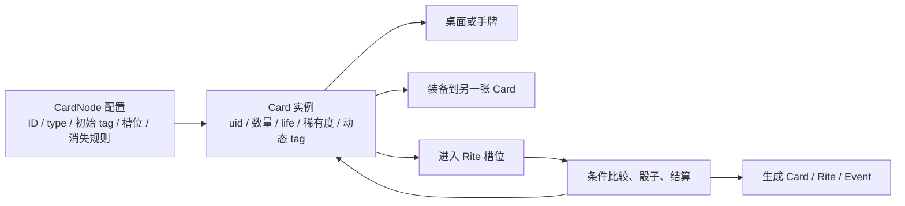

# 《苏丹的游戏》卡牌类型与交互模型

> 目的：为后续将《女神异闻录 5 皇家版》转译为“人格化系统”做原型研究。
>
> 范围：只讨论《苏丹的游戏》成品中的卡牌对象、卡牌状态和它们与 Rite/Event 的连接方式；不把本文件当作开发团队的创作自述。
>
> 资料状态：2026-07-16。源码指针来自本地、只读的原作逆向语料；Wiki 用于核对玩家可见界面与术语。

## 先给结论

《苏丹的游戏》的“卡牌作为统一语言”不是指每个游戏对象都被实现为同一种卡。

它的结构是：**三种运行时基础卡，承担了大量不同的叙事职能；标签、装备、寿命、稀有度和仪式占位把这些基础卡变成具体的人、物、状态、命令和机会。** Rite 与 Event 本身是独立的运行时对象，但它们以卡牌作为输入、条件、成本和结果的主要媒介。

因此，后续做转译时不应问“P5R 的 X 是不是一张新卡”，而应连续区分：

1. X 是基础实体（人物、物品、外部命令）？
2. X 是附着在实体上的可读状态？
3. X 是选择/考验发生的场域（Rite/Event）？
4. X 在场域中是投入物、条件、效果，还是后果？

### 分类口径修订（2026-07-16）

需要同时保留三种口径，不能把它们压成一张表：

- **运行时口径**：原始 `cards.json.type` 只有 `char`、`item`、`sudan`；这是实现容器。
- **官方英文 Wiki 口径**：Sultan Cards、Characters、Items 三类；Items 被描述为涵盖装备、书籍、短暂情绪与情报。
- **中文 Wiki 图鉴口径**：物品有 11 个子类——其他、宝石、部队、地点、读物、符号、秘宝、奇珍、思潮、消耗品、装备；状态在“卡牌”图鉴中与物品并列。

中文 Wiki 还注记：部分角色在代码中定义为物品，但仍整理在角色分类。因此，后续所有“物品卡”讨论须说明是在说程序容器、英文 Wiki 总称，还是中文玩家图鉴分类。

## 1. 三层分类，不能混用

| 层级 | 原作中的分类 | 它回答的问题 |
|---|---|---|
| 运行时基础类型 | `char`、`item`、`sudan` | 这张卡以什么基础实体进入运行时？ |
| 玩家可见的手牌语义 | 主角、追随者、装备、情报、消耗品、苏丹卡、其他已拥有卡 | 玩家此刻把它当作什么资源或行动者？ |
| 中文 Wiki 的物品图鉴 | 其他、宝石、部队、地点、读物、符号、秘宝、奇珍、思潮、消耗品、装备 | 中文玩家资料如何收录物品卡？ |
| 图鉴展示分类 | animal、army、book、char、consumables、food、nonhuman、other_char、others、sudancard、symbolism、treasure、weapon_equip | 图鉴应把它放在哪一组以便查阅？ |

第二层来自玩家界面：中文 Wiki 的手牌说明正是这样枚举；官方 Wiki 则以 Sultan Cards、Characters、Items 作为基本类别。[中文新手指南](https://wiki.biligame.com/sultansgame/%E6%96%B0%E6%89%8B%E6%8C%87%E5%8D%97)；[官方 Cards 页面](https://sultansgame.wiki.gg/wiki/Cards)

后两层都不是程序类型系统。原始配置中，`animal` 图鉴组的 22 条都属于 `item`；`army` 同时包含 `char` 与 `item`。因此，“动物”“军队”“书籍”“宝物”不能直接当成并列于人物/物品/苏丹卡的程序类型；但它们可以是中文玩家资料中合理的图鉴分类。

## 2. 基础卡牌类型

### 2.1 `char`：可被调度的行动者

原始 `cards.json` 中有 317 条 `char` 定义。它们是人物卡的底层类型，但图鉴中的“非人”“其他角色”“军队”“宝物”等展示组并不严格等同于此类型。

它们的关键能力不是“有角色立绘”，而是可以成为 Rite 的参与者、承受后果，并可以持有装备。配置中 131 个 `char` 定义带有装备槽；55 个带有 `post_rite` 配置。玩家可见层面，主角和追随者的属性可以因读书或事件而改变，并通常可持有武器、服装、饰品；部分人物还具有驯兽槽。[中文新手指南](https://wiki.biligame.com/sultansgame/%E6%96%B0%E6%89%8B%E6%8C%87%E5%8D%97)

### 2.2 `item`：不只是“道具”的承载型

原始配置有 955 条 `item` 定义。这是实现容器，而不是玩家向的物品图鉴。中文 Wiki 将物品细分为其他、宝石、部队、地点、读物、符号、秘宝、奇珍、思潮、消耗品、装备；其中消耗品还包含情报与天象。该 Wiki 同时把状态放在卡牌的平行图鉴分类下，并明确承认个别“角色/物品”的代码归类与玩家向归类不同。

这意味着“物品卡”是一个宽容器：它可以是一次性投入物、可装备对象、知识来源、世界状态、地点、财富、部队，或叙事中持续存在的对象。官方 Wiki 的 Cards 页面列举人物、野兽、地产、武器、土地、金币、毒药、传言与知识均可作为卡牌；这不是修辞，而是与配置的宽泛 `item` 容器相吻合。[官方 Cards 页面](https://sultansgame.wiki.gg/wiki/Cards)

### 2.3 `sudan`：外部强制命令的卡牌化

配置中有 20 条 `sudan` 定义。它们是独立于人物和物品的基础类型；`GenLoot` 在生成时也走 `AddSudanCard`，而不是普通 `GenCard` 分支。

四种玩家可见的苏丹卡是 Carnality、Extravagance、Conquer、Bloodshed；官方 Wiki 记载玩家按周抽取其中一张，而不同类型对应不同要求。所有 20 条 `sudan` 配置都带有 `destroy_resources` 与非零 `card_vanishing` 字段。[官方 Wiki 首页](https://sultansgame.wiki.gg/)

它们的设计角色是**把外部权力施加的、带期限的议题放到与普通资源同一张桌面上**。但它们并不等于普通“任务卡”：其类别、品级、消除途径和失败代价会被各个 Rite 单独读取。

## 3. 一张卡在运行时真正包含什么

原作将“配置定义”与“运行实例”分开。

`Card` 实例拥有 `uid`、`id`、`count`、`life`、`rareup`、动态 `tag` 字典、装备槽与已装备卡列表、背包位置以及自定义名称/文本。也就是说，同一个配置 ID 的两张卡在游戏中仍可因寿命、附着装备、标签和所在 Rite 不同而成为不同的叙事对象。

**源码事实**：[SRC: `decompiled/CardExtensions.c` @ `AddEquip` (RVA `0x37e5d0`), `il2cpp_dump/dump.cs:389593`]；运行时 `Card` 字段与配置 `CardNode` 字段可在 `dump.cs:389593`、`389759` 核对。

## 4. 标签：把抽象状态嵌到实体上

`tag.json` 有 442 条标签配置：377 条 `attribute`、60 条 `buff`、5 条 `debuff`。角色能力、性别/身份、拥有状态、装备状态、物品类别、伤病、名声、关系和剧情开关都可以以标签形式出现在卡上。

从运行时类型看，“状态”通常不是另立的第四种基础类型，而是以下几种形式之一：

- 某张卡的动态 tag；
- 一张可装备/可附着的 item；
- Rite 结算后生成或改变的卡；
- 由多个标签共同构成的条件。

但在中文玩家图鉴中，“状态”是与物品并列的收录分类。两种说法分别回答“代码如何表示”与“玩家如何查找”，并不互相替代。

`ModifyTag.Do` 先借助 `OperationFilter` 选取目标卡，再调用 tag 的加、减或赋值规则。`OperationFilter.IsMatch` 可同时检查卡 ID、排除 ID、Lost 状态和 tag 比较；`SlotHasTag.IsSatisfied` 以同一筛选器统计/比较槽位中的卡。

**源码事实**：[SRC: `decompiled/ModifyTag.c` @ `Do` (RVA `0x518180`), `dump.cs:315597`]；[SRC: `decompiled/OperationFilter.c` @ `IsMatch` (RVA `0x3a1880`) / `Filter` (RVA `0x3a15c0`), `dump.cs:394805`]；[SRC: `decompiled/SlotHasTag.c` @ `IsSatisfied` (RVA `0x408cf0`), `dump.cs:417791`]。

## 5. 卡牌如何交互

### 5.1 附着：人物卡和装备/状态卡成为复合体

人物的配置可以声明装备槽。把装备拖至人物卡会将装备卡加入该人物实例的 `equips` 列表；移除装备则按实例 UID 操作。玩家可见的结果是装备属性加入人物卡，因而“人物”不是一个固定数值块，而是一个可重新编组的行动单元。[中文新手指南](https://wiki.biligame.com/sultansgame/%E6%96%B0%E6%89%8B%E6%8C%87%E5%8D%97)

附着还解释了为什么某些“状态”更像一张小卡而非纯数值：它既可被展示、继承、移除，也能参与后续对象关系。

### 5.2 投入：卡牌进入 Rite 的槽位后才获得句法角色

Rite 是地图上的、会结算的独立对象，不是 `Card.type` 的第四个值。它会给卡提供 `s1`、`s2` 等槽位语境；同一张人物卡进入不同位置，可能分别成为主参与者、辅助者、目标、父对象或敌方对象。

`OperationFilter.Filter` 已验证的取卡范围包括：指定槽位、enemy/friend、all、self 与 parent。由此同一个操作语句可表达“检查这一槽的人”“改变其父对象”“检查所有参与者”或“对敌方对象施加后果”。

原作在创建 Rite 实例时会吸附所需卡；玩家指南也明确说明，多天 Rite 开始后，投入的人物、物品及其装备会在结算前不可移动。[SRC: `decompiled/PlayerExtensions.c` @ `InitRite` (RVA `0x38e140`)]；[中文新手指南](https://wiki.biligame.com/sultansgame/%E6%96%B0%E6%89%8B%E6%8C%87%E5%8D%97)

### 5.3 匹配与检定：卡牌不是“打出效果”，而是满足关系

Rite/事件配置可读取卡的 ID、品级、已装备关系、Lost 状态以及 tag 阈值。投入对象的属性、装备、情报或特殊标签共同构成能否通过条件和骰子检定的输入。

因此一个“情报卡”可以是属性补正/重投资源；一件“武器”可以通过人物的装备关系影响行动者；一个“贵族”或“部队”标签可以决定它是否有资格进入某槽；一张苏丹卡则可以是某个特殊槽位的强制要求。这些不是四套专用交互规则，而是同一套筛选—比较—结算语法中的不同实体意义。

### 5.4 结算：改变既有卡，或生成新的卡/机会

结算可以改变标签、添加/移除装备、触发消失过程、执行卡的 `post_rite`，也可以生成新对象。`GenLoot.Generate` 的结果不仅可以是普通卡或苏丹卡，也可以是 Rite 或 Event；因此“获得卡”与“打开一个可进入的叙事场域”同属一条生成管线，但产物类型仍然不同。

战利品类型已验证为：普通加权重复抽取、排除已拥有对象的抽取、无放回选取 M 项，以及逐项条件检查的包式发放；不能把所有奖励简化成“开包给卡”。

**源码事实**：[SRC: `decompiled/GenLoot.c` @ `Generate(LootNode)` (RVA `0x511990`), `dump.cs:314584`]；[SRC: `decompiled/CardExtensions.c` @ `DoPostRite` (RVA `0x4f0d70`) / `DoVanish` (RVA `0x4f1310`)]。

## 6. 用于 P5R 转译的可复用观察

以下是从上述事实作出的设计层推论，而不是原作源码事实：

1. **不要按名词建模，要按可变实体建模。** 人物、装备、情报、资源、名声和异常状态之所以能共用桌面，不是因为它们都长得像卡，而是因为它们都能拥有实例身份、可读标签、位置和后果。
2. **把“场域”从“对象”分开。** Rite/Event 不是卡，但使卡牌的组合具有叙事语法。P5R 转译应同样把殿堂节点、委托、日程或社群场景视为会读取/改变卡牌的场域，而非又一组普通手牌。
3. **人物卡的意义来自可被改写的关系网。** 人物既是行动者，也是装备、状态、任务锁定和剧情后果的承载点；这是《苏丹的游戏》把抽象数值转成角色扮演感的关键结构。
4. **外部命令应该有自己的基础类型。** 苏丹卡并非单纯的负面状态；它把倒计时、权力与具体处置要求实体化。若 P5R 改造中存在期限、认知压力或校内/社会强制，最好也不要把它们悄悄藏回普通数值栏。

## 7. 当前不应擅自下结论的边界

- `card_vanishing`、`vanish` 和每种 `post_rite` 的逐卡语义，需要按具体卡与具体 Rite 再读对应配置和调用链；不能仅由字段名推断为统一的“使用后销毁”。
- 图鉴 `show_type` 是展示分组；它不能独自证明某项内容的运行时行为。
- Rite 定义存在不代表它从开局可见或可启动。生成、实例化、开放、开始和结算是分开的运行时阶段。
- “friend”作用域的实际数据用例、特殊敌我关系和剧情分支，若成为后续 P5R 方案的直接参照，需以目标 Rite 的源码和配置逐案验证。
